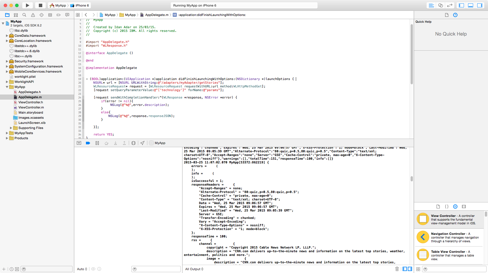

The purpose of this demonstration is to make you experience an end-to-end flow where the MobileFirst Platform Foundation SDK for iOS is integrated into an Xcode project and used to retrieve data by using a MobileFirst adapter.

To learn more about creating projects and applications, using adapters, and lots more, visit the Native iOS Development landing page.

**Prerequesites:** Make sure that the following software is installed:

* MobileFirst Platform command line tool ([download](http://developer.ibm.com/mobilefirstplatform/install/#clui))
* Xcode 6.1 and later


1. **Create a MobileFirst back-end project and adapter**
  * Create a back-end project in a location of your choice.
  ```
  mfp create MyProject  
  cd MyProject  
  ```
  * Add an HTTP adapter to the project.
  ```
  cd MyProject
  mfp add adapter MyAdapter -t http
  ```

2. **Deploy artifacts to the MobileFirst Server**
  * Start the MobileFirst Server and deploy the adapter.
  ```
  mfp start
  mfp push
  ```
3. **Create an Xcode project**

4. **Add the MobileFirst iOS SDK to the Xcode project**  
5. If [CocoaPods](http://guides.cocoapods.org/) is not installed in your development environment, install it as follows:  
  1. Open **Terminal**.
  2. Run the command `sudo gem install cocoapods`
  3. Run the command `pod setup` – Note that this command might take several minutes to complete
6. Change directory to the location of the Xcode project
7. Run the command `pod init`. This command creates a `Podfile`.
8. Open the `Podfile` file, located at the root of the project, with your favorite editor.
9. Comment out or remove the file contents.
10. Add the following lines and save the changes:
```
source 'https://github.com/CocoaPods/Specs.git'
pod 'IBMMobileFirstPlatformFoundation'
```
11. Run the command `pod install`. This command adds the MobileFirst Platform Native SDK, generates the Pod project, and integrates it with the Xcode project.
12. > **Important**: From here on, use the ``[ProjectName]``.**xcworkspace** file to open the project in Xcode. **Do not use** the ``[ProjectName].xcodeproj`` file. A CocoaPods-based project is managed as a workspace that contains the application (the executable) and the library (all project dependencies that are pulled by the CocoaPods manager).
13. In **Terminal**, navigate to the root of the Xcode project and add the required configuration files by running the command. Then follow the onscreen instructions:  
`mfp push`
14. Open the Xcode project by double-clicking the **.xcworkspace** file.
15. Right-click the project and select **Add Files To [ProjectName]**, select the `worklight.plist` file, which is located in the Xcode project root folder.
16. **Implement MobileFirst adapter invocation**
  * *AppDelegate.h*  
  Add the header:
  `#import <IBMMobileFirstPlatformFoundation/IBMMobileFirstPlatformFoundation.h>`
  * *AppDelegate.m*  
  Add the following to `didFinishLaunchingWithOptions`:

```  

  - (BOOL)application:(UIApplication *)application didFinishLaunchingWithOptions:(NSDictionary *)launchOptions {
    NSURL* url = [NSURL URLWithString:@"/adapters/MyAdapter/getFeed"];
    WLResourceRequest* request = [WLResourceRequest requestWithURL:url method:WLHttpMethodGet];
    [request setQueryParameterValue:@"['technology']" forName:@"params"];

    [request sendWithCompletionHandler:^(WLResponse *response, NSError *error) {
        if(error != nil){
             NSLog(@"%@",error.description);
        }
        else{
            NSLog(@"%@",response.responseJSON);
        }
    }];

    return YES;
  }  
```
The same example can be adapted to a Swift project.
17. **Click Run**  
Review the Xcode console for the data retrieved by the adapter request.



> When you use Xcode 7 and iOS 9, read the notes about Apple Transport Security (ATS) and bitcode here: https://ibm.biz/BdXNsT
