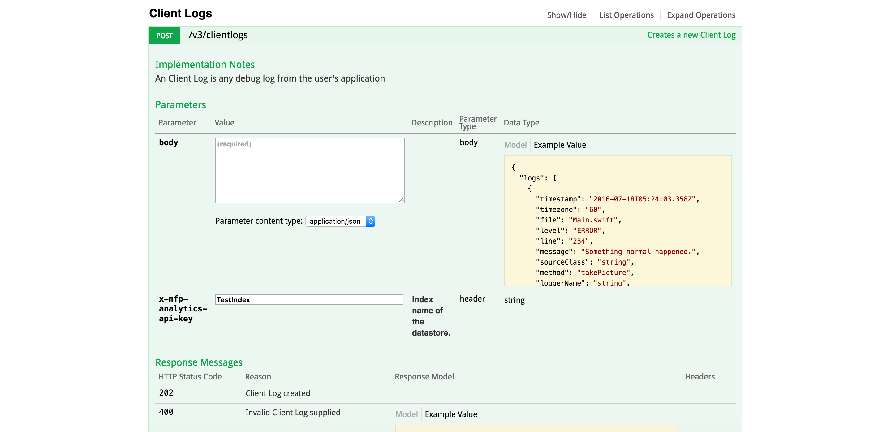

<!-- NLS_CHARSET=UTF-8 -->
## Übersicht
{: #overview }

{{ site.data.keys.mf_analytics_full }} stellt REST-APIs bereit, die Entwickler beim Import von Analysedaten (POST) und beim Export von Analysedaten (GET) unterstützen. 

## Fahren Sie mit folgenden Abschnitten fort: 
{: #jump-to }

* [Analytics-REST-API](#analytics-rest-api)
* [Test mit Swagger-Dokumenten](#try-it-out-on-swagger-docs)

## Analytics-REST-API
{: #analytics-rest-api }

Es folgen Informationen zur Verwendung der Analytics-REST-API:

**Basis-URL**

`/analytics-service/rest`

**Beispiel**

`https://example.com:9080/analytics-service/v3/applogs`

REST-API-Methode |Endpunkt |Beschreibung 
--- | --- | ---
Application Logs (POST) |/v3/applogs |Erstellt ein neues Anwendungsprotokoll 
Application Session (POST) |/v3/appsession |Erstellt eine Anwendungssitzung oder aktualisiert eine vorhandene Sitzung, wenn für die Berichterstellung die gleiche appSessionID verwendet wird 
Bulk (POST) |/v3/bulk |Erstellt Berichte zu großen Mengen von Ereignissen 
Custom Chart (GET) |/v3/customchart |Exportiert alle Definitionen kundenspezifischer Diagramme 
Custom Chart (POST) |/v3/customchart/import |Importiert eine Liste kundenspezifischer Diagramme 
Custom Data (POST) |/v3/customdata |Erstellt neue kundenspezifische Daten 
Device (POST) |/v3/device |Erstellt oder aktualisiert ein Gerät 
Export Data (GET) |/v3/export |Exportiert Daten im angegeben Datenformat 
Network Transaction (POST) |/v3/networktransaction |Erstellt eine neue Netztransaktion 
Server Log (POST) |/v3/serverlog |Erstellt ein neues Serverprotokoll 
User (POST) |/v3/user |Erstellt einen neuen Benutzer  

## Test mit Swagger-Dokumenten
{: #try-it-out-on-swagger-docs }

Testen Sie die Analytics-REST-API anhand von Swagger-Dokumenten.   
Rufen Sie in einer MobileFirst-Server-Konfiguration mit aktiviertem Analytics `<IP-Adresse>:<Port>/analytics-service` auf.

Wenn Sie auf **Expand Operations** klicken, sehen Sie für jede Methode die Implementierungshinweise, Parameter und Antwortnachrichten. 

> Warnung: Alle Daten, die Sie mithilfe der Option **Try it out!** senden, können bereits im Datastore enthaltene Daten beeinträchtigen. Wenn Sie nicht ausdrücklich versuchen, Daten an Ihre Produktionsumgebung
zu senden, verwenden Sie für den `x-mfp-analytics-api-key` einen Testnamen.

