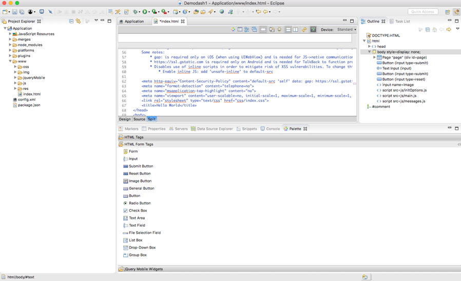

<!-- NLS_CHARSET=UTF-8 -->
## Übersicht
{: #overview }
Das Entwerfen und Implementieren der Benutzerschnittstelle einer Anwendung ist ein wichtiger Bestandteil des Entwicklungsprozesses. Das {{ site.data.keys.product_adj }}-Eclipse-Plug-in unterstützt Sie zusammenmit dem THyM-Plug-in bei der Entwicklung von Cordova-Anwendungen. Das Schreiben eines komplett neuen und kundenspezifischen CSS-Stils für jede Komponente kann ein hohes Maß an Anpassung bringen, erfordert jedoch auch eine Menge Ressourcen.
Manchmal ist es besser, die vorhandenen JavaScript-UI-Frameworks zu verwenden. In diesem Abschnitt ist beschrieben, wie {{site.data.keys.product_adj }}-Anwendungen mit zwei UI-Frameworks entwickelt werden, mit jQuery Mobile und dem Eclipse-WYSIWYG-Editor von {{site.data.keys.product_adj }} Studio. 

Gehen Sie wie folgt vor, um die Benutzerschnittstelle von Cordova-Anwendungen mit dem MobileFirst-Eclipse-Plug-in zu entwickeln:

1. Laden Sie Eclipse herunter.
2. Installieren Sie das [THyM](http://marketplace.eclipse.org/content/eclipse-thym)-Plug-in vom Eclipse Marketplace.
3. Installieren Sie das [MobileFirst-Platform-Plug-in](http://marketplace.eclipse.org/content/ibm-mobilefirst-foundation-studio) vom Eclipse Marketplace.


## WYSIWYG-Editor
{: #wysiwyg-editor }
Mit dem MobileFirst-Platform-Eclipse-Plug-in für HTML-UI-Widgets wird zur Unterstützung von Entwicklern ein WYSIWYG-Eeditor bereitgestellt.
Dieser Editor bietet eine grundlegende Palette für den Benutzer an, von der mit der Maus UI-Widgets wie eine Schaltfläche, ein Textfeld oder andere HTML-Widgets gezogen und abgelegt werden können. Mit diesem Tool für die schnelle Entwicklung mobiler Anwendungen kann der Benutzer rasch eine Cordova-Anwendung entwickeln. 



## jQuery Mobile
{: #jquery-mobile }
jQuery ist ein schnelles und präzises JavaScript-Framework, das den Verarbeitungsablauf für HTML-Dokumente, die Ereignisverarbeitung, Animationen und Ajax-Interaktionen mit dem Ziel einer schnellen Webentwicklung vereinfacht. jQuery Mobile ist ein für Touchscreens von Smartphones und Tablets optimiertes Web-Framework. Für die Ausführung von jQuery Mobile ist jQuery erforderlich. 

Gehen Sie wie folgt vor, um jQuery Mobile zu Ihrer Anwendung hinzuzufügen: 

1. Erstellen Sie in Eclipse ein THyM-Projekt. Klicken Sie dazu auf **Datei -> Neu -> New Hybrid Mobile (Cordova) Application Project**.
2. [Laden Sie das jQuery-Mobile-Paket](http://jquerymobile.com/download/) herunter.
3. Kopieren Sie das herutnergeladene jQuery-Mobile-Paket in das Verzeichnis `www` Ihrer Hybridanwendung. Sehen Sie sich dazu die folgende Abbildung an.
  
4. Öffnen Sie wie im Screenshot gezeigt die Hauptdatei `index.html` und fügen Sie die jQuery-Referenzen (wie im Snippet) zum Projekt hinzu.
    

    ```html
      <!DOCTYPE HTML>
      <html>
          	<head>
          		<meta charset="UTF-8">
          		<title>appName</title>
          		<meta name="viewport" content="width=device-width, initial-scale=1.0, maximum-scale=1.0, minimum-scale=1.0, user-scalable=0">
          		<!--
          			<link rel="shortcut icon" href="images/favicon.png">
          			<link rel="apple-touch-icon" href="images/apple-touch-icon.png">
          		-->
          		<link href="jqueryMobile/jquery.mobile.structure-1.4.5.min.css" rel="stylesheet">
          		<link href="jqueryMobile/demos/css/jquery.mobile.structure-1.4.5.min.css" rel="stylesheet">
          		<link href="jqueryMobile/jquery.mobile-1.4.5.min.css" rel="stylesheet">
          		<link href="jqueryMobile/jquery.mobile.theme-1.4.5.css" rel="stylesheet">
          		<link href="jqueryMobile/jquery.mobile.theme-1.4.5.min.css" rel="stylesheet">
          		<link href="jqueryMobile/jquery.mobile.external-png-1.4.5.min.css" rel="stylesheet">
          		<link href="jqueryMobile/jquery.mobile.inline-png-1.4.5.css" rel="stylesheet">
          		<link href="jqueryMobile/demos/css/jquery.mobile.inline-svg-1.4.5.min.css" rel="stylesheet">
          		<link href="jqueryMobile/jquery.mobile-1.4.5.css" rel="stylesheet">
          		<link href="jqueryMobile/jquery.mobile.inline-png-1.4.5.min.css" rel="stylesheet">
          		<link href="jqueryMobile/jquery.mobile.external-png-1.4.5.css" rel="stylesheet">
          		<link href="jqueryMobile/demos/css/jquery.mobile.inline-png-1.4.5.min.css" rel="stylesheet">
          		<link href="jqueryMobile/demos/theme-classic.css" rel="stylesheet">
          		<link href="jqueryMobile/jquery.mobile.inline-svg-1.4.5.css" rel="stylesheet">
          		<link href="jqueryMobile/jquery.mobile.structure-1.4.5.css" rel="stylesheet">
          		<link href="jqueryMobile/demos/css/jquery.mobile-1.4.5.min.css" rel="stylesheet">
          		<link href="jqueryMobile/jquery.mobile.inline-svg-1.4.5.min.css" rel="stylesheet">
          		<link href="jqueryMobile/demos/css/jquery.mobile.theme-1.4.5.min.css" rel="stylesheet">
          		<link href="jqueryMobile/demos/css/jquery.mobile.external-png-1.4.5.min.css" rel="stylesheet">
          		<link rel="stylesheet" href="css/main.css">
          		<script>window.$ = window.jQuery = WLJQ;</script>
          		<script src="jqueryMobile/demos/jquery.js"></script>
          		<script src="jqueryMobile/demos/jquery.mobile-1.4.5.js"></script>
          	</head>
          	<body style="display: none;">
          		<div data-role="page" id="page">
          			<div data-role="content" style="padding: 15px">
          				<!--application UI goes here-->
          				Hello MobileFirst
          			</div>
          		</div>
          		<script src="js/initOptions.js"></script>
          		<script src="js/main.js"></script>
          		<script src="js/messages.js"></script>
          	</body>
      </html>
    ```
Wenn Sie die Referenzen zu jQuery Mobile in Ihrer HTML-Datei hinzugefügt haben, schließen Sie die Datei und öffnen Sie sie erneut in Eclipse. Jetzt sehen Sie in der Palettenansicht jQuery-Mobile-Widgets, die Sie mit der Maus in Ihren HTML-Erstellungsbereich ziehen und dort ablegen können.
