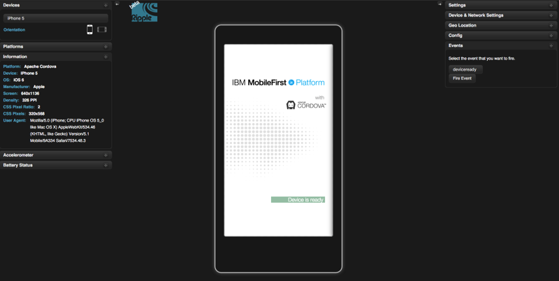
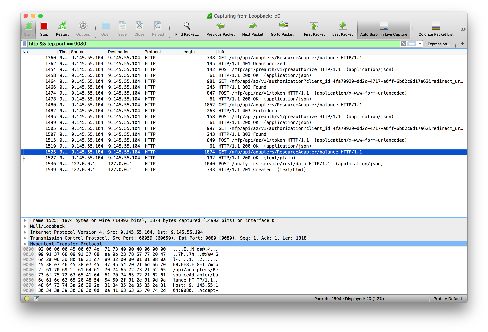

<!-- NLS_CHARSET=UTF-8 -->
## Übersicht
{: #overview }
Beim Debugging geht es darum, die Ursache von Fehler im applikativen Code und auf der Benutzerschnittstelle der Anwendung zu finden. 

* JavaScript-Anwendungen (Cordova, Web) bestehen aus webbasierten Ressourcen wie HTML, JavaScript und CSS. Eine Cordova-Anwendung kann außerdem nativen (in Java, Objective-C, Swift, C# usw. geschriebenen) Code enthalten. 
* Zum Debuggen von nativem Code können Sie Standardttols des Plattform-SDK verwenden, z. B. Xcode, Android Studio oder Microsoft Visual Studio.

In diesem Lernprogramm werden verschiedene Debugstrategien für eine JavaScript-Anwendung untersucht
(lokale Ausführung in einem Emulator oder Simulator, auf
dem physischen Gerät oder in einem Web-Browser). 

> Weitere Informationen zum Cordova-Debugging und zu Cordova-Tests finden Sie auf der
Cordova-Website unter [Debugging Cordova Apps](https://cordova.apache.org/docs/en/latest/guide/next/index.html#link-testing-on-a-simulator-vs-on-a-real-device).


#### Fahren Sie mit folgenden Abschnitten fort: 
{: #jump-to }

* [Debug mit dem {{ site.data.keys.mf_mbs }}](#debugging-with-the-mobile-browser-simulator)
* [Debug mit Ripple](#debugging-with-ripple)
* [Debug mit dem iOS Remote Web Inspector](#debugging-with-ios-remote-web-inspector)
* [Debug mit dem Chrome Remote Web Inspector](#debugging-with-chrome-remote-web-inspector)
* [Debug mit dem {{ site.data.keys.product_adj }}-Logger](#debugging-with-mobilefirst-logger)
* [Debug mit WireShark](#debugging-with-wireshark)

## Debug mit dem {{ site.data.keys.mf_mbs }}
{: #debugging-with-the-mobile-browser-simulator }
Sie können den {{ site.data.keys.product_full }} {{ site.data.keys.mf_mbs }} (MBS) zum Voranzeigen und Debuggen von
{{ site.data.keys.product_adj }}-Anwendungen nutzen.   
Öffnen Sie dazu ein **Befehlszeilenfenster** und führen Sie folgenden Befehl aus: 

```bash
    mfpdev app preview
    ```

Wenn es in Ihrer Anwendung mehr als eine Plattform gibt, geben Sie die Plattform für die Vorschau an: 

```bash
mfpdev app preview -p <Plattform>
```

> <span class="glyphicon glyphicon-exclamation-sign" aria-hidden="true"></span> **Wichtiger Hinweis:** Es gibt mehrere bekannte Einschränkungen für die Vorschaufunktion. Möglicherweise verhält sich Ihre Anwendung während der Vorschau nicht wie erwartet. Es könnte beispielsweise sein, dass die Anwendung mit einem vertraulichen Client Sicherheitseinrichtungen umgeht, sodass Abfrage-Handler nicht ausgelöst werden.

 

### {{ site.data.keys.mf_mbs }}
{: #mobile-browser-simulator}


### Einfache Vorschau
{: #simple-preview }


> Weitere Informationen zur {{ site.data.keys.mf_cli }} enthält das Lernprogram
[{{ site.data.keys.product_adj }}-Artefakte über die {{ site.data.keys.mf_cli }} verwalten](../using-mobilefirst-cli-to-manage-mobilefirst-artifacts).


## Debug mit Ripple
{: #debugging-with-ripple }
Apache Ripple™ ist eine webbasierter Simulator für mobile Umgebungen zum Debuggen mobiler Webanwendungen.   
Ripple ermöglicht die Ausführung einer Cordova-Anwendung in Ihrem Browser und die Simulation diverser Cordova-Features. Sie können beispielsweise die Kamera-API simulieren. Dafür wählen Sie ein lokales Bild von Ihrem Computer aus.   

### Ripple installieren
{: #installing-ripple }

1. Laden Sie die neueste Version von [Node.js](https://nodejs.org/en/) herunter und installieren Sie sie.
Sie können die Installation von Node.js durch Eingabe von `npm -v` im Terminal überprüfen. 
2. Öffnen Sie das Terminal und geben Sie Folgendes ein: 

   ```bash
   npm install -g ripple-emulator
   ```

### Anwendung mit Ripple ausführen
{: #running-application-using-ripple }
Öffnen Sie nach der Ripple-Installation an der Position Ihres Cordova-Projekts ein Terminal und geben Sie Folgendes ein: 

```bash
ripple emulate
```



> Weitere Informationen zu Apache Ripple™ finden Sie auf der [Apache-Ripple-Seite](http://ripple.incubator.apache.org/)
oder auf der Seite [npm ripple-emulator](https://www.npmjs.com/package/ripple-emulator).


## Debug mit dem iOS Remote Web Inspector
{: #debugging-with-ios-remote-web-inspector }
Mit iOS 6 hat Apple einen fernen [Web Inspector](https://developer.apple.com/safari/tools/) zum Debuggen von Webanwendungen
auf iOS-Geräten eingeführt. Stellen Sie vor dem Dubug sicher, dass auf dem Gerät (oder im iOS-Simulator) der private Browsermodus inaktiviert ist.   

1. Tippen Sie zum Aktivieren des Web Inspector auf dem Gerät auf **Einstellungen > Safari > Erweitert > Web Inspector**.
2. Verbinden Sie das iOS-Gerät mit einem Mac oder starten Sie den Simulator, um mit dem Debug zu beginnen. 
3. Navigieren Sie in Safari zu **Einstellungen > Erweitert** und wählen Sie das Kontrollkästchen **Menü 'Entwickler' in der Menüleiste anzeigen** aus. 
4. Wählen Sie in Safari **Entwickeln > [Ihre Geräte-ID] > [Ihre_HTML-Anwendungsdatei]** aus.


## Debug mit dem Chrome Remote Web Inspector
{: #debugging-with-chrome-remote-web-inspector }
In Google Chrome können Sie Webanwendungen auf Android-Geräten oder im Android Emulator über Fernzugriff untersuchen.   
Dafür benötigen Sie Android ab Version 4.4 und Chrome ab Version 32. Zusätzlich ist in der Datei `AndroidManifest.xml` die Einstellung
`targetSdkVersion = 19` oder eine höhere Einstellung erforderlich. In der Datei `project.properties` ist zudem die Einstellung
`target = 19` oder eine höhere Einstellung erforderlich. 

1. Starten Sie die Anwendung im Android Emulator oder auf einem verbundenen Gerät. 
2. Geben Sie in der Adressleiste von Chrome die folgende URL ein: `chrome://inspect`.
3. Wählen Sie **Inspect** für die betreffende Anwendung aus. 


### Debug mit dem {{ site.data.keys.product_adj }}-Logger
{: #debugging-with-mobilefirst-logger }
Die {{ site.data.keys.product }} stellt ein `WL.Logger`-Objekt bereit, mit dem Protokollnachrichten ausgegeben werden können.   
In `WL.Logger` gibt es mehrere Protokollierungsstufen: `WL.Logger.info`, `WL.Logger.debug`, `WL.Logger.error`.

> Weitere Informationen enthält die Beschreibung zu `WL.Logger` in der Benutzerdokumentation im Abschnitt mit den API-Referenzinformationen. 

**Untersuchung des Protokolls:**

* In der **Entwicklerkonsole**, wenn eine Plattform mit einem Simulator oder Emulator vorangezeigt wird
* In **LogCat**, sofern auf dem Android-Gerät ausgeführt
* In der **Xcode-Konsole**, sofern auf dem iOS-Gerät ausgeführt
* In der **Visual-Studio-Ausgabe**, sofern auf dem Windows-Gerät ausgeführt

### Debug mit Wireshark
{: #debugging-with-wireshark }
**Wireshark ist ein Analyseprogramm für Netzprotokolle**, mit dem Vorgänge im Netz ermittelt werden können.   
Mit Filtern können Sie die Ermittlung auf die für Sie erforderlichen Vorgänge beschränken.   

> Weitere Informationen finden Sie auf der Website zu [WireShark](http://www.wireshark.org). 


