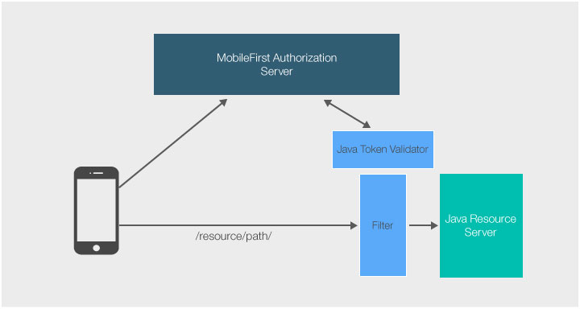

<!-- NLS_CHARSET=UTF-8 -->
## Übersicht
{: #overview }
Die {{ site.data.keys.product_full }} stellt eine Java-Bibliothek für die Durchsetzung von Sicherheitsfunktionen für externe Ressourcen bereit.   
Die Java-Bibliothek wird als JAR-Datei (**mfp-java-token-validator-8.0.0.jar**) bereitgestellt.

Dieses Lernprogramm zeigt, wie ein einfaches Java-Servlet (`GetBalance`) mit einem Gültigkeitsbereich
(`accessRestricted`) geschützt wird.

**Voraussetzungen:**

* Gehen Sie das Lernprogramm [Externe Ressource mit {{ site.data.keys.mf_server }} authentifizieren](../) durch. 
* Sie müssen das [{{ site.data.keys.product_adj }}-Foundation-Sicherheitsframework](../../) verstehen.



## JAR-Datei für Abhängigkeit hinzufügen
{: #adding-the-jar-file-dependency }
Die Datei **mfp-java-token-validator-8.0.0.jar** ist als **Maven-Abhängigkeit** verfügbar:

```xml
<dependency>
  <groupId>com.ibm.mfp</groupId>
  <artifactId>mfp-java-token-validator</artifactId>
  <version>8.0.0</version>
</dependency>
```

## TokenValidationManager-Instanz erstellen
{: #instantiating-the-tokenvalidationmanager }
Wenn Sie Token validieren möchten, müssen Sie eine Instanz von `TokenValidationManager` erstellen.

```java
TokenValidationManager(java.net.URI authorizationURI, java.lang.String clientId, java.lang.String clientSecret);
```

- `authorizationURI`: Die URI des Autorisierungsservers, bei dem es sich in der Regel um {{ site.data.keys.mf_server }} handelt. Beispiel: **http://localhost:9080/mfp/api**
- `clientId`: Die ID des in der {{ site.data.keys.mf_console }} konfigurierten vertraulichen Clients
- `clientSecret`: Der geheime Schlüssel des in der {{ site.data.keys.mf_console }} konfigurierten vertraulichen Clients

> Die Bibliothek macht eine API zugänglich, in die die Interaktion
mit dem Introspektionsendpunkt des Autorisierungsservers eingebunden ist und die diese Interaktion vereinfacht. Ausführliche API-Referenzinformationen finden Sie unter
[{{ site.data.keys.product_adj }}-Java-Token-Validator](http://www.ibm.com/support/knowledgecenter/en/SSHS8R_8.0.0/com.ibm.worklight.apiref.doc/apiref/r_mfpf_java_token_validator_api.html?view=kc).

## Berechtigungsnachweise validieren
{: #validating-the-credentials }
Die API-Methode `validate` fordert den Autorisierungsserver auf, den Authorization-Header zu validieren. 

```java
public TokenValidationResult validate(java.lang.String authorizationHeader, java.lang.String expectedScope);
```

- `authorizationHeader`: Der Inhalt des `Authorization`-HTTP-Headers, d. h. das Zugriffstoken. Das Token könnte beispielsweise von einer HTTP-Servletanforderung (`HttpServletRequest`) abgerufen werden (`httpServletRequest.getHeader("Authorization")`).
- `expectedScope`: Der Bereich für die Validierung des Tokens, z. B. `accessRestricted`

Sie können Fehler oder gültige Introspektionsdaten aus dem resultierenden `TokenValidationResult`-Objekt abfragen. 

```java
TokenValidationResult tokenValidationRes = validator.validate(authCredentials, expectedScope);
    			if (tokenValidationRes.getAuthenticationError() != null) {
    				// Fehler
    AuthenticationError error = tokenValidationRes.getAuthenticationError();
    httpServletResponse.setStatus(error.getStatus());
    httpServletResponse.setHeader("WWW-Authenticate", error.getAuthenticateHeader());
} else if (tokenValidationRes.getIntrospectionData() != null) {
    // Hier Logik für Erfolg
}
```                    

## Introspektionsdaten
{: #introspection-data }
Das von `getIntrospectionData()` zurückgegebene `TokenIntrospectionData`-Objekt
gibt Ihnen einige Informationen zum Client, z. B. den Benutzernamen des zurzeit aktiven Benutzers. 

```java
httpServletRequest.setAttribute("introspection-data", tokenValidationRes.getIntrospectionData());
```

```java
TokenIntrospectionData introspectionData = (TokenIntrospectionData) request.getAttribute("introspection-data");
String username = introspectionData.getUsername();
```

## Cache
{: #cache }
Die Klasse `TokenValidationManager` hat einen internen Cache, in dem Token und Introspektionsdaten zwischengespeichert werden. Der Cache soll
bei Anforderungen mit identischem Header die
Tokenuntersuchungen (*introspections*) reduzieren, die für die Autorisierungsserver durchgeführt werden. 

Die Standardcachegröße liegt bei **50000 Elementen**. Wenn diese Kapaziatät erreicht ist, wird das älteste Token entfernt.   

Der Konstruktor von `TokenValidationManager` kann auch eine Menge von Introspektionsdatenelementen (`cacheSize`) zur Speicherung akzeptieren: 

```java
public TokenValidationManager(java.net.URI authorizationURI, java.lang.String clientId, java.lang.String clientSecret, long cacheSize);
```

## Einfaches Java-Servlet schützen
{: #protecting-a-simple-java-servlet }
1. Erstellen Sie ein einfaches Java-Servlet mit der Bezeichnung `GetBalance`, das einen fest codierten Wert zurückgibt: 

   ```java
   @WebServlet("/GetBalance")
   public class GetBalance extends HttpServlet {
    	private static final long serialVersionUID = 1L;

    	protected void doGet(HttpServletRequest request, HttpServletResponse response) throws ServletException, IOException {
    		// Fest codierten Wert zurückgeben
    		response.getWriter().append("17364.9");
    	}

   }
   ```

2. Erstellen Sie eine `javax.servlet.Filter`-Implementierung mit der Bezeichnung
`JTVFilter`, die den Authorization-Header für einen gegebenen Bereich validiert: 

   ```java
   public class JTVFilter implements Filter {

    	public static final String AUTH_HEADER = "Authorization";
    	private static final String AUTHSERVER_URI = "http://localhost:9080/mfp/api"; // Hier die Autorisierungsserver-URI definieren
    	private static final String CLIENT_ID = "jtv"; // Hier die ID des vertraulichen Clients definieren
    	private static final String CLIENT_SECRET = "jtv"; // Hier geheimen Schlüssel (SECRET) des vertraulichen Clients definieren

    	private TokenValidationManager validator;
    	private FilterConfig filterConfig = null;

    	@Override
    	public void init(FilterConfig filterConfig) throws ServletException {
    		URI uri = null;
    		try {
    			uri = new URI(AUTHSERVER_URI);
    			validator = new TokenValidationManager(uri, CLIENT_ID, CLIENT_SECRET);
    			this.filterConfig = filterConfig;
    		} catch (Exception e1) {
    			System.out.println("Error reading introspection URI");
    		}
    	}

    	@Override
    	public void doFilter(ServletRequest req, ServletResponse res, FilterChain filterChain) throws IOException, ServletException {
    		String expectedScope = filterConfig.getInitParameter("scope");
    		HttpServletRequest httpServletRequest = (HttpServletRequest) req;
    		HttpServletResponse httpServletResponse = (HttpServletResponse) res;

    		String authCredentials = httpServletRequest.getHeader(AUTH_HEADER);

    		try {
    			TokenValidationResult tokenValidationRes = validator.validate(authCredentials, expectedScope);
    			if (tokenValidationRes.getAuthenticationError() != null) {
    				// Fehler
    				AuthenticationError error = tokenValidationRes.getAuthenticationError();
    				httpServletResponse.setStatus(error.getStatus());
    				httpServletResponse.setHeader("WWW-Authenticate", error.getAuthenticateHeader());
    			} else if (tokenValidationRes.getIntrospectionData() != null) {
    				// Erfolg
    				httpServletRequest.setAttribute("introspection-data", tokenValidationRes.getIntrospectionData());
    				filterChain.doFilter(req, res);
    			}
    		} catch (TokenValidationException e) {
    			httpServletResponse.setStatus(500);
    		}
    	}

   }
   ```

3. Deklarieren Sie in der Datei **web.xml** des Servlets eine Instanz von `JTVFilter`
und übergeben Sie den Bereich (**scope**) `accessRestricted` als Parameter: 

   ```xml
   <filter>
      <filter-name>accessRestricted</filter-name>
      <filter-class>com.sample.JTVFilter</filter-class>
      <init-param>
        <param-name>scope</param-name>
        <param-value>accessRestricted</param-value>
      </init-param>
   </filter>
   ```

   Schützen Sie Ihr Servlet dann mit dem Filter: 

   ```xml
   <filter-mapping>
      <filter-name>accessRestricted</filter-name>
      <url-pattern>/GetBalance</url-pattern>
   </filter-mapping>
   ```

## Beispielanwendung
{: #sample-application }

Sie können das Projekt in den unterstützten Anwendungsservern (Tomcat, WebSphere Application Server Full Profile und WebSphere Application Server Liberty Profile) implementieren.  
[Laden Sie das einfache Java-Servlet herunter](https://github.com/MobileFirst-Platform-Developer-Center/JavaTokenValidator/tree/release80).

### Verwendung des Beispiels
{: #sample-usage }
1. Sie müssen [den vertraulichen Client](../#confidential-client)
und die geheimen Schlüssel in der {{ site.data.keys.mf_console }} aktualisieren.
2. Implementieren Sie eine der Sicherheitsüberprüfungen: **[UserLogin](../../user-authentication/security-check/)**
oder **[PinCodeAttempts](../../credentials-validation/security-check/)**.
3. Registrieren Sie die passende Anwendung. 
4. Ordnen Sie der Sicherheitsüberprüfung den Bereich `accessRestricted` zu. 
5. Aktualisieren Sie die Clientanwendung so, dass `WLResourceRequest` Ihre Servlet-URL ist. 
