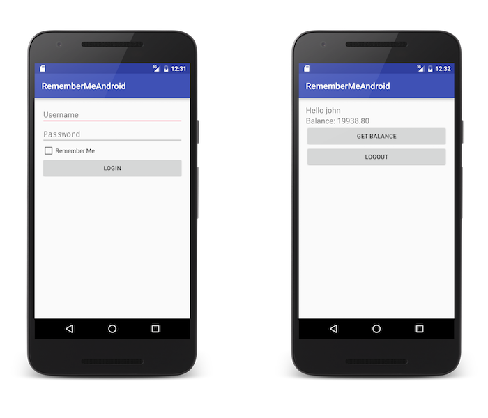

<!-- NLS_CHARSET=UTF-8 -->
## Übersicht
{: #overview }
**Voraussetzung:** Arbeiten Sie zuerst den Abschnitt
**CredentialsValidationSecurityCheck** des Lernprogramms [Abfrage-Handler implementieren](../../credentials-validation/android) durch. 

Das Abfrage-Handler-Lernprogramm demonstriert einige zusätzliche Features (APIs) wie
die bevorrechtigte Anmeldung und Abmeldung sowie das bevorrechtigte Abrufen eines Zugriffstokens für einen Bereich
(`login`, `logout` und `obtainAccessToken`).

## Anmeldung
{: #login }
In diesem Beispiel erwartet `UserLogin`, dass die Schlüsselwerte (*key:values*) `username` und `password` aufgerufen werden. Optional wird auch ein boolescher Schlüssel `rememberMe` akzeptiert, der
die Sicherheitsüberprüfung auffordert, sich diesen Benutzer für einen längeren Zeitraum zu merken, In der Beispielanwendung wird dieser boolesche Wert in Form eines Kontrollkästchens im Anmeldeformular erfasst. 

Das Argument `credentials` ist ein `JSONObject`,
das `username`, `password` und `rememberMe` enthält:

```java
submitChallengeAnswer(credentials);
```

Vielleicht möchten Sie ja, dass sich ein Benutzer ohne den Empfang einer Abfrage anmelden kann. Sie könnten beispielsweise eine Anmeldeanzeige als erste Anzeige der Anwendung einblenden oder eine Anmeldeanzeige nach der Abmeldung oder nach einem Anmeldefehler anzeigen. Diese Szenarien werden als **bevorrechtigte Anmeldungen** bezeichnet.

Sie können die API `submitChallengeAnswer` nicht aufrufen, wenn es keine zu beantwortende Abfrage gibt. Für solche Szenarien enthält das
SDK der {{ site.data.keys.product }} die API `login`. 

```java
WLAuthorizationManager.getInstance().login(securityCheckName, credentials, new WLLoginResponseListener() {
    @Override
    public void onSuccess() {
        Log.d(securityCheckName, "Login Preemptive Success");

    }

    @Override
    public void onFailure(WLFailResponse wlFailResponse) {
        Log.d(securityCheckName, "Login Preemptive Failure");
    }
});
```

Wenn die Berechtigungsnachweise nicht stimmen, sendet die Sicherheitsüberprüfung eine **Abfrage** zurück.

Es ist die Verantwortung des Anwendungsentwicklers zu wissen, wann für eine bestimmte Anwendung
`login` und wann `submitChallengeAnswer` zu verwenden ist. Dazu kann der Entwickler
beispielsweise ein boolesches Flag definieren, z. B. `isChallenged`, und dieses auf `true` setzen,
wenn `handleChallenge` erreicht wird, oder das Flag in allen anderen Fällen (Fehler, Erfolg, Initialisierung usw.) auf
`false` setzen. 

Wenn der Benutzer auf die Anmeldeschaltfläche (**Login**) klickt, kann dynamisch entschieden werden, welche API zu verwenden ist: 

```java
public void login(JSONObject credentials){
    if(isChallenged){
        submitChallengeAnswer(credentials);
    }
    else{
        WLAuthorizationManager.getInstance().login(securityCheckName, credentials, new WLLoginResponseListener() {
//...
        });
    }
}
```

> **Hinweis:**
>Die `WLAuthorizationManager`-API `login()` hat ihre eigenen
Methoden `onSuccess` und `onFailure`. Die Methode `handleSuccess` oder `handleFailure` des
betreffenden Abfrage-Handlers
wird **ebenfalls** aufgerufen. ## Zugriffstoken anfordern
{: #obtaining-an-access-token }
Da diese Sicherheitsüberprüfung die Funktion **RememberMe** (in Form des booleschen Schlüssels
`rememberMe`) unterstützt, sollte sinnvollerweise überprüft werden,
ob der Client angemeldet ist, wenn die Anwendung gestartet wird. 

Das SDK der {{ site.data.keys.product }} stellt die API `obtainAccessToken` bereit, um den Server nach einem gültigen Token zu fragen: 

```java
WLAuthorizationManager.getInstance().obtainAccessToken(scope, new WLAccessTokenListener() {
    @Override
    public void onSuccess(AccessToken accessToken) {
        Log.d(securityCheckName, "auto login success");
    }

    @Override
    public void onFailure(WLFailResponse wlFailResponse) {
        Log.d(securityCheckName, "auto login failure");
    }
});
```

> **Hinweis:**
> Die `WLAuthorizationManager`-API `obtainAccessToken()` hat ihre eigenen Methoden
`onSuccess` und `onFailure`. Die Methode
`handleSuccess` oder `handleFailure` des betreffenden Abfrage-Handlers
wird **ebenfalls** aufgerufen. 

Wenn der Client bereits angemeldet ist oder erinnert wird (Zustand *remembered*), löst die API einen Erfolg aus. Wenn der Client nicht angemeldet ist, sendet die Sicherheitsüberprüfung eine Abfrage zurück. 

Die API `obtainAccessToken` nimmt einen Gültigkeitsbereich (**scope**) auf. Der Bereich kann den Namen Ihrer
**Sicherheitsüberprüfung** haben.

> Weitere Informationen zu Bereichen (**scopes**) enthält das Lernprogramm [Autorisierungskonzepte](../../). 

## Authentifizierten Benutzer abrufen
{: #retrieving-the-authenticated-user }
Die Methode `handleSuccess` des Abfrage-Handlers verwendet eine JSON-Objekt-ID (`JSONObject identity`) als Parameter.
Wenn die Sicherheitsüberprüfung einen authentifizierten Benutzer (`AuthenticatedUser`) definiert, enthält dieses Objekt die Eigenschaften des Benutzers. Mit `handleSuccess` können Sie den aktuellen Benutzer speichern. 

```java
@Override
public void handleSuccess(JSONObject identity) {
    super.handleSuccess(identity);
    isChallenged = false;
    try {
        // Aktuellen Benutzer speichern
        SharedPreferences preferences = context.getSharedPreferences(Constants.PREFERENCES_FILE, Context.MODE_PRIVATE);
        SharedPreferences.Editor editor = preferences.edit();
        editor.putString(Constants.PREFERENCES_KEY_USER, identity.getJSONObject("user").toString());
        editor.commit();
    } catch (JSONException e) {
        e.printStackTrace();
    }
}
```

Hier hat `identity` einen Schlüssel mit der Bezeichnung
`user`, der wiederum ein `JSONObject` enthält, das den authentifizierten Benutzer (`AuthenticatedUser`) repräsentiert. 

```json
{
  "user": {
    "id": "john",
    "displayName": "john",
    "authenticatedAt": 1455803338008,
    "authenticatedBy": "UserLogin"
  }
}
```

## Abmeldung
{: #logout }
Das SDK der {{ site.data.keys.product }} stellt eine API `logout` für die Abmeldung bei einer bestimmten Sicherheitsüberprüfung bereit. 

```java
WLAuthorizationManager.getInstance().logout(securityCheckName, new WLLogoutResponseListener() {
    @Override
    public void onSuccess() {
        Log.d(securityCheckName, "Logout Success");
    }

    @Override
    public void onFailure(WLFailResponse wlFailResponse) {
        Log.d(securityCheckName, "Logout Failure");
    }
});
```

## Beispielanwendungen
{: #sample-applications }
Zu diesem Lernprogramm gibt es zwei Beispiele: 

- **PreemptiveLoginAndroid**: Diese Anwendung wird immer mit einer Anmeldeanzeige gestartet, die die API `login` für bevorrechtigte Anmeldung verwendet. 
- **RememberMeAndroid**: Diese Anwendung hat ein Kontrollkästchen *Remember Me*. Wenn die Anwendung das nächste Mal geöffnet wird, kann der Benutzer die Anmeldeanzeige umgehen. 

Beide Beispiele verwenden dieselbe Sicherheitsüberprüfung `UserLogin` des Adapter-Maven-Projekts **SecurityCheckAdapters**. 

[Klicken Sie hier](https://github.com/MobileFirst-Platform-Developer-Center/SecurityCheckAdapters/tree/release80), um das Maven-Projekt SecurityCheckAdapters herunterzuladen.   
[Klicken Sie hier](https://github.com/MobileFirst-Platform-Developer-Center/RememberMeAndroid/tree/release80), um das Projekt "Remember Me" herunterzuladen.   
[Klicken Sie hier](https://github.com/MobileFirst-Platform-Developer-Center/PreemptiveLoginAndroid/tree/release80), um das Projekt "Preemptive Login" herunterzuladen. 

### Verwendung des Beispiels
{: sample-usage }
Anweisungen finden Sie in der Datei README.md zum Beispiel.   
Benutzername und Kennwort für die App müssen übereinstimmen, z. B. "john"/"john".


