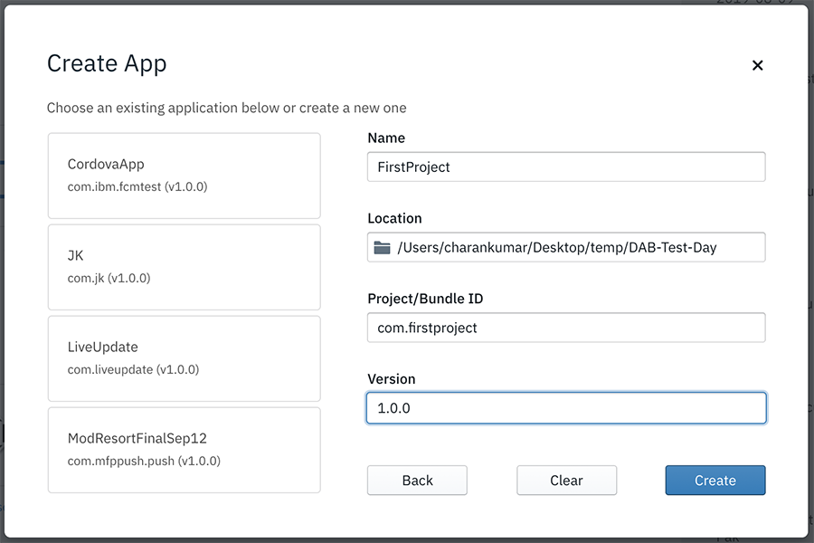

<!-- NLS_CHARSET=UTF-8 -->
## Übersicht
{: #getting-started }

Sie können den Digital App Builder wie folgt starten:

* Klicken Sie unter **Mac OS** doppelt auf das Symbol für **IBM Digital App Builder**, um den Digital App Builder zu öffnen.
* Starten Sie unter **Windows** den Digital App Builder, indem Sie **Start > Programme > IBM Digital App Builder** auswählen.

>**Hinweis**: Wenn Sie den Digital App Builder zum ersten Mal öffnen, müssen Sie die eingeblendete **Lizenz für die Verwendung von IBM Digital App Builder akzeptieren**, um fortfahren zu können. Nach dem Akzeptieren der Lizenzvereinbarung wird automatisch zum ersten Mal die **Prüfung der Voraussetzungen** durchgeführt. Wenn keine Fehler gefunden werden, klicken Sie auf **OK**. Korrigieren Sie andernfalls die Fehler und starten Sie den Digital App Builder neu.

Sie können die Option **Neue App erstellen** oder **App öffnen** auswählen oder die verfügbaren Vorlagen für die Erstellung Ihrer App nutzen. 
>**Hinweis**: Sie können Ihre kürzlich erstellte App im Abschnitt **Letzte** sehen. Bei einer Neuinstallation sehen Sie keinen Abschnitt **Letzte**. 

### Neue App erstellen
{: #create-new-app }

Klicken Sie zum Erstellen einer neuen App im Builder-Dashboard auf das Symbol **Neue App erstellen**. 

1. Klicken Sie auf das Symbol **Neue App erstellen**, um das Fenster **Kanal auswählen** zu öffnen.

    

2. Wählen Sie den Kanal aus, für den die App entwickelt werden soll, indem Sie auf das entsprechende Symbol klicken. Sie können später weitere Kanäle zur selben App hinzufügen.

    * **Android**: Wählen Sie diese Option aus, wenn Sie eine Android-App erstellen.
    * **iOS**: Wählen Sie diese Option aus, wenn Sie eine iOS-App erstellen.
        >**Hinweis**: Sie können die iOS-Apps nur unter Mac OS erstellen und ausführen.
    * **Web**: Wählen Sie diese Option aus, wenn Sie die App für das Web erstellen.
    * **PWA**: Wählen Sie diese Option aus, wenn Sie eine Progressive Web App erstellen.

3. Das Auswahlfenster für den Typ des Servers, zu dem eine Verbindung hergestellt werden soll, wird angezeigt.

    

4. Sie können **Gemeinsam genutzter Playground-Server** oder **Angepasster professioneller Server** auswählen.

    * **Gemeinsam genutzter Playground-Server** – Dies ist ein gemeinsam genutzter Mobile Foundation Server für den Schnelleinstieg, der von IBM Cloud bereitgestellt wird.

        >**Warnung**: Der gemeinsam genutzte Playground-Server ist ein allgemeiner Server, der von vielen Entwicklern genutzt wird. Dieser Server sollte nicht für Produktions-Apps verwendet werden. Die Daten in diesem Server können ohne Vorankündigung gelöscht werden. Es gibt keine garantierte Verfügbarkeitszeit für den Server.

        

        * Geben Sie den **IBM Cloud-API-Schlüssel** ein. Informationen zu den Zugriffsdetails finden Sie im Abschnitt "Häufig gestellte Fragen" unter [**Vorgehensweise beim Erstellen eines Plattform-API-Schlüssels**](../faq/). 

        * Klicken Sie auf **Anmelden**, um eine Verbindung zum Server herzustellen. 

    * **Angepasster professioneller Server** – Sie können eine Verbindung zu Ihrem eigenen, lokal oder in IBM Cloud erstellten Mobile Foundation Server herstellen. Im Fenster **Instanz der IBM Mobile Foundation konfigurieren** können Sie einen vorhandenen Server auswählen oder einen neuen Server erstellen.

        
 
        Im Fenster **Instanz der IBM Mobile Foundation konfigurieren** wird eine Liste der zuvor definierten Mobile-Foundation-Server-Instanzen angezeigt. Wenn Sie den Server auswählen, werden **Servername**, **Server-URL**, **Administratorbenutzername** und **Administratorkennwort** angezeigt. Zum Definieren eines neuen Servers können Sie auf den Link **Neuen Server erstellen** klicken. Daraufhin erscheint das neue Fenster **Instanz der IBM Mobile Foundation konfigurieren**.

        

        * Geben Sie die Details der neuen IBM Mobile-Foundation-Instanz ein, z. B. **Servername**, **Server-URL**, **Administratorbenutzername** und **Administratorkennwort**.
            >**Hinweis**: Die Server-URL und die Anmeldeberechtigungsnachweise finden Sie im Mobile-Foundation-Server-Dashboard für die ausgewählte Serverinstanz.
        * Geben Sie bei Bedarf einen **Benutzernamen** (für den vertraulichen Client) und ein **Administratorkennwort** an, um im Datenviewer eine Datenvorschau anzeigen zu können.
        * Klicken Sie auf **Verbinden**.

5. Nach erfolgreicher Anmeldung bzw. erfolgreichem Verbindungsaufbau wird das Fenster **App erstellen** angezeigt, in dem Sie eine vorhandene App-Definition auswählen können. Sie können auch eine neue Definition erstellen, indem Sie die erforderlichen Angaben machen. 
    * Geben Sie für eine neue App Folgendes an: **Name** der Anwendung, **Position**, an der die Projektdateien gespeichert werden, **Projekt/Bundle-ID** und **Version** der Anwendung. 
 
        

    * Klicken Sie auf **Erstellen**, um die Anwendung zu erstellen. Daraufhin wird das Fenster **Willkommen bei der Workbench** angezeigt.
    * Klicken Sie auf **Starten**, um den Arbeitsbereich des Digital App Builder für die Erstellung einer neuen Anwendung oder die Modifikation einer vorhandenen Anwendung zu öffnen.

        

### Vorhandene App öffnen
{: #open-an-existing-app }
 
>**Hinweis**: Sie können eine vorhandene App öffnen, die ausschließlich mit dem Digital App Builder entwickelt wurde.

Sie können eine der folgenden Methoden zum Öffnen einer vorhandenen App nutzen:

* Wenn Sie auf der Homepage auf **App öffnen** klicken, wird der Dateiexplorer geöffnet. Navigieren Sie zu Ihrem App-Projektordner und klicken Sie auf **OK**, um die App zur weiteren Bearbeitung zu öffnen.
* Sie können die App auch aus der Liste der aktuellen Apps öffnen, sofern sie aufgelistet ist. Klicken Sie dazu doppelt auf den App-Namen.

### Vorlagen verwenden
{: #using-templates }

Mit Vorlagen können Sie Ihre Anwendung rasch erstellen. Die Vorlagen sind mit bestimmten Features versehen, die Sie bei der schnellen Modifikation und Entwicklung von Apps unterstützen. Bis jetzt ist nur der Watson Chatbot verfügbar.

