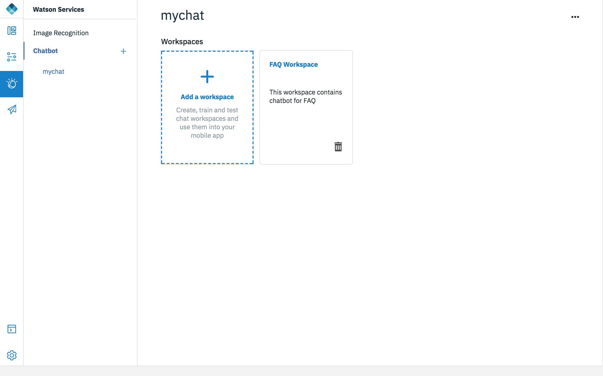

<!-- NLS_CHARSET=UTF-8 -->
## Watson-Chatbot
{: #dab-chatbot }

Chatbots werden vom Service Watson Assistant in IBM Cloud gesteuert. Erstellen Sie eine Watson-Assistant-Instanz in IBM Cloud. Weitere Informationen finden Sie [hier](https://cloud.ibm.com/catalog/services/watson-assistant-formerly-conversation).

Im Anschluss an die Konfiguration könne Sie einen neuen **Arbeitsbereich** erstellen. Der Arbeitsbereich umfasst eine Reihe von Dialogen, die einen Chatbot ausmachen. Nach Erstellung eines Arbeitsbereichs können Sie mit der Erstellung der Dialoge beginnen. Geben Sie für eine Absicht eine Reihe von Fragen an und legen Sie für diese Absicht eine Reihe von Antworten fest. Watson Assistant verwendet Natural Language Understanding, um die Absicht anhand der von Ihnen bereitgestellten Beispielfragen zu interpretieren. Anschließend kann Watson Assistant versuchen, die von einem Benutzer auf verschiedenen Wegen gestellte Frage zu interpretieren, und sie der Absicht zuordnen.

Gehen Sie wie folgt vor, um einen Chatbot in Ihrer App zu aktivieren:

1. Klicken Sie auf **Watson** und dann auf **Chatbot**. Daraufhin erscheint die Anzeige **Arbeiten mit Watson Assistant**.

    

2. Klicken Sie auf **Verbinden** für eine Verbindung zu Ihrer Watson-Assistant-Instanz.

    

3. Geben Sie die Details des **API-Schlüssels** ein und geben Sie die **URL** Ihrer Watson-Assistant-Instanz an. 
4. Geben Sie einen **Namen** für Ihren Chatbot an und klicken Sie auf **Verbinden**. Daraufhin wird Ihr Chat-Servicedashboard mit dem angegebenen **Namen** angezeigt.

    

5. Fügen Sie einen Arbeitsbereich hinzu. Klicken Sie dazu auf **Arbeitsbereich hinzufügen**. Daraufhin erscheint die Anzeige **Neues Modell erstellen**.

    

6. Geben Sie den **Arbeitsbereichsnamen** und die **Arbeitsbereichsbeschreibung** ein und klicken Sie auf **Erstellen**. Daraufhin werden drei **Dialogarbeitsbereiche** ("Willkommen", "Keine Übereinstimmung gefunden" und "Neuer Dialog") erstellt.

    

7. Klicken Sie auf **Neuer Dialog**, um das neue Chatbot-Modell zu trainieren. 

    

8. Fügen Sie Fragen und Antworten als CSV-Datei oder in Form von Einzelfragen mit den zugehörigen Antworten hinzu. Wählen Sie beispielsweise für "Wenn der Benutzer Folgendes fragt:" **Benutzeraussage hinzufügen** aus und dann für "Sollte der Bot wie folgt antworten:" **Bot-Antwort hinzufügen**. Sie können auch Fragen und die gewünschten Bot-Antworten hochladen.
9. Klicken Sie auf **Speichern**.
10. Klicken Sie unten rechts auf das Chatbot-Symbol, um den Chatbot zu testen.

    
