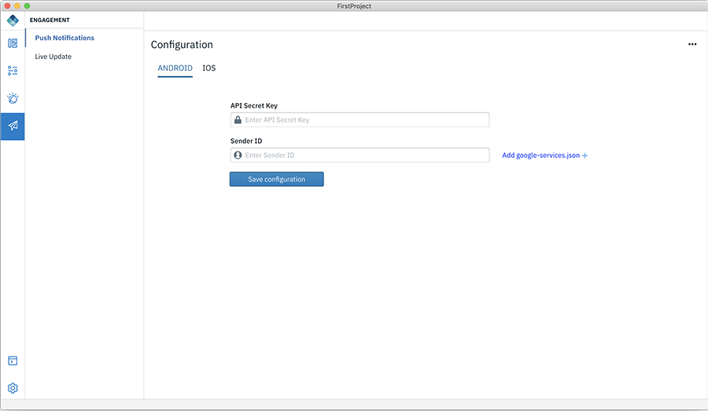

<!-- NLS_CHARSET=UTF-8 -->
## Push-Benachrichtigungen zu einer App hinzufügen
{: #dab-engagement-push }

Sie können Push-Benachrichtigungen zu Ihrer App hinzufügen und die Benutzerbindung verbessern.

Gehen Sie wie folgt vor, um Push-Benachrichtigungen zu Ihrer App hinzuzufügen:

1. Wählen Sie **Engagement** aus. Daraufhin wird die Liste der verfügbaren Services angezeigt. 

    

2. Wählen Sie **Push-Benachrichtigungen** aus und klicken Sie auf **Aktivieren**. Daraufhin wird die Konfigurationsseite für Push-Benachrichtigungen angezeigt.

3. Konfigurieren Sie Push-Benachrichtigungen für Android. Geben Sie dazu den **geheimen API-Schlüssel** und die **Absender-ID** an und klicken Sie auf **Konfiguration speichern**.

    

4. Navigieren Sie zur Registerkarte "iOS" und geben Sie Push-Konfigurationsdetails an. Wählen Sie die **Umgebung**aus, geben Sie die . p12-Datei mit Pfad an und geben Sie das **Kennwort** ein. Klicken Sie dann auf **Konfiguration speichern**.

    

5. Führen Sie für iOS den folgenden zusätzlichen Schritt aus:
    * Öffnen Sie das Xcode-Projekt `<Pfad_zur_App>/ionic/platforms/ios/<app>.xcodeproj` und aktivieren Sie die Funktion für Push-Benachrichtigungen. Weitere Informationen finden Sie unter [https://help.apple.com/xcode/mac/current/#/devdfd3d04a1](https://help.apple.com/xcode/mac/current/#/devdfd3d04a1).

6. Gehen Sie für die Serverseite wie folgt vor:
 
    * Lesen Sie die Informationen unter [http://mobilefirstplatform.ibmcloud.com/tutorials/en/foundation/8.0/notifications/sending-notifications/#setting-up-notifications](http://mobilefirstplatform.ibmcloud.com/tutorials/en/foundation/8.0/notifications/sending-notifications/#setting-up-notifications) zum Aktivieren von Push-Benachrichtigungen auf der Serverseite.

    * Lesen Sie die Informationen unter [http://mobilefirstplatform.ibmcloud.com/tutorials/en/foundation/8.0/notifications/sending-notifications/#sending-notifications](http://mobilefirstplatform.ibmcloud.com/tutorials/en/foundation/8.0/notifications/sending-notifications/#sending-notifications) zum Senden von Benachrichtigungen vom Server.

**Hinweis**:
Push-Benachrichtigungen von MFP Server werden zum Aktivieren des Benachrichtigungsservice verwendet. Falls der IBM Cloud-Service für Push-Benachrichtigungen bereits verwendet wurde, folgen Sie dem Link, um Benachrichtigungen in MFP Server
einzurichten ([http://mobilefirstplatform.ibmcloud.com/tutorials/en/foundation/8.0/notifications/sending-notifications/#setting-up-notifications](http://mobilefirstplatform.ibmcloud.com/tutorials/en/foundation/8.0/notifications/sending-notifications/#setting-up-notifications)).

