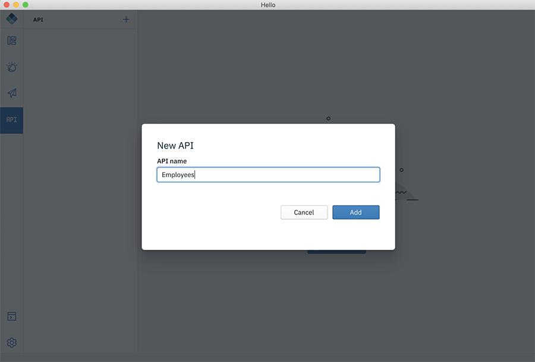

<!-- NLS_CHARSET=UTF-8 -->

## Pseudo-API
{: #dab-mock-api }

Wenn Sie eine mobile App entwickeln, steht Ihnen in der Regel das Back-End, von dem die Daten abgerufen werden müssen, nicht zur Verfügung. In einer solchen Situation ist es hilfreich, wenn ein Pseudoserver verfügbar ist, der die gleichen Daten wie das aktuelle Back-End zurückgibt. In genau diesem Bereich ist das Pseudo-API-Feature des Digital App Builder hilfreich. Der Entwickler der mobilen App kann den Server einfach durch Angabe von JSON-Daten nachahmen.

>**Hinweis**: Dieses Feature ist nur im Codemodus verfügbar.

Gehen Sie wie folgt vor, um APIs für die Nachahmung von Back-End-REST-Services zu erstellen und zu verwalten:

1. Öffnen Sie Ihre App im Codemodus. 
2. Wählen Sie **API** aus. Klicken Sie auf **API hinzufügen**.
    

3. Geben Sie in dem daraufhin geöffneten Fenster den Namen Ihrer API ein und klicken Sie auf **Hinzufügen**.
    

4. Nun sehen Sie die erstellte API mit der automatisch generierten URL.
    

5. Klicken Sie auf **Bearbeiten**. Geben Sie an, welche Daten beim Aufrufen dieser API zurückgegeben werden sollen, und klicken Sie auf **Speichern**. Beispiel:  

    ```
    [
      {
        "firstName": "John",
        "lastName": "Doe",
        "title": "Director of Marketing",
        "office": "D531"
      },
      {
        "firstName": "Don",
        "lastName": "Joe",
        "title": "Vice President,Sales",
        "office": "B2600"
      }
    ]
    ```

    

>**Hinweis**: Wenn Sie die API schnell testen möchten, klicken Sie auf **Try now**. Daraufhin wird die Swagger-Dokumentation in Ihrem Standardbrowser geöffnet, wo Sie Ihre API testen können.

### Pseudo-APIs in der App konsumieren
{: #dab-mock-api-consuming }

1. Ziehen Sie im Codemodus das Code-Snippet **API Call** mit der Maus aus dem Abschnitt **MOBILE CORE** und legen Sie es in Ihrem Code ab.
2. Bearbeiten Sie den Code. Modifizieren Sie die URL so, dass sie auf den Pseudo-API-Endpunkt zeigt. Beispiel: 

    ```
     var resourceRequest = new WLResourceRequest(
         "/adapters/APIProject/api/entity4",
         WLResourceRequest.GET,
         { "useAPIProxy": false }
     );
     resourceRequest.send().then(
         function(response) {
             alert("Success: " + response.responseText);
         },
         function(response) {
             alert("Failure: " + JSON.stringify(response));
         }
     );
    ```
 
