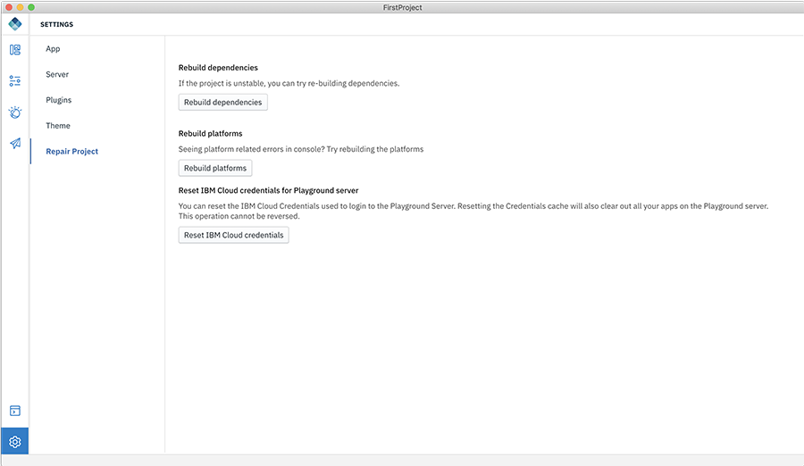

<!-- NLS_CHARSET=UTF-8 -->

## Einstellungen für den Digital App Builder
{: #dab-app-settings }

Unter "Einstellungen" können Sie die App-Einstellungen verwalten und während des Erstellungsprozesses auftretende Fehler korrigieren. Zum Bereich der Einstellungen gehören die Registerkarten **App-Details**, **Server**, **Plug-ins**, **Motiv** und **Projekt reparieren**.

### App-Details
{: #app-details}

Die App-Details sind Informationen zu Ihrer App: **App-Symbol**, **Name**, **Position**, an der Dateien gespeichert werden, bei der Erstellung der App angegebene **Projekt/Bundle-ID**, ausgewählte **Plattformen** (Kanäle) und aktivierter **Service**. 

Sie können das **App-Symbol** ändern. Klicken Sie dazu auf das Symbol und laden Sie ein neues Symbol hoch. 

Sie können zusätzliche Plattformen hinzufügen/entfernen, indem Sie das zugehörige Markierungsfeld aus-/abwählen.

Klicken Sie auf **Speichern**, um die Änderungen zu übernehmen.

### Server
{: #server }

Die Serverinformationen sind die **Serverdetails**, an denen Sie gerade arbeiten. Wenn Sie die Informationen bearbeiten möchten, klicken Sie auf den Link **Bearbeiten**. Sie können die Autorisierung für den vertraulichen Client hinzufügen oder modifizieren.

Auf der Registerkarte "Server" werden auch **Letzte Server**angezeigt.

>**Hinweis**: Sie können einen Server löschen, der zuvor beim Erstellen einer App mit Digital App Builder hinzugefügt wurde und nicht von keiner in Digital App Builder erstellten App verwendet wird. 

Wenn Sie einen neuen Server hinzufügen möchten, klicken Sie auf die Schaltfläche **Neu verbinden +**. Geben Sie in dem daraufhin erscheinenden Fenster **Verbindung zu neuem Server herstellen** die Details an und klicken Sie auf **Verbinden**.

### **Plug-ins**
{: #plugins}

Es werden die im Digital App Builder verfügbaren Plug-ins aufgelistet. Folgende Aktionen können ausgeführt werden:

* **Neue installieren** - Sie können auf diese Schaltfläche klicken, um neue Plug-ins zu installieren. Daraufhin erscheint der Dialog **Neues Plug-in**. Geben Sie den **Plug-in-Namen** und optional die **Version** an. Wenn es sich um ein **lokales Plug-in** handelt, aktivieren Sie den entsprechenden Schalter und verweisen Sie auf die Position. Klicken Sie dann auf **Installieren**.

* In der Liste der bereits installierten Plug-ins können Sie die Version bearbeiten und ein Plug-in neu installieren oder deinstallieren. Wählen Sie dazu den Link für das betreffende Plug-in aus.

### Motiv
{: #dab-theme}

Passen Sie Darstellung und Funktionsweise Ihrer App an, indem Sie ein Motiv angeben ("Dunkel" oder "Hell"). 

### Projekt reparieren
{: #repair-project}

Auf der Registerkarte "Projekt reparieren" können Sie Probleme beheben. Klicken Sie dazu auf die entsprechenden Optionen.

* **Abhängigkeiten neu erstellen** - Wenn das Projekt instabil ist, können Sie versuchen, die Abhängigkeiten neu zu erstellen.
* **Plattformen neu erstellen** - Wenn Sie plattformspezifische Fehler in der Konsole sehen, versuchen Sie, die Plattformen erneut zu erstellen. Falls Sie Änderungen an den Kanälen vorgenommen oder zusätzliche Kanäle hinzugefügt haben, verwenden Sie diese Option.
* **IBM Cloud-Berechtigungsnachweise für Playground-Server zurücksetzen** - Sie können die IBM Cloud-Berechtigungsnachweise für die Anmeldung beim Playground-Server zurücksetzen. Wenn Sie den Cache für Berechtigungsnachweise zurücksetzen, werden auch alle Ihre Apps auf dem Playground-Server gelöscht. **DIESE OPERATION KANN NICHT RÜCKGÄNGIG GEMACHT WERDEN.**
