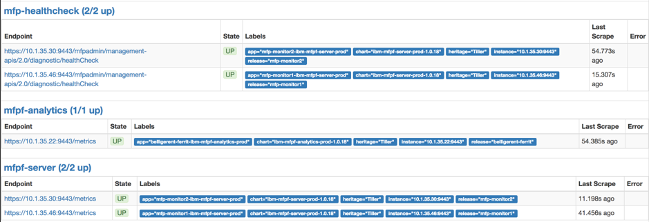
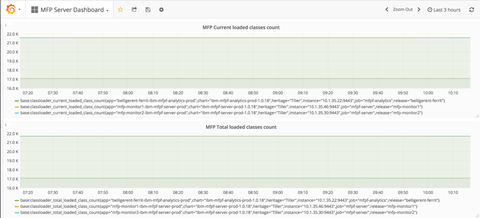

<!-- NLS_CHARSET=UTF-8 -->
## Übersicht
{: #overview }

In diesem Lernprogramm geht es um die Integration von **Prometheus** zur Überwachung der Mobile Foundation in IBM Cloud Private.

In der IBM Mobile Foundation kann das Feature `mpMetrics-1.0` aktiviert werden, um Mobile Foundation Server, Analytics und das Application Center (instrumentiert mit der API *MicroProfile metrics*) überwachen zu können. Sie werden bei der Überwachung von JVM-Metriken und Metriken auf Systemebene Ihrer in ICP implementierten Mobile-Foundation-Container unterstützt. 

Das Standardantwortformat auf eine API-Anforderung `/metrics` ist ein mit **Prometheus** kompatibles Textformat.


## Vorgehensweise
{: #procedure}

Führen Sie die folgenden Schritte aus, um die Überwachung der Mobile Foundation in {{ site.data.keys.prod_icp }} einzurichten.

### Schritt 1: Service IBM Monitoring implementieren
a.  Implementieren Sie den Überwachungsservice (Monitoring) aus dem IBM Cloud-Private-Katalog.<br/>
b.  Navigieren Sie zu **Catalog**, wählen Sie das Helm-Chart **ibm-icpmonitoring** aus und installieren Sie es. Das Helm-Chart wird in {{site.data.keys.prod_icp }} installiert.<br/>
    

### Schritt 2: **Prometheus**-Konfiguration *configmap* aktualisieren

Führen Sie den folgenden Befehl auf einem ordnungsgemäß abgeleiteten Terminal aus, bei dem es sich um eine CLI-Instanz mit den Kontextkonfigurationsdaten des ICP-Clusters handelt:<br/>
```bash
kubectl get svc | grep prometheus
```
<br/>
Sie sehen eine Reihe von Services, die vom Chart `ibm-icpmonitoring` implementiert werden. In diesem Lernprogramm geht es vorrangig um den Service `<Name_des_Helm-Release>-promethues` (mfp-prometheus-prometheus). Sehen Sie sich dazu den folgenden Screenshot an:<br/>


<br/>
Zu jedem dieser Services gibt es ein *configmap*-Objekt. Um die Metrikdaten der Mobile-Foundation-Pods zu erhalten, müssen Sie die zum Service **mfp-prometheus-prometheus** gehörende *configmap* modifzieren. Fügen Sie die Annotation `mfpfserver` für Mobile Foundation Server, die Annotation `mfpfanalytics` für Analytics und die Annotation `mfpfappcenter` für das Application Center sowie einige weitere Attribute zu der Serviceimplmentierung hinzu.<br/>
Am einfachsten erreichen Sie dies, indem Sie das vorgesehehe *configmap*-Objekt mit dem folgenden Befehl auf einem abgeleiteten Terminal bearbeiten: <br/>
```bash
  kubectl edit configmap mfp-prometheus-prometheus
  ```
<br/>
Mit diesem Befehl wird die angeforderte YAML-Datei im vi-Editor angezeigt. Blättern Sie bis zum Ende der Datei und fügen Sie den nachstehenden Text direkt vor der Zeile `kind: ConfigMap` ein.

Es folgt ein YAML-Snippet für Konfiguratin der Mobile-Foundation-Server-Metriken:<br/>

```yaml
# Konfiguration für MFP-Server-Überwachung
- job_name: 'mfpf-server'
scheme: 'https'
basic_auth:
  username: 'mfpRESTUser'
  password: 'mfpadmin'
tls_config:
  insecure_skip_verify: true
kubernetes_sd_configs:
  - role: endpoints
relabel_configs:
  - source_labels: [__meta_kubernetes_service_annotation_mfpfserver]
    action: keep
    regex: true
  - source_labels: [__address__, __meta_kubernetes_service_annotation_prometheus_io_port]
    action: replace
    target_label: __address__
    regex: (.+)(?::\d+);(\d+)
    replacement: $1:$2
  - action: labelmap
    regex: __meta_kubernetes_service_label_(.+)
```    
<br/>

Es folgt ein YAML-Snippet für die Konfiguration der Überwachung des Zustands von Mobile Foundation Server:<br/>

```yaml
# Konfiguration für die Überwachung des MFP-Zustands<br/>
- job_name: 'mfp-healthcheck'
metrics_path: /mfpadmin/management-apis/2.0/diagnostic/healthCheck
scheme: 'https'
basic_auth:
  username: 'admin'
  password: 'admin'
tls_config:
  insecure_skip_verify: true
kubernetes_sd_configs:
  - role: endpoints
relabel_configs:
  - source_labels: [__meta_kubernetes_service_annotation_mfpfserver]
    action: keep
    regex: true
  - source_labels: [__address__, __meta_kubernetes_service_annotation_prometheus_io_port]
    action: replace
    target_label: __address__
    regex: (.+)(?::\d+);(\d+)
    replacement: $1:$2
  - action: labelmap
    regex: __meta_kubernetes_service_label_(.+)
```
<br/>
> ** Hinweis:** Für die Implementierung von Mobile Foundation Analytics und des Application Center gilt eine ähnliche Metrikkonfiguration.

Der Wert von *job_name* und *source_labels* ändert sich wie bereits erwähnt. 
  
### Schritt 3: **Prometheus**-Konfiguration nach Aktualisierung der Jobs neu laden
Führen Sie den folgenden curl-Befehl aus:<br/>
```cURL
curl -s -XPOST http://<IP-Adresse des Proxyknotens>:31271/-/reload
```
<br/>


### Schritt 4: Mobile-Foundation-Statistik überwachen

a. Öffnen Sie in einem Browser mit folgender URL die **Prometheus**-Konsole:<br/>
```
http://<IP-Adresse des Proxyknotens>:31271
```
b. Klicken Sie in der **Prometheus**-Konsole zuerst auf **Status**. Wählen Sie dann in der Dropdown-Liste **Targets** aus. Sehen Sie sich dazu den folgenden Screenshot an:<br/>
  
c. Sie sollten alle Ziele (**Targets**) sehen, für die Prometheus Statistikdaten erhalten hat.<br/>
  <br/>
  
<br/>
  Im obigen Screenshot sind klar Mobile Foundation Server, Analytics und das Application Center als Ziele (**Targets**) angegeben. Sehen Sie sich den Wert des Attributs *job_name* in der YAML-Datei für die *configmap* in Schritt 2 an.<br/>
  Wie haben unser Implementierungsbeispiel vertikal skaliert, sodass es jetzt zwei Replikate gibt. Aus dem Gunde zeigt **Prometheus** zwei Endpunkte für Server. <br/>

  Wenn Sie in der **Prometheus**-Konsole auf **Graph** klicken, können Sie in der daraufhin erscheinenden Anzeige auf **insert metric at cursor** klicken. Sehen Sie sich dazu den folgenden Screenshot an:<br/>
  

  Sie sehen eine Reihe von Metriken, die von der vorhandenen **Prometheus**-Konfiguration überwacht werden können. In der langen Liste der Metriken stammen Metriken, deren Namen mit **base:** beginnen, von den Mobile-Foundation-Containern, die das Feature `mpMetrics-1.0` beigesteuert hat. <br/>
  

  Wenn Sie eine Liberty-Metrik (z. B. **base:thread_count**) auswählen, können Sie im Prometheus-Diagramm die Werte aus beiden Mobile-Foundation-Server-Pods sehen. Vergleichen Sie dazu den folgenden Screenshot:<br/>
  

  Sie können in **Prometheus** weitere relevante Metriken in grafischer oder numerischer Form untersuchen. Klicken Sie dazu auf **Console**.<br/>
  Darüber hinaus können Sie Ihre Implementierungen skalieren. Binnen kurzem stimmt die Anzahl der Endpunkte in der Prometheus-Konsole mit der Anzahl der Replikate überein. <br/>

  >**Hinweis:** Wir haben hier für Kennwörter in der *configmap*-Datei von Prometheus Klartext verwendet. Wenn die Konfiguration in der Prometheus-Anzeige aufgerufen wird, wird das Kennwort jedoch nicht angezeigt. 

### Schritt 5: Metriken im **Grafana**-Dashboard anzeigen
Die Helm-Charts für die Mobile Foundation enthalten JSON-Beispieldateien für das Grafana-Dashboard. In dem in Schritt 1 implementierten Überwachungsservice (Monitoring) gibt es Grafana bereits. <br/>

Ein Grafana-Dashboard kann wie folgt aus einer JSON-Datei importiert werden: <br/>

* Starten Sie Grafana vom implementierten Überwachungsservice aus. <br/>
  <b>Workloads -> Helm releases -> `<Name_des_Helm-Release>` (z. B. mfp-prometheus) ->Launch)</b>

* Laden Sie die JSON-Dashboarddatei von [GitHub](https://github.ibm.com/IBMPrivateCloud/charts/tree/master/stable/ibm-mfpf-server-prod/additionalFiles/ibm-mfpf-server-prod-grafanadashboard.json) auf Ihre lokale Workstation herunter. <br/>

* Klicken Sie auf der Grafana-Schnittstelle auf die Schaltfläche *Home* und dann auf **Import Dashboard**.<br/>

* Klicken Sie auf die Schaltfläche **Upload .json file** und wählen Sie die JSON-Datei für das Grafana-Dashboard in Ihrem lokalen Dateisystem aus. <br/>

* Wählen Sie im Menü **Select a data source** die Option **prometheus** aus, sofern dieser Eintrag noch nicht ausgewählt ist. <br/>

* Klicken Sie auf **Import**.<br/>

Im folgenden Screenshot sehen Sie ein Monitoring-Beispiel-Dashboard für Mobile Foundation Server:<br/>



