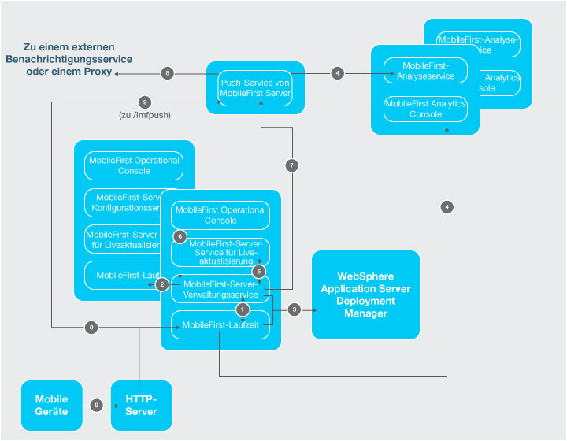
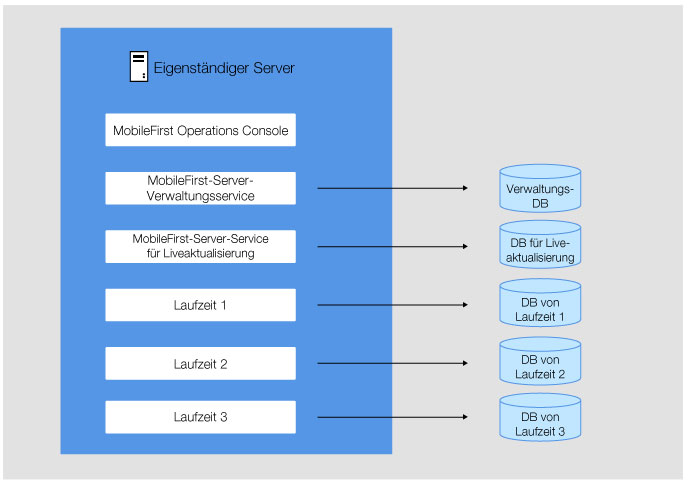
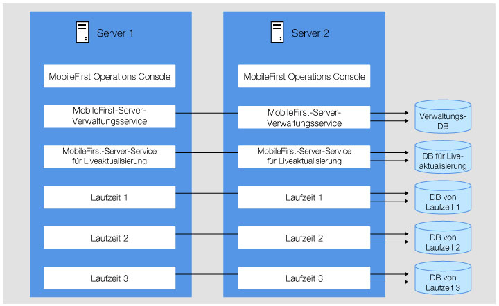
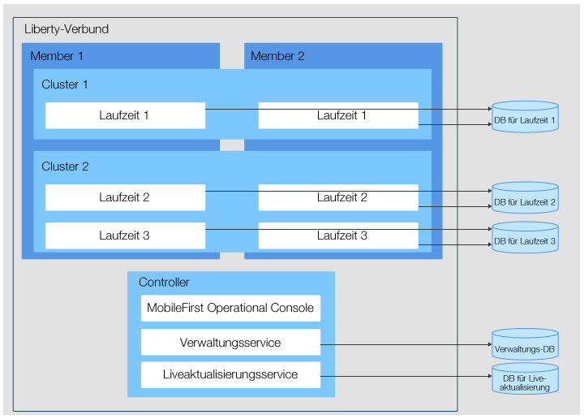
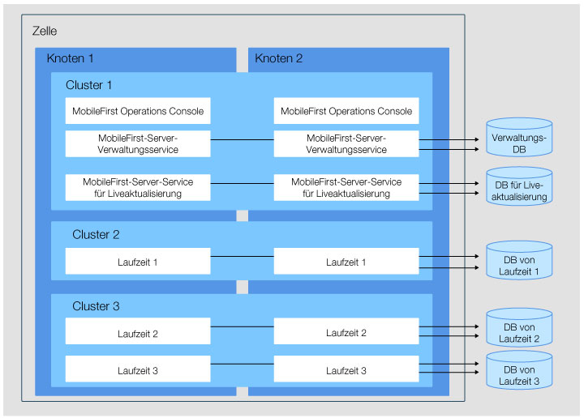
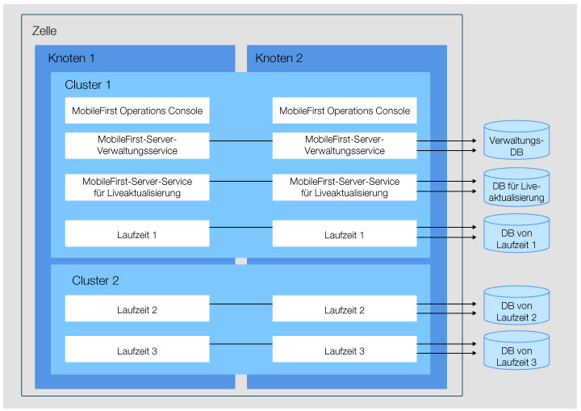

<!-- NLS_CHARSET=UTF-8 -->
## Übersicht
{: #overview }
In dieser Übersicht finden Sie ausführliche Informationen zu den möglichen Topologien für MobileFirst-Server-Komponenten sowie Angaben zu verfügbaren Netzabläufen.   
Die Komponenten werden entsprechend der von Ihnen verwendeten Servertopologie implementiert. Im Abschnitt zu den Netzabläufen erfahren Sie, wie die Komponenten untereinander und mit den Endbenutzergeräten
kommunizieren. 

#### Fahren Sie mit folgenden Abschnitten fort:
{: #jump-to }

* [Netzabläufe zwischen den MobileFirst-Server-Komponenten](#network-flows-between-the-mobilefirst-server-components)
* [Einschränkungen für die MobileFirst-Server-Komponenten und für {{ site.data.keys.mf_analytics }}](#constraints-on-the-mobilefirst-server-components-and-mobilefirst-analytics)
* [Mehrere MobileFirst-Foundation-Laufzeiten](#multiple-mobilefirst-foundation-runtimes)
* [Mehrere Instanzen von {{ site.data.keys.mf_server }} innerhalb eines Servers oder in einer WebSphere-Application-Server-Zelle](#multiple-instances-of-mobilefirst-server-on-the-same-server-or-websphere-application-server-cell)

## Netzabläufe zwischen den MobileFirst-Server-Komponenten
{: #network-flows-between-the-mobilefirst-server-components }
Die MobileFirst-Server-Komponenten können
über JMX oder HTTP miteinander kommunizieren. Sie müssen bestimmte JNDI-Eigenschaften konfigurieren, um die Kommunikation zu ermöglichen.   
Die Netzabläufe zwischen den Komponenten und dem Gerät sind in der folgenden Abbildung dargestellt: 

Die Abläufe zwischen den verschiedenen MobileFirst-Server-Komponenten, {{ site.data.keys.mf_analytics }}, den mobilen Geräten und dem Anwendungsserver sind in den folgenden Abschnitten erläutert: 

1. [Abläufe zwischen MobileFirst-Foundation-Laufzeit und MobileFirst-Server-Verwaltungsservice](#mobilefirst-foundation-runtime-to-mobilefirst-server-administration-service)
2. [Abläufe zwischen MobileFirst-Server-Verwaltungsservice und MobileFirst-Foundation-Laufzeit auf anderen Servern](#mobilefirst-server-administration-service-to-mobilefirst-foundation-runtime-in-other-servers)
3. [Abläufe zwischen MobileFirst-Server-Verwaltungsservice, MobileFirst-Laufzeit und Deployment Manager in WebSphere Application Server Network Deployment](#mobilefirst-server-administration-service-and-mobilefirst-runtime-to-the-deployment-manager-on-websphere-application-server-network-deployment)
4. [Abläufe zwischen MobileFirst-Server-Push-Service, MobileFirst-Foundation-Laufzeit und {{ site.data.keys.mf_analytics }}](#mobilefirst-server-push-service-and-mobilefirst-foundation-runtime-to-mobilefirst-analytics)
5. [Abläufe zwischen MobileFirst-Server-Verwaltungsservice und MobileFirst-Server-Liveaktualisierungsservice](#mobilefirst-server-administration-service-to-mobilefirst-server-live-update-service)
6. [Abläufe zwischen {{ site.data.keys.mf_console }} und MobileFirst-Server-Verwaltungsservice](#mobilefirst-operations-console-to-mobilefirst-server-administration-service)
7. [Abläufe zwischen MobileFirst-Server-Verwaltungsservice, MobileFirst-Server-Push-Service und Autorisierungsserver](#mobilefirst-server-administration-service-to-mobilefirst-server-push-service-and-to-the-authorization-server)
8. [Abläufe zwischen MobileFirst-Server-Push-Service und externem Push-Benachrichtigungsservice (abgehend)](#mobilefirst-server-push-service-to-an-external-push-notification-service-outbound)
9. [Abläufe zwischen mobilen Geräten und MobileFirst-Foundation-Laufzeit](#mobile-devices-to-mobilefirst-foundation-runtime)

### Abläufe zwischen MobileFirst-Foundation-Laufzeit und MobileFirst-Server-Verwaltungsservice
{: #mobilefirst-foundation-runtime-to-mobilefirst-server-administration-service }
Die Laufzeit und der Verwaltungsservice können über JMX oder HTTP miteinander
kommunizieren. Diese Kommunikation findet während der Initialisierungphase der Laufzeit statt. Die Laufzeit nimmt lokal über den Anwendungsserver Kontakt zum
Verwaltungsservice auf, um die Liste der Adapter und Anwendungen zu erhalten, für die sie Services bereitstellen soll. Die Kommunikation findet auch statt, wenn bestimmte
Verwaltungsoperationen in der
{{ site.data.keys.mf_console }} oder vom
Verwaltungsservice ausgeführt werden. In
WebSphere Application Server Network Deployment kann die Laufzeit Kontakt zu einem Verwaltungsservice aufnehmen, der auf einem anderen Server der Zelle installiert ist. Dadurch ist eine nicht symmetrische
Implementierung möglich (siehe [Einschränkungen für den MobileFirst-Server-Verwaltungsservice und -Liveaktualisierungsservice
sowie für die MobileFirst-Foundation-Laufzeit](#constraints-on-mobilefirst-server-administration-service-mobilefirst-server-live-update-service-and-mobilefirst-foundation-runtime)). Bei allen anderen Anwendungsservern
(Apache Tomcat, WebSphere Application Server Liberty
oder eigenständiger WebSphere Application Server) muss der Verwaltungsservice jedoch auf demselben
Server wie die Laufzeit ausgeführt werden. 

Die Protokolle für JMX richten sich nach dem jeweiligen Anwendungsserver. 

* Apache Tomcat - RMI
* WebSphere Application Server Liberty -
HTTPS (mit REST-Connector)
* WebSphere Application Server -
SOAP oder RMI

Für die Kommunikation über JMX ist es erforderlich, dass diese Protokolle auf dem Anwendungsserver verfügbar sind. Weitere Informationen zu den
Anforderungen finden Sie unter
[Voraussetzungen für den Anwendungsserver](../appserver/#application-server-prerequisites). 

Die JMX-Beans der Laufzeit und des
Verwaltungsservice werden vom Anwendungsserver abgerufen. Bei Verwendung von
WebSphere Application Server Network Deployment werden
die JMX-Beans jedoch vom Deployment Manager abgerufen. Der Deployment Manager hat den Überblick über alle Beans einer Zelle in
WebSphere Application Server Network Deployment.
Einige Konfigurationen (z. B. die Farmkonfiguration) sind daher in WebSphere Application Server Network Deployment nicht erforderlich
und eine nicht symmetrische Implementierung ist in
WebSphere Application Server Network Deployment möglich.
Weitere Informationen finden Sie unter
[Einschränkungen für den MobileFirst-Server-Verwaltungsservice und -Liveaktualisierungsservice sowie für die
MobileFirst-Foundation-Laufzeit](#constraints-on-mobilefirst-server-administration-service-mobilefirst-server-live-update-service-and-mobilefirst-foundation-runtime). 

Die verschiedenen Installationen von
{{ site.data.keys.mf_server }} in demselben Anwendungsserver oder
in derselben WebSphere-Application-Server-Zelle können Sie mit einer Umgebungs-ID (einer JNDI-Variablen) unterscheiden. Diese Variable hat standardmäßig einen leeren
Wert. Eine Laufzeit mit einer gegebenen Umgebungs-ID kommuniziert nur mit einem Verwaltungsservice, der die gleiche Umgebungs-ID hat. Angenommen, der Verwaltungsservice hat die Umgebungs-ID
X und die Laufzeit hat eine andere Umgebungs-ID (z. B.
Y). In dem Fall können die beiden Komponenten sich nicht sehen. In der
{{ site.data.keys.mf_console }} wird keine verfügbare Laufzeit
angezeigt. 

Ein Verwaltungsservice muss mit allen
{{ site.data.keys.product }}-Laufzeitkomponenten eines Clusters
kommunizieren können. Wenn eine Verwaltungsoperation wie das Hochladen einer neuen Adapterversion oder das Ändern des aktiven Status einer Anwendung
ausgeführt wird, müssen alle Laufzeitkomponenten des Clusters über die Änderung informiert werden. Wenn der Anwendungsserver nicht
WebSphere Application Server Network Deployment ist, kann diese Kommunikation nur stattfinden, wenn
eine Farm konfiguriert ist. Weitere Informationen finden Sie unter
[Einschränkungen für den MobileFirst-Server-Verwaltungsservice und -Liveaktualisierungsservice sowie für die
MobileFirst-Foundation-Laufzeit](#constraints-on-mobilefirst-server-administration-service-mobilefirst-server-live-update-service-and-mobilefirst-foundation-runtime). 

Die Laufzeit kommuniziert auch über HTTP oder HTTPS mit dem Verwaltungsservice, um große Artefakte (z. B. Adapter) herunterzuladen. Der Verwaltungsservice generiert
eine URL und die Laufzeit öffnet eine abgehende HTTP- oder HTTPS-Verbindung, um über diese URL ein Artefakt anzufordern. Die standardmäßige Generierung der URL kann
durch das Definieren der JNDI-Eigenschaften
mfp.admin.proxy.port, mfp.admin.proxy.protocol
und mfp.admin.proxy.host im Verwaltungsservice außer Kraft gesetzt werden. Der Verwaltungsservice muss unter Umständen auch über HTTP oder HTTPS mit der Laufzeit kommunizieren, um
OAuth-Token für die Ausführung der Push-Operationen abzurufen. Weitere Informationen finden Sie unter [Abläufe zwischen MobileFirst-Server-Verwaltungsservice, MobileFirst-Server-Push-Service und Autorisierungsserver](#mobilefirst-server-administration-service-to-mobilefirst-server-push-service-and-to-the-authorization-server)

Für die Kommunikation zwischen der Laufzeit und dem Verwaltungsservice werden die folgenden JNDI-Eigenschaften
verwendet: 

#### MobileFirst-Server-Verwaltungsservice
{: #mobilefirst-server-administration-service }

* [JNDI-Eigenschaften für den Verwaltungsservice: JMX](../server-configuration/#jndi-properties-for-administration-service-jmx)
* [JNDI-Eigenschaften für den Verwaltungsservice: Proxys](../server-configuration/#jndi-properties-for-administration-service-proxies)
* [JNDI-Eigenschaften für den Verwaltungsservice: Topologien](../server-configuration/#jndi-properties-for-administration-service-topologies)

#### MobileFirst-Foundation-Laufzeit
{: #mobilefirst-foundation-runtime }

* [Liste der JNDI-Eigenschaften für die {{ site.data.keys.product_adj }}-Laufzeit](../server-configuration/#list-of-jndi-properties-for-mobilefirst-runtime)

### Abläufe zwischen MobileFirst-Server-Verwaltungsservice und MobileFirst-Foundation-Laufzeit auf anderen Servern
{: #mobilefirst-server-administration-service-to-mobilefirst-foundation-runtime-in-other-servers }
Wie bereits unter
[Abläufe zwischen MobileFirst-Foundation-Laufzeit und
MobileFirst-Server-Verwaltungsservice](#mobilefirst-foundation-runtime-to-mobilefirst-server-administration-service) erläutert, muss ein Verwaltungsservice mit allen Laufzeitkomponenten eines Clusters kommunizieren
können. Wenn eine Verwaltungsoperation ausgeführt wird,
können so alle Laufzeitkomponenten eines Clusters über diese Änderung informiert werden. Die Kommunikation erfolgt über JMX.

In WebSphere Application Server Network Deployment
kann diese Kommunikation ohne weitere Konfigurationsschritte stattfinden. Alle
JMX-MBeans, die mit derselben Umgebungs-ID korrespondieren, werden vom Deployment Manager
abgerufen. 

In einem Cluster mit eigenständigem WebSphere Application Server,
WebSphere Application Server Liberty Profile
oder Apache Tomcat ist die Kommunikation nur möglich, wenn eine Farm konfiguriert ist.
Weitere Informationen finden Sie unter
[Server-Farm installileren](../appserver/#installing-a-server-farm).

### Abläufe zwischen MobileFirst-Server-Verwaltungsservice, MobileFirst-Laufzeit und Deployment Manager in WebSphere Application Server Network Deployment
{: #mobilefirst-server-administration-service-and-mobilefirst-runtime-to-the-deployment-manager-on-websphere-application-server-network-deployment }
In WebSphere Application Server Network Deployment
kommunizieren die Laufzeit und der Verwaltungsservice mit dem Deployment Manager, um die unter [Abläufe zwischen
MobileFirst-Foundation-Laufzeit und MobileFirst-Server-Verwaltungsservice](#mobilefirst-foundation-runtime-to-mobilefirst-server-administration-service)
und
[Abläufe zwischen
MobileFirst-Server-Verwaltungsservice und MobileFirst-Foundation-Laufzeit auf anderen Servern](#mobilefirst-server-administration-service-to-mobilefirst-foundation-runtime-in-other-servers) angegebenen JMX-Beans abzurufen. Die entsprechenden JNDI-Eigenschaften
sind **mfp.admin.jmx.dmgr.*** (siehe [JNDI-Eigenschaften für den Verwaltungsservice: JMX](../server-configuration/#jndi-properties-for-administration-service-jmx)).

Für Operationen, die eine Kommunikation zuwischen der Laufzeit und dem Verwaltungsservice erfordern,
muss der Deployment Manager akjtiv sein. Eine solche Operation könnte eine Laufzeitinitialisierung oder die Benachrichtigung über eine Änderung durch den Verwaltungsservice
sein. 

### Abläufe zwischen MobileFirst-Server-Push-Service, MobileFirst-Foundation-Laufzeit und {{ site.data.keys.mf_analytics }}
{: #mobilefirst-server-push-service-and-mobilefirst-foundation-runtime-to-mobilefirst-analytics }
Die Laufzeit sendet Daten
über HTTP oder HTTPS an {{ site.data.keys.mf_analytics }}. Diese Kommunikation wird mit folgenden
JNDI-Eigenschaften der Laufzeit definiert: 

* **mfp.analytics.url**: URL, die vom
{{ site.data.keys.mf_analytics }} Service
zugänglich gemacht wird, damit er von der Laufzeit eingehende Analysedaten empfangen kann. Beispiel: `http://<Hostname>:<Port>/analytics-service/rest` 

    Wenn
{{ site.data.keys.mf_analytics }} als Cluster installiert ist,
können die Daten an beliebig viele Clulster-Member gesendet werden. 

* **mfp.analytics.username**: Benutzername für den Zugriff auf den
{{ site.data.keys.mf_analytics }} Service.
Der Analyseservice wird durch eine Sicherheitsrolle geschützt. 
* **mfp.analytics.password**:  Kennwort für den Zugriff auf den Analyseservice
* **mfp.analytics.console.url**: URL, die an die
{{ site.data.keys.mf_console }} übergeben wird, um einen Link zur
{{ site.data.keys.mf_analytics_console }} anzuzeigen.
Beispiel: `http://<Hostname>:<Port>/analytics/console` 

Diese Kommunikation wird mit folgenden
JNDI-Eigenschaften des Push-Service definiert: * **mfp.push.analytics.endpoint**: URL, die vom
{{ site.data.keys.mf_analytics }} Service
zugänglich gemacht wird, damit er vom Push-Service eingehende Analysedaten empfangen kann. Beispiel: `http://<Hostname>:<Port>/analytics-service/rest` 

Wenn
{{ site.data.keys.mf_analytics }} als Cluster installiert ist,
können die Daten an beliebig viele Clulster-Member gesendet werden.     
* **mfp.push.analytics.username**: Benutzername für den Zugriff auf den
{{ site.data.keys.mf_analytics }} Service.
Der Analyseservice wird durch eine Sicherheitsrolle geschützt. 
* **mfp.push.analytics.password**:  Kennwort für den Zugriff auf den Analyseservice

### Abläufe zwischen MobileFirst-Server-Verwaltungsservice und MobileFirst-Server-Liveaktualisierungsservice
{: #mobilefirst-server-administration-service-to-mobilefirst-server-live-update-service }
Der Verwaltungsservice kommuniziert mit dem Liveaktualisierungsservice, um Konfigurationsdaten
von
{{ site.data.keys.product }}-Artefakten zu speichern und abzurufen.
Die Kommunikation erfolgt über HTTP oder HTTPS.

Die URL für den Kontakt zum Liveaktualisierungsservice wird automatisch vom Verwaltungsservice generiert. Beide Services müssen sich in demselben Anwendungsserver
befinden. Das Kontextstammverzeichnis des Liveaktualisierungsservice wird wie folgt definiert: `<Kontextstammverzeichnis_des_Verwaltungsservice>config`. Wenn das Kontextstammverzeichnis des Verwaltungsservice beispielsweise
**mfpadmin** ist, muss der Liveaktualisierungsservice das Kontextstammverzeichnis
**mfpadminconfig** haben. Die standardmäßige Generierung der URL kann
durch das Definieren der JNDI-Eigenschaften
**mfp.admin.proxy.port**, **mfp.admin.proxy.protocol**
und **mfp.admin.proxy.host** im Verwaltungsservice außer Kraft gesetzt werden. 

Diese Kommunikation zwischen den beiden Services wird mit
folgenden JNDI-Eigenschaften konfiguriert: 

* **mfp.config.service.user**
* **mfp.config.service.password**
* Unter
[JNDI-Eigenschaften für den
Verwaltungsservice: Proxys](../server-configuration/#jndi-properties-for-administration-service-proxies) aufgeführte Eigenschaften 

### Abläufe zwischen {{ site.data.keys.mf_console }} und MobileFirst-Server-Verwaltungsservice
{: #mobilefirst-operations-console-to-mobilefirst-server-administration-service }
Die {{ site.data.keys.mf_console }} ist
eine Webbenutzerschnittstelle und agiert als Front-End für den Verwaltungsservice. Sie kommuniziert über HTTP oder HTTPS
mit den REST-Services des Verwaltungsservice. Die Benutzer, die die Konsole verwenden dürfen, müssen auch berechtigt sein,
den Verwaltungsservice zu verwenden. Jeder Benutzer, der einer bestimmten Sicherheitsrolle der Konsole zugeordnet ist,
muss der gleichen Sicherheitsrolle des Verwaltungsservice zugeordnet sein. Mit diesem Setup kann der Service die Anforderungen von der Konsole
akzeptieren. 

Die zum Konfigurieren dieser Kommunikation verwendeten JNDI-Eigenschaften sind unter
[JNDI-Eigenschaften
für die {{ site.data.keys.mf_console }}](../server-configuration/#jndi-properties-for-mobilefirst-operations-console) angegeben.

> Hinweis: Die Eigenschaft
**mfp.admin.endpoint** ermöglicht der Konsole, den Verwaltungsservice zu finden. Sie können den Stern (\*) als Platzhalterzeichen verwenden,
wenn Sie angeben möchten, dass die von der Konsole für den Kontakt zum Verwaltungsservice generierte URL den gleichen Wert wie die
bei der Konsole eingehende HTTP-Anforderung verwenden soll. Die Angabe `*://*:*/mfpadmin` bedeutet beispielsweise, dass die Services dasselbe Protokoll, denselben Host und denselben Port
wie die Konsole verwenden, aber **mfpadmin** als Kontextstammverzeichnis. Diese Eigenschaft wird für die Konsolenanwendung angegeben.

### Abläufe zwischen MobileFirst-Server-Verwaltungsservice, MobileFirst-Server-Push-Service und Autorisierungsserver
{: #mobilefirst-server-administration-service-to-mobilefirst-server-push-service-and-to-the-authorization-server }
Der Verwaltungsservice kommuniziert mit dem Push-Service, um diverse Push-Operationen anzufordern. Diese Kommunikation wird mit dem
OAuth-Protokoll geschützt.
Beide Services müssen als vertrauliche Clients registriert sein. Eine erste Registrierung kann bei der Installation durchgeführt werden. Dafür müssen beide Services Kontakt zu einem
Autorisierungsserver aufnehmen. Die
{{ site.data.keys.product }}-Laufzeit kann als dieser Autorisierungsserver agieren. 

Diese Kommunikation wird mit folgenden
JNDI-Eigenschaften des Verwaltungssservice konfiguriert: 

* **mfp.admin.push.url**: URL des Push-Service
* **mfp.admin.authorization.server.url**: URL des
{{ site.data.keys.product }}-Autorisierungsservers
* **mfp.admin.authorization.client.id**: Client-ID des Verwaltungsservice als vertraulicher OAuth-Client
* **mfp.admin.authorization.client.secret**: Geheimer Code zum Abrufen OAuth-basierter Token

> Hinweis: Die Eigenschaften
**mfp.push.authorization.client.id** und
**mfp.push.authorization.client.secret** des Verwaltungsservice können verwendet werden, um den Push-Service automatisch als vertraulichen Client
zu registrieren, wenn der Verwaltungsservice gestartet wird. Der Push-Service muss mit den gleichen Werten konfiguriert werden.

Diese Kommunikation wird mit folgenden
JNDI-Eigenschaften des Push-Service konfiguriert: 

* **mfp.push.authorization.server.url**: URL des
{{ site.data.keys.product }}-Autorisierungsservers. Stimmt mit dem Wert
der Eigenschaft **mfp.admin.authorization.server.url** überein.
* **mfp.push.authorization.client.id**: Client-ID des Push-Service für den Kontakt zum Autorisierungsserver 
* **mfp.push.authorization.client.secret**: Geheimer Code für den Kontakt zum Autorisierungsserver

### Abläufe zwischen MobileFirst-Server-Push-Service und externem Push-Benachrichtigungsservice (abgehend)
{: #mobilefirst-server-push-service-to-an-external-push-notification-service-outbound }
Der Push-Service erzeugt abgehende Datenverbindungen zum externen
Service, z. B. zum
Apple Push Notification Service (APNS) oder zu Google Cloud
Messaging (GCM). Diese Kommunikation kann auch über einen Proxy erfolgen.
Je nach Benachrichtigungsservice müssen die folgenden JNDI-Eigenschaften festgelegt werden: 

* **push.apns.proxy**
* **push.gcm.proxy**

Weitere Informationen enthält die
[Liste der JNDI-Eigenschaften für den MobileFirst-Server-Push-Service](../server-configuration/#list-of-jndi-properties-for-mobilefirst-server-push-service).

### Abläufe zwischen mobilen Geräten und {{ site.data.keys.product }}-Laufzeit
{: #mobile-devices-to-mobilefirst-foundation-runtime }
Die mobilen Geräte nehmen
Kontakt zur Laufzeit auf. Die Sicherheit dieser Kommunikation wird durch die Konfiguration der Anwendung und die angeforderten
Adapter bestimmt. Weitere Informationen
finden Sie unter
[{{ site.data.keys.product_adj }}-Sicherheitsframework](../../../authentication-and-security).

## Einschränkungen für die MobileFirst-Server-Komponenten und für {{ site.data.keys.mf_analytics }}
{: #constraints-on-the-mobilefirst-server-components-and-mobilefirst-analytics }
Bevor Sie sich für eine Servertopologie entscheiden, sollten Sie sich mit den
Einschränkungen für die verschiedenen MobileFirst-Server-Komponenten und für
{{ site.data.keys.mf_analytics }}
beschäftigen. 

* [Einschränkungen für den MobileFirst-Server-Verwaltungsservice und -Liveaktualisierungsservice sowie für die MobileFirst-Foundation-Laufzeit](#constraints-on-mobilefirst-server-administration-service-mobilefirst-server-live-update-service-and-mobilefirst-foundation-runtime)
* [Einschränkungen für den MobileFirst-Server-Push-Service](#constraints-on-mobilefirst-server-push-service)

### Einschränkungen für den MobileFirst-Server-Verwaltungsservice und -Liveaktualisierungsservice sowie für die MobileFirst-Foundation-Laufzeit
{: #constraints-on-mobilefirst-server-administration-service-mobilefirst-server-live-update-service-and-mobilefirst-foundation-runtime }
Nachfolgend sind die Einschränkungen und Implementierungsmodi für den Verwaltungsservice, den Liveaktualisierungsservice und die Laufzeit geordnet nach Servertopologien
beschrieben. 

Der Liveaktualisierungsservice muss immer zusammen mit dem Verwaltungsservice in einem Anwendungsserver
installiert werden (siehe Erläuterungen unter
[Abläufe zwischen MobileFirst-Server-Verwaltungsservice
und MobileFirst-Server-Liveaktualisierungsservice](#mobilefirst-server-administration-service-to-mobilefirst-server-live-update-service)). Das Kontextstammverzeichnis des Liveaktualisierungsservice wird wie folgt definiert: /<Kontextstammverzeichnis_des_Verwaltungsservice>config. Wenn das Kontextstammverzeichnis des Verwaltungsservice beispielsweise
**/mfpadmin** ist, muss der Liveaktualisierungsservice das Kontextstammverzeichnis
**/mfpadminconfig** haben.

Sie können die folgenden Anwendungsservertopologien verwenden: 

* Eigenständiger Server: WebSphere Application Server Liberty Profile, Apache Tomcat oder WebSphere Application Server Full Profile
* Server-Farm: WebSphere Application Server Liberty Profile, Apache Tomcat oder WebSphere Application Server Full Profile
* WebSphere-Application-Server-Network-Deployment-Zelle
* Liberty-Verbund

#### Implementierungsmodi
{: #modes-of-deployment }
Für die Implementierung des Verwaltungsservice, des Liveaktualisierungsservice und der Laufzeit in der Anwendungsserverinfrastruktur gibt es je nach
verwendeter Anwendungsservertopologie zwei Modi. Bei einer asymmetrischen Implementierung können Sie die Laufzeiten in anderen Anwendungsservern als den Verwaltungsservice und den Liveaktualisierungsservice
installieren. 

**Symmetrische
Implementierung**  
Bei einer symmetrischen Implementierung müssen Sie
die {{ site.data.keys.product }}-Verwaltungskomponenten
(Anwendungen für die {{ site.data.keys.mf_console }}, den Verwaltungsservice und den
Liveaktualisierungsservice) und die Laufzeit in demselben Anwendungsserver installieren. 

**Asymmetrische
Implementierung**  
Bei einer asymmetrischen Implementierung können Sie die Laufzeiten in anderen Anwendungsservern als die MobileFirst-Foundation-Verwaltungskomponenten
installieren.   
Die
asymmetrische Implementierung wird nur für die Topologie einer WebSphere-Application-Server-Network-Deployment-Zelle und eines
Liberty-Verbundes
unterstützt. 

#### Wählen Sie eine Topologie aus:
{: #select-a-topology }

* [Eigenständige Servertopologie](#stand-alone-server-topology)
* [Server-Farmtopologie](#server-farm-topology)
* [Topologie eines Liberty-Verbunds](#liberty-collective-topology)
* [WebSphere-Application-Server-Network-Deployment-Topologien](#websphere-application-server-network-deployment-topologies)
* [Reverse Proxy mit Server-Farm- und WebSphere-Application-Server-Network-Deployment-Topologie verwenden](#using-a-reverse-proxy-with-server-farm-and-websphere-application-server-network-deployment-topologies)

### Eigenständige Servertopologie
{: #stand-alone-server-topology }
Sie können für
WebSphere Application Server Full Profile, WebSphere Application Server
Liberty Profile und
Apache Tomcat eine eigenständige Topologie konfigurieren. In dieser Topologie werden die Verwaltungskomponenten und Laufzeiten alle in einer Java Virtual Machine (JVM) implementiert.

Bei einer JVM ist nur eine symmetrische Implementierung mit folgenden Merkmalen möglich: 

* Verwaltungskomponenten können implementiert werden.
Jede {{ site.data.keys.mf_console }} kommuniziert mit einem Verwaltungsservice und einem Liveaktualisierungsservice. 
* Laufzeiten können implementiert werden. 
* Eine {{ site.data.keys.mf_console }} kann mehrere Laufzeiten verwalten. 
* Eine Laufzeit wird von nur einer {{ site.data.keys.mf_console }} verwaltet.
* Jeder Verwaltungsservice verwendet sein eigenes Verwaltungsdatenbankschema.
* Jeder Liveaktualisierungsservice verwendet sein eigenes Datenbankschema.
* Jede Laufzeit verwendet ihr eigenes Laufzeitdatenbankschema.

#### JNDI-Eigenschaften konfigurieren
{: #configuration-of-jndi-properties }
Einige JNDI-Eigenschaften sind erforderlich, um die
JMX-Kommunikation (Java Management Extensions) zwischen dem Verwaltungsservice und der Laufzeit zu ermöglichen und den Verwaltungsservice, der eine Laufzeit verwaltet, zu definieren. Einzelheiten zu diesen Eigenschaften
enthalten die [Liste der JNDI-Eigenschaften
für den MobileFirst-Server-Verwaltungsservice](../server-configuration/#list-of-jndi-properties-for-mobilefirst-server-administration-service) und die
[Liste der JNDI-Eigenschaften für die {{ site.data.keys.product_adj }}-Laufzeit](../server-configuration/#list-of-jndi-properties-for-mobilefirst-runtime).

**Eigenständiger Server mit WebSphere Application Server Liberty Profile**  
Für die Verwaltungsservices und Laufzeiten sind die folgenden globalen JNDI-Eigenschaften erforderlich. 

| JNDI-Eigenschaften| Werte|
|--------------------------|--------|
| mfp.topology.platform| Liberty|
| mfp.topology.clustermode | Standalone|
| mfp.admin.jmx.host | Hostname des Servers mit WebSphere Application Server Liberty Profile|
| mfp.admin.jmx.port | Port des REST-Connectors, der der Port des Attributs httpsPort ist, das im Element `<httpEndpoint>` der Datei server.xml des Servers mit WebSphere Application Server Liberty Profile deklariert ist. Diese Eigenschaft hat keinen Standardwert.|
| mfp.admin.jmx.user       | Benutzername des WebSphere-Application-Server-Liberty-Administrators, der mit dem im Element `<administrator-role>` der Datei server.xml des Servers mit WebSphere Application Server Liberty Profile definierten Namen übereinstimmen muss. |
| mfp.admin.jmx.pwd | Kennwort des WebSphere-Application-Server-Benutzers mit Administratorberechtigung|

Sie können in einer JVM mehrere Verwaltungskomponenten implementieren, die unterschiedliche Laufzeiten verwalten. 

Wenn Sie mehrere Verwaltungskomponenten implementieren, müssen Sie Folgendes angeben: 

* Für jeden Verwaltungsservice einen eindeutigen Wert für die lokale JNDI-Eigenschaft **mfp.admin.environmentid**
* Für jede Laufzeit den Wert für die lokale JNDI-Eigenschaft
**mfp.admin.environmentid**, der für den Verwaltungsservice definiert ist, der
die jeweilige Laufzeit verwaltet 

**Eigenständiger Apache-Tomcat-Server**
Für die Verwaltungsservices und Laufzeiten sind die folgenden lokalen JNDI-Eigenschaften erforderlich.

| JNDI-Eigenschaften|	Werte|
|------------------------|------------|
| mfp.topology.platform| Tomcat|
| mfp.topology.clustermode | Standalone|

JVM-Eigenschaften sind auch für die Definition von JMX (Java Management Extensions) RMI (Remote Method Invocation) erforderlich. Weitere Informationen finden Sie unter [JMX-Verbindung für Apache Tomcat konfigurieren](../appserver/#apache-tomcat-prerequisites).

Wenn der Apache Tomcat Server
hinter einer Firewall ausgeführt wird,
sind die JNDI-Eigenschaften
**mfp.admin.rmi.registryPort** und **mfp.admin.rmi.serverPort**
für den Verwaltungsservice erforderlich (siehe [JMX-Verbindung für Apache Tomcat konfigurieren](../appserver/#apache-tomcat-prerequisites)).

Sie können in einer JVM mehrere Verwaltungskomponenten implementieren, die unterschiedliche Laufzeiten verwalten.   
Wenn Sie mehrere Verwaltungskomponenten implementieren, müssen Sie Folgendes angeben: 

* Für jeden Verwaltungsservice einen eindeutigen Wert für die lokale JNDI-Eigenschaft mfp.admin.environmentid
* Für jede Laufzeit den Wert für die lokale JNDI-Eigenschaft
mfp.admin.environmentid, der für den Verwaltungsservice definiert ist, der
die jeweilige Laufzeit verwaltet 

**Eigenständiger WebSphere Application Server**  
Für die Verwaltungsservices und Laufzeiten sind die folgenden lokalen JNDI-Eigenschaften erforderlich. 

| JNDI-Eigenschaften| Werte|
|--------------------------| -----------------------|
| mfp.topology.platform| WAS|
| mfp.topology.clustermode | Standalone|
| mfp.admin.jmx.connector| JMX-Connectortyp. Der Wert kann SOAP oder RMI sein. |

Sie können in einer JVM mehrere Verwaltungskomponenten implementieren, die unterschiedliche Laufzeiten verwalten.   
Wenn Sie mehrere Verwaltungskomponenten implementieren, müssen Sie Folgendes angeben: 

* Für jeden Verwaltungsservice einen eindeutigen Wert für die lokale JNDI-Eigenschaft **mfp.admin.environmentid**
* Für jede Laufzeit den Wert für die lokale JNDI-Eigenschaft
**mfp.admin.environmentid**, der für den Verwaltungsservice definiert ist, der
die jeweilige Laufzeit verwaltet 

### Server-Farmtopologie
{: #server-farm-topology }
Sie können eine Farm mit den Anwendungsservern
WebSphere Application Server Full Profile,
WebSphere Application Server Liberty Profile oder
Apache Tomcat konfigurieren. 

Ein Farm besteht aus einzelnen Servern, in denen die gleichen Komponenten implementiert sind und die eine gemeinsame Datenbank für den Verwaltungsservice
und eine gemeinsame Laufzeitdatenbank
verwenden. In einer Farmtopologie kann die Arbeitslast von
{{ site.data.keys.product }}-Anwendungen auf mehrere Server verteilt
werden. Jeder Server der Farm muss eine Java Virtual Machine
(JVM) desselben Anwendungsservertyps sein. Eine Server-Farm ist somit homogen. Mehrere Liberty-Server können beispielsweise als eine Server-Farm
konfiguriert werden. Eine Kombination von Liberty-Server und Tomcat-Server oder eigenständigem
WebSphere Application Server kann im Gegensatz dazu nicht als Server-Farm
konfiguriert werden. 

In dieser Topologie werden die Verwaltungskomponenten ({{ site.data.keys.mf_console }}, der
Verwaltungsservice und der Liveaktualisierungsservice) und die Laufzeiten in jedem Server der Farm implementiert.

Diese Topologie unterstützt nur die symmetrische Implementierung. Die Laufzeiten und Verwaltungskomponenten müssen in jedem Server der Farm
implementiert werden. Die Implementierung dieser Topologie hat folgende Merkmale:

* Verwaltungskomponenten können implementiert werden.
Jede Instanz der {{ site.data.keys.mf_console }} kommuniziert mit einem Verwaltungsservice und einem Liveaktualisierungsservice. 
* Die Verwaltungskomponenten müssen in allen Servern der Farm
implementiert werden. 
* Laufzeiten können implementiert werden. 
* Die Laufzeiten müssen in allen Servern der Farm
implementiert werden. 
* Eine {{ site.data.keys.mf_console }} kann mehrere Laufzeiten verwalten. 
* Eine Laufzeit wird von nur einer {{ site.data.keys.mf_console }} verwaltet.
* Jeder Verwaltungsservice verwendet sein eigenes Verwaltungsdatenbankschema. Alle implementierten Instanzen eines Verwaltungsservice verwenden dasselbe
Verwaltungsdatenbankschema. 
* Jeder Liveaktualisierungsservice verwendet sein eigenes Datenbankschema. Alle implementierten Instanzen eines Liveaktualisierungsservice verwenden dasselbe
Datenbankschema. 
* Jede Laufzeit verwendet ihr eigenes Laufzeitdatenbankschema. Alle implementierten Instanzen einer Laufzeit verwenden dasselbe
Laufzeitdatenbankschema. 

#### JNDI-Eigenschaften konfigurieren
{: #configuration-of-jndi-properties-1 }
Einige JNDI-Eigenschaften sind erforderlich, um die
JMX-Kommunikation zwischen dem Verwaltungsservice und der Laufzeit desselben Servers zu ermöglichen und den Verwaltungsservice, der eine Laufzeit verwaltet, zu definieren. Für Ihren Komfort sind diese Eigenschaften
in den folgenden Tabellen aufgelistet. Installationsanweisungen für eine Server-Farm finden Sie unter
[Server-Farm installieren](../appserver/#installing-a-server-farm). Weitere Informationen zu den JNDI-Eigenschaften
enthalten die [Liste der
JNDI-Eigenschaften für den MobileFirst-Server-Verwaltungsservice](../server-configuration/#list-of-jndi-properties-for-mobilefirst-server-administration-service) und die
[Liste der JNDI-Eigenschaften für die {{ site.data.keys.product_adj }}-Laufzeit](../server-configuration/#list-of-jndi-properties-for-mobilefirst-runtime).

**Server-Farm mit WebSphere Application Server Liberty Profile**  
Für die Verwaltungsservices und Laufzeiten sind in jedem Server der Farm die folgenden globalen JNDI-Eigenschaften erforderlich. 

<table>
    <tr>
        <th>
JNDI-Eigenschaften</th>
        <th>
Werte</th>
    </tr>
    <tr>
        <td>
mfp.topology.platform</td>
        <td>
Liberty</td>
    </tr>
    <tr>
        <td>
mfp.topology.clustermode</td>
        <td>
Farm</td>
    </tr>
    <tr>
        <td>
mfp.admin.jmx.host</td>
        <td>
            Hostname des Servers mit WebSphere Application Server Liberty Profile
        </td>
    </tr>
    <tr>
        <td>
            mfp.admin.jmx.port
        </td>
        <td>
Poer des REST-Connectors, der mit dem Wert des
Attributs httpsPort übereinstimmen muss, das im Element <code>httpEndpoint</code>
der Datei <b>server.xml</b> des Servers mit WebSphere Application Server Liberty Profile deklariert ist.
 


<httpEndpoint id="defaultHttpEndpoint" httpPort="9080" httpsPort="9443" host="*" />

        </td>
    </tr>
    <tr>
        <td>
            mfp.admin.jmx.user
        </td>
        <td>
Benutzername des
WebSphere-Application-Server-Liberty-Administrators,
der
im Element <code>administrator-role</code> der Datei
<b>server.xml</b> des Servers mit WebSphere Application Server Liberty Profile
definiert ist. 
            

<administrator-role>
    <user>MfpRESTUser</user>
</administrator-role>
        
        </td>
    </tr>
    <tr>
        <td>
            mfp.admin.jmx.pwd
        </td>
        <td>
Kennwort des WebSphere-Application-Server-Benutzers mit Administratorberechtigung</td>
    </tr>
</table>

Die JNDI-Eigenschaft **mfp.admin.serverid** ist
erforderlich, damit der Verwaltungsservice die Server-Farmkonfiguration verwalten kann. Der Wert dieser Eigenschaft ist die Server-ID. Jeder Server in der Farm muss eine andere ID haben. 

Sie können in einer JVM mehrere Verwaltungskomponenten implementieren, die unterschiedliche Laufzeiten verwalten. 

Wenn Sie mehrere Verwaltungskomponenten implementieren, müssen Sie Folgendes angeben: 

* Für jeden Verwaltungsservice einen eindeutigen Wert für die lokale JNDI-Eigenschaft mfp.admin.environmentid
* Für jede Laufzeit den Wert für die lokale JNDI-Eigenschaft
**mfp.admin.environmentid**, der für den Verwaltungsservice definiert ist, der
die jeweilige Laufzeit verwaltet 

**Apache-Tomcat-Server-Farm**  
Für die Verwaltungsservices und Laufzeiten sind in jedem Server der Farm die folgenden globalen JNDI-Eigenschaften erforderlich. 

| JNDI-Eigenschaften|	Werte|
|--------------------------|-----------|
| mfp.topology.platform| Tomcat|
| mfp.topology.clustermode | Farm|

JVM-Eigenschaften sind auch für die Definition von JMX (Java Management Extensions) RMI (Remote Method Invocation) erforderlich. Weitere Informationen finden Sie unter [JMX-Verbindung für Apache Tomcat konfigurieren](../appserver/#apache-tomcat-prerequisites).

Die JNDI-Eigenschaft **mfp.admin.serverid** ist
erforderlich, damit der Verwaltungsservice die Server-Farmkonfiguration verwalten kann. Der Wert dieser Eigenschaft ist die Server-ID. Jeder Server in der Farm muss eine andere ID haben. 

Sie können in einer JVM mehrere Verwaltungskomponenten implementieren, die unterschiedliche Laufzeiten verwalten. 

Wenn Sie mehrere Verwaltungskomponenten implementieren, müssen Sie Folgendes angeben: 

* Für jeden Verwaltungsservice einen eindeutigen Wert für die lokale JNDI-Eigenschaft mfp.admin.environmentid
* Für jede Laufzeit den Wert für die lokale JNDI-Eigenschaft
**mfp.admin.environmentid**, der für den Verwaltungsservice definiert ist, der
die jeweilige Laufzeit verwaltet 

**Server-Farm mit WebSphere Application Server Full Profile**  
Für die Verwaltungsservices und Laufzeiten sind in jedem Server der Farm die folgenden globalen JNDI-Eigenschaften erforderlich. 

| JNDI-Eigenschaften| Werte|
|----------------------------|--------|
| mfp.topology.platform| WAS|
| mfp.topology.clustermode| Farm|
| mfp.admin.jmx.connector| SOAP|

Die folgenden JNDI-Eigenschaften sind
erforderlich, damit der Verwaltungsservice die Server-Farmkonfiguration verwalten kann. 

| JNDI-Eigenschaften| Werte|
|--------------------|--------|
| mfp.admin.jmx.user | Name des Benutzers von WebSphere Application Server.
Dieser Benutzer muss in der Benutzerregistry von
WebSphere Application Server definiert sein. |
| mfp.admin.jmx.pwd	| Kennwort des WebSphere-Application-Server-Benutzers|
| mfp.admin.serverid | Server-ID, die für jeden Server in der Farm eine andere sein muss und mit dem Wert dieser Eigenschaft, die in der Server-Farmkonfigurationsdatei für diesen Server
verwendet wird, übereinstimmen muss|

Sie können in einer JVM mehrere Verwaltungskomponenten implementieren, die unterschiedliche Laufzeiten verwalten. 

Wenn Sie mehrere Verwaltungskomponenten implementieren, müssen Sie die folgenden Werte angeben: 

* Für jeden Verwaltungsservice einen eindeutigen Wert für die lokale JNDI-Eigenschaft **mfp.admin.environmentid**
* Für jede Laufzeit den Wert für die lokale JNDI-Eigenschaft
**mfp.admin.environmentid**, der für den Verwaltungsservice definiert ist, der
die jeweilige Laufzeit verwaltet 

### Topologie eines Liberty-Verbunds
{: #liberty-collective-topology }
Sie können die MobileFirst-Server-Komponenten in einer
Liberty-Verbundtopologie implementieren. 

In einer Liberty-Verbundtopologie
werden die MobileFirst-Server-Verwaltungskomponenten
({{ site.data.keys.mf_console }}, Verwaltungsservice und
Liveaktualisierungsservice) in einem Verbundcontroller implementiert und die
MobileFirst-Foundation-Laufzeiten
in einem Verbundmember. Diese Topologie unterstützt nur die asymmetrische Implementierung. Die Laufzeiten können nicht in einem Verbundcontroller implementiert werden. 

Die Implementierung dieser Topologie hat folgende Merkmale:

* Verwaltungskomponenten können in einem Controller oder in mehreren Controllern des Verbunds implementiert werden.
Jede Instanz der * * {{ site.data.keys.mf_console }} kommuniziert mit einem Verwaltungsservice und einem Liveaktualisierungsservice. 
* Laufzeiten können in Clustermembern des Verbunds implementiert werden. 
* Eine {{ site.data.keys.mf_console }} verwaltet mehrere Laufzeiten, die
in den Clustermembern des Verbunds implementiert sind. 
* Eine Laufzeit wird von nur einer {{ site.data.keys.mf_console }} verwaltet.
* Jeder Verwaltungsservice verwendet sein eigenes Verwaltungsdatenbankschema.
* Jeder Liveaktualisierungsservice verwendet sein eigenes Datenbankschema.
* Jede Laufzeit verwendet ihr eigenes Laufzeitdatenbankschema.

#### JNDI-Eigenschaften konfigurieren
{: #configuration-of-jndi-properties-2 }
In den folgenden Tabellen sind die JNDI-Eigenschaften aufgelistet, die erforderlich sind, um die
JMX-Kommunikation zwischen dem Verwaltungsservice und der Laufzeit zu ermöglichen und den Verwaltungsservice, der eine Laufzeit verwaltet, zu definieren. Weitere Informationen zu diesen Eigenschaften
enthalten die [Liste der
JNDI-Eigenschaften für den MobileFirst-Server-Verwaltungsservice](../server-configuration/#list-of-jndi-properties-for-mobilefirst-server-administration-service) und die
[Liste der JNDI-Eigenschaften für die {{ site.data.keys.product_adj }}-Laufzeit](../server-configuration/#list-of-jndi-properties-for-mobilefirst-runtime). Anweisungen für die manuelle Installation
eines Liberty-Verbunds finden Sie unter [Manuelle Installation in einem WebSphere-Application-Server-Liberty-Verbund](../appserver/#manual-installation-on-websphere-application-server-liberty-collective). 

Für den Verwaltungsservice sind die folgenden globalen JNDI-Eigenschaften erforderlich: 

<table>
    <tr>
        <th>
JNDI-Eigenschaften</th>
        <th>
Werte</th>
    </tr>
    <tr>
        <td>mfp.topology.platform</td>
        <td>Liberty</td>
    </tr>
    <tr>
        <td>mfp.topology.clustermode</td>
        <td>Cluster</td>
    </tr>
    <tr>
        <td>mfp.admin.serverid</td>
        <td>Controller</td>
    </tr>
    <tr>
        <td>mfp.admin.jmx.host</td>
        <td>Hostmane des Liberty-Controllers</td>
    </tr>
    <tr>
        <td>mfp.admin.jmx.port</td>
        <td>Port des REST-Connectors, der mit dem Wert des
Attributs <b>httpsPort</b> übereinstimmen muss, das im Element <code>httpEndpoint</code> der Datei server.xml
des Liberty-Controllers deklariert ist. 


<httpEndpoint id="defaultHttpEndpoint" httpPort="9080" httpsPort="9443" host="*"/>

        </td>
    </tr>
    <tr>
        <td>mfp.admin.jmx.user</td>
        <td>Benutzername des Controlleradministrators, der im Element
<code>administrator-role</code> der Datei
<b>server.xml</b> des Liberty-Controllers definiert ist


<administrator-role> <user>MfpRESTUser</user> </administrator-role>

        </td>
    </tr>
    <tr>
        <td>mfp.admin.jmx.pwd</td>
        <td>Kennwort des Liberty-Controllerbenutzers mit Verwaltungsaufgaben</td>
    </tr>
</table>

Sie können mehrere Verwaltungskomponenten
implementieren, um dem Controller zu ermöglichen, separate Verwaltungskomponenten auszuführen, die verschiedene Laufzeiten verwalten. 

Wenn Sie mehrere Verwaltungskomponenten implementieren, müssen Sie für jeden Verwaltungsservice einen eindeutigen Wert für
die lokale JNDI-Eigenschaft **mfp.admin.environmentid** angeben. 

Für die Laufzeiten sind die folgenden globalen JNDI-Eigenschaften erforderlich: 

<table>
    <tr>
        <th>
JNDI-Eigenschaften</th>
        <th>
Werte</th>
    </tr>
    <tr>
        <td>mfp.topology.platform</td>
        <td>Liberty</td>
    </tr>
    <tr>
        <td>mfp.topology.clustermode</td>
        <td>Cluster</td>
    </tr>
    <tr>
        <td>mfp.admin.serverid</td>
        <td>Wert, über den das Verbundmember eindeutig identifiziert werden kann. Für jedes Member des Verbunds muss ein anderer Wert angegeben werden.
Der Wert <code>controller</code> kann nicht verwendet werden, weil er für den Verbundcontroller reserviert ist. </td>
    </tr>
    <tr>
        <td>mfp.admin.jmx.host</td>
        <td>Hostmane des Liberty-Controllers</td>
    </tr>
    <tr>
        <td>mfp.admin.jmx.port</td>
        <td>Port des REST-Connectors, der mit dem Wert des
Attributs <b>httpsPort</b> übereinstimmen muss, das im Element <code>httpEndpoint</code> der Datei server.xml
des Liberty-Controllers deklariert ist. 


<httpEndpoint id="defaultHttpEndpoint" httpPort="9080" httpsPort="9443" host="*"/>

        </td>
    </tr>
    <tr>
        <td>mfp.admin.jmx.user</td>
        <td>Benutzername des Controlleradministrators, der im Element
<code>administrator-role</code> der Datei
<b>server.xml</b> des Liberty-Controllers definiert ist


<administrator-role> <user>MfpRESTUser</user> </administrator-role>

        </td>
    </tr>
    <tr>
        <td>mfp.admin.jmx.pwd</td>
        <td>Kennwort des Liberty-Controllerbenutzers mit Verwaltungsaufgaben</td>
    </tr>
</table>

Die folgende JNDI-Eigenschaft ist für die Laufzeit erforderlich, wenn mehrere Controller (Replikate) die gleichen Verwaltungskomponenten verwenden: 

| JNDI-Eigenschaften| Werte| 
|-----------------|--------|
| mfp.admin.jmx.replica | Syntax der Endpunktliste mit den verschiedenen Controllerreplikaten: `replica-1 hostname:replica-1 port, replica-2 hostname:replica-2 port,..., replica-n hostname:replica-n port` | 

Wenn im Controller mehrere Verwaltungskomponenten implementiert werden, muss jede Laufzeit für die lokale JNDI-Eigenschaft
**mfp.admin.environmentid** den Wert verwwenden, der für den Verwaltungsservice definiert ist, der
die jeweilige Laufzeit verwaltet. 

### WebSphere-Application-Server-Network-Deployment-Topologien
{: #websphere-application-server-network-deployment-topologies }
Die Verwaltungskomponenten und Laufzeiten werden in Servern oder Clustern der
WebSphere-Application-Server-Network-Deployment-Zelle implementiert. 

Beispiele für solche Topologien unterstützen die asymmetrische und/oder symmetrische Implementierung. Sie können beispielsweise die Verwaltungskomponenten ({{ site.data.keys.mf_console }},
Verwaltungservice und Liveaktualisierungsservice) in einem Cluster
und die von diesen Komponenten verwalteten Laufzeiten in einem anderen Cluster implementieren. 

#### Symmetrische Implementierung innerhalb eines Servers oder Clusters
{: #symmetric-deployment-in-the-same-server-or-cluster }
Das folgende Diagramm zeigt eine symmetrische Implementierung, bei der die Laufzeiten und Verwaltungskomponenten in demselben Server oder Cluster implementiert sind.

Die Implementierung dieser Topologie hat folgende Merkmale:

* Verwaltungskomponenten können in einem Server oder in mehreren Servern der Zelle implementiert werden. Jede Instanz der * {{ site.data.keys.mf_console }} kommuniziert mit einem Verwaltungsservice und einem Liveaktualisierungsservice.
* Laufzeiten können in demselben Server oder Cluster implementiert werden wie die Verwaltungskomponenten, die die Laufzeiten verwalten.
* Eine Laufzeit wird von nur einer {{ site.data.keys.mf_console }} verwaltet.
* Jeder Verwaltungsservice verwendet sein eigenes Verwaltungsdatenbankschema.
* Jeder Liveaktualisierungsservice verwendet sein eigenes Datenbankschema.
* Jede Laufzeit verwendet ihr eigenes Laufzeitdatenbankschema.

#### Asymmetrische Implementierung mit Laufzeiten und Verwaltungsservices in verschiedenen Servern oder Clustern
{: #asymmetric-deployment-with-runtimes-and-administration-services-in-different-server-or-cluster }
Das folgende Diagramm zeigt eine Topologie, bei der die Laufzeiten in einem anderen Server oder Cluster als die Verwaltungsservices implementiert sind.

Die Implementierung dieser Topologie hat folgende Merkmale:

* Verwaltungskomponenten können in einem Server oder in mehreren Servern der Zelle implementiert werden. Jede Instanz der * {{ site.data.keys.mf_console }} kommuniziert mit einem Verwaltungsservice und einem Liveaktualisierungsservice.
* Laufzeiten können in anderen Servern oder Clustern der Zelle implementiert werden. 
* Eine {{ site.data.keys.mf_console }} verwaltet
mehrere Laufzeiten, die in anderen Servern oder Clustern der Zelle implementiert sind. 
* Eine Laufzeit wird von nur einer {{ site.data.keys.mf_console }} verwaltet.
* Jeder Verwaltungsservice verwendet sein eigenes Verwaltungsdatenbankschema.
* Jeder Liveaktualisierungsservice verwendet sein eigenes Datenbankschema.
* Jede Laufzeit verwendet ihr eigenes Laufzeitdatenbankschema.

Diese Topologie ist vorteilhaft, weil die Laufzeiten von den Verwaltungskomponenten und von anderen
Laufzeiten isoliert werden können. Sie kann für die Leistungsisolation, die Isolation kritischer Anwendungen und die Durchsetzung
des Service Level Agreement
(SLA) genutzt werden. 

#### Symmetrische und asymmetrische Implementierung
{: #symmetric-and-asymmetric-deployment }
Das folgende Diagramm zeigt
ein Beispiel für eine symmetrische Implementierung in Cluster 1 und eine asymmetrische Implementierung in
Cluster 2, bei der die Laufzeit 2 und die Laufzeit 3 in einem anderen Cluster als die Verwaltungskomponenten
implementiert sind. Die {{ site.data.keys.mf_console }} verwaltet
die in Cluster 1 und Cluster 2 implementierten Laufzeiten.

Die Implementierung dieser Topologie hat folgende Merkmale:

* Verwaltungskomponenten können in einem Server oder in mehreren Servern der Zelle implementiert werden. Jede Instanz der {{ site.data.keys.mf_console }} kommuniziert mit einem Verwaltungsservice und einem Liveaktualisierungsservice. 
* Laufzeiten können in einem Server oder in mehreren Servern der Zelle implementiert werden.

* Eine {{ site.data.keys.mf_console }} kann
mehrere Laufzeiten verwalten, die in demselben oder in anderen Servern oder Clustern der Zelle implementiert sind. 
* Eine Laufzeit wird von nur einer {{ site.data.keys.mf_console }} verwaltet.
* Jeder Verwaltungsservice verwendet sein eigenes Verwaltungsdatenbankschema.
* Jeder Liveaktualisierungsservice verwendet sein eigenes Datenbankschema.
* Jede Laufzeit verwendet ihr eigenes Laufzeitdatenbankschema.

#### JNDI-Eigenschaften konfigurieren
{: #configuration-of-jndi-properties-3 }
Einige JNDI-Eigenschaften sind erforderlich, um die
JMX-Kommunikation zwischen dem Verwaltungsservice und der Laufzeit zu ermöglichen und den Verwaltungsservice, der eine Laufzeit verwaltet, zu definieren. Einzelheiten zu diesen Eigenschaften
enthalten die [Liste der JNDI-Eigenschaften
für den MobileFirst-Server-Verwaltungsservice](../server-configuration/#list-of-jndi-properties-for-mobilefirst-server-administration-service) und die
[Liste der JNDI-Eigenschaften für die {{ site.data.keys.product_adj }}-Laufzeit](../server-configuration/#list-of-jndi-properties-for-mobilefirst-runtime).

Für die Verwaltungsservices und Laufzeiten sind die folgenden lokalen JNDI-Eigenschaften erforderlich: 

| JNDI-Eigenschaften|	Werte|
|-----------------|--------|
| mfp.topology.platform| WAS|
| mfp.topology.clustermode | Cluster|
| mfp.admin.jmx.connector|	JMX-Connectortyp für die Verbindung zum Deployment Manager. Der Wert kann SOAP oder RMI sein. SOAP ist der bevorzugte Wert und der Standardwert. RMI muss verwendet werden, wenn der SOAP-Port inaktiviert ist.|
| mfp.admin.jmx.dmgr.host |	Hostname des Deployment Manager|
| mfp.admin.jmx.dmgr.port |	Vom Deployment Manager verwendeter RMI- oder SOAP-Port (je nach Wert von mfp.admin.jmx.connector)|

Sie können verschiedene Verwaltungskomponenten, die jeweils unterschiedliche Laufzeiten verwalten,
in demselben Server oder Cluster ausführen. 

Wenn Sie mehrere Verwaltungskomponenten implementieren, müssen Sie Folgendes angeben: 

* Für jeden Verwaltungsservice einen eindeutigen Wert für die lokale JNDI-Eigenschaft **mfp.admin.environmentid**
* Für jede Laufzeit den Wert für die lokale Eigenschaft **mfp.admin.environmentid**, der für den Verwaltungsservice definiert ist, der die jeweilige Laufzeit verwaltet

Wenn der virtuelle Host, der dem Verwaltungsservice zugeordnet ist, nicht der Standardhost ist,
müssen Sie im Verwaltungsservice die folgenden Eigenschaften festlegen:

* **mfp.admin.jmx.user**: Benutzername des WebSphere-Application-Server-Administrators
* **mfp.admin.jmx.pwd**: Kennwort des WebSphere-Application-Server-Administrators

### Reverse Proxy mit Server-Farm- und WebSphere-Application-Server-Network-Deployment-Topologie verwenden
{: #using-a-reverse-proxy-with-server-farm-and-websphere-application-server-network-deployment-topologies }
Für verteilte Topologien können Sie einen Reverse Proxy verwenden.
Wenn Ihre Topologie einen Reverse Proxy enthält, konfigurieren Sie die erforderlichen JNDI-Eigenschaften für den Verwaltungsservice. 

Sie können vorgeschaltet vor eine Server-Farmtopologie oder eine Topologie mit
WebSphere Application Server Network Deployment
einen Reverse Proxy nutzen, z. B. IBM HTTP Server. In dem Fall müssen Sie die Verwaltungskomponenten entsprechend konfigurieren. 

Der Reverse Proxy kann wie folgt aufgerufen werden: 

* Vom Browser aus, wenn Sie auf die {{ site.data.keys.mf_console }} zugreifen
* Von der Laufzeit aus, wenn diese den Verwaltungsservice aufruft
* Von der {{ site.data.keys.mf_console }} aus, wenn diese den Verwaltungsservice aufruft

Wenn sich der Reverse Proxy in einer Datenverwaltungszone (einer Firewallkonfiguration für den Schutz lokaler Netze)
befindet und zwischen dieser Zone und dem internen Netz eine Firewall verwendet wird, muss diese Firewall alle von den Anwendungsservern
eingehenden Anforderungen autorisieren. 

Ist der Anwendungsserverinfrastruktur ein Reverse Proxy vorgeschaltet, müssen für den Verwaltungsservice die folgenden JNDI-Eigenschaften definiert werden. 

| JNDI-Eigenschaften|	Werte|
|-----------------|--------|
| mfp.admin.proxy.protocol| Protokoll für die Kommunikation mit dem Reverse Proxy (HTTP oder HTTPS)|
| mfp.admin.proxy.host| Hostname des Reverse Proxy|
| mfp.admin.proxy.port| Portnummer des Reverse Proxy|

Die Eigenschaft **mfp.admin.endpoint**, die auf die URL des Reverse Proxy verweist, ist auch
für die {{ site.data.keys.mf_console }} erforderlich.

### Einschränkungen für den MobileFirst-Server-Push-Service
{: #constraints-on-mobilefirst-server-push-service }
Der Push-Service kann sich in demselben Anwendungsserver wie der Verwaltungsservice oder die Laufzeit befinden oder in einem anderen Anwendungsserver. Client-Apps nehmen über die
URL Kontakt zum Push-Service auf, die sie auch für den Kontakt zur Laufzeit verwenden, nur dass das Kontextstammverzeichnis
der Laufzeit durch
imfpush ersetzt wird. Wenn Sie den Push-Service auf einem anderen Server als die Laufzeit installieren möchten, muss Ihr HTTP-Server den für das
Kontextstammverzeichnis
/imfpush bestimmten Datenverkehr zu einem Server umleiten, auf dem der Push-Service ausgeführt wird. 

Weitere
Informationen zu den JNDI-Eigenschaften für die Anpassung der Installation an eine Topologie finden Sie unter
[Abläufe zwischen
MobileFirst-Server-Verwaltungsservice, MobileFirst-Server-Push-Service und Autorisierungsserver](#mobilefirst-server-administration-service-to-mobilefirst-server-push-service-and-to-the-authorization-server). Der Pushservice muss mit dem Kontextstammverzeichnis /imfpush installiert werden. 

## Mehrere MobileFirst-Foundation-Laufzeiten implementieren
{: #multiple-mobilefirst-foundation-runtimes }
Sie können mehrere Laufzeiten implementieren. Jede Laufzeit muss ein eigenes Kontextstammverzeichnis haben, und alle Laufzeiten müssen mit einem
MobileFirst-Server-Verwaltungsservice und einer
{{ site.data.keys.mf_console }} verwaltet werden. 

Die bestehenden Einschränkungen sind unter
[Einschränkungen für den MobileFirst-Server-Verwaltungsservice und -Liveaktualisierungsservice sowie für die
MobileFirst-Foundation-Laufzeit](#constraints-on-mobilefirst-server-administration-service-mobilefirst-server-live-update-service-and-mobilefirst-foundation-runtime) beschrieben. Für jede Laufzeit (mit eigenem Kontextstammverzeichnis) muss es eigene Datenbanktabellen
geben. 

> Anweisungen finden Sie unter [Mehrere Laufzeiten konfigurieren](../server-configuration/#configuring-multiple-runtimes).

## Mehrere Instanzen von {{ site.data.keys.mf_server }} innerhalb eines Servers oder in einer WebSphere-Application-Server-Zelle
{: #multiple-instances-of-mobilefirst-server-on-the-same-server-or-websphere-application-server-cell }
Wenn Sie eine gemeinsame Umgebungs-ID festlegen, können Sie in einem Server mehrere Instanzen von {{ site.data.keys.mf_server }}
installieren. 

Sie können mehrere Instanzen des MobileFirst-Server-Verwaltungsservice und -Liveaktualisierungsservice sowie der
MobileFirst-Foundation-Laufzeit in einem Anwendungsserver oder in einer WebSphere-Application-Server-Zelle installieren. Die Installationen müssen jedoch unterschieden werden können.
Verwenden Sie dafür die Variable **mfp.admin.environmentid** für den Verwaltungsservice und die Laufzeit. Der Verwaltungsservice verwaltet nur die Laufzeitumgebungen, die dieselbe Umgebungs-ID haben. Daher werden nur die
Laufzeitkomponenten und der Verwaltungsservice mit übereinstimmendem Wert für
**mfp.admin.environmentid** als Teil derselben Installation betrachtet. 
