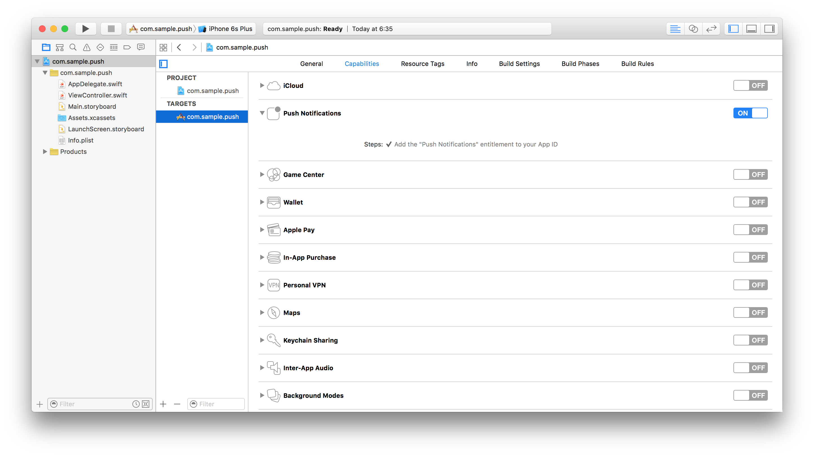

<!-- NLS_CHARSET=UTF-8 -->
## Übersicht
{: #overview }
Bevor iOS-, Android- und Windows-Cordova-Anwendungen Push-Benachrichtigungen empfangen und anzeigen
können, muss das Cordova-Plug-in **cordova-plugin-mfp-push** zu dem Cordova-Projekt hinzugefügt werden. Wenn eine Anwendung konfiguriert ist,
kann die {{ site.data.keys.product_adj }}-API für Benachrichtigungen verwendet werden,
um Geräte zu registrieren und Geräteregistrierungen aufzuheben, um
Tags zu abonnieren und Tagabonnements zu beenden und um Benachrichtigungen handhaben zu können. In diesem Lernprogramm werden Sie lernen, wie
Push-Benachrichtigungen in Cordova-Anwendungen gehandhabt werden. 

> **Hinweis:** Authentifizierte Benachrichtigungen werden wegen eines Defects zurzeit **nicht** in Cordova unterstützt. Es gibt jedoch eine Ausweichlösung.
Jeder `MFPPush`-API-Aufruf kann in `WLAuthorizationManager.obtainAccessToken("push.mobileclient").then( ... );` eingeschlossen werden. Die bereitgestellte Beispielanwendung macht von dieser
Ausweichlösung Gebrauch.


Informationen zu Benachrichtigungen im Hintergrund und interaktiven Benachrichtigungen in iOS finden Sie in folgenden Abschnitten: 

* [Benachrichtigungen im Hintergrund](../silent)
* [Interaktive Benachrichtigungen](../interactive)

**Voraussetzungen:**

* Stellen Sie sicher, dass Sie die folgenden Lernprogramme durchgearbeitet haben: 
    * [{{ site.data.keys.product_adj }}-Entwicklungsumgebung einrichten](../../../installation-configuration/#installing-a-development-environment)
    * [SDK der {{ site.data.keys.product }} zu Cordova-Anwendungen hinzufügen](../../../application-development/sdk/cordova)
    * [Übersicht über Push-Benachrichtigungen](../../)
* {{ site.data.keys.mf_server }} wird lokal oder fern ausgeführt. 
* Die {{ site.data.keys.mf_cli }} ist auf der Entwicklerworkstation installiert. 
* Die Cordova-CLI ist auf der Entwicklerworkstation installiert. 

#### Fahren Sie mit folgenden Abschnitten fort: 
{: #jump-to }
* [Benachrichtigungskonfiguration](#notifications-configuration)
* [API für Benachrichtigungen](#notifications-api)
* [Handhabung von Push-Benachrichtigungen](#handling-a-push-notification)
* [Beispielanwendung](#sample-application)

## Benachrichtigungskonfiguration
{: #notifications-configuration }
Erstellen Sie ein neues Cordova-Projekt oder verwenden Sie ein vorhandenes Cordova-Projekt.
Fügen Sie mindestens eine der untersützten Plattformen (iOS, Android, Windows) zu dem Projekt hinzu.

> Wenn das {{ site.data.keys.product_adj }}-Cordova-SDK noch nicht im Projekt enthalten ist,
folgen Sie den Anweisungen im Lernprogramm [SDK der {{ site.data.keys.product }} zu Cordova-Anwendungen hinzufügen](../../../application-development/sdk/cordova).


### Push-Plug-in hinzufügen
{: #adding-the-push-plug-in }
1. Navigieren Sie in einem **Befehlszeilenfenster** zum Stammverzeichnis des Cordova-Projekts.   

2. Fügen Sie das Push-Plug-in hinzu, indem Sie den folgenden Befehl ausführen:

   ```bash
   cordova plugin add cordova-plugin-mfp-push
   ```

3. Erstellen Sie das Cordova-Projekt mit folgendem Befehl:

   ```bash
   cordova build
   ```

### iOS-Plattform
{: #ios-platform }
Für die iOS-Plattform ist ein zusätzlicher Schritt erforderlich.  
In Xcode müssen Sie Push-Benachrichtigungen für Ihre Anwendung in der Anzeige **Capabilities** aktivieren. 

> <span class="glyphicon glyphicon-exclamation-sign" aria-hidden="true"></span> **Wichtiger Hinweis:** Die für die Anwendung
ausgewählte Bundle-ID (bundleId) muss mit der App-ID (AppId) übereinstimmen, die Sie zuvor auf der Apple-Developer-Site erstellt haben. Sehen Sie sich dazu das Lernprogramm [Übersicht über Push-Benachrichtigungen] an.




### Android-Plattform
{: #android-platform }
Für die Android-Plattform ist ein zusätzlicher Schritt erforderlich.  
Fügen Sie in Android Studio die folgende Aktivität (`activity`) zum Tag `application` hinzu: 

```xml
<activity android:name="com.ibm.mobilefirstplatform.clientsdk.android.push.api.MFPPushNotificationHandler" android:theme="@android:style/Theme.NoDisplay"/>
```

## API für Benachrichtigungen
{: #notifications-api }
### Clientseite
{: #client-side }

|JavaScript-Funktion |Beschreibung |
| --- | --- |
|[`MFPPush.initialize(success, failure)`](#initialization) |MFPPush-Instanz initialisieren  | 
|[`MFPPush.isPushSupported(success, failure)`](#is-push-supported) |Unterstützt das Gerät Push-Benachrichtigungen?| 
|[`MFPPush.registerDevice(options, success, failure)`](#register-device) |Registriert das Gerät beim Push-Benachrichtigungsservice| 
|[`MFPPush.getTags(success, failure)`](#get-tags) |Ruft alle verfügbaren Tags einer Instanz des Push-Benachrichtigungsservice ab| 
|[`MFPPush.subscribe(tag, success, failure)`](#subscribe) |Abonniert einen bestimmten Tag | 
|[`MFPPush.getSubsciptions(success, failure)`](#get-subscriptions) |Ruft die derzeit vom Gerät abonnierten Tags ab      | 
|[`MFPPush.unsubscribe(tag, success, failure)`](#unsubscribe) |Beendet das Abonnement eines bestimmten Tags| 
|[`MFPPush.unregisterDevice(success, failure)`](#unregister) |Hebt die Registrierung des Geräts beim Push-Benachrichtigungsservice auf| 

### API-Implementierung
{: #api-implementation }
#### Initialisierung
{: #initialization }
Initialisieren Sie die **MFPPush**-Instanz. 

- Die Initialisierung ist erforderlich, damit die Clientanwendung mit dem richtigen Anwendungskontext eine Verbindung zum Service MFPPush herstellen kann.   
- Die API-Methode muss aufgerufen werden, bevor andere MFPPush-APIs verwendet werden.
- Die Callback-Funktion wird für die Handhabung empfangener Push-Benachrichtigungen registriert. 

```javascript
MFPPush.initialize(function(successResponse){
alert("Successfully intialized");
        MFPPush.registerNotificationsCallback(notificationReceived);
    },
    function(failureResponse) {
        alert("Failed to initialize");
    }
);
```

#### Wird Push unterstützt?
{: #is-push-supported }
Überprüfen Sie, ob das Gerät Push-Benachrichtigungen unterstützt. 

```javascript
MFPPush.isPushSupported (function(successResponse) {
alert("Push Supported: " + successResponse);
    },
    function(failureResponse) {
        alert("Failed to get push support status");
    }
);
```

#### Gerät registrieren
{: #register-device }
Registrieren Sie das Gerät beim Push-Benachrichtigungsservice. Wenn keine Optionen erforderlich sind, kann "options" auf `null` gesetzt werden.


```javascript
var options = { };
MFPPush.registerDevice(
    options,
    function(successResponse) {
        alert("Successfully registered");
    },
    function(failureResponse) {
        alert("Failed to register");
    }
);
```

#### Tags abrufen
{: #get-tags }
Rufen Sie alle verfügbaren Tags vom Push-Benachrichtigungsservice ab. 

```javascript
MFPPush.getTags (
    function(tags) {
        alert(JSON.stringify(tags));
},
    function() {
        alert("Failed to get tags");
    }
);
```

#### Abonnement
{: #subscribe }
Abonnieren Sie die gewünschten Tags. 

```javascript
var tags = ['sample-tag1','sample-tag2'];

MFPPush.subscribe(
    tags,
    function(tags) {
        alert("Subscribed successfully");
    },
    function() {
        alert("Failed to subscribe");
    }
);
```

#### Abonnements abrufen
{: #get-subscriptions }
Rufen Sie die derzeit vom Gerät abonnierten Tags ab. 

```javascript
MFPPush.getSubscriptions (
    function(subscriptions) {
        alert(JSON.stringify(subscriptions));
    },
    function() {
        alert("Failed to get subscriptions");
    }
);
```

#### Abonnement beenden
{: #unsubscribe }
Beenden Sie das Tagabonnement. 

```javascript
var tags = ['sample-tag1','sample-tag2'];

MFPPush.unsubscribe(
    tags,
    function(tags) {
        alert("Unsubscribed successfully");
    },
    function() {
        alert("Failed to unsubscribe");
    }
);
```

#### Registrierung aufheben
{: #unregister }
Sie können die Registrierung des Geräts bei der Instanz des Push-Benachrichtigungsservice
aufheben. 

```javascript
MFPPush.unregisterDevice(function(successResponse) {
alert("Unregistered successfully");
    },
    function() {
        alert("Failed to unregister");
    }
);
```

## Handhabung von Push-Benachrichtigungen
{: #handling-a-push-notification }
Für die Handhabung einer empfangenen Push-Benachrichtigung können mit dem Antwortobjekt der Benachrichtigung in der registrierten Callback-Funktion arbeiten. 

```javascript
var notificationReceived = function(message) {
    alert(JSON.stringify(message));
};
```


## Beispielanwendung
{: #sample-application }
[Klicken Sie hier](https://github.com/MobileFirst-Platform-Developer-Center/PushNotificationsCordova/tree/release80), um das Cordova-Projekt herunterzuladen. 

**Hinweis:** Für die Ausführung des Beispiels muss auf jedem Android-Gerät die neueste Version der Google Play Services installiert sein. 

### Verwendung des Beispiels
{: #sample-usage }
Anweisungen finden Sie in der Datei README.md zum Beispiel. 
