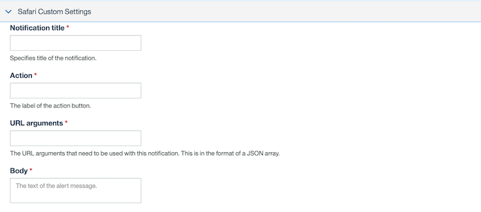

<!-- NLS_CHARSET=UTF-8 -->

Das Senden von Benachrichtigungen an Webplattformen ist mit dem Senden von Benachrichtigungen an mobile Plattformen vergleichbar. Weitere Informationen finden Sie [hier]({{ site.baseurl }}/tutorials/en/foundation/8.0/notifications/sending-notifications/). 

* Auf der Registerkarte **Benachrichtigungen senden** sehen Sie die neue Auswahloption **Plattform**.
* Sie können *Mobile* oder *Web* auswählen.

Im Dropdown-Menü **Senden an** finden Sie je nach konfigurierter Plattform neue Optionen wie **Chrome**, **Firefox** und **Safari**. Jeder Plattform ist ein Abschnitt mit angepassten Einstellungen zugeordnet, die für die jeweilige Plattform erforderlich sind. Sie können als Adressaten einer Benachrichtigung auch **Alle** Plattformen, **Geräte nach Tags**, **Geräte nach Benutzer-ID** oder **Einzelnes Gerät** auswählen.

### Angepasste Einstellungen für Chrome

Hier sehen Sie einige der spezifischen Einstellungen für Chrome.

- **Benachrichtigungstitel**: Gibt den Titel der Benachrichtigung an
- **URL des Benachrichtigungssymbols**: URL des Symbols, das für Web-Push-Benachrichtigungen festgelegt werden soll
- **Lebensdauer**: Benachrichtigt FCM über die Gültigkeit von Nachrichten

### Angepasste Einstellungen für Firefox

Hier sehen Sie einige der spezifischen Einstellungen für Firefox.
- **Benachrichtigungstitel**: Gibt den Titel der Benachrichtigung an
- **URL des Benachrichtigungssymbols**: URL des Symbols, das für Web-Push-Benachrichtigungen festgelegt werden soll

### Angepasste Einstellungen für Safari

Hier sehen Sie einige der spezifischen Einstellungen für Safari.
- **Benachrichtigungstitel**: Gibt den Titel der Benachrichtigung an
- **Aktion**: Beschriftung der Aktionsschaltfläche
- **URL-Argumente**: URL-Argumente, die mit dieser Benachrichtigung verwendet werden müssen. Das Format ist ein JSON-Array.
- **Hauptteil**: Text der Benachrichtigung

Das auf *Tags*, *Geräte-ID* und *Benutzer-ID* basierte Senden von Benachrichtigungen ist mit dem Senden von Benachrichtigungen auf mobilen Plattformen vergleichbar. 
