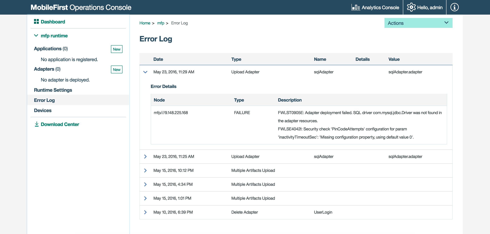
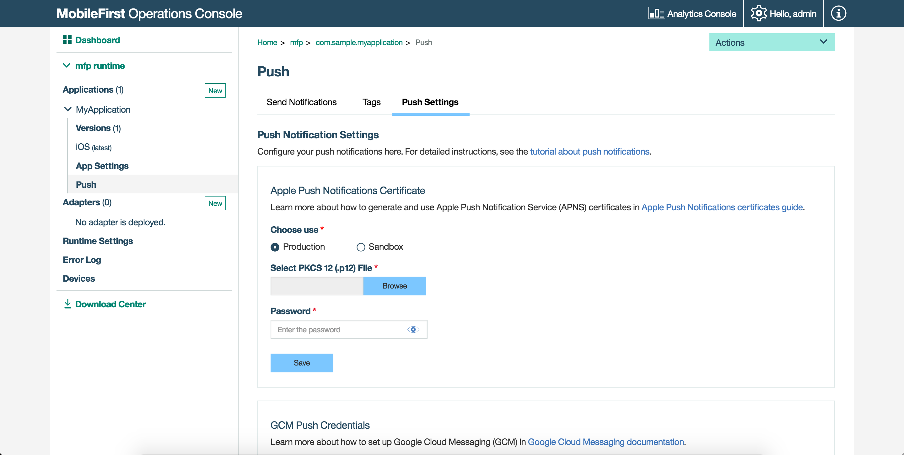

<!-- NLS_CHARSET=UTF-8 -->
## Übersicht
{: #overview }
Die {{ site.data.keys.mf_console_full }} ist eine webbasierte Benutzerschnittstelle,
die für Entwickler und Administratoren vereinfachte Arbeitsabläufe zur Erstellung, Überwachung, Sicherung
und Verwaltung von Anwendungen und Adaptern bereitstellt. 

#### Entwickler
{: #as-a-developer }
* Anwendungen für eine beliebige Umgebung entwickeln und
bei {{ site.data.keys.mf_server }} registrieren
* Alle implementierten Anwendungen und Adapter im
Dashboard auf einen Blick sehen 
* Regsitrierte Anwendungen verwalten und konfigurieren (direkte Aktualiserung, Inaktivierung über Fernzugriff, Sicherheitsparameter für Anwendungsauthentizität und Benutzerauthentifizierung) 
* Push-Benachrichtigungen einrichten (Zertifikate implementieren, Benachrichtigungstags erstellen und Benachrichtigungen senden)
* Adapter erstellen und implementieren
* Beispiele herunterladen

#### IT-Administrator
{: #as-an-it-administrator }
* Diverse Services überwachen
* Geräte mit Zugriff auf {{ site.data.keys.mf_server }} suchen und ihre Zugriffsrechte verwalten
* Adapterkonfigurationen dynamisch aktualisieren
* Client-Logger-Konfigurationen mit Protokollprofilen anpassen
* Verwendung der Produktlizenzen verfolgen

#### Fahren Sie mit folgenden Abschnitten fort: 
{: #jump-to }
* [Zugriff auf die Konsole](#accessing-the-console)
* [Navigation in der Konsole](#navigating-the-console)

## Zugriff auf die Konsole
{: #accessing-the-console }
Es gibt die folgenden Möglichkeiten, auf die {{ site.data.keys.mf_console }} zuzugreifen: 

### Lokal installierter {{ site.data.keys.mf_server }}
{: #from-a-locally-installed-mobilefirst-server }
#### Desktop-Browser
{: #desktop-browser }
Laden Sie in einem Browser Ihrer Wahl die URL [http://localhost:9080/mfpconsole](http://localhost:9080/mfpconsole). Geben Sie für Benutzername/Kennwort die Werte *admin/admin* an.

#### Befehlszeile
{: #command-line }
Führen Sie in einem **Befehlszeilenfenster** mit installierter
{{ site.data.keys.mf_cli }} den Befehl `mfpdev server console` aus.

### Fern installierter {{ site.data.keys.mf_server }}
{: #from-a-remotely-installed-mobilefirst-server }
#### Desktop-Browser
{: #desktop-browser-remote }
Laden Sie in einem Browser Ihrer Wahl die URL `http://Serverhost:Serverport/mfpconsole`.  
Der Host-Server kann ein Server des Kunden oder der IBM Cloud-Service "IBM [Mobile Foundation](../../../bluemix/)" sein.

#### Befehlszeile
{: #command-line-remote }
Führen Sie in einem **Befehlszeilenfenster** mit installierter
{{ site.data.keys.mf_cli }} die folgenden Schritte aus: 

1. Fügen Sie eine ferne Serverdefinition hinzu: 

    *Interaktiver Modus*  
    Führen Sie den Befehl `mfpdev server add` aus und folgen Sie den angezeigten Anweisungen. 

    *Direktmodus*  
    Führen Sie den Befehl mit folgender Struktur aus: `mfpdev server add [Servername] --URL [URL_des_fernen_Servers] --login [Administratorbenutzername] --password [Administratorkennwort] --contextroot [Name_des_Verwaltungsservice]`. Beispiel: 

   ```bash
   mfpdev server add MyRemoteServer http://my-remote-host:9080/ --login TheAdmin --password ThePassword --contextroot mfpadmin
   ```

2. Führen Sie den Befehl `mfpdev server console MyRemoteServer` aus.

> Weitere Informationen zu den verschiedenen CLI-Befehlen enthält das Lernprogramm [{{ site.data.keys.product_adj }}-Artefakte über die CLI verwalten](../../../application-development/using-mobilefirst-cli-to-manage-mobilefirst-artifacts/).


## Navigation in der Konsole
{: #navigating-the-console }
### Dashboard
{: #dashboard }
Im Dashboard können Sie sich schnell einen Überblick über die implementierten Projekte verschaffen. 


#### Dropdown-Liste der Aktionen
{: #actions-dropdown }
Über die Dropdown-Liste haben Sie einen schnellen Zugriff auf die verschiedenen Konsolenaktionen. 


### Laufzeiteinstellungen
{: #runtime-settings }
Sie können Laufzeiteigenschaften, Variablen für globale Sicherheit, den Server-Keystore und vertrauliche Clients bearbeiten. 


### Fehlerprotokoll
{: #error-log }
Im Fehlerprotokoll sind fehlgeschlagene Verwaltungsoperationen aufgelistet, die in der {{ site.data.keys.mf_console }} oder über die
Befehlszeile für die aktuelle Laufzeitumgebung eingeleitet wurden. Nutzen Sie das Protokoll, um sich über die Auswirkungen von Fehlern auf die Server zu informieren. 

> Weitere Informationen finden Sie in der Benutzerdokumentation im Abschnitt zum Fehlerprotokoll von Operationen für Laufzeitumgebungen. 



### Geräte
{: #devices }
Administratoren können nach Geräten suchen, die auf {{ site.data.keys.mf_server }} zugreifen,
und die Zugriffsrechte verwalten.   
Sie können mithilfe der Benutzer-ID oder des Anzeigenamens nach Geräten suchen. Die Benutzer-ID ist die Kennung, die bei der Anmeldung verwendet wurde.   
Ein Anzeigename
ist ein Name, der dem Gerät
zur Unterscheidung von anderen Geräten mit derselben Benutzer-ID zugeordnet wurde. 

> Weitere Informationen finden Sie in der Benutzerdokumentation im Abschnitt zur Verwaltung des Gerätezugriffs. 


### Anwendungen
{: #applications }
#### Anwendungen registrieren
{: #registering-applications }
Hier können Sie grundlegende Anwendungswerte angeben und Startercode herunterladen. 


#### Anwendungen verwalten
{: #managing-applications }
Sie können registrierte Anwendungen über die [direkte Aktualisierung](../../../application-development/direct-update/),
die Inaktivierung per Fernzugriff, die [Anwendungsauthentizität](../../../authentication-and-security/application-authenticity/)
und das [Festlegen von Sicherheitsparametern](../../../authentication-and-security/) verwalten und konfigurieren.


#### Authentifizierung und Sicherheit
{: #authentication-and-security }
Sie können Parameter für die Anwendungssicherheit konfigurieren (z. B. die Standardverfallszeit für Token), Sicherheitsüberprüfungen Bereichselemente zuordnen, obligatorische Anwendungsbereiche definieren und Optionen für Sicherheitsüberprüfungen konfigurieren.

> [Informieren Sie sich](../../../authentication-and-security/) über das {{ site.data.keys.product_adj }}-Sicherheitsframework. 


#### Anwendungseinstellungen
{: #application-settings }
Konfigurieren Sie den Anzeigenamen der Anwendung in der Konsole sowie den Anwendungstyp und die Lizenzierung. 


#### Benachrichtigungen
{: #notifications }
Sie können [Push-Benachrichtigungen](../../../notifications/) und die zugehörigen Parameter konfigurieren (z. B.
Zertifikate und GCM-Details), Tags definieren und Benachrichtigungen an Geräte senden. 



### Adapter
{: #adapters }
#### Adapter erstellen
{: #creating-adapters }
Sie können einen [Adapter registrieren](../../../adapters/), Startercode herunterladen und einen Adapter bei laufendem Betrieb aktualisieren, indem Sie seine
Eigenschaften aktualisieren, ohne das Adapterartefakt neu erstellen oder reimplementieren zu müssen. 


#### Adaptereigenschaften
{: #adapter-properties }
Wenn ein Adapter implementiert ist, kann er in der Konsole konfiguriert werden. 


### Clientprotokolle
{: #client-logs }
Administratoren können Protokollprofile nutzen, um die Konfiguration von Client-Loggern (z. B. die Protokollebene und Protokollpaketfilter)
für beliebige Kombinationen aus Betriebssystem,
Betriebssystemversion, Anwendung, Anwendungsversion und Gerätemodell anzupassen. 

Wenn ein Administrator ein
Konfigurationsprofil erstellt, wird die Protokollkonfiguration mit Antworten auf API-Aufrufe wie
`WLResourceRequest` verknüpft und automatisch angewendet. 

> Weitere Informationen finden Sie in der Benutzerdokumentation im Abschnitt zur
Konfiguration der clientseitigen Protokollerfassung. 


### Lizenzüberwachung
{: #license-tracking }
Auf die Lizenzüberwachung kann oben über die Einstellungsschaltflächen zugegriffen werden. 

Die Lizenzbedingungen richten sich nach der jeweils verwendeten Edition (Enterprise Edition oder Consumer Edition) der {{ site.data.keys.product }}. Die Lizenzüberwachung ist
standardmäßig aktiviert, sodass
für die Lizenzierungsrichtlinie relevante Metriken wie aktive Clientgeräte und
installierte Anwendungen überwacht werden. Mithilfe dieser Angaben kann festgestellt werden,
ob die aktuelle
Nutzung der {{ site.data.keys.product }} im Rahmen der Lizenzberechtigungen
erfolgt. Potenzielle Lizenzverstöße lassen sich so verhindern.

Dadurch, dass Administratoren die Nutzung der Clientgeräte überwachen, können
sie feststellen, ob die Geräte aktiv sind, und Geräte stilllegen, die nicht mehr auf den
Service zugreifen sollen. Diese Situation kann beispielsweise eintreten, wenn ein Angestellter das Unternehmen verlassen hat.

> Weitere Informationen finden Sie in der Benutzerdokumentation im Abschnitt zur Lizenzüberwachung. 


### Downloads
{: #downloads }
Wenn keine Internetanbindung verfügbar ist, können Sie in der {{ site.data.keys.mf_console }} über das Download-Center
eine Momentaufnahme
der verschiedenen Entwicklungsartefakte der {{ site.data.keys.product }} herunterladen. 


