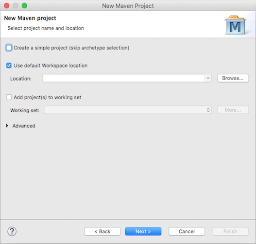
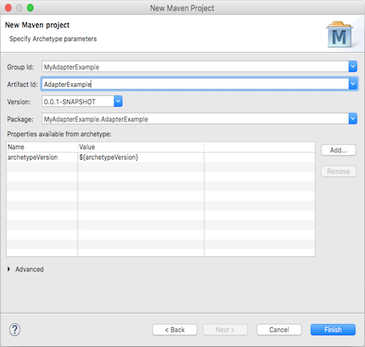

## Overview
As taught in previous [Adapters tutorials](../), MobileFirst Adapters are Maven projects that are created by using either Maven directly or via the MobileFirst Developer CLI. The adapter code can then be edited in any IDE, and later built and deployed using either Maven or the MobileFirst Developer CLI. A devloper may also choose to create, develop, build and deploy all inside a supported IDE, such as Eclipse or IntelliJ. In this tutorial a MobileFirst adapter is created and built from the Eclipse IDE.

**Prerequisite:** 

* Get familiarized with MobileFirsts adapters by reading the [Adapters tutorials](../) first.
* Maven integration in Eclipse. Starting Eclipse Kepler (v4.3), Maven support is built-in in Eclipse. If your Eclipse instance does not support Maven, [follow the m2e instructions](http://www.eclipse.org/m2e/) to add Maven support.

#### Jump to:

* [Creating a new adapter Maven project](#creating-a-new-adapter-maven-project)
* [Importing an existing adapter Maven project](#importing-an-existing-adapter-maven-project)
* [Building and deploying an adapter Maven project](#building-and-deploying-maven-project)
* [Further reading](#further-reading)

## Create or import a MobileFirst Adapter Maven project
Follow the bellow instructions to either create a new adapter Maven project or import an existing one.

### Creating a new adapter Maven project

1. To create a new adapter Maven project, select: **File → New → Other... → Maven → Maven Project** and click **Next**.

    
    
2. Provide project name and location.  
    - Make sure the option to create a simple project is ticked **off** and click **Next**.

    

3. Add the MobileFirst adapter Archetype.
    - Click on **Add Archetype** and the provide the following details:
        - **Archetype Group ID**: `com.ibm.mfp`
        - **Archetype Artifact Id**: either `adapter-maven-archetype-java`, `adapter-maven-archetype-http` or `adapter-maven-archetype-sql`
        - **Archetype Version**: `8.0.0`

    
    
4. Specify Maven project parameters.  
    - Specify required **Group ID**, **Artifact ID**, **Version** and **package** parameters, and click **Finish**.
    - Change <code>${archetypeVersion}</code> to <code>8.0.0</code>.

    
    
### Importing an existing adapter Maven project
To import the adapter Maven project, select **File → Import... → Maven → Existing Maven Projects**.

## Building and deploying an adapter Maven project
After building an adapter Maven project, a **.adapter** artifact is generated and placed in the Maven project's **target** folder. The generated **.adapter** artifact can then be deployed either to the local MobileFirst Server or to a remote MobileFirst Server using either Maven, the MobileFirst Developer CLI or the MobileFirst Operations Console.

### Building an adapter Maven project
To build an adapter, right-click on the adapter folder and select **Run As → Maven install**.  

### Deploying an adapter Maven project
Learn how to deploy an adapter in the [Deploy section](../creating-adapters/#build-and-deploy-adapters) of the Creating Java and JavaScript Adapters tutorial.

> **Tip:** Eclipse can also be enhanced to ease the deployment step by integrating a **Command-line** window using a plug-in, creating a consistant development environment. From this window Maven or MobileFirst Developer CLI commands can be run.

## Further reading
Learn how to debug Java code in adapters in the [Testing and debugging adaters](../testing-and-debugging-adapters) tutorial.
