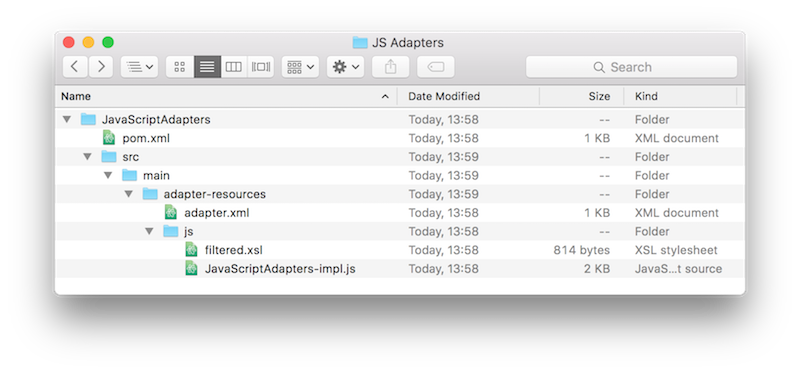

## Overview
JavaScript adapters provide templates for connection to HTTP and SQL back-ends. It provides a set of services, called procedures and mobile apps can call these procedures by issuing AJAX requests.


**Prerequisite:** Make sure to read the [Creating Java and JavaScript Adapters](../creating-adapters) tutorial first.

## File structure



### The adapter-resources folder  
The `adapter-resources` folder contains an XML configuration file. This configuration file describes the connectivity options and lists the procedures that are exposed to the application or other adapters.

```xml
<?xml version="1.0" encoding="UTF-8"?>
<mfp:adapter name="JavaScriptAdapter">

  <displayName>JavaScriptAdapter</displayName>
	<description>JavaScriptAdapter</description>
  <connectivity>
    <connectionPolicy>
    ...

    </connectionPolicy>
  </connectivity>

  <procedure name="procedure1"></procedure>
  <procedure name="procedure2"></procedure>

  <property name="name" displayName="username" defaultValue="John"  />
</mfp:adapter>
```
* `name`: Mandatory. The name of the adapter
* `displayName`: Optional. The name that is displayed in the MobileFirst Console
* `description`: Optional. Additional information that is displayed in the MobileFirst Console
* `connectivity`:
 * Defines the connection properties and load constraints of the back-end system.
 * When the back-end system requires user authentication, defines how user credentials are obtained.
* `procedure`: Declares a service for accessing a back-end application. One entry for each adapter procedure.
* `property`: The **adapter.xml** file can also contain custom properties. The configuration properties elements must always be located *below* the `procedure` elements.

<br>
The connection properties as well as the custom properties can be overridden in the **MobileFirst Operations Console → [your adapter] → Configurations tab** without having to deploy the adapter again:


**Pull and Push Configurations**

Customized adapter properties can be shared using the adapter configuration file found in the **Configuration files tab**.  
To do so, use the `pull` and `push` commands described below.  For the properties to be shared, you need to *change the default values given to the properties*.

Replace the **DmfpfConfigFile** placeholder with the actual value, for example: `config.json`. Then, run the command from the root folder of the adapter Maven project:

* To **pull** the configurations file - `mvn adapter:configpull -DmfpfConfigFile=<path to a file that will store the configuration>`.
* To **push** the configurations file - `mvn adapter:configpush -DmfpfConfigFile=<path to the file that stores the configuration>`.

> <span class="glyphicon glyphicon-info-sign" aria-hidden="true"></span> **Note:** The file can be of any file extension and if the file does not exist, it will be created.

### The js folder
This folder contains all JavaScript files, which contains the implementation of procedures that are declared in the XML file. It also contains zero, one, or more XSL files, which contain a transformation scheme for retrieved raw XML data.  
Data that is retrieved by an adapter can be returned raw or preprocessed by the adapter itself. In either case, it is presented to the application as a **JSON object**.

## JavaScript adapter procedures
Procedures are declared in XML and are implemented with server-side JavaScript, for the following purposes:

* To provide adapter functions to the application
* To call back-end services to retrieve data or to perform actions

Each procedure that is declared in the adapter XML file must have a corresponding function in the JavaScript file.

By using server-side JavaScript, a procedure can process the data before or after it calls the service. You can apply more filtering to retrieved data by using simple XSLT code.  
JavaScript adapter procedures are implemented in JavaScript. However, because an adapter is a server-side entity, it is possible to [use Java in the adapter](../javascript-adapters/using-java-adapters) code.

### Using global variables
The MobileFirst server does not rely on HTTP sessions and each request may reach a different node. You should not rely on global variables to keep data from one request to the next.

## Server-side APIs
JavaScript adapters can use the MobileFirst server-side APIs to perform operations that are related to MobileFirst Server, such as calling other JavaScript adapters, logging to the server log, getting values of configuration properties, reporting activities to Analytics and getting the identity of the request issuer.  

### getPropertyValue
Use the `MFP.Server.getPropertyValue(propertyName)` API to retrieve properties defined in the **adapter.xml** or in the MobileFirst Operations Console:

```js
MFP.Server.getPropertyValue("name");
```

### getTokenIntrospectionData

Use the `MFP.Server.getTokenIntrospectionData()` API to

To get the current `AuthenticatedUser` use:

```js
var currentUser = MFP.Server.getTokenIntrospectionData()......
```

### getAdapterName
Use the `getAdapterName()` API to retrieve the adapter name.

### invokeHttp
Use the `MFP.Server.invokeHttp(options)` API in HTTP adapters.  
You can see usage examples on the [JavaScript HTTP Adapter](js-http-adapter) tutorial.

### invokeSQL
Use the `MFP.Server.invokeSQLStatement(options)` and the `MFP.Server.invokeSQLStoredProcedure(options)` APIs in SQL adapters.  
You can see usage examples on the [JavaScript SQL Adapter](js-sql-adapter) tutorial.

### addResponseHeader
Use the `MFP.Server.addResponseHeader(name,value)` API to add a new header(s) to the response:

```js
MFP.Server.addResponseHeader("Expires","Sun, 5 October 2014 18:00:00 GMT");
```
### getClientRequest
Use the `MFP.Server.getClientRequest()` API to get a reference to the Java HttpServletRequest object that was used to invoke an adapter procedure:

```js
var request = WL.Server.getClientRequest();
var userAgent = request.getHeader("User-Agent");
```

### invokeProcedure
Use the `MFP.Server.invokeProcedure(invocationData)` to call other JavaScript adapters.  
You can see usage examples on the [Advanced Adapter Usage and Mashup](advanced-adapter-usage-mashup) tutorial.

<br/>

> Learn more about `MFP.Server` APIs in the user documentation.

## JavaScript adapter examples:
