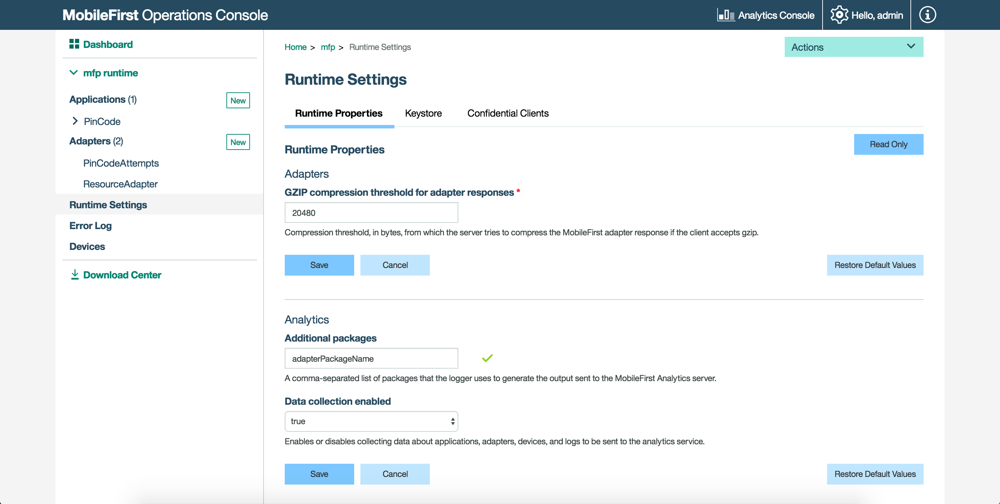

## Overview
This tutorial provides the required code snippets in order to add logging capabilities in a Java adapter.

## Logging example
Import the java logging package:

```java
import java.util.logging.Logger;
```

Define a logger:

```java
static Logger logger = Logger.getLogger(JavaLoggerTestResource.class.getName());
```

Now inside a method include logging:

```java
logger.warning("Logging warning message...");
```

This message outputs to the `trace.log` file of the application server. If the server administrator is forwarding logs from the MobileFirst Server to the MobileFirst Analytics server the `logger` message will also appear in the **Infrastructure → Server Log Search** view in the MobileFirst Analytics Console.

## Server Setup
To set-up logging in JavaScript adapters:

1. In MobileFirst Operations Console select the **Settings** option from the sidebar navigation.
2. Click the **Edit** button in the **Runtime Properties tab**.
3. In the **Analytics → Additional packages** section, specify the class name of the Java adapter, for example `com.sample.JavaLoggerTestResource`, to forward logs to the MobileFirst Server.


