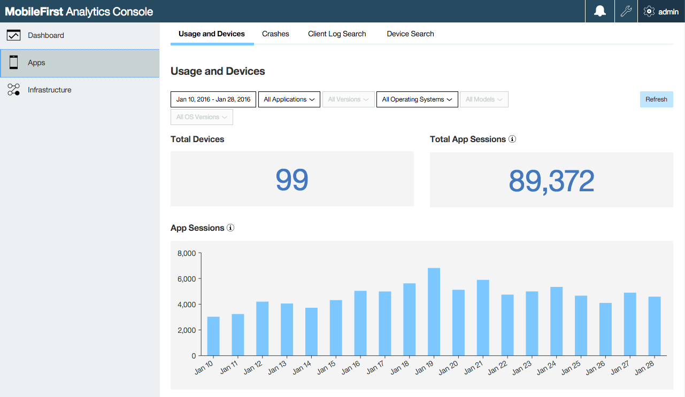

## Overview
MobileFirst Operational Analytics provides client-side APIs to help a user get started with collecting Analytics data about the application. This tutorial provides information on how to setup analytics support on the client application and lists available APIs.

#### Jump to:
* [Configuring Analytics on the Client Side](#configuring-analytics-on-the-client-side)
* [Enabling/Disabling Client Events](#enabling-disabling-client-event-types)
* [Custom Events](#custom-events)

## Configuring Analytics on the Client Side
Before you can start collecting the out-of-the-box data that Operational Analytics provides, you first need to import the corresponding libraries to initialize the analytics support.

### JavaScript
No setup required. Initialized out-of-the-box.

### iOS
#### Import Library

```objc
import "WLAnalytics.h"
```

#### Initialize Analytics
No setup required. Initialized out-of-the-box.

### Android
#### Import Library

```java
import com.worklight.common.WLAnalytics;
```

#### Initialize Analytics
Inside the `onCreate` method of your main activity include:

```java
WLAnalytics.init(this.getApplication());
```

## Sending Analytics
Sending Analytics is a crucial step to see client-side analytics on the Analytics Server. When collecting Analytics, the analytics logs are stored in a log file on the client device which is sent to the analytics server after using the `send` method of the Analytics API.

#### JavaScript
In a Cordova/Web application, use the following JavaScript API method:

```javascript
WL.Analytics.send();
```

##### Android
In an Android application, use the following Java API method:

```java
WLAnalytics.send();
```

#### iOS
In an iOS application, use the following *Objective-C* API method:

```objc
[[WLAnalytics sharedInstance] send];
```

or for *Swift* use the API method:

```swift
WLAnalytics.sharedInstance().send();
```

## Enabling/Disabling Client Event Types
The Analytics API gives the developer the freedom to enable and disable collecting Analytics on the event they want to visualize on their Analytics Console. 

When building Cordova applications the Analytics API does not have methods to enable or disable collection on `LIFECYCLE` or `NETWORK` events. In other words, Cordova applications come with `LIFECYCLE` and `NETWORK` events enabled out of the box. If you wish to disable these events, follow the [Client Lifecycle Events](#client-lifecycle-events
) and [Client Network Events](#client-lifecycle-events) on disabling events.

### Client Lifecycle Events
After configuring the Analytics SDK, app sessions will start to be recorded on the user's device. A session in MobileFirst Operational Analytics is recorded when the app is moved from the foreground then to the background, which creates a session on the analytics console.

As soon as the device is set up to record sessions and you send your data, you will see the analytics console populated with data like below.



You can enable or disable the collecting of app sessions with the API below:

#### Cordova

* For the iOS platform:
	* Open the **[Cordova appilcation root folder] → platforms → ios → Classes → AppDelegate.m** file
	* Follow the iOS guide below to enable or disable `LIFECYCLE` activities.
	* Build the Cordova project by running the command: `cordova build`
	
* For the Android platform: navigate to the sub activity of the main activity to disable.
	* Open the  **[Cordova appilcation root folder] → platforms → android → src → com → sample → [app-name] → MainActivity.java**
	* Look for the `onCreate` method and follow the Android guide below to enable or disable `LIFECYCLE` activities.
	* Build the Cordova project by running the command: `cordova build`

#### Android

To enable client lifecycle event logging:

```java
WLAnalytics.addDeviceEventListener(DeviceEvent.LIFECYCLE);
```

To disable client lifecycle event logging:

```java
WLAnalytics.removeDeviceEventListener(DeviceEvent.LIFECYCLE); 
```

#### iOS

To enable client lifecycle event logging:

*Objective-C:*

```objc
[[WLAnalytics sharedInstance] addDeviceEventListener:LIFECYCLE];
```

*Swift:*

```swift
WLAnalytics.sharedInstance().addDeviceEventListener(LIFECYCLE);
```

To disable client lifecycle event logging:

*Objective-C:*

```objc
[[WLAnalytics sharedInstance] removeDeviceEventListener:LIFECYCLE];
```

*Swift:*

```swift
WLAnalytics.sharedInstance().removeDeviceEventListener(NETWORK);
```

### Client Network Activities
Collection on adapters and the network occur in two different locations -- on the client and on the server:

* The client is going to collect information such as roundtrip time and payload size when you start collecting on the device event `Network`.

* The server is going to collect backend information such as server processing time, adapter usage, used procedures.

Since the client and the server are each collecting their own information this means that charts will not display data until the client is configured to do so. To configure your client you need to start collecting on the device event `NETWORK`.

#### Cordova

* For the iOS platform:
	* Open the **[Cordova appilcation root folder] → platforms → ios → Classes → AppDelegate.m** file
	* Follow the iOS guide below to enable or disable `NETWORK` activities.
	* Build the Cordova project by running the command: `cordova build`
	
* For the Android platform: navigate to the sub activity of the main activity to disable.
	* Open the  **[Cordova appilcation root folder] → platforms → ios → src → com → sample → [app-name] → MainActivity.java**
	* Look for the `onCreate` method and follow the Android guide below to enable or disable `NETWORK` activities.
	* Build the Cordova project by running the command: `cordova build`

#### iOS

To enable client network event logging:

*Objective-C:*

```objc
[[WLAnalytics sharedInstance] addDeviceEventListener:NETWORK];
```

*Swift:*

```
WLAnalytics.sharedInstance().addDeviceEventListener(NETWORK);
```

To disable client network event logging:

*Objective-C:*

```objc
[[WLAnalytics sharedInstance] removeDeviceEventListener:NETWORK];
```

*Swift:*

```swift
WLAnalytics.sharedInstance().removeDeviceEventListener(NETWORK);
```

#### Android

To enable client network event logging:

```java
WLAnalytics.addDeviceEventListener(DeviceEvent.NETWORK);
```

To disable client network event logging:

```java
WLAnalytics.removeDeviceEventListener(DeviceEvent.NETWORK);
```

## Custom Events
Use the following API methods to create custom events.

#### Cordova

```javascript
WL.Analytics.log({"key" : 'value'});
WL.Analytics.send();
```

#### Android
After setting the first two configurations you can start to log data like in the example below.

```java
JSONObject json = new JSONObject();
try {
    json.put("key", "value");
} catch (JSONException e) {
    // TODO Auto-generated catch block
    e.printStackTrace();
}

WLAnalytics.log("Message", json);
WLAnalytics.send();
```

#### iOS
After importing WLAnalytics you can now use the API to collect custom data like below:

*Objective-C:*

```objc
NSDictionary *inventory = @{
    @"property" : @"value",
};

[[WLAnalytics sharedInstance] log:@"Custom event" withMetadata:inventory];
[[WLAnalytics sharedInstance] send];
```

*Swift:*

```swift
let metadata: [NSObject: AnyObject] = ["foo": "bar"];  
WLAnalytics.sharedInstance().log("hello", withMetadata: metadata);
WLAnalytics.sharedInstance().send();
```
