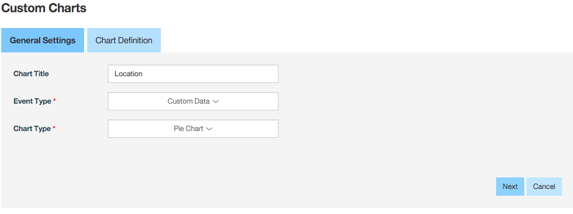
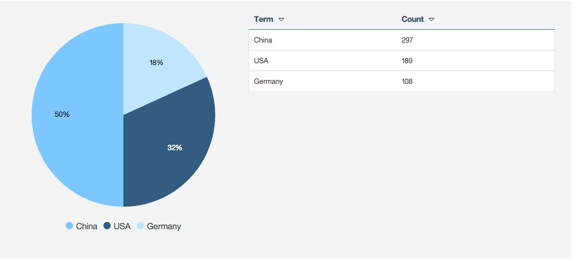

### Creating Custom Charts
Creating a custom chart is simple. The following example walks you through creating a pie chart, based on the user pressing three buttons.

The messages that are logged to the Operational Analytics server in this example are hard-coded buttons. Those messages look like this:

```javascript
WL.Analytics.log({"location":"USA"});
WL.Analytics.log({"location":"China"});
WL.Analytics.log({"location":"Germany"});
```

> **Note**: Remember to always send data to the analytics server by using `WL.Analytics.send();`

To create a chart, follow these steps.

1. Go to the **Custom Charts** tab


2. click **Create Chart**.


3. Enter a **Chart Title**

4. Select **Custom Data** as the **Event Type**

5. Select a **Chart Type**. This example uses a **Pie Chart**.


6. Click on the **Chart Definition** tab.

7. Select a **Property**. This example uses ```location```.


8. Click **Save**. The chart is saved under the **Custom Charts** tab in the main dashboard.


