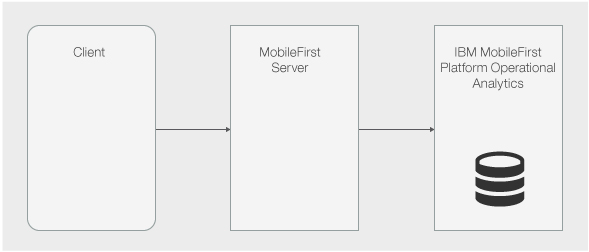

## Overview
MobileFirst Platform Foundation Operational Analytics collects data from app to server activities, client logs, client crashes, and server side logs from the MobileFirst Runtime Server and client devices. Collecting analytics from all these data points populates the Operational Analytics Charts with infrastructure and client side information.



Operational Analytics is bundled by default as part of the [MobileFirst Platform Foundation Development Kit](../setting-up-your-development-environment/mobilefirst-development-environment).  


#### Jump to

* [MobileFirst Analytics Console](#mobilefirst-analytics-console)
* [Elasticsearch](#elasticsearch)
* [Tutorials to follow next](#tutorials-to-follow-next)

## MobileFirst Analytics Console
You can open the Analytics Console from the MobileFirst Operations Console, by clicking on "Analytics Console".


In the MobileFirst Platform Foundation Development Kit this console's default URL is `http://localhost:9080/analytics/console`.  
After navigating to the Analytics console you will see a dashboard like below (but with empty data).


From the Analytics Console you can then:

* [Create custom charts](#custom-charts)
* [Manage alerts](#manage-alerts)
* [Monitor App Crash](#monitor-app-crash)
* [Monitor Network Data](#monitor-network)

### Custom Charts
Custom charts allow you to visualize the collected analytics data in your analytics data store in charts that are not avaliable in the out of the box MobileFirst Analytics Console. This visualization is a powerful way to analyze data important to your business needs.

### Manage Alerts
You can set thresholds in alert definitions to better monitor your activities.

You can configure thresholds which, if exceeded, trigger alerts to notify the MobileFirst Analytics Console monitor. The triggered alerts can be visualized on the console, or the alerts can be handled by a custom webhook. A custom webhook allows control who and how someone is notified when an alert is triggered.

### Monitor App Crash
App crashes are visualized on the MobileFirst Operational Analytics Console, where you can quickly view crashes and act on them accordingly. Crash logs are collected on the device by default. When crash logs are sent to the analytics server, they will automatically populate the crash charts.

### Monitor Network Data
The MobileFirst Operational Analytics Console monitors network data when it is sent to the analytics server and allows the user to query this information in different ways.

> For more information about the data collected by MobileFirst Analytics, see the user documentation

## Elasticsearch
Behind the scenes, running search queries and storing data for Operational Analytics is **Elasticsearch 1.5x**.  
Elasticsearch is a real-time distributed search and analytics engine that provides the ability to explore data at speed and at a scale. Elasticsearch is used for full-text search, structured search.

Elasticsearch is used for storing all mobile and server data in JSON format in the Operational Analytics server in Elasticsearch instances.  
The Elasticsearch instances are queried in real-time in order to populate the MobileFirst Operational Analytics Console.

MobileFirst Operational Analytics does not hide any Elasticsearch functionality. If knowledge how to fully utilize Elasticsearch, debug Elasticsearch, or optimize Elasticsearch instances is present, Operational Analytics does not prevent using it.

If you have interest in any Elasticsearch functionality besides what MobileFirst Operational Analytics offers out of the box, you can read more about it in the Elasticsearch documentation.

> Read more in the [Elasticsearch documentation](https://www.elastic.co/guide/en/elasticsearch/reference/1.5/index.html)

### Elasticsearch properties
Elasticsearch properties are available through JNDI variables or environment entries.  
One of the more useful JNDI properties to get started viewing the Elasticsearch data is:

 ```xml
<jndiEntry jndiName="analytics/http.enabled" value="true"/>
 ```

 This JNDI property will allow you to view your Operational Analytics raw data in JSON format and allow you to access your Elasticsearch instance through the port defined by Elasticsearch (default port 9500).

> **Note**: This is not secure and should not be enabled on a production environment.

**Viewing data**  
You can view all your data by visiting the tenant's search REST endpoint.  
Being able to access an Elasticsearch instance provides the ability to run custom queries and view more detailed information about the Elasticsearch cluster.

```
http://localhost:9500/*/_search
```

**View cluster health**

```
http://localhost:9500/_cluster/health
```

**View information on current nodes**

```
http://localhost:9500/_nodes
```

**View the current mappings**

```
http://localhost:9500/*/_mapping
```

> Elasticsearch exposes many more REST endpoints. To learn more, visit the Elasticsearch documentation.

## Tutorials to follow next

* [Client-side log collection](remote-controlled-client-side-log-collection)
* [Analytics API](analytics-api)

## Related Blogposts
* [More on Instrumenting Custom Analytics](https://{{site.baseurl}}/blog/2016/01/22/howto-custom-in-app-behavior-analytics/)
* [More on Instrumenting Webhooks]((https://{{site.baseurl}}/blog/2015/10/19/using-mfp-adapters-endpoint-analytics-alerts-webhooks/)
