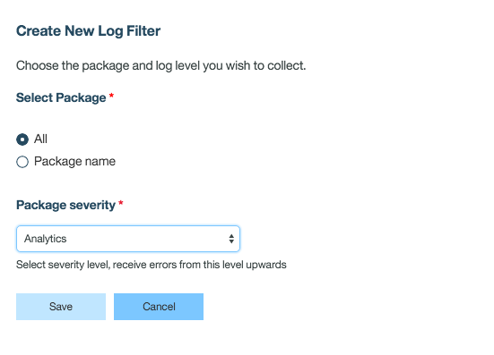

### Overview
Logging is the instrumentation of source code that uses API calls to record messages in order to facilitate diagnostics and debugging. Example: ```java.util.logging``` in Java.

Logging libraries typically have verbosity controls, that are frequently called *levels*. From least to most verbose: ERROR, WARN, INFO, LOG, DEBUG

* Developers can filter by level in their log viewer.
* Capture tools can filter by level in their configurations.

This tutorial covers the following topics:

* Log capture
* Server preparation (in production)
* Admin control for client logs
* Crash capture
* For more information
* API calls for specific environments

### Log capture
Log capture is the ability to persistently record messages that are passed to the logging API.

Capture is on by default but can be turned off.

Logging defaults to FATAL level in development and production. You can control levels, and therefore verbosity, with API calls that are specific to your environment.

### Server preparation (in production)
It is useless to persistently capture log output in browsers and devices in production unless that captured data can be sent for diagnostic inspection. You can send captured data by calling the send method explicitly in your application.

You can turn the automatic behavior on or off with API calls that are specific to your environment, or by calling the ```send``` method explicitly in your application.

#### How to receive and process logs at the server?
There are two ways to receive client logs on MobileFirst Server:

1. Install the IBM MobileFirst Platform Operational Analytics (MobileFirst Operational Analytics for short).
2. Develop and deploy an adapter that is named ```WLClientLogReceiver``` with a function (procedure) that is named ```log```.

> **Note:** This adapter cannot be a Java Adapter

The MobileFirst Operational Analytics is available by default in the embedded Liberty server in the MobileFirst Studio development environment. You can open the Analytics Console from the MobileFirst Operations Console. When MobileFirst Operational Analytics is properly installed and configured, client logs that are sent to MobileFirst Server are automatically forwarded to MobileFirst Operational Analytics.

> For more information about installing MobileFirst Operational Analytics in a production  environment, see the topic about installing MobileFirst Operational Analytics, in the user documentation.

If you do not wish to use MobileFirst Operational Analytics, you can still collect and process client logs by creating an adapter. By default, MobileFirst Platform Foundation is configured to forward client logs to an adapter named ```WLClientLogReceiver```, which exposes a method called ```log```.

If MobileFirst Operational Analytics and the adapter have both been configured, MobileFirst Platform Foudation sends logs to both endpoints. Using both may be useful if you want to take benefit of MobileFirst Operational Analytics log searching capabilities AND do some custom operations on client logs by using your own adapter.

### Admin control of client log capture
To configure log capture preferences for applications in production, use the MobileFirst Operations Console. Administrators can control the MobileFirst client SDK log capture and levels from the MobileFirst Operations Console.

Through `Log Filters` you are able to create a filter level that you can log at.


### Crash capture
The MobileFirst client SDK, on Android and iOS, captures a stack trace upon application crash and logs it at FATAL level. This type of crash is a true crash where the UI disappears from the user's view.

The MobileFirst client SDK, in JavaScript, captures JavaScript global errors and if possible, a JavaScript call stack, and logs it at FATAL level. This type of crash is not a crash event, and might or might not have any adverse consequences to the user experience at run time.

Crash, uncaught exceptions, and global errors are caught and logged automatically.
### For more information
For more information about logging and log capture, see the user documentation.
