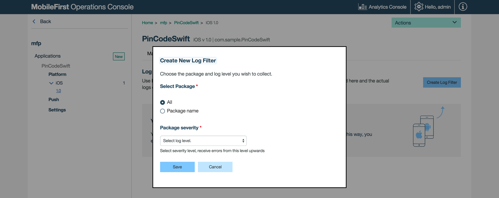

## Overview
Logging is the instrumentation of source code that uses API calls to record messages in order to facilitate diagnostics and debugging. The MobileFirst Platform Foundation Operations Server gives you the ability to contorl which logs should be collected remotley. This gives the server administrator more fine tuned control over the server resources.

Features the server offers:

* [Remote Client Side Logging](#server-control-of-client-log-capture)
* [Additional Packages](#additional-packages)
* [Adapter Logs](#adapter-logs)

## Logging levels
Logging libraries typically have verbosity controls that are frequently called **levels**. From least to most verbose: ERROR, WARN, INFO, LOG and DEBUG. 

## Server Control of Client Log Capture
Administrators can control the MobileFirst client SDK log capture and levels from the **MobileFirst Operations Console → [your application] → Log Filters**.  
Through `Log Filters` you are able to create a filter level that you can log at.



In order to use the server configuration the client has to use the `updateConfigFromServer` method in the `Logger` API.

#### Android

```java
Logger.updateConfigFromServer();
```

#### iOS

```objective-c
[OCLogger updateConfigFromServer];
```

#### Cordova

```javascript
WL.Logger.updateConfigFromServer();
```

The `Logger` configuration values returned from the server will take precidence over any value set on the client side. When the Client Log Profile is removed and the client tries to retrieve the Client Log Profile, the client will receive an empty payload. If an empcdty payload is received then the `Logger` configuration will default to what was originally configured on the client.

## Additional Packages
The MobileFirst Platform Foundation Operations Console also gives the server administrator the ability to persist logs from specified packages and send those logs to the analytics server. This is useful for a user when they want to take advantage of triaging adapter logs in the analytics console without having to collect all server logs. 

## Adapter Logs

* [JavaScript Adapters](javascript-adapter-log-collection)
* [Java Adapters](java-adapter-log-collection/)

## For more information
> For more information about logging and log capture, see the user documentation.
