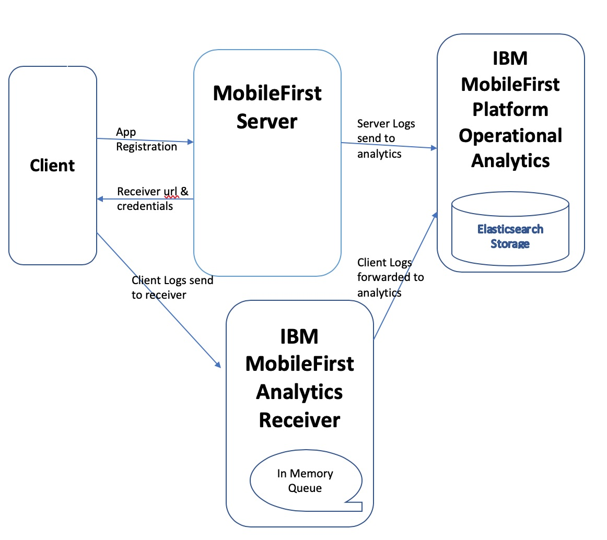

<!-- NLS_CHARSET=UTF-8 -->
## Overview
{: #overview }

The {{ site.data.keys.mf_analytics_receiver_short }} is an optional service which receives logs from mobile applications and forward them to {{ site.data.keys.mf_analytics_short }} in a phassed manner using inmemory event queue. {{ site.data.keys.mf_analytics_receiver_short }} maintains inmemory event queue to store the logs before sending them to {{ site.data.keys.mf_analytics_short }}. Enableing this service will reduce major work done by {{ site.data.keys.mf_server }} to receive logs via loguploader api. So It improves performance of  {{ site.data.keys.mf_server }} by reducing number of threads and reduces heap usage. Absence of this service, {{ site.data.keys.mf_server }} will handle client logs and forward them to {{ site.data.keys.mf_analytics_short }}.

## {{ site.data.keys.mf_analytics_receiver_short }} workflow
{: #analytics-receiver-workflow }

Configure {{ site.data.keys.mf_analytics_receiver_short }} in a separate node since it requires enough heap space to store logs into inmemory queue. 

{{ site.data.keys.mf_analytics_receiver_short }} should reference {{ site.data.keys.mf_analytics_short }}  details inroder to forward the forward the received logs. i.e JNDI setting for the service will point to the URL and credentials of {{ site.data.keys.mf_analytics_short }}.

By default mobile applications send the logs to  {{ site.data.keys.mf_server }}. But if {{ site.data.keys.mf_analytics_receiver_short }} enabled then {{ site.data.keys.mf_server }} will inform about receiver url and credentials to mobile applications so that all the logs will be send to {{ site.data.keys.mf_analytics_receiver_short }}. So JNDI env setup for {{ site.data.keys.mf_server }} will have reference to {{ site.data.keys.mf_analytics_receiver_short }} url and its credentials. 

As soon as application registers with  {{ site.data.keys.mf_server }}, it will transfer url and credential details of {{ site.data.keys.mf_analytics_receiver_short }} to mobile application. Upon receiving {{ site.data.keys.mf_analytics_receiver_short }} details mobile application stores them into security prefs and use them for sending logs. 

## {{ site.data.keys.mf_analytics_receiver_short }} configuration
{: #analytics-receiver-configuration }

The analytics receiver WAR file is included with the MobileFirst Server installation. For more information, see Distribution structure of MobileFirst Server.

* Information about how to install {{ site.data.keys.mf_analytics_receiver_server }}, see [{{ site.data.keys.mf_analytics_receiver_server }} installation guide](../installation-configuration/production/analyticsreceiver/installation).
* For more information about how to configure IBM MobileFirst Analytics Receiver, see [Configuration guide](../installation-configuration/production/analyticsreceiver/configuration).

* As a quick configuration after installing {{ site.data.keys.mf_analytics_receiver_short }} make sure following JNDI properties are pointing to {{ site.data.keys.mf_analytics }} . 

| Property                           | Description                                           | Default Value |
|------------------------------------|-------------------------------------------------------|---------------|
| receiver.analytics.url                  |Required. The URL that is exposed by the {{ site.data.keys.mf_analytics_server }} that receives incoming analytics data. For example, http://hostname:port/analytics-service/rest. | None |
| receiver.analytics.username             | The user name that is used if the data entry point is protected with basic authentication. | None |
| receiver.analytics.password             | The password that is used if the data entry point is protected with basic authentication. | None |
| receiver.analytics.event.qsize          | Optional. Size of analytic event queue size. It should be added with caution by providing ample JVM heap size. Default queue size 10000  | None |

* Inorder to enable receiver to be used as loguploader make sure following JNDI properties are set in {{ site.data.keys.mf_server }}. These JNDI properties should be pointed to {{ site.data.keys.mf_analytics_receiver_server }}. 

| Property                           | Description                                           | Default Value |
|------------------------------------|-------------------------------------------------------|---------------|
| mfp.analytics.receiver.url                  |Required. The URL that is exposed by the {{ site.data.keys.mf_analytics_receiver_server }} that receives incoming analytics data. For example, http://hostname:port/analytics-receiver/rest. | None |
| mfp.analytics.receiver.username             | The user name that is used if the data entry point is protected with basic authentication. | None |
| mfp.analytics.receiver.password             | The password that is used if the data entry point is protected with basic authentication. | None |

* Make sure {{ site.data.keys.mf_analytics_short }} setup is not disturbed in {{ site.data.keys.mf_server }} since serverlogs are still transmitted directly from {{ site.data.keys.mf_server }} to {{ site.data.keys.mf_analytics_server }} .

## Troubleshooting
{: #troubleshotting }

For information on troubleshooting {{ site.data.keys.mf_analytics_receiver }}, see [Analytics Receiver Troubleshooting](../troubleshooting/analyticsreceiver/).
