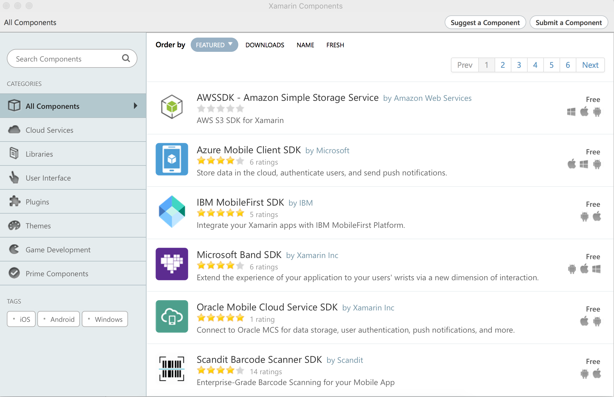

<!-- NLS_CHARSET=UTF-8 -->
## Overview
The {{ site.data.keys.product }} SDK consists of a collection of dependencies that are available through [Xamarin Component store](https://components.xamarin.com/) and which you can add to your Xamarin project.  
The pods correspond to core functions and other functions:

* **MobileFirst.Xamarin** - Implements client-to-server connectivity, handles authentication and security aspects, resource requests, and other required core functions.
* **MobileFirst.JSONStore** - Contains the JSONStore framework.  
* **MobileFirst.Push** - Contains the push notification framework. For more information, review the [Notifications tutorials](../../../notifications/).

In this tutorial you learn how to add the {{ site.data.keys.product_adj }} Native SDK by using Xamarin Component Store to a new or existing Xamarin Android or iOS application. You also learn how to configure the {{ site.data.keys.mf_server }} to recognize the application.

**Prerequisites:**

- Xamarin Studio installed on the developer workstation.  
- A local or remote instance of {{ site.data.keys.mf_server }} is running.
- Read the [Setting up your {{ site.data.keys.product_adj }} development environment](../../../installation-configuration/development/) and [Setting up your Xamarin development environment](../../../installation-configuration/development/xamarin/) tutorials.

#### Jump to:

- [Adding the {{ site.data.keys.product_adj }} Native SDK](#adding-the-mobilefirst-native-sdk)
- [Updating the {{ site.data.keys.product_adj }} Native SDK](#updating-the-mobilefirst-native-sdk)
- [Tutorials to follow next](#tutorials-to-follow-next)

## Adding the {{ site.data.keys.product_adj }} Native SDK
Follow the instructions below to add the {{ site.data.keys.product_adj }} Native SDK to a new or existing Xcode project, and to register the application to the {{ site.data.keys.mf_server }}.

Before you start, make sure that the {{ site.data.keys.mf_server }} is running.  
If using a locally installed server: From a **Command-line** window, navigate to the server's folder and run the command: `./run.sh`.

### Creating an application
Create a Xamarin solution using Xamarin Studio or Visual Studio or use an existing one.

### Adding the SDK

1. The {{ site.data.keys.product_adj }} Native SDK is provided via Xamarin Components Store.
2. Expand the Android or iOS project.
3. In the Android or iOS project, right-click **Components**.
4. Select **Get More Components**. 
5. Search for **IBM MobileFirst SDK**. Choose and do **Add to App**.

6. Right-click **Packages** and select **Add packages** .Search for and add **Newtonsoft.Json**. This pulls in the Newtonsoft dependency from Nuget. This needs to be done separately for both Android and iOS projects.
7. Right-click **References** and select **Edit References**. Go to **.Net Assembly** tab and click 'Browse'. From the project folder's root go to `Components -> ibm-worklight-8.0.0.1 -> lib -> pcl`. Select **Worklight.Core.dll**.

### Registering the application

1. Load the {{ site.data.keys.mf_console }}.
2. Click the New button next to Applications to register a new application and follow the on-screen instructions.
3. Android and iOS applications have to be registered separately. This ensures both the Android application and iOS application can connect successfully to the server. The registration details for Android and iOS applications can be found in the `AndroidManifest.xml` and `Info.plist` respectively.
3. After the application is registered, navigate to the application's Configuration Files tab and copy or download the mfpclient.plist and mfpclient.properties file. Follow the onscreen instructions to add the file to your project.

### Completing the setup process

#### mfpclient.plist
1. Right-click the Xamarin iOS project and select **Add files..**. Browse and find the `mfpclient.plist` to the root of the project. Choose **Copy file to project** if prompted.
2. Right-click the `mfpclient.plist` file and select **Build action**.Choose **Content**.

#### mfpclient.properties

1. Right-click the *Assets* folder of Xamarin Android project and select **Add files..**. Browse and find the `mfpclient.properties` to the folder. Choose **Copy file to project** if prompted.
2. Right-click the `mfpclient.properties` file and select **Build action**.Choose **Android asset**.


### Referencing the SDK

Whenever you want to use the {{ site.data.keys.product_adj }} Native SDK, make sure that you import the {{ site.data.keys.product }} framework:

CommonProject:

```csharp
using Worklight;
```

iOS:

```csharp
using MobileFirst.Xamarin.iOS;
```

Android:

```csharp
using Worklight.Xamarin.Android;
```

## Updating the {{ site.data.keys.product_adj }} Native SDK
To update the {{ site.data.keys.product_adj }} Native SDK with the latest release, update the version of the SDK via the Xamarin Components store.

## Generated {{ site.data.keys.product_adj }} Native SDK artifacts

### mfpclient.plist

This file defines the client-side properties used for registering your iOS app on the {{ site.data.keys.mf_server }}.

| Property            | Description                                                         | Example values |
|---------------------|---------------------------------------------------------------------|----------------|
| wlServerProtocol    | The communication protocol with the {{ site.data.keys.mf_server }}.             | http or https  |
| wlServerHost        | The host name of the {{ site.data.keys.mf_server }}.                            | 192.168.1.63   |
| wlServerPort        | The port of the {{ site.data.keys.mf_server }}.                                 | 9080           |
| wlServerContext     | The context root path of the application on the {{ site.data.keys.mf_server }}. | /mfp/          |
| languagePreferences | Sets the default language for client sdk system messages.           | en             |

## Tutorials to follow next
With the {{ site.data.keys.product_adj }} Native SDK now integrated, you can now:

- Review the [Adapters development tutorials](../../../adapters/)
- Review the [Authentication and security tutorials](../../../authentication-and-security/)
- Review the [Notifications tutorials](../../../notifications/)
- Review [All Tutorials](../../../all-tutorials)
