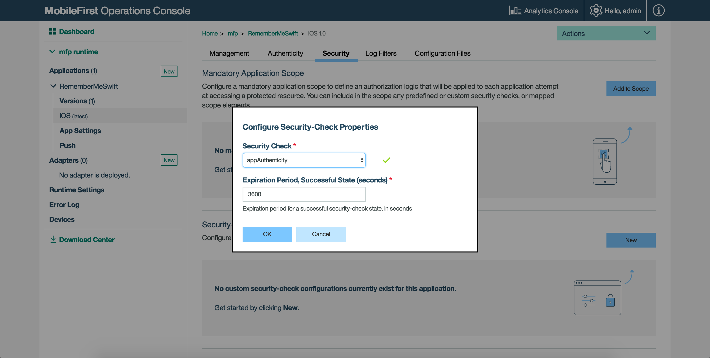

## Overview
By issuing an HTTP request, an entity can access to corporate HTTP services (APIs) IBM MobileFirst Platform Foundation Server provides access to. The predefined application-authenticity [security check](../authentication-concepts/) ensures that an application that tries to connect to a MobileFirst Server instance is the authentic one and was not tampered with or modified by a third-party attacker.

To enable Application Authenticity you can either follow the on-screen instructions in the **MobileFirst Operations Console** → **[your-application]** → **Authenticity**, or review the information below.

#### Availability
* Application Authenticity is available in all supported platforms (iOS, Android, Windows 8.1 Universal, Windows 10 UWP) in both Cordova and Native applications.

#### Limitations

* Application Authenticity is **not available** in the MobileFirst Development Server. To test, use a remote application server such as a QA, UAT or Production server.
* Application Authenticity does not support **Bitcode** in iOS. If using Application Authentcity, disable Bitcode in the Xcode project properties.

#### Jump to:

- [Authenticity flow](authenticity-flow)
- [Enabling authenticity](enabling-application-authenticity)
- [Configuring authenticity](configuring-application-authenticity)

## Application Authenticity Flow
By default, the application-authenticity security check is run during the application's runtime registration with MobileFirst Server, which occurs the first time an instance of the application attempts to connect to the server.

Once an application has passed the authenticity challenge, an authenticity scope is granted. For as long as the token is valid, the authenticity challenge will not occur again. See [Configuring authenticity](configuring-authenticity) to learn how this can be customized.


> The challenge token in the diagram is processed by compiled native code, so that third-party attackers cannot see the logic of this processing.

## Enabling Application Authenticity
To enable Application Authenticity in your Cordova or Native application, the application's binary file needs to be signed using the application-authenticity tool. Eligible binary files are: `ipa` for iOS, `apk` for Android and `appx` for Windows 8.1 Universal &amp; Windows 10 UWP.

1. Open a **Command-line** window and run the command: `java -jar path-to-application-authenticity-tool.jar path-to-binary-file`

    For example:

    ```bash
    java -jar /Users/your-username/Desktop/application-authenticity-tool.jar /Users/your-username/Desktop/MyBankApp.ipa
    ```

    The result of the command above is an `.authenticity_data` file generated next to the `MyBankApp.ipa` file, called `MyBankApp.authenticity_data`.
 
2. Open the MobileFirst Operations Console in your browser of choice.
3. Select your application from the navigation sidebar and click on the Authenticiy menu item.
3. Click on **Upload Authenticity File** to upload the `.authenticity_data` file.

When the `.authenticity_data` file is uploaded, Application Authenticity is enabled.


### Disabling Application Authenticity
To disable Application Authenticity, click the **Delete Authenticity File** button.

## Configuring Application Authenticity
The predefined application-authenticity security check can be configured with the following property:

- `expirationInSec`: Defaults to 3600 seconds / 1 hour. Defines the duration until the Authenticity token expires.

Once an authenticity check has been performed, it will not be performed again until the token has expired based on the set value.

#### To configure the `expirationInSec` property:

1. Load the MobileFirst Operations Console and navigate to **[your application]** → **Security** → **Security Check Configurations** and click on **Create New**.

2. Search for the "appAuthenticity" scope element.

3. Set a new value in seconds.



