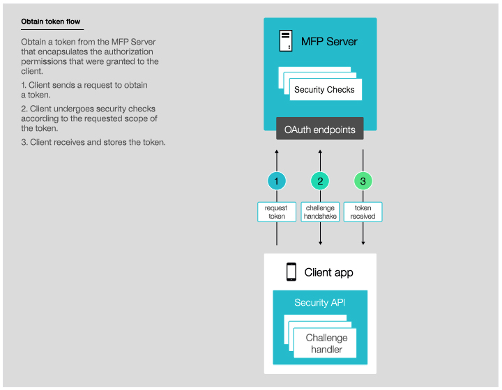

## Overview
The MobileFirst Platform Foundation authentication framework uses the [OAuth 2.0](http://oauth.net/) protocol. The OAuth 2 protocol is based on the acquisition of an access token that encapsulates the authorization header that is granted to the client.  

In that context, IBM MobileFirst Platform Server serves as an **authorization server** and is able to **generate access tokens**. The client can then use these tokens to access resources on a resource server, which can be either the MobileFirst Server itself or an external server. The resource server checks the validity of the token to make sure that the client can be granted access to the requested resource. The separation between resource server and authorization server allows to enforce security on resources that are running outside MobileFirst Server.

#### Jump to:

* [Authorization flow](#authorization-flow)
* [Authorization entities](#authEntities)
* Protecting resources
* Configuring Authentication from the MobileFirst Console
* Further reading

## Authorization flow
The authorization flow has two phases:

1. The client acquires a token.
2. The client uses the token to access a protected resource.

### Acquiring a token
In this phase, the client undergoes `security checks` in order to receive an access token.  
These `security checks` use **authorization entities**, which are described in [the next section](#authEntities).  


### Using a token to access a protected resource
It is possible to enforce security both on resources that run on MobileFirst Server, as shown in this diagram, and on resources that run on any external resource server as explained in tutorial [Using MobileFirst Server to authenticate external resources](../../using-mobilefirst-server-authenticate-external-resources/).

It is also possible to separate the Authorization Server from MFP Server by using DataPower as an Authorization Server.  
In this case the Introspection Endpoint will keep MFP Server and DataPower in sync.


## Authorization entities
- You can protect resources such as adapters from unauthorized access by specifying a **scope** that contains zero or more **scope elements**.

- A **SecurityCheck** defines the process to be used to authenticate users. It is often associated with a **SecurityCheckConfiguration** that defines properties to be used by the SecurityCheck. SecurityChecks are instantiated by **Security Adapters**. The same SecurityCheck can be used to protect several resources.

- The client application needs to implement a **challenge handler** to handle challenges sent by the SecurityCheck.

### SecurityCheck
A SecurityCheck is an object responsible for obtaining credentials from a client and validate them.

#### securityCheckDefinition
Security checks are defined inside adapters. Any adapter can theoretically define a SecurityCheck. An adapter can either be a *resource* adapter (meaning it serves resources/content to send to the client), a *SecurityCheck* adapter, or **both**. However it is recommended to define the SecurityCheck in a separate adapter.

In your **adapter.xml** file add an XML element called `securityCheckDefinition`. For example:

```xml
<securityCheckDefinition name="sample" class="com.ibm.mfp.sampleSecurityCheck">
    <property name="successExpirationSec" defaultValue="60"/>
    <property name="failureExpirationSec" defaultValue="60"/>
    <property name="maxAttempts" defaultValue="3"/>
</securityCheckDefinition>
```

- The `name` attribute will be the name of your SecurityCheck
- The `class` attribute specifies the implementation of the SecurityCheck
- Some SecurityChecks can be configured with a list of `property` elements.

#### SecurityCheck implementation
The class file of your SecurityCheck is where all of the logic happens. Your implementation should extend one of the provided base classes, below.  
The parent class you choose will determine the balance between customization and simplicity.

##### `SecurityCheckWithUserAuthentication`
TODO

##### `SecurityCheckWithAttempts`
TODO

##### `SecurityCheckWithExternalization`
TODO

##### `SecurityCheck`
TODO

#### SecurityCheckConfiguration

Each `SecurityCheck` implementation class can use a `SecurityCheckConfiguration` that defines properties available for that `SecurityCheck`. Each base `SecurityCheck` class comes with a matching `SecurityCheckConfiguration` class. You can create your own implementation that extends one of the base `SecurityCheckConfiguration` classes and use it for your custom `SecurityCheck`.

For example, `SecurityCheckWithUserAuthentication`'s `createConfiguration` method returns an instance of `SecurityCheckWithAuthenticationConfig`.

```java
public abstract class SecurityCheckWithUserAuthentication extends SecurityCheckWithAttempts {
    @Override
    public SecurityCheckConfiguration createConfiguration(Properties properties) {
        return new SecurityCheckWithAuthenticationConfig(properties);
    }
}
```

`SecurityCheckWithAuthenticationConfig` enables a property called `rememberMeDurationSec`.

```java
public class SecurityCheckWithAuthenticationConfig extends SecurityCheckWithAttemptsConfig {

    public int rememberMeDurationSec;

    public SecurityCheckWithAuthenticationConfig(Properties properties) {
        super(properties);
        rememberMeDurationSec = getIntProperty("rememberMeDurationSec", properties, 0);
    }

}
```

Those properties can be configured at several levels:

##### adapter.xml
TODO

##### application xml?
TODO

##### console?
TODO

#### Built-in Security Checks
Also available are these out-of-the-box security checks:

- [Application Authenticity Protection](../application-authenticity-protection/)
- [Direct Update](../../client-side-development/direct-update)
- [LTPA](../websphere-ltpa-based-authentication/)

### Scope
A **scope** is a space-separated list of **scope elements**. A scope is used to protect a resource (see later).

### Scope Element
By default, the scope elements you write in your *scope* are matched to a **SecurityCheck** with the same name.

Optionally, at the application level, you can also map a **scope element** to a different SecurityCheck. Specifically, you can map it to a list of zero or more SecurityChecks. This can be useful if you want to protect a resource differently depending on which application is trying to access it.

## Protecting resources

### Java adapters
You can specify the `scope` of a Java adapter by using the `@OAuthSecurity` annotation.

```java
@DELETE
@Path("/{userId}")
@OAuthSecurity(scope="deletePower")
//This will serve: DELETE /users/{userId}
public void deleteUser(@PathParam("userId") String userId){
    ...
}
```
In this example, the `deleteUser` procedure uses the annotation `@OAuthSecurity(scope="deletePower")`, which means that it is protected by a **scope** containing the **scope element** `deletePower`.

A scope can be made of several **scope elements**, space-separated: `@OAuthSecurity(scope="element1 element2 element3")`.

If you do not specify the `@OAuthSecurity` annotation, the procedure is protected by the MobileFirst default security scope. That means that only a registered mobile app that is deployed on the same MobileFirst Server instance as the adapter can access this resource. Any security test protecting the application also applies here.

If you want to disable MobileFirst default security, you can use: `@OAuthSecurity(enabled=false)`.

You can use the `@OAuthSecurity` annotation also at the resource class level, to define a scope for the entire Java class.

### JavaScript adapters
TODO

### External resources
TODO

## Configuring Authentication from the MobileFirst Console

## Further Reading
