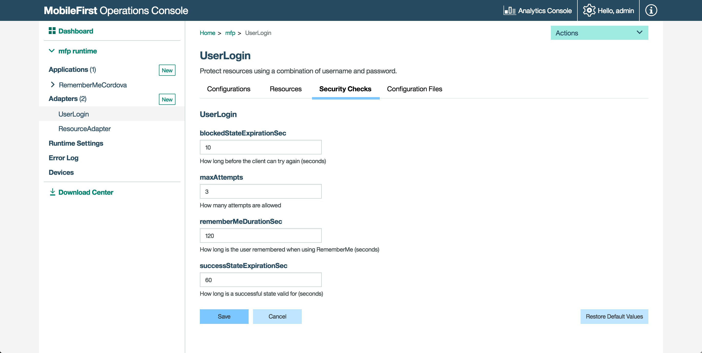
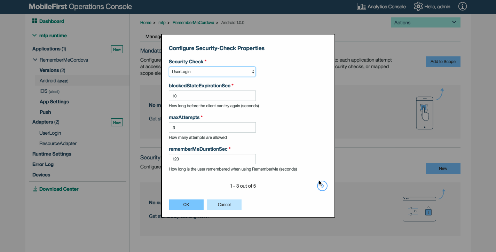

## Overview
A SecurityCheck is an object responsible for obtaining credentials from a client and validate them.

Security checks are defined inside adapters. Any adapter can theoretically define a SecurityCheck. An adapter can either be a *resource* adapter (meaning it serves resources/content to send to the client), a *SecurityCheck* adapter, or **both**. However it is recommended to define the SecurityCheck in a separate adapter.

## Defining a SecurityCheck
In your **adapter XML** file add an XML element called `securityCheckDefinition`. For example:

```xml
<securityCheckDefinition name="sample" class="com.ibm.mfp.sampleSecurityCheck">
    <property name="successExpirationSec" defaultValue="60"/>
    <property name="failureExpirationSec" defaultValue="60"/>
    <property name="maxAttempts" defaultValue="3"/>
</securityCheckDefinition>
```

- The `name` attribute will be the name of your SecurityCheck
- The `class` attribute specifies the implementation of the SecurityCheck
- Some SecurityChecks can be configured with a list of `property` elements.

## SecurityCheck implementation
The class file of your SecurityCheck is where all of the logic happens. Your implementation should extend one of the provided base classes, below.  
The parent class you choose will determine the balance between customization and simplicity.

### SecurityCheck
`SecurityCheck` is a Java interface defining the minimum required methods to represent the server-side state of a security check. Using this interface alone does not provide any implementation code and it is the sole responsibility of the implementor handle each scenario.

### SecurityCheckWithExternalization
This abstract class implements a basic version of the `SecurityCheck` interface.
It provides among other things: externalization as JSON, inactivity timeout, expiration countdown...

Subclassing this class leaves a lot of flexibility in your Security Check implementation.

### SecurityCheckWithAttempts
This abstract class extends `SecurityCheckWithExternalization` and implements most of its methods to simplify usage. The only two methods required to implement are `validateCredentials` and `createChallenge`. This class is good for simple flows that just need to validate some arbitrary credentials to grant access.

This class also provides built-in capabilities to block access after a set number of attempts.

> Learn more in the [SecurityCheckWithAttempts](../security-check-with-attempts) tutorial

### SecurityCheckWithUserAuthentication
This abstract class extends `SecurityCheckWithAttempts` and therefore inherits all of its features.

In addition, the class provides the framework an `AuthenticatedUser` (an object representing the logged in user). The only methods required to implement are `createUser`, `validateCredentials` and `createChallenge`.

This class also optionally enables a "Remember Me" behavior.

> Learn more in the [SecurityCheckWithUserAuthentication](../security-check-with-user-authentication) tutorial

## SecurityCheckConfiguration

Each `SecurityCheck` implementation class can use a `SecurityCheckConfiguration` class that defines properties available for that `SecurityCheck`. Each base `SecurityCheck` class comes with a matching `SecurityCheckConfiguration` class. You can create your own implementation that extends one of the base `SecurityCheckConfiguration` classes and use it for your custom `SecurityCheck`.

For example, `SecurityCheckWithUserAuthentication`'s `createConfiguration` method returns an instance of `SecurityCheckWithAuthenticationConfig`.

```java
public abstract class SecurityCheckWithUserAuthentication extends SecurityCheckWithAttempts {
    @Override
    public SecurityCheckConfiguration createConfiguration(Properties properties) {
        return new SecurityCheckWithAuthenticationConfig(properties);
    }
}
```

`SecurityCheckWithAuthenticationConfig` enables a property called `rememberMeDurationSec` with a default of `0`.

```java
public class SecurityCheckWithAuthenticationConfig extends SecurityCheckWithAttemptsConfig {

    public int rememberMeDurationSec;

    public SecurityCheckWithAuthenticationConfig(Properties properties) {
        super(properties);
        rememberMeDurationSec = getIntProperty("rememberMeDurationSec", properties, 0);
    }

}
```

Those properties can be configured at several levels:

### adapter.xml
In your adapter.xml file, inside `<securityCheckDefinition>`, you can add one or more `<property>` elements.
The `<property>` element takes the following attributes:

- `name`: The name of the property, as defined in the configuration class.
- `defaultValue`: Overrides the default value defined in the configuration class.
- `displayName`: A friendly name to be displayed in the console.

Example:

```xml
<property name="maxAttempts" defaultValue="3" displayName="How many attempts are allowed"/>
```

### MobileFirst Operations Console - Adapter
In the MobileFirst Console, in the "Security Check" tab of your adapter, you will be able change the value of any property defined in the adapter.xml.
Note that **only** the properties defined in adapter.xml appear on this screen; properties defined in the configuration class won't appear here automatically.



### MobileFirst Operations Console - Application
Property values can also be overridden at the application level. In your MobileFirst Console, in the "Security" tab of your application, under the "Security Check Configurations" section, you can modify the values defined in each Security Check available.



## Predefined Security Checks
Also available are these out-of-the-box security checks:

- [Application Authenticity](../application-authenticity/)
- [Direct Update](../../using-the-mfpf-sdk/direct-update)
- LTPA
