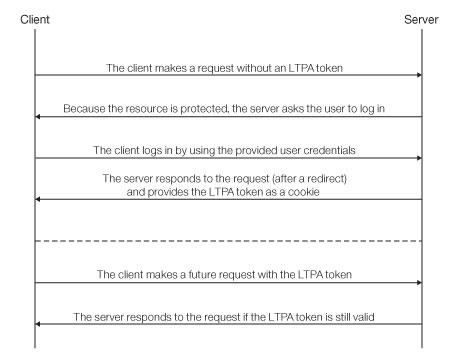
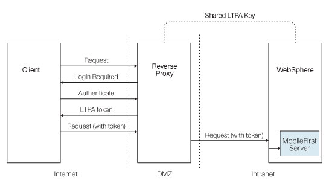
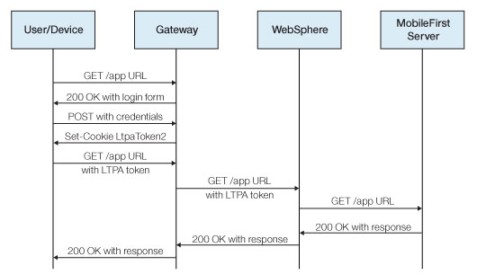

<!-- NLS_CHARSET=UTF-8 -->
## Overview
A lightweight third-party authentication (LTPA) token is a type of security token that is used by IBM WebSphere Application Server and other IBM products. LTPA can be used to send the credentials of an authenticated user to back-end services. It can also be used as a single sign-on (SSO) token between the user and multiple servers.

Simple client < - > server flow with LTPA:

After a user logs in to the server, the server generates an LTPA token, which is an encrypted hash that contains authenticated user information. The token is signed by a private key that is shared among all the servers that want to decode it. The token is usually in cookie form for HTTP services. By sending the token as a cookie, the need for subsequent user interaction is avoided.

LTPA tokens have a configurable expiration time to reduce the possibility of session hijacking.

## Reverse proxy with LTPA
Your infrastructure can also use the LTPA token to communicate with a back-end server that acts on behalf of the user. In a reverse-proxy topology, the user cannot directly access the back-end server. The reverse proxy can be used to authenticate a user's identity, and then send the LTPA token of the authenticated user to back-end servers. This configuration ensures that access to {{ site.data.keys.mf_server }} cannot be obtained until a user is authenticated. This is useful, for example, when you do not want to use {{ site.data.keys.product }} to handle vital user credentials, or when you want to use an existing authentication setup. Enterprise environments should use a reverse proxy, such as IBM WebSphere DataPower or IBM Security Access Manager, in the DMZ, and place the {{ site.data.keys.mf_server }} in the intranet.

In a reverse-proxy implementation, {{ site.data.keys.mf_server }} must be configured for LTPA authentication to get the user identity.

LTPA flow between a client and a back-end server using a reverse proxy:

## {{ site.data.keys.product_adj }} integration with a reverse proxy
You can use a reverse proxy to enable enterprise connectivity within a {{ site.data.keys.product_adj }} environment, and to provide authentication services to {{ site.data.keys.product }}.

### General architecture
Reverse proxies typically front {{ site.data.keys.mf_server }} instances as part of the deployment, as shown in the figure below, and follow the gateway pattern.

The **MFP** icon represents an instance of {{ site.data.keys.mf_server }}. The **GW** icon represents a reverse-proxy gateway, such as WebSphere DataPower. In addition to protecting {{ site.data.keys.product_adj }} resources from the Internet, the reverse proxy provides termination of HTTPS (SSL) connections and authentication. The reverse proxy can also act as a policy enforcement point (PEP).

When a gateway is used, an application (**A**) on a device (**D**) uses the public URI that is advertised by the gateway instead of the internal {{ site.data.keys.mf_server }} URI. The public URI can be exposed as a setting within the application, or can be built in during promotion of the application to production, before the application is published to public or private application stores.

### Authentication at the gateway
If authentication ends at the gateway, {{ site.data.keys.product }} can be informed of the authenticated user by a shared context, such as a custom HTTP header or a cookie. By using the extensible authentication framework, you can configure {{ site.data.keys.product }} to use the user identity from one of these mechanisms, and establish a successful log in. The below figure shows a typical authentication flow for this gateway topology.

This configuration was successfully tested with WebSphere DataPower for LTPA-based authentication. On successful authentication, the gateway forwards an LTPA token (in the form of an HTTP cookie) to WebSphere Application Server, which validates the LTPA token and creates a caller principal. {{ site.data.keys.product }} can use this caller principal, as needed.

## The {{ site.data.keys.product_adj }} LTPA-based SSO security check
The predefined {{ site.data.keys.product_adj }} LTPA-based single-sign on (SSO) security check (**LtpaBasedSSO**) enables integration of {{ site.data.keys.product }} with the WebSphere Application Server LTPA protocol. This security check allows you to integrate instances of {{ site.data.keys.mf_server }} within an LTPA-based gateway topology, as described in the previous sections, and use a back-end service to authenticate users by using an SSO LTPA token.

This predefined security check can be used as any other security check in the {{ site.data.keys.product_adj }} security framework you can map a custom scope element to this check, and use the check (or a scope element that contains it) in a protecting resource scope or in a mandatory application scope.

You can also configure the behavior of this security check for your application.

## Configuring the LTPA-based SSO security check
The predefined LTPA-based single sign-on (SSO) security check (**LtpaBasedSSO**) has a single configurable property: **expirationSec**. This property sets the expiration period for a successful security-check state. The expiration period determines the minimal interval for invoking the check again after a successful execution.

> **Note:** The procedure explains how to use the {{ site.data.keys.mf_console }} to configure the property value. Alternatively, you can also set the property value directly in the **application-descriptor** file. For detailed information, see Configuring application security-check properties.

1. Open a {{ site.data.keys.mf_console }} window. Select your application version from the **navigation sidebar**, and then select the application **Security** tab.
2. In the **Security-Check Configurations** section, select **Create New**.
3. In the **Configure Security-Check Properties** window, configure the **LTPA-based SSO** security check:
    * In the **Security Check** field, select **LtpaBasedSSO** from the list.
    * In the **Expiration Period Successful State (seconds)** field, set your preferred expiration period for a successful state of the security check, in seconds.

When the configuration is done, you can see and edit your LtpaBasedSSO security-check configuration in the Security-Check Configurations table of the application Security tab.

