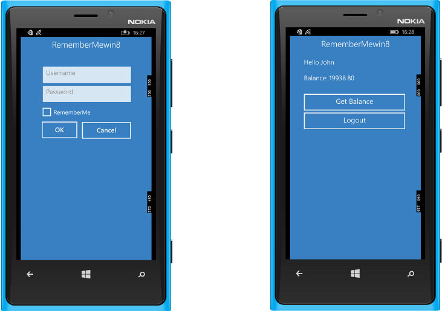

## Overview
**Prerequisite:** Make sure to read the **CredentialsValidationSecurityCheck** [challenge handler implementation](../../credentials-validation/windows-8-10) tutorial.

The challenge handler tutorial demonstrate a few additional features (APIs) such as preemptive `Login`, `Logout`, and `ObtainAccessToken`.

## Login
In this example, `UserLoginSecurityCheck` expects *key:value*s called `username` and `password`. Optionally, it also accepts a Boolean `rememberMe` key, which tells the security check to remember this user for a longer period. In the sample application, this is collected by a Boolean value from a checkbox in the login form.

The `credentials` argument is a `JSONObject` containing `username`, `password`, and `rememberMe`:

```csharp
public override void SubmitChallengeAnswer(object answer)
{
    challengeAnswer = (JObject)answer;
}
```

You may also want to log in a user without any challenge being received. For example, you can show a login screen as the first screen of the application, or show a login screen after a logout, or a login failure. Those scenarios are called **preemptive logins**.

You cannot call the `challengeAnswer` API if there is no challenge to answer. For those scenarios, the MobileFirst Foundation SDK includes the `Login` API:

```csharp
WorklightResponse response = await Worklight.WorklightClient.CreateInstance().AuthorizationManager.Login(String securityCheckName, JObject credentials);
```

If the credentials are wrong, the security check sends back a **challenge**.

It is the developer's responsibility to know when to use `Login`, as oppposed to `challengeAnswer`, based on the application's needs. One way to achieve this is to define a Boolean flag, for example `isChallenged`, and set it to `true` when `HandleChallenge` is reached, or set it to `false` in any other cases (failure, success, initialization, etc).

When the user clicks the **Login** button, you can dynamically choose which API to use:

```csharp
public async void login(JSONObject credentials)
{
    if(isChallenged)
    {
        challengeAnswer= credentials;
    }
    else
    {
        WorklightResponse response = await Worklight.WorklightClient.CreateInstance().AuthorizationManager.Login(securityCheckName, credentials);
    }
}
```
## Obtaining an access token
Because this security check supports the **RememberMe** functionality (as the`rememberMe` Boolean key), it would be useful to check whether the client is currently logged in, when the application starts.

The MobileFirst Foundation SDK provides the `ObtainAccessToken` API to ask the server for a valid token:

```csharp
WorklightAccessToken accessToken = await Worklight.WorklightClient.CreateInstance().AuthorizationManager.ObtainAccessToken(String scope);

if(accessToken.IsValidToken && accessToken.Value != null && accessToken.Value != "")
{
  Debug.WriteLine("Auto login success");
}
else
{
  Debug.WriteLine("Auto login failed");
}

```

If the client is already logged-in or is in the *remembered* state, the API triggers a success. If the client is not logged in, the security check sends back a challenge.

The `ObtainAccessToken` API takes in a **scope**. The scope can be the name of your **security check**.

> Learn more about **scopes** in the [Authorization concepts](../../authorization-concepts) tutorial.

## Retrieving the authenticated user
The challenge handler `HandleSuccess` method receives a `JObject identity` as a parameter.
If the security check sets an `AuthenticatedUser`, this object contains the user's properties. You can use `HandleSuccess` to save the current user:

```csharp
public override void HandleSuccess(JObject identity)
{
    isChallenged = false;
    try
    {
        //Save the current user
        var localSettings = Windows.Storage.ApplicationData.Current.LocalSettings;
        localSettings.Values["useridentity"] = identity.GetValue("user");

    } catch (Exception e) {
        Debug.WriteLine(e.StackTrace);
    }
}
```

Here, `identity` has a key called `user` which itself contains a `JObject` representing the `AuthenticatedUser`:

```json
{
  "user": {
    "id": "john",
    "displayName": "john",
    "authenticatedAt": 1455803338008,
    "authenticatedBy": "UserLogin"
  }
}
```

## Logout
The MobileFirst Foundation SDK also provides a `Logout` API to logout from a specific security check:

```csharp
WorklightResponse response = await Worklight.WorklightClient.CreateInstance().AuthorizationManager.Logout(securityCheckName);
```

## Sample applications
Two samples are associated with this tutorial:

- **PreemptiveLoginWin**: An application that always starts with a login screen, using the preemptive `Login` API.
- **RememberMeWin**: An application with a *Remember Me* checkbox. The user can bypass the login screen the next time the application is opened.

Both samples use the same `UserLoginSecurityCheck` from the **SecurityCheckAdapters** adapter Maven project.

[Click to download](https://github.com/MobileFirst-Platform-Developer-Center/SecurityCheckAdapters/tree/release80) the SecurityCheckAdapters Maven project.  
[Click to download](https://github.com/MobileFirst-Platform-Developer-Center/RememberMeWin8/tree/release80) the Remember Me Win8 project.  
[Click to download](https://github.com/MobileFirst-Platform-Developer-Center/RememberMeWin10/tree/release80) the Remember Me Win10 project.  
[Click to download](https://github.com/MobileFirst-Platform-Developer-Center/PreemptiveLoginWin8/tree/release80) the PreemptiveLogin Win8 project.  
[Click to download](https://github.com/MobileFirst-Platform-Developer-Center/PreemptiveLoginWin10/tree/release80) the PreemptiveLoginWin10 project.

### Sample usage
Follow the sample's README.md file for instructions.
The username/password for the app must match, i.e. "john"/"john".


