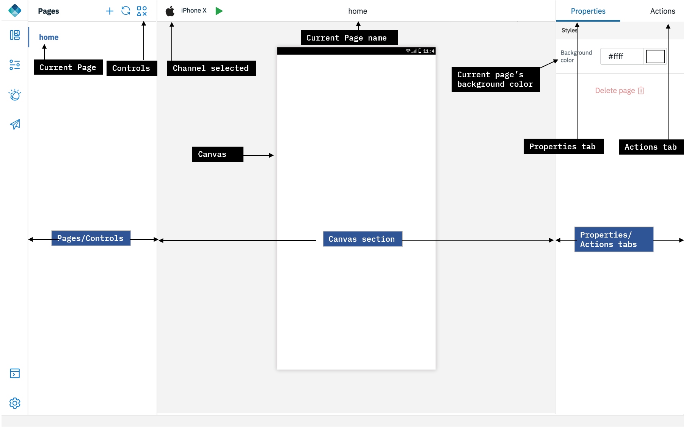
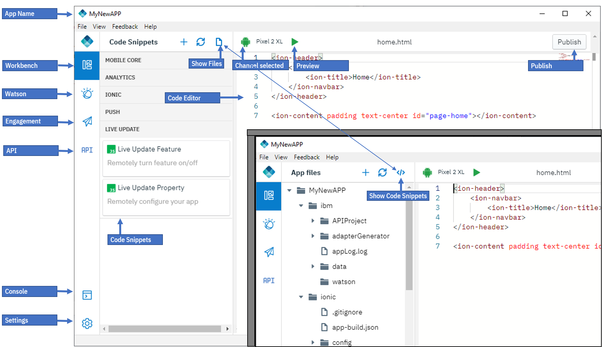

<!-- NLS_CHARSET=UTF-8 -->
## Digital App Builder Interface
{: #digital-app-builder-interface }

Based on the mode (Design/Code) selected, the Digital App Builder interface is displayed.

### Digital App Builder interface in Design mode

Digital App Builder interface consists of the following in the Left navigation panel:

* **Workbench** - displays or hides the page details
* **Data** - helps you to add a dataset by connecting to an existing data source or create a data source for a microservice using OpenAPI doc. 
* **Watson** - consists of Image Recognition and Chatbot (Watson Assistant) components for configuring an existing instance or create a new instance. 
* **Engagement** - You can increase your user engagement with the app by adding Push notifications services and use Live Update feature to show/hide controls and pages or change their properties when your app is live.
* **Console**: displays the console to see the activities. 
* **Settings**: displays the App details, Server info, Plugins, and Repair Project (like Rebuilding dependencies, Rebuilding platforms, Resetting IBM Cloud credentials), enable or disable analytics.

#### Workbench
{: #workbench }

Workbench helps you to design the pages. Workbench consists of three work areas:

1. **Pages/Controls**: This area displays the name of the pages created by default. Use **+** sign to create a new page. On clicking **Controls** icon, displays controls that helps in adding functionality to a page in an app. You can drag and drop the controls from the respective Controls pallette to a page's canvas. Each control has a set of properties and actions. You can modify the properties of each of the controls selected.

    Following is the list of controls provided available:
    * **Basic**: You can drag-and-drop these basic controls (Button, Heading, Image, and Label) to the canvas and configure the properties and actions.

        

        * **Button** - Buttons has a property to label. In the Action tab you can specify the page to navigate to on click of the Button.
        * **Heading Text** - Helps you to add a heading text for the application such as Page Title.
        * **Image** - Helps you upload a local image or provide a url of an image.
        * **Label** - Helps you to add static text to your page body. 
    * **Databound** - helps you to connect with a data set and operate on the entities in the data set. Databound consists of two components: **List** and **Connected Labels**

        

        * **List** - Create a new page and drag and drop the List component. Add the **List Title**, Choose the list type to work on, Add content to work on, and select the dataset to use.

        For more information on how to add **Data set**, refer [here](../how-to-add-dataset/).

    * **Login** - Login consists of the **Login Form** control. 
 
        The Login Form control helps you to create a login page for your application to connect the user to the Mobile Foundation server. Mobile Foundation server provides a security framework to authenticate users and provide that security context to access the data sets. For more information read [here](https://mobilefirstplatform.ibmcloud.com/tutorials/en/foundation/8.0/authentication-and-security/creating-a-security-check/).

        

        For more information on how to add the **Login Form** control, refer [here](../how-to-login/).

    * **AI** - AI controls allows you to add Watson AI capabilities to your app.

        * **Watson Chat** - This control provides a complete chat interface that can be powered with Watson Assistant service on IBM Cloud. 

            

            * In the properties section select the configured Watson Assistant service and select the Workspace you want to connect to. To define and train a Chat conversation see [Chatbot](../how-to-chatbot/) under Watson.

        * **Watson Visual Recognition** - This control provides an ability to take a picture and have Watson Visual recognition service identify it for you.
         
            
 
            *  In the properties section select the configured Visual Recognition service and the classification model. To define and train using your own images see [Image recognition](../how-to-image-recognition/) under Watson.

2. **Canvas** section - This area consists of the Current Channel selected, Current Page name, Publish, and Canvas.

    * **Channel** icon - This displays the current channel selected. You can add additional channels by selecting the required channels in the Platforms section under **Settings > App > App details**.
    * Current Page Name - Displays the canvas page name. When switched between pages, the current page name gets updated to the selected page.
    * **Build/Preview the app** - This button has two options: a. helps to preview the app that you are developing; b. build the app.
    * **Publish** - This option helps you to build and publish your app for Android/iOS to App Center or Publish Direct Updates of your app “over-the-air” with refreshed web resources.
    * **Canvas** - At the centre of this section is the canvas which displays either the design or the code. You can drag-and-drop the controls and create the app.

3. **Properties/Actions** tab - At the right-hand side is the properties and action tab. When a control is placed in the canvas, you can edit and modify the properties of the control and connect a control with a related action to perform.

#### Data
{: #dataset-integration}

You can create a Data set for a micro service and after creating the data set, you can connect the data bound controls in your app.

For more information on how to add **Data set**, refer [here](../how-to-add-dataset/).

#### Watson
{: #integrating-with-watson-services}

The Digital App Builder provides an ability to configure the app to connect to the various Watson services provisioned on IBM Cloud.

#### Engagement
{: #engagement}

You can add Push notifications to your app and increase user engagement or use Live Update feature to show/hide controls and pages or change their properties when your app is live.

#### Console
{: #console }

Helps you to view the code for each of the components. Also displays the information about various activities and errors.

#### Settings
{: #settings}

Settings helps you to manage the app settings and rectify any errors during the build process. Settings consists of **App details**, **Server**, **Plugins**, and **Repair Project** tabs.

### Digital App Builder interface in Code mode

Digital App Builder interface in Code mode consists of the following in the Left navigation panel:

* **Workbench** - displays or hides the Files
* **Watson** - consists of Image Recognition and Chatbot (Watson Assistant) components for configuring an existing instance or create a new instance. 
* **Engagement** - You can increase your user engagement with the app by adding Push notifications services and use Live Update feature to show/hide controls and pages or change their properties when your app is live.
* **API** - Helps to mock the server by just providing a JSON data during development.
* **Console**: displays the console to see the activities. 
* **Settings**: displays the App details, Server info, Plugins, and Repair Project (like Rebuilding dependencies, Rebuilding platforms, Resetting IBM Cloud credentials), enable or disable analytics.

#### Workbench (Code mode)
{: #workbench }

Workbench helps you to design the pages. Workbench consists of two work areas:

1. **Project Files**: This area displays the list of files associated with this app created by default. Use **+** sign to create a new page. On clicking **Controls** icon (**</>**), displays the **Code Snippets** panel. You can drag and drop these code snippets to your code and modify the properties of each of the controls selected.

#### Code Snippets (Code mode only)
{: #code-snippets}

Some of the commonly used Code Snippets are predefined and can be added to the source files by simple drag-and-drop from the Code Snippets section. This section consists of code snippets in the following categories:

* **Mobile Core** - Code snippets for performing basic operations with IBM Mobile Foundation Server
* **Analytics** - Code snippets for Custom Analytics, and User Feedback.
* **Ionic** - Code snippets for simple Ionic components.
* **Push** - Code snippets for working with Push Notifications.
* **Live Update** - Code snippets for working with Live Update for Feature toggle.

