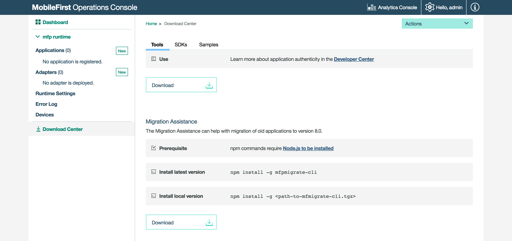
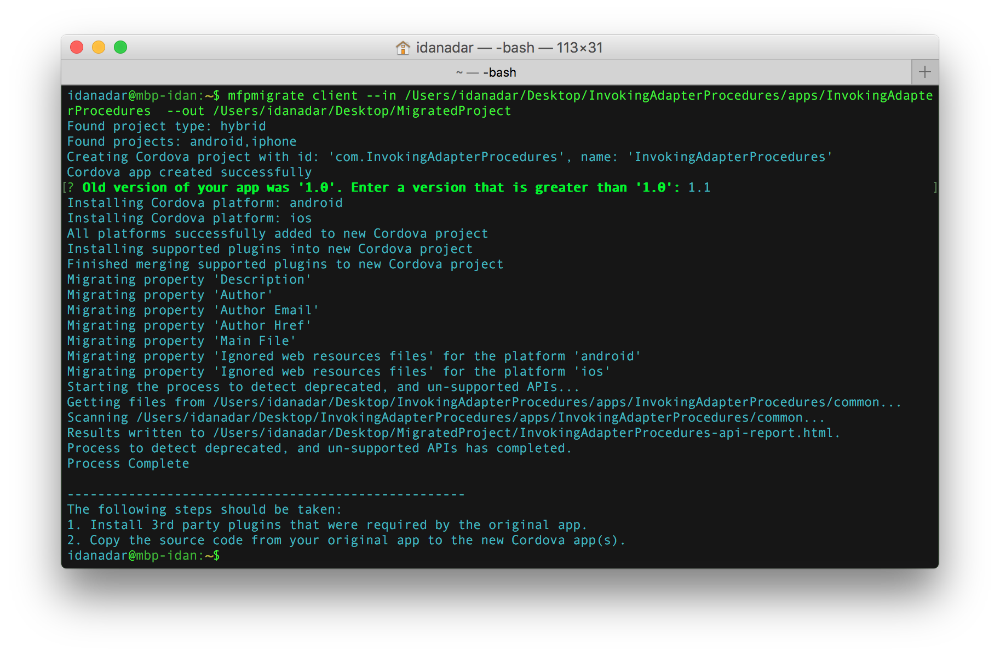
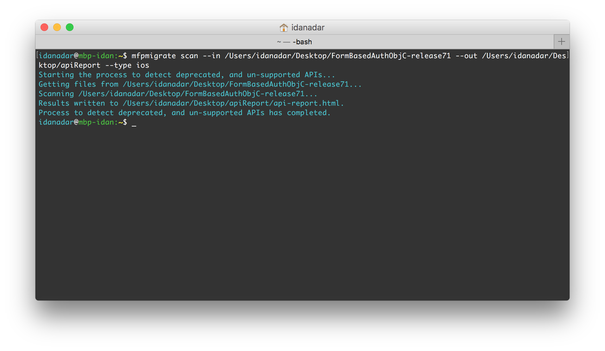
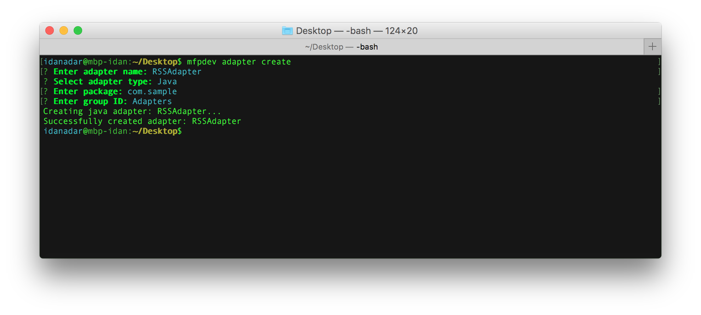

<br/>
<div style="background-color:red;color:white; padding: 5px;">
* talk about installation options (bluemix/devkit)?  
* talk about the new console?<br/>
* add instructions to register the apps and adapters to test the migration<br/>
* work on page UI  
* update links to GA-links for the KC links  
* add "learn more" links to tutorials
</div>

The intent of this cookbook is to provide a clear and simple view of the migration steps for IBM Worklight Foundation 6.2 and IBM MobileFirst Platform Foundation 6.3-7.1 applications and adapters, to IBM MobileFirst Foundation 8.0.

The migration process will guide you through the steps to transform Classic Hybrid applications into [standard Cordova applications](https://cordova.apache.org), as well as update the MobileFirst SDK in native applications. Adapters will be migrated into Maven projects, and implementation concepts such as the MobileFirst security framework, push notifications and direct update will be further clarified. You'll also be guided how to get your application and adapter(s) registered in the MobileFirst Server, since you'll probably want to test it. :)

To ease some aspects of the migration process, a Migration Assistance tool is provided.  
The tool helps in identifying areas in your codebase that you will need to inspect and alter, such as APIs that are deprecated, no longer supported, or modified.

> **Note:** This cookbook does not attempt to cover all possible migration scenarios and you are advised [to visit the migration user documentation topics](http://www.ibm.com/support/knowledgecenter/SSHS8R_8.0.0/com.ibm.worklight.upgrade.doc/devenv/c_migrating_projects.html) for a comprehensive read.

<br/>
<span style="color:red">temporary icons</span>
<div id="container">
    <div class="row">
        <div id="migrationOptions">
            <div class="col-md-3">
                <a href="#migration-assistance-tool">
                    <div class="migrationOption-migration-assistance-tool">
                        
                        Migration Assistance tool
                    </div>
                </a>
            </div>
            <div class="col-md-3">
                <a href="#applications">
                    <div class="migrationOption-migrating-applications">
                        
                        Migrating Applications
                    </div>
                </a>
            </div>
            <div class="col-md-3">
                <a href="#adapters">
                    <div class="migrationOption-migrating-adapters">
                        
                        Migrating Adapters
                    </div>
                </a>
            </div>
            <div class="col-md-3">
                <a href="#devtopics">
                    <div class="migrationOption-development-topics">
                        
                        Development topics
                    </div>
                </a>
            </div>  
        </div>          
    </div>
</div>

<hr id="migration-assistance-tool"/>

## Installing the Migration Assistance Tool
Since we’ll be using the Migration Assistance tool down the road, lets have it installed.

1. [Install NodeJS](https://nodejs.org/en/) as it is a prerequisite for the tool to work.
2. From the MobileFirst Operations Console, click on the Download Center link at the bottom of the sidebar navigation and download &amp; install the Migration Assistance tool.




With the tool installed, lets move on to migrating applications.

<hr id="applications"/>

## Migrating Applications
In this section you'll be guided through the steps to migrate your Classic Hybrid/MFPF Cordova and Native applications.  
This section includes: assessing the changes in the API by running the Migration Assistance tool, setting up the project structure, managing the application source, using package managers and handling API changes.

**Select your application type:**

* [Classic Hybrid/MFPF Cordova](#moving-from-classic-hybrid-mfp-cordova-apps-to-standard-cordova-apps)
* [Native application](#updating-the-sdks-in-native-applications)

### Moving from Classic Hybrid/MFPF Cordova apps to standard Cordova apps
*This aspect of the migration process applies to Worklight Foundation 6.2 - MobileFirst Platform Foundation 6.3-7.1*

In past releases of IBM Worklight Foundation and IBM MobileFirst Platform Foundation, Classic Hybrid applications were created, developed, built and managed using the Eclipse Studio plug-in or MobileFirst CLI. Starting MobileFirst Foundation 8.0, support is introduced for standard Cordova applications, replacing the previous application model. Cordova applications are created using standard community tools, for example the Cordova CLI (**note:** You can also [setup Eclipse for Cordova application development]({{site.baseurl}}/tutorials/en/foundation/8.0/using-the-mfpf-sdk/using-mobilefirst-cli-in-eclipse/)). The MobileFirst Cordova SDK is added to the mixture using the Cordova CLI as a set of Cordova plug-ins (available from [npm](http://npmjs.org)).

The move to standard Cordova applications opens the door for developers to use their favorite tools and their own approaches to application development. As a developer you are now super-charged with the power that is the [Cordova eco-system](http://cordova.apache.org).  

> Learn more about Cordova application development in MobileFirst Foundation 8.0 [in the tutorials section]({{site.basurl}}/tutorials/en/foundation/8.0/).

To benefit from this newly gained power you’ll need to migrate your existing Classic Hybrid app structure to a standard Cordova app structure.  
So lets do that.

<br/>
#### Step 1
Open a command-line window and use the Migration Assistance tool in the following manner.  
This could take a while to complete, depending on your Internet connection...

```bash
mfpmigrate client --in path_to_source_directory --out path_to_destination_directory

```

* Replace **source_directory** with the path to the application folder inside the Studio project, for example: *../Desktop/InvokingAdapterProcedures/apps/InvokingAdapterProcedures*
* Replace **destination_directory** with a path to a folder that will house the converted application and the generated API report

> You can read more about what that the Migration Assistance tool does [in this user documentation topic](http://engtest01w.francelab.fr.ibm.com:9090/support/knowledgecenter/SSHS8R_8.0.0/com.ibm.worklight.upgrade.doc/dev/t_cord_mig_assist_tool.html).



Once the Migration Assistance tool successfully finishes running, the following has taken place:  

* The **MigratedProject** folder now contains a new Cordova application with the same metadata as your Classic Hybrid app (the application identifier and other settings depending on the setup of the Classic Hybrid app), as well as installed the MobileFirst Cordova SDK and added required platforms.  
* An API report, **{app-name}-api-report.html**, was generated containing potential actions that you will need to follow in order to align the application implementation for use in MobileFirst Foundation 8.0.


#### Step 2
Before you can act on the generated API report, the application’s source code needs to be copied over from the Classic Hybrid app to the Cordova app.

**Classic Hybrid app**  
Copy the contents of the **common** folder and paste it to the **www** folder of the Cordova app (replace if prompted).

**MFPF 7.1 Cordova app**  
copy the **www** folder and replace the existing **www** folder of the Cordova app.

**Note:** If you have environment-specific implementation in your Classic Hybrid app you can copy it over [using Cordova Merges](cordova.apache.org/docs/en/latest/guide/cli/index.html#using-merges-to-customize-each-platform).

 > You are not required to use the Cordova application that is created for you by the Migration Assistance tool. Using the Cordova CLI you can create a new Cordova application on your own and add the MobileFirst Cordova SDK, as well as any 3rd party Cordova plug-in you may need. [Follow the Cordova tutorials to learn more](https://mobilefirstplatform.ibmcloud.com/tutorials/en/foundation/8.0/cordova-tutorials/).

<br/>
#### Step 3
With the application’s source code now in the Cordova app, [a few code blocks need to be either added or edited](http://engtest01w.francelab.fr.ibm.com:9090/support/knowledgecenter/SSHS8R_8.0.0/com.ibm.worklight.upgrade.doc/dev/t_migrating_hybrid_byoc.html).

<div class="panel-group accordion" id="accordion" role="tablist" aria-multiselectable="true">
    <div class="panel panel-default">
        <div class="panel-heading" role="tab" id="migratingCordova">
            <h4 class="panel-title">
                <a role="button" data-toggle="collapse" data-parent="#accordion" href="#collapseCordova" aria-expanded="true" aria-controls="collapseCordova">Click for instructions</a>
            </h4>
        </div>

        <div id="collapseCordova" class="panel-collapse collapse" role="tabpanel" aria-labelledby="cordova">
            <div class="panel-body">
                <ol>
                    <li>Update the <b>www/index.html</b> file. 
                    
                        <ul>
                            <li>Add the following CSS code to the head of your index.html file, before your CSS code that is already there.


<link rel="stylesheet" href="worklight/worklight.css">
<link rel="stylesheet" href="css/main.css">


                        <b>Note:</b> The <b>worklight.css</b> file sets the body attribute to relative. If this affects the style of your app, then declare a different value for the position in your own CSS code. For example:


body {
  position: absolute;
}

                            </li>
                        
                            <li>Add a reference to the Cordova JavaScript file to the head of the file after the CSS definitions.

<script type="text/javascript" src="cordova.js"></script>
                            </li>
                        

                            <li>Remove the following line of code if it is present.
<script>window.$ = window.jQuery = WLJQ;</script>

                            You can download your own version of JQuery, and load it as shown in the following code line.
<script src="lib/jquery.min.js"></script>

                            You do not have to move the optional jQuery addition to the lib folder. You can move this addition anywhere you want to, but you must correctly reference it in the index.html file.
                            </li>
                        </ul>
                    </li>
                
                    <li>Update the <b>www/js/InitOptions.js</b> file to call WL.Client.init automatically.
                        <ul>
                            <li>Remove the following code from <b>InitOptions.js</b>.
                            The function <code>WL.Client.init</code> is called automatically with the global variable <code>wlInitOptions</code>.


if (window.addEventListener) {
  window.addEventListener('load', function() { WL.Client.init(wlInitOptions); }, false);
} else if (window.attachEvent) {
  window.attachEvent('onload',  function() { WL.Client.init(wlInitOptions); });
}

                            </li>
                        </ul>
                    
                    <li><b>Optional:</b> Update the <b>www/InitOptions.js</b> file to call <code>WLClient.init</code> manually.

                        <ul>
                            <li>Edit the <b>config.xml</b> file and set the <code>mfp:clientCustomInit</code> element's <code>enabled</code> attribute to <b>true</b>.</li>

                            <li>If you are using the MobileFirst hybrid default template, replace this code:

if (window.addEventListener) {
  window.addEventListener('load', function() { WL.Client.init(wlInitOptions); }, false);
} else if (window.attachEvent) {
  window.attachEvent('onload',  function() { WL.Client.init(wlInitOptions); });
}


with the following code:


if (document.addEventListener) {
  document.addEventListener('mfpready', function() { WL.Client.init(wlInitOptions); }, false);
} else if (window.attachEvent) {
  document.attachEvent('mfpready',  function() { WL.Client.init(wlInitOptions); });
}

                            </li>
                        </ul>
                    </li>
                </ol>
            </div>
        </div>
    </div>
</div>

<br/>
#### Step 4
The Cordova application is almost fully migrated. Now’s the time to handle the generated API report. Open the API report in a browser window and review the presented items. For each item in the report, you will need to [either implement it differently or replace it entirely](http://engtest01w.francelab.fr.ibm.com:9090/support/knowledgecenter/SSHS8R_8.0.0/com.ibm.worklight.upgrade.doc/dev/c_upgrad_exist_cordova_webview.html?lang=en-us#c_upgrad_exist_cordova_webview). You can re-run the Migration Assistance tool, this time pointing to the new Cordova application to check again for any APIs that were not dealt with.

<br/>
> **Supplemental reading:**  
>
> * [Comparison of Cordova apps developed with IBM MobileFirst Platform Foundation 8.0.0 versus V7.1](engtest01w.francelab.fr.ibm.com:9090/support/knowledgecenter/SSHS8R_8.0.0/com.ibm.worklight.upgrade.doc/dev/c_cordova_vs_hybrid.html#c_cordova_vs_hybrid)
> * [Features that are discontinued in 8.0.0 and features that are not included in 8.0.0](engtest01w.francelab.fr.ibm.com:9090/support/knowledgecenter/api/content/nl/en-us/SSHS8R_8.0.0/com.ibm.worklight.getstart.doc/what_s_new/c_removed_features.html#c_removed__section_discontinued_feature_80)
> * [Migrating existing hybrid or cross-platform apps to Cordova apps supported by MobileFirst version 8.0](engtest01w.francelab.fr.ibm.com:9090/support/knowledgecenter/SSHS8R_8.0.0/com.ibm.worklight.upgrade.doc/dev/c_convert2cordova.html)

<br/>
**Congratulations! You’ve migrated your application’s client-side code to MobileFirst Foundation 8.0!**

### Next steps
* Review the [development topics](#development-topics) to continue with the migration.
* [Migrate your adapters](#migrating-adapters).

## Updating the SDKs in native applications
In past releases of IBM Worklight Foundation and IBM MobileFirst Platform Foundation, the SDKs for native applications required using the Eclipse Studio plug-in to first create the platform-specific artifacts (WorklightAPI folder, configuration files and so on) followed by a manual copy &amp; paste of said artifacts into the native projects in their respective IDEs followed by further project setup. 

Starting MobileFirst Foundation 8.0, support is now introduced for community favored package managers: [CocoaPods for iOS](https://cocoapods.org/), [Gradle for Android](gradle.org/) and [NuGet for Windows](https://www.nuget.org/). With these tools at the developer’s hands, adding the MobileFirst Native SDK is now streamlined for each of the platform's environment.

> Learn more about Native application development in MobileFirst Foundation 8.0 [in the tutorials section]({{site.basurl}}/tutorials/en/foundation/8.0/).

To migrate existing native applications, lets first asses the changes in the API by running the Migration Assistance tool, followed by replacing the existing SDK with the new SDK.

<br/>
#### Step 1
Use the Migration Assistance tool to generate an API report.

> **Note:** at this time the Migration Assistance tool supports scanning applications based on MobileFirst Platform Foundation 7.1 only.  

Open a command-line window and use the Migration Assistance tool in the following manner:  
    `mfpmigrate scan --in path_to_source_directory --out path_to_destination_directory
 --type platform`

* Replace **source_directory** with the path to the native project, for example: *../Desktop/FormBasedAuthObjCiOS-release71*
* Replace **destination_directory** with the location where you'd like the report to be generated at
* Replace **platform** with a supported platform: `ios`, `android` or `windows`



Once the Migration Assistance tool successfully finishes running, the following has taken place:  

* An API report, **{app-name}-api-report.html**, was generated containing potential actions that you will need to follow in order to align the application implementation for use in MobileFirst Foundation 8.0.


<br/>
#### Step 2

**iOS**  
**Prerequisite:** Make sure you have CocoaPods installed on your Mac:

* Open a Command-line window and navigate to the root of the Xcode project.
* Run the command: `sudo gem install cocoapods` followed by `pod setup`. **Note:** These commands may take several minutes to complete.

<br/>

If the below doesn't cover your specific case do [check the iOS migration user documentation topics](http://engtest01w.francelab.fr.ibm.com:9090/support/knowledgecenter/api/content/nl/en-us/SSHS8R_8.0.0/com.ibm.worklight.upgrade.doc/dev/c_upgrade_ios_section.html).

<div class="panel-group accordion" id="accordion1" role="tablist" aria-multiselectable="true">
    <div class="panel panel-default">
        <div class="panel-heading" role="tab" id="removeiOSSDK">
            <h4 class="panel-title">
                <a role="button" data-toggle="collapse" data-parent="#accordion1" href="#collapseRemoveiOSSDK" aria-expanded="false" aria-controls="collapseRemoveiOSSDK">Remove the old SDK</a>
            </h4>
        </div>

        <div id="collapseRemoveiOSSDK" class="panel-collapse collapse" role="tabpanel" aria-labelledby="removeiOSSDK">
            <div class="panel-body">
                <ol>
                    <li>Open your project in Xcode.</li>
                    <li>Delete the <b>WorklightAPI</b> folder from your Xcode project (move it to trash).</li>
                    <li>Modify your existing code in the following ways:
                    <li>In the <b>Build Settings</b> tab, 
                        <ul>
                            <li>Remove <b>$(SRCROOT)/WorklightAPI/include</b> from the header search path.</li>
                            <li>Remove <b>$(PROJECTDIR)/WorklightAPI/frameworks</b> from the frameworks search path.</li>
                            <li>Remove any references to the static librarylibWorklightStaticLibProjectNative.a.</li>
                        </ul>
                    </li>
                    <li>In the <b>Build Phases</b> tab, remove the links to the following frameworks and libraries (these will be re-added automatically by CocoaPods):
                        <ul>
                            <li>libWorklightStaticLibProjectNative.a
                            <li>SystemConfiguration.framework
                            <li>MobileCoreServices.framework
                            <li>CoreData.framework
                            <li>CoreLocation.framework
                            <li>Security.framework
                            <li>sqlcipher.framework
                            <li>libstdc++.6.dylib
                            <li>libz.dylib
                        </ul>
                    </li>
                </ol>
            </div>
        </div>
    </div>
    
    <div class="panel panel-default">
        <div class="panel-heading" role="tab" id="addiOSSDK">
            <h4 class="panel-title">
                <a role="button" data-toggle="collapse" data-parent="#accordion1" href="#collapseAddiOSSDK" aria-expanded="false" aria-controls="collapseAddiOSSDK">Add the new SDK</a>
            </h4>
        </div>

        <div id="collapseAddiOSSDK" class="panel-collapse collapse" role="tabpanel" aria-labelledby="addiOSSDK">
            <div class="panel-body">
                <ol>
                    <li>Make sure Xcode is closed.</li>
                    <li>Open <b>Terminal</b> and navigate to the root of the Xcode project</li>
                        <ul>
                            <li>Run the <code>pod init</code> command to create a Podfile file.</li>
                            <li>The Podfile is created at the root of the Xcode project. Find it and open it in an editor of your choosing.</li>
                            <li>Comment out or remove the existing content.</li>
                            <li>Add the following lines and save the changes, including the iOS version:
        use_frameworks!
        platform :ios, 9.0
        pod 'IBMMobileFirstPlatformFoundation'

                            Additional pods:<br/>
                            IBMMobileFirstPlatformFoundationPush<br/>
                            IBMMobileFirstPlatformFoundationJSONStore<br/><br/>
                            
                            You can further specify additional pods in the file in case your app needs to use the additional functionality. For example, if your app uses OpenSSL, the Podfile might look like this:

        use_frameworks!
        platform :ios, 9.0
        pod 'IBMMobileFirstPlatformFoundation'
        pod 'IBMMobileFirstPlatformFoundationOpenSSLUtils'                
                            </li>
                            <li>Run the <code>pod install</code> command. This command installs the MobileFirst Native SDK, IBMMobileFirstPlatformFoundation.framework, and any other frameworks that are specified in the Podfile and their dependencies. It then generates the pods project, and integrates the client project with the MobileFirst SDK.</li>
                        </ul>
                    </li>
                    <li>Open your <b>ProjectName.xcworkspace</b> file in Xcode by typing <b>open ProjectName.xcworkspace</b> from a command line. This file is in the same directory as the ProjectName.xcodeproj file. You can also double-click it.</li>
                    <li>Replace all of the existing MobileFirst imports of headers with a single entry of the following new umbrella header:<br/><br/>
                    
                    <b>Objective C:</b><br/>
                    <code>#import &lt;IBMMobileFirstPlatformFoundation/IBMMobileFirstPlatformFoundation.h&gt;</code>
                    <br/><br/>
                    <b>Swift:</b><br/>
                    <code>import IBMMobileFirstPlatformFoundation</code>
                    </li>
                    <li>In the <b>Build Settings</b> tab, under <b>Other Linker Flags</b>, add <code>$(inherited)</code> at the beginning of the <b>-ObjC</b> flag.</li>
                    <li>If you are using Push Notifications or JSONStore, you need to include an independent import.
                    <br/><br/>
                    <b>Push Notifications</b><br/>
                    For Objective C:<br/>
                    <code>#import &lt;IBMMobileFirstPlatformFoundationPush/IBMMobileFirstPlatformFoundationPush.h&gt;</code>
                    <br/><br/>
                    For Swift:<br/>
                    <code>import IBMMobileFirstPlatformFoundationPush</code>
                    <br/><br/>
                    <b>JSONStore</b><br/>
                    For Objective C:<br/>
                    <code>#import &lt;IBMMobileFirstPlatformFoundationJSONStore/IBMMobileFirstPlatformFoundationJSONStore.h&gt;</code>
                    <br/><br/>
                    For Swift:<br/>
                    <code>import IBMMobileFirstPlatformFoundationJSONStore</code>
                    </li>
                </ol>
            </div>
        </div>
    </div>
</div>

<br/>

**Android**  
If the below doesn't cover your specific case do [check the Android migration user documentation topics](http://engtest01w.francelab.fr.ibm.com:9090/support/knowledgecenter/api/content/nl/en-us/SSHS8R_8.0.0/com.ibm.worklight.upgrade.doc/dev/c_upgrad_exist_android_projs.html).

<div class="panel-group accordion" id="accordion2" role="tablist" aria-multiselectable="true">
    <div class="panel panel-default">
        <div class="panel-heading" role="tab" id="removeAndroidSDK">
            <h4 class="panel-title">
                <a role="button" data-toggle="collapse" data-parent="#accordion2" href="#collapseRemoveAndroidSDK" aria-expanded="false" aria-controls="collapseRemoveAndroidSDK">Remove the old SDK</a>
            </h4>
        </div>

        <div id="collapseRemoveAndroidSDK" class="panel-collapse collapse" role="tabpanel" aria-labelledby="removeAndroidSDK">
            <div class="panel-body">
                Find your project's lib folder, and delete the following files:
                <ul>
                    <li>worklight-android.jar</li>
                    <li>uicandroid.jar</li>
                    <li>bcprov.jar</li>
                    <li>android-async-http.jar</li>
                </ul>
            </div>
        </div>
    </div>
    
    <div class="panel panel-default">
        <div class="panel-heading" role="tab" id="addAndroidSDK">
            <h4 class="panel-title">
                <a role="button" data-toggle="collapse" data-parent="#accordion2" href="#collapseAddAndroidSDK" aria-expanded="false" aria-controls="collapseAddAndroidSDK">Add the new SDK</a>
            </h4>
        </div>

        <div id="collapseAddAndroidSDK" class="panel-collapse collapse" role="tabpanel" aria-labelledby="addAndroidSDK">
            <div class="panel-body">
                <ol>
                    <li>In <b>Android → Gradle Scripts</b>, select the <b>build.gradle (Module: app)</b> file.</li>
                    <li>Add the following lines below <code>apply plugin: 'com.android.application'</code>:

repositories{
    jcenter()
}</li>
                    <li>Add the following inside <b>android</b>:

packagingOptions {
    pickFirst 'META-INF/ASL2.0'
    pickFirst 'META-INF/LICENSE'
    pickFirst 'META-INF/NOTICE'
}</li>
                    <li>Add the following lines inside <b>dependencies</b>:

compile group: 'com.ibm.mobile.foundation',
name: 'ibmmobilefirstplatformfoundation',
version: '8.0.+',
ext: 'aar',
transitive: true

                    You can further specify additional artfiacts in case your app needs to use the additional functionality. For example, if your app uses Push Notifications, add:

compile group: 'com.ibm.mobile.foundation',
name: 'ibmmobilefirstplatformfoundationpush',
version: '8.0.+',
ext: 'aar',
transitive: true</li>
                </ol>
            </div>
        </div>
    </div>
</div>

<br/>


**Windows**  
If the below doesn't cover your specific case do [check the Windows migration user documentation topics](http://engtest01w.francelab.fr.ibm.com:9090/support/knowledgecenter/api/content/nl/en-us/SSHS8R_8.0.0/com.ibm.worklight.upgrade.doc/dev/c_upgrade_windows_section.html).

<div class="panel-group accordion" id="accordion3" role="tablist" aria-multiselectable="true">
    <div class="panel panel-default">
        <div class="panel-heading" role="tab" id="removeWindowsSDK">
            <h4 class="panel-title">
                <a role="button" data-toggle="collapse" data-parent="#accordion3" href="#collapseRemoveWindowsSDK" aria-expanded="false" aria-controls="collapseRemoveWindowsSDK">Remove the old SDK</a>
            </h4>
        </div>

        <div id="collapseRemoveWindowsSDK" class="panel-collapse collapse" role="tabpanel" aria-labelledby="removeWindowsSDK">
            <div class="panel-body">
                Removing the following files from the Visual Studio project:
                
                <ul>
                    <li>wlclient.properties</li>
                    <li>Newtonsoft.Json</li>
                    <li>SharpCompress</li>
                    <li>worklight-windows8</li>
                </ul>
            </div>
        </div>
    </div>
    
    <div class="panel panel-default">
        <div class="panel-heading" role="tab" id="addWindowsSDK">
            <h4 class="panel-title">
                <a role="button" data-toggle="collapse" data-parent="#accordion3" href="#collapseAddWindowsSDK" aria-expanded="false" aria-controls="collapseAddWindowsSDK">Add the new SDK</a>
            </h4>
        </div>

        <div id="collapseAddWindowsSDK" class="panel-collapse collapse" role="tabpanel" aria-labelledby="addWindowsSDK">
            <div class="panel-body">
                <ol>
                    <li>Right-click the project solution and select <b>Manage Nuget packages</b>.</li>
                    <li>In the search option, search for "IBM MobileFirst Platform", choose <b>IBM.MobileFirstPlatform.8.0.0.0</b> and click <b>Install</b>.<br/>
                    <li>in Package.appxmanifest, add the <b>Internet (client)</b> capability.</li>
                </ol>
            </div>
        </div>
    </div>
</div>

<br/>
#### Step 3
The Native application is almost fully migrated. Now’s the time to handle the generated API report. Open the API report in a browser and review it. For each item in the report, you will need to either implement it differently or replace it entirely.

* [iOS code changes](http://engtest01w.francelab.fr.ibm.com:9090/support/knowledgecenter/api/content/nl/en-us/SSHS8R_8.0.0/com.ibm.worklight.upgrade.doc/dev/c_upgrad_exist_ios_topics.html)
* [Android code changes](http://engtest01w.francelab.fr.ibm.com:9090/support/knowledgecenter/api/content/nl/en-us/SSHS8R_8.0.0/com.ibm.worklight.upgrade.doc/dev/c_upgrade_androidSDK.html)
* [Windows code changes](http://engtest01w.francelab.fr.ibm.com:9090/support/knowledgecenter/api/content/nl/en-us/SSHS8R_8.0.0/com.ibm.worklight.upgrade.doc/dev/c_upgrade_windowsSDK.html)

<br/>
> **Supplemental reading:**  
>
> * [Migrating encryption in iOS](http://engtest01w.francelab.fr.ibm.com:9090/support/knowledgecenter/api/content/nl/en-us/SSHS8R_8.0.0/com.ibm.worklight.upgrade.doc/dev/c_upgrad_exist_ios_encryption.html)

<br/>
**Congratulations! You’ve migrated your application’s client-side code to MobileFirst Foundation 8.0!**

### Next steps
* Review the [development topics](#development-topics) to continue with the migration.
* [Migrate your adapters](#migrating-adapters).

<hr id="adapters"/>

## Migrating Adapters
*This aspect of the migration process applies to Worklight Foundation 6.2 - MobileFirst Platform Foundation 6.3-7.1*

In past releases of IBM Worklight Foundation and IBM MobileFirst Platform Foundation, Adapters were created, developed and built using the Eclipse Studio plug-in or the MobileFirst CLI. Starting MobileFirst Foundation 8.0, adapters are now considered as standard Apache Maven projects using IBM-provided archetypes for generating the Java and JavaScript adapter types. Using Maven provides to server-side developers a simple and standard way to manage and integrate required dependencies, as well as frees them to use their favored tools during development time.

Maven projects can be created from a command-line using either Maven commands, or using the MobileFirst CLI that operates Maven commands behind-the-scenes.  
You can also setup Eclipse or IntelliJ to [create and develop adapters in an IDE environment]({{site.baseurl}}/tutorials/en/foundation/8.0/adapters/developing-adapters/).

**Tip:** Another added value of adapters in MobileFirst Foundation 8.0 is the introduction of a DevOps-style operation mode, where once an adapter is deployed to the MobileFirst Server you can configure various properties (for example, a username and password value for a database connection) live via the MobileFirst Operations Console, without needing to re-deploy the adapter. Now that's rad.

> Learn more about Adapters development in MobileFirst Foundation 8.0 [in the tutorials section]({{site.basurl}}/tutorials/en/foundation/8.0/adapters).

To migrate existing adapters into Maven projects, the process includes creating a matching new Maven project and copying into it the existing adapter's source code (with some modifications).

### Prerequisites

1. Install Apache Maven.
    - [Download the Apache Maven .zip](https://maven.apache.org/download.cgi).
    - Add a `MVN_PATH` variable, pointing to the Maven folder.  
        *Mac and Linux:*  
        Edit your **~/.bash_profile**:  
        
        ```bash
        #### Apache Maven example location
        export MVN_PATH="/usr/local/bin"
        ```

        *Windows:*  
        [Follow this guide](http://crunchify.com/how-to-setupinstall-maven-classpath-variable-on-windows-7/).  
    - Verify the installation by executing: `mvn -v`.

2. The cookbook uses the MobileFirst CLI to call Maven commands in order to create and build the adapters.
    - If you haven't already, [install NodeJS](https://nodejs.org/en/) as it is a prerequisite for the tool to work.
    - From a command-line window, run the command: `npm install -g mfpdev-cli` (or download &amp; install it from the Download Center in the MobileFirst Operations Console).
    - Verify the installation by executing: `mfpdev -v`.

<br/>
#### Step 1
Create a new adapter template that matches your own adapter type.  

* From a command-line window, run the command: `mfpdev adapter create`.
* Select the adapter type: an HTTP or SQL JavaScript adapter, or a Java adapter.
* Provide a [GroupID](https://maven.apache.org/guides/mini/guide-naming-conventions.html)

    

#### Step 2
With the new Maven project in place, we can now copy over the adapter implementation. After that we'll need to handle some code changes...

**HTTP JavaScript adapters**  

* Navigate in your filesystem to the adapter folder, for example: *../Desktop/JavaScriptAdapters/adapters/RSSReader*.
* Open another window and navigate to your new Maven project, for example: *../Desktop/MigratedApdapter* and into the **src/main/adapter-resources** folder.
    * Copy &amp; paste into this folder your existing adapter files: **filterd.xsl** (if used)
    * Edit **adapter.xml**: replace its contents with your existing adapter's XML content (in this example, RSSReader.xml)
    * Edit **js/{file-name}-impl.js**: replace its contents with your existing adapter's  content (in this example, RSSReader-impl.js) 

<br/>
**SQL JavaScript adapters**  

* Navigate in your filesystem to the adapter folder, for example: *../Desktop/JavaScriptAdapters/adapters/SQLAdapter*.
* Open another window and navigate to your new Maven project, for example: *../Desktop/MigratedApdapter* and into the **src/main/adapter-resources** folder.
    * Edit **adapter.xml**: replace its contents with your existing adapter's XML content (in this example, SQLAdapter.xml)
    * Edit **js/{file-name}-impl.js**: replace its contents with your existing adapter's  content (in this example, SQLAdapter-impl.js) 

<br/>
Here's where Maven dependencies come into play. Since we're not using Worklight/MobileFirst Studio where we previously placed the database connector in the **server/lib** folder, we'll instead replace it with a Maven dependency.

* Go back to the newly created Maven project and open the **pom.xml** file located at the root of the directory.
* Add a dependency for your database type. You can search for the appropriate depdendency to use [in the Maven Central website](http://search.maven.org/).
    * In this example we'll use MySQL database.
    * Add the following code block in the `dependencies` section:

    ```xml
    <dependency>
		<groupId>mysql</groupId>
		<artifactId>mysql-connector-java</artifactId>
		<version>5.1.6</version>
	</dependency>
    ```
* If you have additional libs, the **pom.xml** file is where you point to them; either to a local file or to a remote dependency.

> [Learn more about Maven dependencies](https://maven.apache.org/guides/introduction/introduction-to-dependency-mechanism.html).

<br/>
**Java adapters**  

<!-- * Navigate in your filesystem to the adapter folder, for example: *../Desktop/InvokingAdapterProcedures-release71/adapters/RSSReader*.
* Open another window and navigate to your new Maven project, for example: *../Desktop/MigratedApdapter* and into the **src/main/adapter-resources** folder.
    * Copy &amp; paste into this folder your existing adapter files: **filterd.xsl** (if used)
    * Edit **adapter.xml**: replace its contents with your existing adapter's XML content (in this example, RSSReader.xml)
    * Edit **js/{file-name}-impl.js**: replace its contents with your existing adapter's  content (in this example, RSSReadder-impl.js)  -->

<br/>
#### Step 3

<br/>
#### Step 4


<hr id="devtopics"/>
## Development topics
<span style="color:red">missing text</span>

* Push
* Security
* [Migrating Direct Update](engtest01w.francelab.fr.ibm.com:9090/support/knowledgecenter/api/content/nl/en-us/SSHS8R_8.0.0/com.ibm.worklight.upgrade.doc/dev/c_upgrade_direct_update.html#c_upgrade_direct_update) (cordova)
* Analytics??