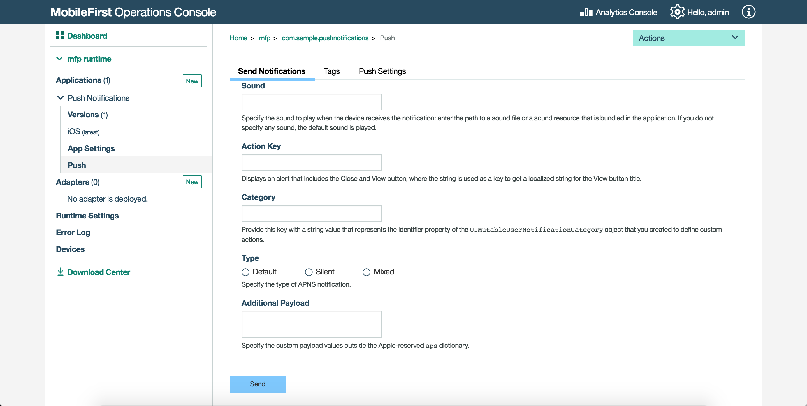

<!-- NLS_CHARSET=UTF-8 -->
## Overview
Silent notifications are notifications that do not display alerts or otherwise disturb the user. When a silent notification arrives, the application handing code runs in background without bringing the application to foreground. Currently, the silent notifications are supported on iOS devices with version 7 onwards. If the silent notification is sent to iOS devices with version lesser than 7, the notification is ignored if the application is running in background. If the application is running in the foreground, then the notification callback method is invoked.

## Sending silent push notification
Prepare the notification and send notification. For more information, see [Sending push notifications](../../sending-notifications).

The three types of notifications that are supported for iOS are represented by constants `DEFAULT`, `SILENT`, and `MIXED`. When the type is not explicitly specified, the `DEFAULT` type is assumed.

For `MIXED` type notifications, a message is displayed on the device while, in the background, the app awakens and processes a silent notification. The callback method for `MIXED` type notifications gets called twice - once when the silent notification reaches the device and once when the application is opened by tapping on the notification.

Based on the requirement choose the appropriate type under **{{ site.data.keys.mf_console }} → [your application] → Push → Send Notifications → iOS custom settings**. 

> **Note:** If the notification is silent, the **alert**, **sound**, and **badge** properties are ignored.



## Handling silent push notifications in Cordova application
In the JavaScript push notification callback method, you must do the following steps:

1. Check the notification type. For example:

   ```javascript
   if(props['content-available'] == 1) {
        //Silent Notification or Mixed Notification. Perform non-GUI tasks here.
   } else {
        //Normal notification
   }
   ```

2. If the notification is silent or mixed, after you complete the background job, invoke `WL.Client.Push.backgroundJobDone` API.

## Handling silent push notifications in native iOS application
You must follow these steps to receive silent notifications:

1. Enable the application capability to perform background tasks on receiving the remote notifications.
2. Check whether the notification is silent or not by checking that the `content-available` key is set to **1**.
3. After you finish processing the notification, you must call the block in the handler parameter immediately, otherwise  your app will be terminated. Your app has up to 30 seconds to process the notification and call the specified completion handler block.
