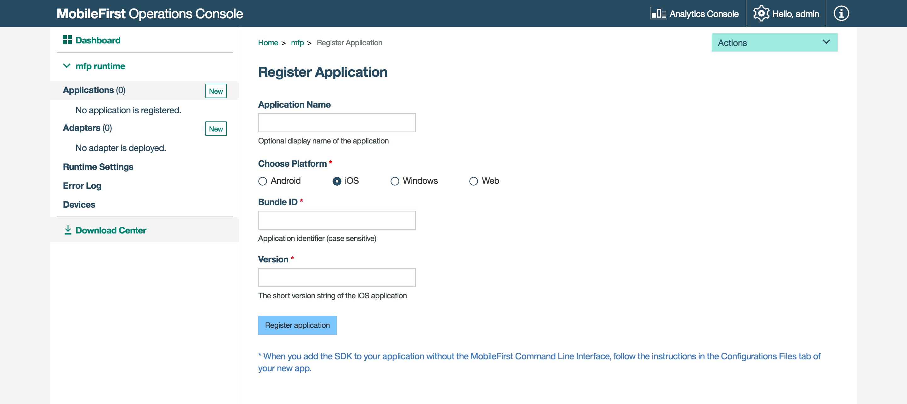
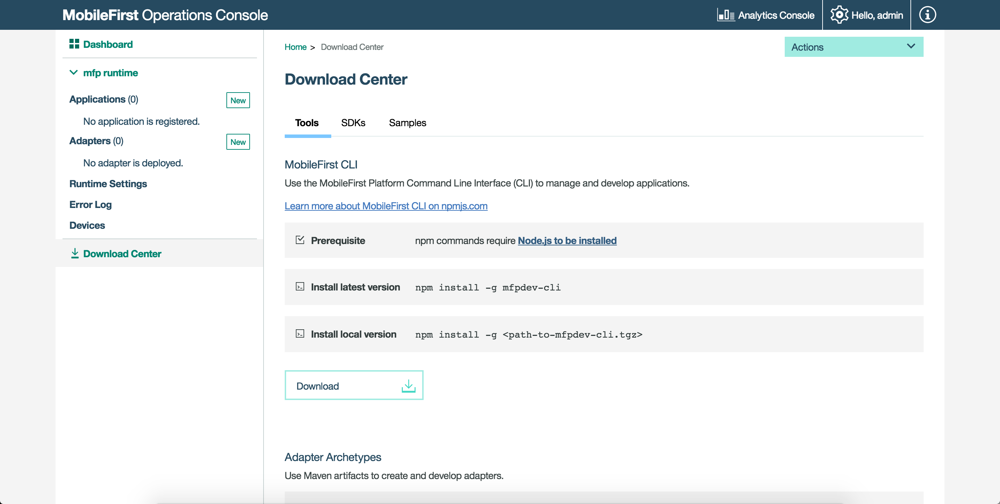

<!-- NLS_CHARSET=UTF-8 -->
## Overview
{: #overview }
The {{ site.data.keys.mf_console_full }} is a web-based UI which enables simplified work flows for both the developer and the administrator to create, monitor, secure and administer applications &amp; adapters.

#### As a developer
{: #as-a-developer }
* Develop applications for any environment and register them to {{ site.data.keys.mf_server }}.
* See all your deployed applications and adapters at a glance. See the Dashboard.
* Manage and configure registered applications, including Direct Update, remote disablement, and security parameters for application authenticity and user authentication.
* Set up push notification by deploying certificates, creating notification tags, and sending notification.
* Create and deploy adapters.
* Download samples.

#### As an IT administrator
{: #as-an-it-administrator }
* Monitor various services.
* Search for devices that access {{ site.data.keys.mf_server }} and manage their access rights.
* Update adapter configurations dynamically.
* Adjust client logger configurations through log profiles.
* Track how product licenses are used.

#### Jump to:
{: #jump-to }
* [Accessing the console](#accessing-the-console)
* [Navigating the console](#navigating-the-console)

## Accessing the console
{: #accessing-the-console }
The {{ site.data.keys.mf_console }} can be accessed in the following ways:

### From a locally installed {{ site.data.keys.mf_server }}
{: #from-a-locally-installed-mobilefirst-server }
#### Desktop Browser
{: #desktop-browser }
From your browser of choice, load the URL [http://localhost:9080/mfpconsole](http://localhost:9080/mfpconsole). The username/password are *admin/admin*.

#### Command-line
{: #command-line }
From a **Command-line** window, with the {{ site.data.keys.mf_cli }} installed, run the command: `mfpdev server console`.

### From a remotely installed {{ site.data.keys.mf_server }}
{: #from-a-remotely-installed-mobilefirst-server }
#### Desktop Browser
{: #desktop-browser-remote }
From your browser of choice, load the URL `http://the-server-host:server-port-number/mfpconsole`.  
The host server can be either a customer-owned server, or the IBM Bluemix service, IBM [Mobile Foundation](../../../bluemix/).

#### Command-line
{: #command-line-remote }
From a **Command-line** window, with the {{ site.data.keys.mf_cli }} installed, 

1. Add a remote server definition:

    *Interactive Mode*  
    Run the command: `mfpdev server add` and follow the on-screen instructions.

    *Direct Mode*  
    Run the command with the following structure: `mfpdev server add [server-name] --URL [remote-server-URL] --login [admin-username] --password [admin-password] --contextroot [admin-service-name]`. For example:

   ```bash
   mfpdev server add MyRemoteServer http://my-remote-host:9080/ --login TheAdmin --password ThePassword --contextroot mfpadmin
   ```

2. Run the command: `mfpdev server console MyRemoteServer`.

> Learn more about the various CLI commands in the [Using CLI to manage {{ site.data.keys.product_adj }} artifacts](../../../application-development/using-mobilefirst-cli-to-manage-mobilefirst-artifacts/) tutorial.

## Navigating the console
{: #navigating-the-console }
### Dashboard
{: #dashboard }
The Dashboard provides a glance view of the deployed projects.


#### Actions dropdown
{: #actions-dropdown }
The dropdown provides quick access to various console actions.


### Runtime settings
{: #runtime-settings }
Edit runtime properties, global security variables, server keystore and confidential clients.


### Error log
{: #error-log }
The Error log shows a list of the failed management operations that were initiated from the {{ site.data.keys.mf_console }}, or from the command line, on the current runtime environment. Use the log to see the effect of the failure on the servers.

> For more information, see the topic about error log of operations on runtime environments in the user documentation.


### Devices
{: #devices }
Administrators can search for devices that access the {{ site.data.keys.mf_server }} and can manage access rights.  
Devices can be searched for using either user ID or using a friendly name. The user ID is the identifier that was used to log-in.  
A friendly name is a name that is associated with the device to distinguish it from other devices that share the user ID. 

> For more information, see the topic about device access management in the user documentation.


### Applications
{: #applications }
#### Registering applications
{: #registering-applications }
Provide basic application values and download Starter Code. 



#### Managing applications
{: #managing-applications }
Manage and configure registered applications by use of [Direct Update](../../../application-development/direct-update/), Remote Disable, [Application Authenticity](../../../authentication-and-security/application-authenticity/), and [setting security parameters](../../../authentication-and-security/).


#### Authentication and Security
{: #authentication-and-security }
Configure application security parameters, such as the default token expiration value, map scope elements to security checks, define mandatory application scopes, and configure security-check options.

> [Learn more](../../../authentication-and-security/) about the {{ site.data.keys.product_adj }} security framework.


#### Application Settings
{: #application-settings }
Configure the display name of the application in the console as well as the application type and licensing.


#### Notifications
{: #notifications }
Set-up [push notifications](../../../notifications/) and related parameters, such as certificates and GCM details, define tags, as well as send notifications to devices.


### Adapters
{: #adapters }
#### Creating adapters
{: #creating-adapters }
[Register an adapter](../../../adapters/) and download Starter Code, as well as update an adapter on-the-fly by updating its properties without needing to re-build and re-deploy the adapter artifact.


#### Adapter properties
{: #adapter-properties }
After an adapter is deployed, it can be configured in the console.


### Client logs
{: #client-logs }
Administrators can use log profiles to adjust client logger configurations, such as log level and log package filters, for any combination of operating system, operating system version, application, application version, and device model.

When an administrator creates a configuration profile, the log configuration is concatenated with responses API calls such as `WLResourceRequest`, and is applied automatically.

> For more information, see the topic about client-side log capture configuration in the user documentation.


### License tracking
{: #license-tracking }
Accessible from the top Settings buttons.

License terms vary depending on which edition (Enterprise or Consumer) of {{ site.data.keys.product }} is being used.   License tracking is enabled by default and tracks metrics relevant to the licensing policy, such as active client devices and installed applications. This information helps determine whether the current usage of {{ site.data.keys.product }} is within the license entitlement levels and can prevent potential license violations.

By tracking the usage of client devices and determining whether the devices are active, administrators can decommission devices that should no longer be accessing the service. This situation might arise if an employee has left the company, for example.

> For more information, see the topic about license tracking in the user documentation.


### Downloads
{: #downloads }
For situtations where Internet connectivity is not available, you can download a snapshot of the various development artifacts of {{ site.data.keys.product }} from the Download Center in the {{ site.data.keys.mf_console }}.



