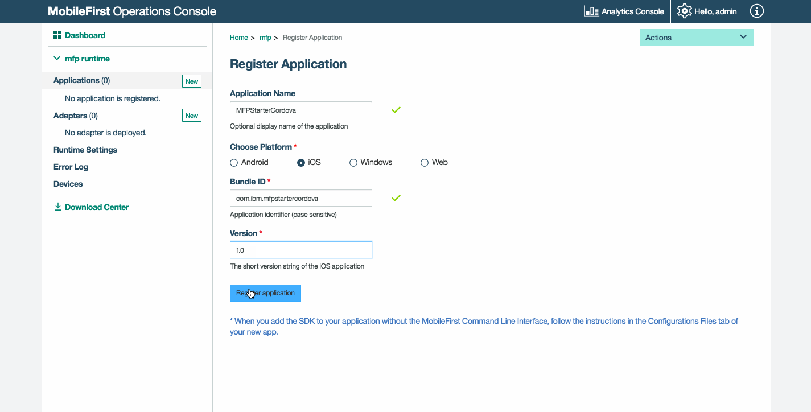
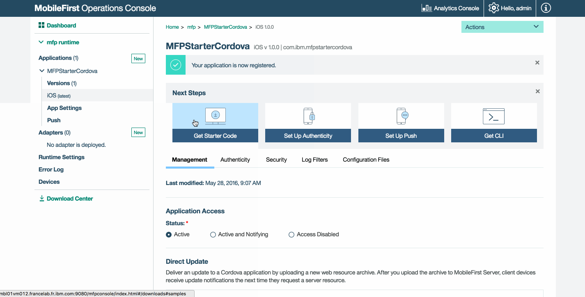

## Overview
The purpose of this demonstration is to experience an end-to-end flow where an application and an adapter are registered using the MobileFirst Operations Console, an "skeleton" Cordova project is downloaded and edited to call the adapter, and the result is displayed - verifying a successful connection with the MobileFirst Server.

#### Prerequisites:

* Xcode for iOS, Android Studio for Android or Visual Studio 2013/2015 for Windows 8.1 Universal / Windows 10 UWP
* MobileFirst Developer CLI ([download]({{site.baseurl}}/downloads))
* Cordova 6.0 CLI
* *Optional*. Stand-alone MobileFirst Server ([download]({{site.baseurl}}/downloads))

### 1. Starting the MobileFirst Server

> If a remote server was already set-up, skip this step.

From a **Command-line** window, navigate to the server's folder and run the command: `./run.sh` in Mac and Linux or `run.cmd` in Windows.

### 2. Creating an application

In a browser window, open the MobileFirst Operations Console by loading the URL: `http://your-server-host:server-port/mfpconsole`. If running locally, use: [http://localhost:9080/mfpconsole](http://localhost:9080/mfpconsole). The username/password are *admin/admin*.
 
1. Click on the "New" button next to **Applications**
    * Select a platform: **Android, iOS, Windows**
    * Enter **com.ibm.sample** as the **application identifier**
    * Enter **1.0.0** as the **version** value

    
 
2. Click on the **Get Starter Code** tile and select to download the Cordova mobile app scaffold.

    
 
### 3. Editing application logic

1. Open the Cordova project in your code editor of choice.

2. Select the **www/js/index.js** file and paste the following code snippet, replacing the existing `WLAuthorizationManager.obtainAccessToken()` function:

    ```javascript
    WLAuthorizationManager.obtainAccessToken()
    .then (
        function(accessToken) {
            var statusText = document.getElementById("statusText");
            statusText.innerHTML = "Obtained Access Token Successfully";
          
            var resourceRequest = new WLResourceRequest(
                "/adapters/javaAdapter/users/world",
                WLResourceRequest.GET
            );

            resourceRequest.send().then(
                function(response) {
                    // Will display "Hello world" in an alert dialog.
                    alert("Success: " + response.responseText);
                },
                function(response) {
                    alert ("Failure: " + response.errorMsg);
                }
            );
        },
        
        function(error) {
            var statusText = document.getElementById("statusText");
            statusText.innerHTML = "Failed to obtain access token: " + JSON.stringify(error);
        }
    );
    ```
    
### 4. Creating an adapter
Click on the "New" button next to **Adapters**
        
1. Select the **Actions → Download sample** option. Download the "Hello World" **Java** adapter sample.

    > If Maven and MobileFirst Developer CLI are not installed, follow the on-screen **Set up your development environment** instructions.

2. From a **Command-line** window, navigate to the adapter's Maven project root folder and run the command:

    ```bash
    mfpdev adapter build
    ```

3. When the build finishes, deploy it from the MobileFirst Operations Console using the **Actions → Deploy adapter** action. The adapter can be found in the **[adapter]/target** folder.

* Alternatively, download [this prepared .adapter artifact](../javaAdapter.adapter) and deploy it from the MobileFirst Operations Console using the **Actions → Deploy adapter** action.
    
    


### 5. Testing the application

1. In the Cordova project, select the **config.xml** file and edit the  
`<mfp:server ... url=" "/>` value with the IP address of the MobileFirst Server.

2. From a **Command-line** window, navigate to the Cordova project folder.

3. Run the command: `cordova platform add ios/android/windows` to add a platform.

4. Run the command: `cordova run`.

If a device is connected, the application will be installed and launched in the device,  
Otherwise the Simulator or Emulator will be used.

#### Results
* Clicking on the **Test Server Connection** button will display **Obtained Access Token Successfully**.
* If the application was able to connect to the MobileFirst Server, a resource request call using the Java adapter will take place.

The adapter response is then displayed in an alert.

## Next steps
Learn more on using adapters in applications, and how to integrate additional services such as Push Notifications, using the MobileFirst security framework and more:

- Review the [Using the MobileFirst Platform Foundation](../../using-the-mfpf-sdk/) tutorials
- Review the [Adapters development](../../adapters/) tutorials
- Review the [Authentication and security tutorials](../../authentication-and-security/)
- Review the [Notifications tutorials](../../notifications/)
- Review [All Tutorials](../../all-tutorials)
