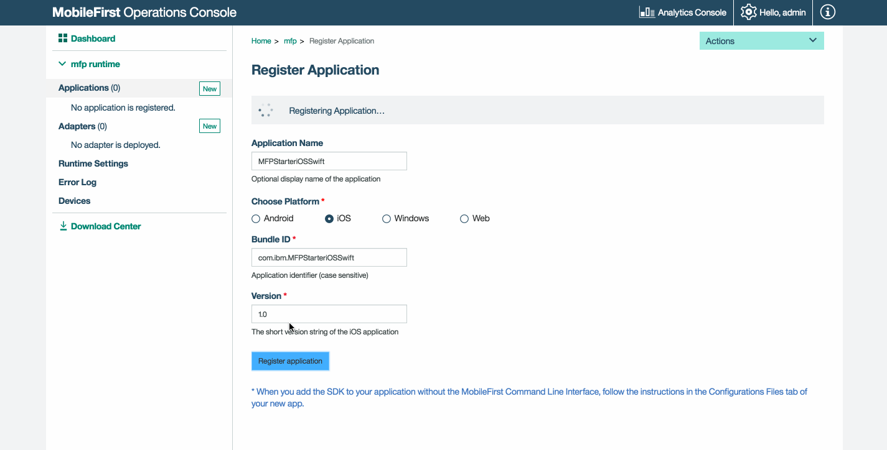
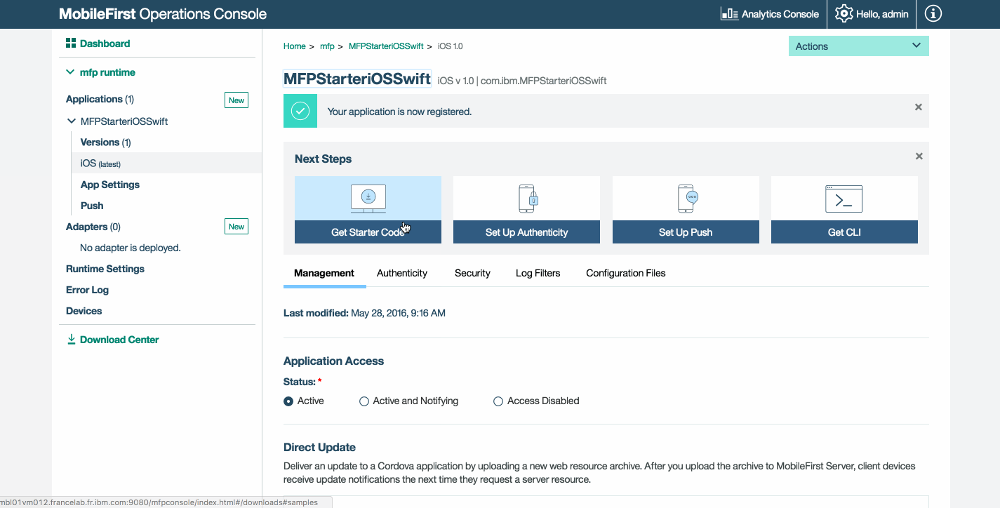

## Overview
The purpose of this demonstration is to experience an end-to-end flow where an application and an adapter are registered using the MobileFirst Operations Console, an "skeleton" Xcode project is downloaded and edited to call the adapter, and the result is printed to the log - verifying a successful connection with the MobileFirst Server.

#### Prerequisites:

* Xcode
* MobileFirst Developer CLI ([download]({{site.baseurl}}/downloads))
* *Optional*. Stand-alone MobileFirst Server ([download]({{site.baseurl}}/downloads))

### 1. Starting the MobileFirst Server

> If a remote server was already set-up, skip this step.

From a **Command-line** window, navigate to the server's **scripts** folder and run the command: `./start.sh`.

### 2. Creating an application

In a browser window, open the MobileFirst Operations Console by loading the URL: `http://your-server-host:server-port/mfpconsole`. If running locally, use: [http://localhost:9080/mfpconsole](http://localhost:9080/mfpconsole). The username/password are *admin/admin*.
 
1. Click on the "New" button next to **Applications** and select the desired *platform*, *identifier* and *version* values.

    
 
2. Click on the **Get Starter Code** tile and select to download the iOS Starter Code.

    
    
### 3. Editing application logic

1. Open the Xcode project project by double-clicking the **.xcworkspace** file.

2. Select the **[project-root]/ViewController.m/swift** file and paste the following code snippet, replacing the existing `viewDidLoad()` function:
 
    In Objective-C:

    ```objc
    - (void)viewDidLoad {
        [super viewDidLoad];
        
        NSURL* url = [NSURL URLWithString:@"/adapters/javaAdapter/users/world"];
        WLResourceRequest* request = [WLResourceRequest requestWithURL:url method:WLHttpMethodGet];
         
        [request sendWithCompletionHandler:^(WLResponse *response, NSError *error) {
            if (error != nil){
                 NSLog(@"Failure: %@",error.description);
            }
            else if (response != nill){
                // Will print "Hello world" in the Xcode Console.
                NSLog(@"Success: %@",response.responseText);
            }
        }];
    }
    ```
    
    In Swift:
    
    ```swift
    override func viewDidLoad() {
        super.viewDidLoad()
    
        let url = NSURL(string: "/adapters/javaAdapter/users/world")
        let request = WLResourceRequest(URL: url, method: WLHttpMethodGet)
        
        request.sendWithCompletionHandler { (WLResponse response, NSError error) -> Void in
            if (error != nil){
                NSLog("Failure: " + error.description)
            }
            else if (response != nil){
                NSLog("Success: " + response.responseText)
            }
        }
    }
    ```

### 4. Creating an adapter

1. Click on the "New" button next to **Adapters**
    * Select the **Actions → Download sample** option. Download the **Java** adapter sample.
        
        > If Maven and MobileFirst CLI are not installed, follow the on-screen **Setting up your environment** instructions to install.  
    * From a **Command-line** window, navigate to the adapter's Maven project root folder and run the command: 

        ```bash
        mfpdev adapter build
        ```
    * When the build finishes, deploy it from the MobileFirst Operations Console using the **Actions → Deploy adapter** action. The adapter can be found in the **[adapter]/target** folder.
    * Alternatively, download [this prepared .adapter artifact](#) and deploy it from the MobileFirst Operations Console using the **Actions → Deploy adapter** action.
    
    


### 5. Testing the application

1. In Xcode, select the **mfpclient.plist** file and edit the **host** property with the IP address of the MobileFirst Server.

2. Press the **Play** button.

The adapter response is then printed in the Xcode Console.


> **Note:** Xcode 7 enables [Application Transport Security (ATS)](https://developer.apple.com/library/ios/releasenotes/General/WhatsNewIniOS/Articles/iOS9.html#//apple_ref/doc/uid/TP40016198-SW14) by default.  
To complete the tutorial, [disable  ATS](http://iosdevtips.co/post/121756573323/ios-9-xcode-7-http-connect-server-error).

> 1. In Xcode, right-click the **[project]/info.plist file → Open As → Source Code**
> 2. Paste the following: 

>    
    ```xml
    <key>NSAppTransportSecurity</key>
    <dict>
        <key>NSAllowsArbitraryLoads</key>
        <true/>
    </dict>
    ```

> 3. Press the **Play** button.

## Next steps
Learn more on using adapters in applications, and how to integrate additional services such as Push Notifications, using the MobileFirst security framework and more:

- Review the [Server-side development tutorials](../../adapters/)
- Review the [Authentication and security tutorials](../../authentication-and-security/)
- Review the [Notifications tutorials](../../notifications/)
- Review [All Tutorials](../../all-tutorials)
