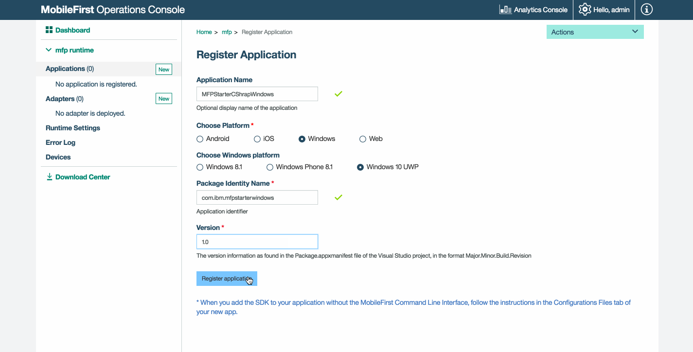
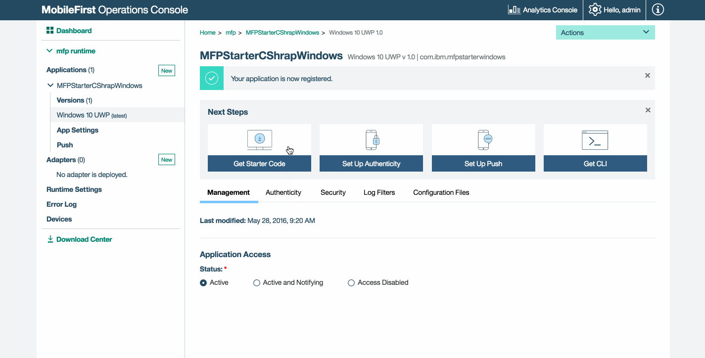

## Overview
The purpose of this demonstration is to experience an end-to-end flow where an application and an adapter are registered using the MobileFirst Operations Console, an "skeleton" Visual Studio project is downloaded and edited to call the adapter, and the result is printed to the log - verifying a successful connection with the MobileFirst Server.

#### Prerequisites:

* Configured Visual Studio 2013/5
* MobileFirst Developer CLI ([download]({{site.baseurl}}/downloads))
* *Optional*. Stand-alone MobileFirst Server ([download]({{site.baseurl}}/downloads))

### 1. Starting the MobileFirst Server

> If a remote server was already set-up, skip this step.

From a **Command-line** window, navigate to the server's folder and run the command: `run.bat`.

### 2. Creating an application

In a browser window, open the MobileFirst Operations Console by loading the URL: `http://your-server-host:server-port/mfpconsole`. If running locally, use: [http://localhost:9080/mfpconsole](http://localhost:9080/mfpconsole). The username/password are *admin/admin*.

1. Click on the "New" button next to **Applications**
    * Select a **Windows** platform
    * Enter **com.ibm.sample** as the **application identifier**
    * Enter **1.0** as the **version** value

    

2. Click on the **Get Starter Code** tile and select to download the Windows 8.1 or Windows 10 mobile app scaffold.

    

### 3. Editing application logic

1. Open the Visual Studio project.

2. Select the solution's **MainPage.xaml.cs** file and paste the following code snippet:

    ```csharp
    IWorklightClient _newClient = WorklightClient.CreateInstance();

    StringBuilder uriBuilder = new StringBuilder().Append("/adapters/javaAdapter/users/world");    

    WorklightResourceRequest rr = _newClient.ResourceRequest(uriBuilder.ToString(), "GET");

    WorklightResponse resp= return Task.Run<WorklightResponse> (() => {
       rr.send();
    });

    if (resp.success) {
      Debug.WriteLine("Success: " + resp.ResponseText);
    } else {
      Debug.WriteLine("Failure: " + resp.error);  
    }
    ```

### 4. Creating an adapter

1. Click on the "New" button next to **Adapters**
    * Select the **Actions → Download sample** option. Download the **Java** adapter sample.

        > If Maven and MobileFirst CLI are not installed, follow the on-screen **Setting up your environment** instructions to install.  
    * From a **Command-line** window, navigate to the adapter's Maven project root folder and run the command:

        ```bash
        mfpdev adapter build
        ```
    * When the build finishes, deploy it from the MobileFirst Operations Console using the **Actions → Deploy adapter** action. The adapter can be found in the **[adapter]/target** folder.
    * Alternatively, download [this prepared .adapter artifact](#) and deploy it from the MobileFirst Operations Console using the **Actions → Deploy adapter** action.

    

### 5. Testing the application

1. In Visual Studio, select the **mfpclient.resw** file and edit the **host** property with the IP address of the MobileFirst Server.

2. Press the **Run App** button.

The adapter response is then printed in the Visual Studio Output Console.


## Next steps
Learn more on using adapters in applications, and how to integrate additional services such as Push Notifications, using the MobileFirst security framework and more:

- Review the [Server-side development tutorials](../../adapters/)
- Review the [Authentication and security tutorials](../../authentication-and-security/)
- Review the [Notifications tutorials](../../notifications/)
- Review [All Tutorials](../../all-tutorials)
