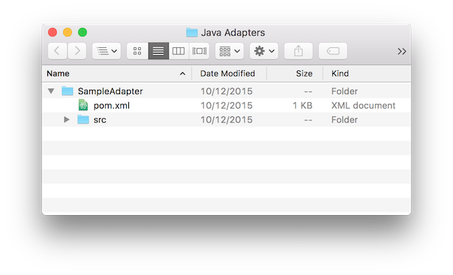

### Overview
This tutorial demonstrates how to create either Java or JavaScript adapter using the Maven Archetype "adapter-maven-archetype".
The "adapter-maven-archetype" is based on the [Maven archetype toolkit](https://maven.apache.org/guides/introduction/introduction-to-archetypes.html) in order to create the adapter as a Maven project.

**Prerequisite:**  Make sure that you read the [Adapters Overview](../adapters-overview) tutorial first.</span>

### Using Maven Archetype "adapter-maven-archetype"
The "adapter-maven-archetype" is based on the [Maven archetype toolkit](https://maven.apache.org/guides/introduction/introduction-to-archetypes.html) in order to create the adapter as a Maven project.

</br>
#### Install Maven
In order to create an adapter, you first need to download and install Maven. Go to the [Apache Maven website](https://maven.apache.org/) and follow the instructions how to download and install Maven.

</br>
#### Creating an Adapter
To create an adapter Maven project, use the `archetype:generate` command.
You can choose to run the command interactively or directly.

**In Interactive Mode**

1. Run:

    ```shell
    mvn archetype:generate -DarchetypeGroupId=com.ibm.mfp -DarchetypeArtifactId=<adapter type artifact ID> -DarchetypeVersion=8.0.0
    ```
  * The `Archetype Group Id` and Archetype Version are required parameters to identify the archetype.
  * The `Archetype Artifact Id` is a required parameter to identify the adapter type:
     * Use `adapter-maven-archetype-java` to crate a Java adapter
     * Use `adapter-maven-archetype-http` to create a JavaScript HTTP adapter
     * Use `adapter-maven-archetype-sql` to create a JavaScript SQL adapter  

2. Enter the Group Id of the Maven project to be build:

    ```shell
    Define value for property 'groupId': : sample.group.id
    ```

3. Enter the Artifact Id of the Maven project **which will later be used also as the adapter name**:

    ```shell
    Define value for property 'artifactId': : SampleAdapter
    ```

4. Enter the Maven project version (the default is `1.0-SNAPSHOT`):

    ```shell
    Define value for property 'version':  1.0-SNAPSHOT: : 1.0
    ```

5. Enter the Java adapter package name (the default is the `groupId`):

    ```shell
    Define value for property 'package':  sample.group.id: : com.sample.adapter
    ```

6. Enter `y` to confirm:

    ```shell
    [INFO] Using property: archetypeVersion = 7.2.0.0
    Confirm properties configuration:
    groupId: sample.group.id
    artifactId: Sample
    version: 1.0
    package: com.sample.adapter
    adapter-name: TestAdapter
    archetypeVersion: 7.2.0.0
     Y: : y
    ```
<br/>

**In Direct Mode**

Replace the placeholders with the actual values and run:

```shell
mvn archetype:generate -DarchetypeGroupId=com.ibm.mfp -DarchetypeArtifactId=<adapter type artifact ID> -DarchetypeVersion=8.0.0 -DgroupId=<maven_project_groupid> -DartifactId=<maven_project_artifactid> -Dversion=<maven_project_version> -Dpackage=<java_adapter_package_name>
```

<br/>

>For more information about the `archetype:generate` command see the Maven documentation.

After creating the adapter the result will be a Maven project containing a `src` folder and a `pom.xml` file:



#### Building and Deploying Java Adapters
**Build**

The adapter will be built every time you run the `mvn install` command to build your Maven project.  
The end result is the `.adapter` file in the project `target` folder:


**Deploy**

1. Edit the `pom.xml` file with the following `properties` parameters:

      ```xml
      ...
      <properties>
    		<!-- parameters for deploy mfpf adapter -->
    		<mfpfUrl>http://localhost:9080/mfpadmin</mfpfUrl>
    		<mfpfUser>demo</mfpfUser>
    		<mfpfPassword>demo</mfpfPassword>
    	</properties>
      ```
   * Replace the `IP` and `PORT` with the MobileFirst Server IP and port.
   * Replace the `mfpfUser` and `mfpfPassword` with the MobileFirst admin user name and password.  
2. Open the project's root folder in terminal and run the `mvn:adapter` command:

      ```shell
      mvn adapter:deploy
      ```
**NOTE:** The deploy command is available only during development (for security reasons).

</br>
#### Dependencies
In order to use an external library in your adapter, follow these suggested instructions:

1. Add a `lib` folder under the root Maven project folder and put the external library in it.
2. Add the library path under the `dependencies` element in the Maven project `pom.xml` file.  
For example:

    ```xml
    <dependency>
        <groupId>sample</groupId>
        <artifactId>com.sample</artifactId>
        <version>1.0</version>
        <scope>system</scope>
        <systemPath>${project.basedir}/lib/</systemPath>
    </dependency>
    ```

</br>
> For more information about `dependencies` see the Maven documentation.

</br>
#### Grouping Adapters in a Single Maven Project


* **Using the MobileFirst Operations Console:**
  1. Open your browser of choice and load the MobileFirst Operations Console using the address `http://<IP>:<PORT>/mfpconsole/`.  
  2. Drag and drop the `.adapter` file from the target folder into the Console.

* **Using the MobileFirst CLI:**
  1.
