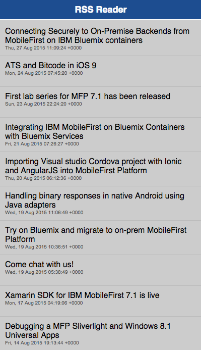

<span style = "color:red">RENAMING</span>

### Overview
MobileFirst applications can access resources using the `WLResourceRequest` REST API.  
The REST API works with all adapters and external resources <span style = "color:red"> LINK TO using-mobilefirst-server-authenticate-external-resources</span>, and is supported in the following hybrid environments: iOS, Android, Windows Phone 8, and  Windows 8.

<span style = "color:red">If your application supports other hybrid environments such as BlackBerry, Mobile Web, or Desktop Browser, see the tutorial for <a href="{{site.baseurl}}/tutorials/en/foundation/6.3/server-side-development/invoking-adapter-procedures-hybrid-client-applications/">IBM MobileFirst Platform Foundation 6.3</a>. </span>

This tutorial explains how to use the `WLResourceRequest` API with an HTTP adapter.

### WLResourceRequest
The `WLResourceRequest` class handles resource requests to MobileFirst adapters or external resources.

```js
var resourceRequest = new WLResourceRequest(
    "/adapters/RSSReader/getFeedFiltered",
    WLResourceRequest.GET
);
```
The parameters for the constructor are:

* **request URL**:
 * For JavaScript adapters, the URL should be `/adapters/{AdapterName}/{procedureName}`
 * For Java adapters, the URL should be `/adapters/{AdapterName}/{path}`
 * To access resources outside of the project, use the full URL
* **HTTP method**: Most commonly `WLResourceRequest.GET` or `WLResourceRequest.POST`
* **timeout**: Optional, request timeout in milliseconds</br></br>

#### setQueryParameter
By using the `setQueryParameter` method, you can include query (URL) parameters in the REST request.

* In JavaScript adapters, which use ordered nameless parameters, pass an array of parameters with the name `params`:

    ```js
    resourceRequest.setQueryParameter("params", "['MobileFirst_Platform']");
    ```
* In Java adapters or external resources, use `setQueryParameter` for each parameter:

    ```js
    resourceRequest.setQueryParameter("param1", "value1");
    resourceRequest.setQueryParameter("param2", "value2");
    ```
</br>

#### send(body)
The `send()` method triggers the request. It takes an optional parameter to set a body to the HTTP request, which could be a JSON object or a simple string.

```js
resourceRequest.send().then(
    onSuccess,
    onFailure
)
```
Using JavaScript promises, you can define `onSuccess` and `onFailure` functions.
</br></br>

#### sendFormParameters(json)
To send URL-encoded form parameters, use the `sendFormParameters(json)` method instead. This method converts the JSON to a URL encoded string, sets the content-type to `application/x-www-form-urlencoded`, and sets it as the HTTP body.

>For more information about `WLResourceRequest`, see the API reference in the user documentation.

### Results
Both the `onSuccess` and `onFailure` callbacks receive a `response` object, which typically contains the following properties:

* **`status`**: The HTTP response status
* **`responseJSON`**: An object that contains the data that is returned by the invoked procedure, and additional information about the procedure invocation

The `response` object is returned to the corresponding success/failure handler.

<span style = "color:red">highlight="2,3,4,5,13"</span>

```json
{
  "errors": [],
  "info": [],
  "warnings": [],
  "isSuccessful": true,
  "responseHeaders": {
    "Cache-Control": "no-cache, must-revalidate, post-check=0, pre-check=0"
  },
  "responseTime": 491,
  "statusCode": 200,
  "statusReason": "OK",
  "totalTime": 592,
  "Items": [{
    "creator": "Jon Fingas",
    "link": "http:\/\/www.engadget.com\/2014\/11\/10\/harvard-used-cameras-to-check-attendance\/?ncid=rss_truncated",
    "pubDate": "Mon, 10 Nov 2014 02:21:00 -0500",
    "title": "Harvard used cameras to track attendance without telling students"
  }, {
    "creator": "Jon Fingas",
    "link": "http:\/\/www.engadget.com\/2014\/11\/10\/bmw-ev-charging-street-lights\/?ncid=rss_truncated",
    "pubDate": "Mon, 10 Nov 2014 00:10:00 -0500",
    "title": "BMW's new street lights will charge your electric car"
  }, {
    "creator": "Daniel Cooper",
    "link": "http:\/\/www.engadget.com\/2014\/11\/09\/hwyc-lumia-925\/?ncid=rss_truncated",
    "pubDate": "Sun, 09 Nov 2014 22:43:00 -0500",
    "title": "How would you change Nokia's Lumia 925?"
  }]
}
```

* `errors`, `info`, and `warnings` are optional arrays of strings that contain messages.
* The `isSuccessful` property is set to `true` if the procedure invocation succeeded (even if no data was retrieved), or to `false` otherwise.
* The response can contain other metadata such as `responseHeaders`, `responseTime`, `statusCode`, `statusReason`, and `totalTime`.

#### Handling the result
The rest of the invocation result depends on what was retrieved from the back-end system. In this example, the `Items` element is a JSON representation of the XML code that was received from the back end, after the rules in the XSL file were applied.

```js
function loadFeedsSuccess(result){
    WL.Logger.debug("Feed retrieve success");
    if (result.responseJSON.Items.length > 0)
        displayFeeds(result.responseJSON.Items);
}
```

### Sample application
[Click to download](https://github.com/MobileFirst-Platform-Developer-Center/InvokingAdapterProcedures) the MobileFirst project.

The sample uses the JavaScript HTTP adapter created in the [HTTP Adapter tutorial.](../creating-adapters/javascript-adapters/js-http-adapter)


