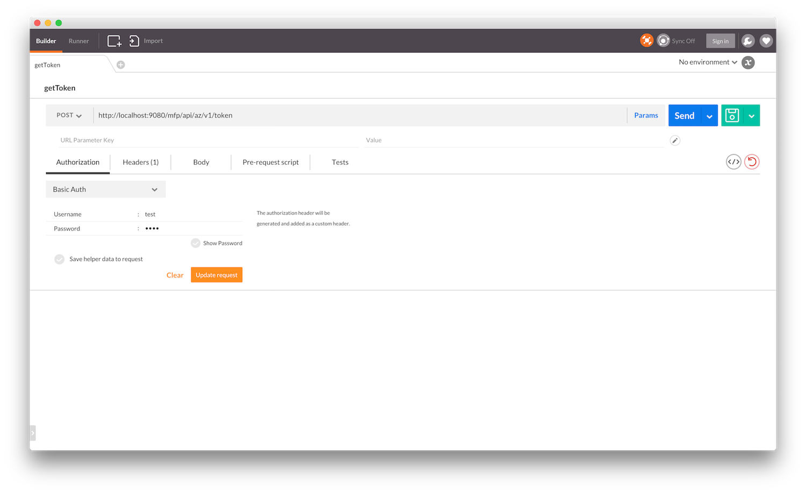
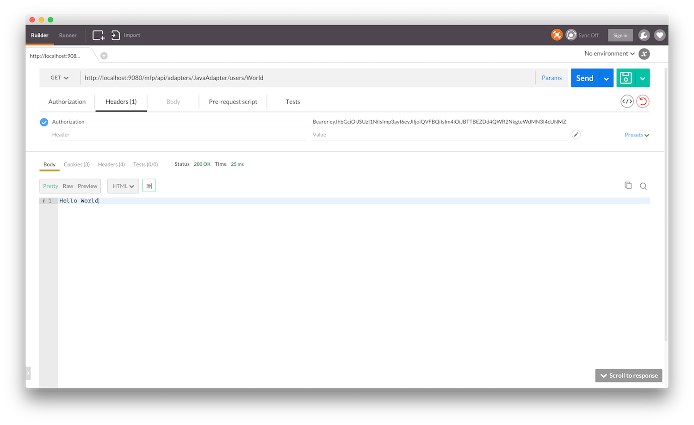
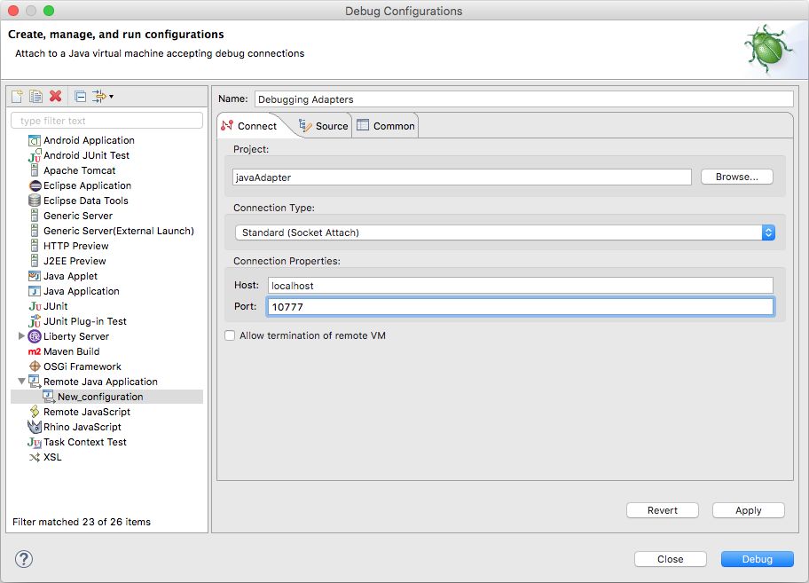
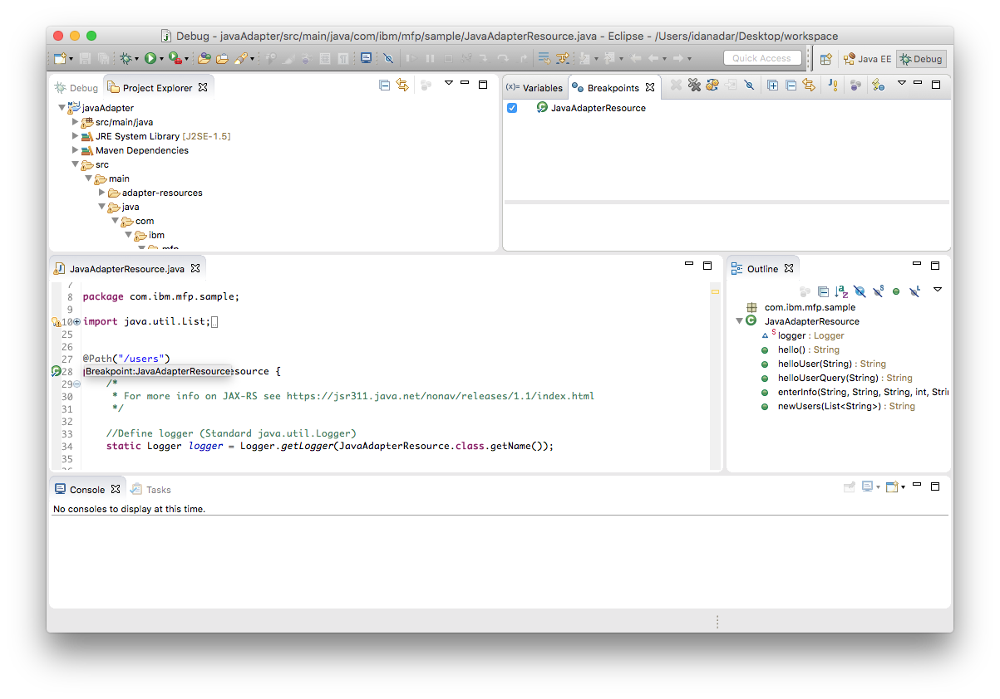

## Overview

You can test Java and JavaScript adapters as well as debug Java code implemented for use in Java or JavaScript adapters via IDEs such as Eclipse, IntelliJ and alike.  
This tutorial demonstrates how to test adapters using the MobileFirst Developer CLI and using Postman and also how to debug a Java adapter using the Eclipse IDE.

#### Jump to:

* [Testing Adapters](#testing-adapters)
* [Debugging Adapters](#debugging-adapters)

## Testing Adapters
MobileFirst adapters are available via a REST interface. This means that if you know the URL of a resource, you can use HTTP tools such as Postman to test requests and pass `URL` parameters, `path` parameters, `body` parameters or `headers` as you see fit.

The structure of the URL used to access the adapter resource is:

* In JavaScript adapters - `http://hostname-or-ip-address:port-number/mfp/api/adapters/{adapter-name}/{procedure-name}`
* In Java adapters - `http://hostname-or-ip-address:port-number/mfp/api/adapters/{adapter-name}/{path}`

### Using Postman

**Passing parameters:**

* When using Java adapters, parameters can be passed in the URL, body, form, etc, depending on how you configured your adapter.
* When using JavaScript adapters, parameters are passed as `params=["param1", "param2"]`. In other words, a JavaScript procedure receives only one parameter called `params` which needs to be an array of ordered, unnamed values. This parameter can either be in the URL (`GET`) or in the body (`POST`) using `Content-Type: application/x-www-form-urlencoded`.

**Handling security:**

If your resource is protected by a scope, the request prompts you to provide a valid authorization header. Note that by default, MobileFirst uses a simple security scope even if you did not specify any. So unless you specifically disabled security, the endpoint is always protected.

To disable security in Java adapters you should attach the `OAuthSecurity` annotation to the method/class:

```java
@OAuthSecurity(enabled=false)
```

To disable security in JavaScript adapters you should add the `secured` attribute to the procedure:

```js
<procedure name="adapter-procedure-name" secured="false"/>
```

Alternatively, the development version of the MobileFirst Server includes a test token endpoint to bypass the security challenges. To receive a Test Token you should:

1. In the MobileFirst Operations Console → **Settings** → **Confidential Clients** tab, create a confidential client or use the default one:  
For testing purposes set **Allowed Scopes** as `**`.

  

2. Use your HTTP client (Postman) to make an HTTP `POST` request to `http://<IP>:<PORT>/mfp/api/az/v1/token` with the following parameters using `Content-Type: application/x-www-form-urlencoded`:

    ```xml
    grant_type : client_credentials
    scope : **
    ```

  
3. Add an `authorization header` using `Basic authentication` with the confidential client's ID (test) and secret (test):  

  


The result will be a JSON object with a temporary valid access token:

```json
{
  "access_token": "eyJhbGciOiJSUzI1NiIsImp3ayI6eyJlIjoiQVFBQiIsIm4iOiJBTTBEZDd4QWR2NkgteWdMN3I4cUNMZEUtM0kya2s0NXpnWnREZF9xczhmdm5ZZmRpcVRTVjRfMnQ2T0dHOENWNUNlNDFQTXBJd21MNDEwWDlJWm52aHhvWWlGY01TYU9lSXFvZS1ySkEwdVp1dzJySGhYWjNXVkNlS2V6UlZjQ09Zc1FOLW1RSzBtZno1XzNvLWV2MFVZd1hrU093QkJsMUVocUl3VkR3T2llZzJKTUdsMEVYc1BaZmtOWkktSFU0b01paS1Uck5MelJXa01tTHZtMDloTDV6b3NVTkExNXZlQ0twaDJXcG1TbTJTNjFuRGhIN2dMRW95bURuVEVqUFk1QW9oMmluSS0zNlJHWVZNVVViTzQ2Q3JOVVl1SW9iT2lYbEx6QklodUlDcGZWZHhUX3g3c3RLWDVDOUJmTVRCNEdrT0hQNWNVdjdOejFkRGhJUHU4Iiwia3R5IjoiUlNBIiwia2lkIjoidGVzdCJ9fQ.eyJpc3MiOiJjb20uaWJtLm1mcCIsInN1YiI6InRlc3QiLCJhdWQiOiJjb20uaWJtLm1mcCIsImV4cCI6MTQ1MjUxNjczODAwNSwic2NvcGUiOiJ4eCJ9.vhjSkv5GShCpcDSu1XCp1FlgSpMHZa-fcJd3iB4JR-xr_3HOK54c36ed_U5s3rvXViao5E4HQUZ7PlEOl23bR0RGT2bMGJHiU7c0lyrMV5YE9FdMxqZ5MKHvRnSOeWlt2Vc2izh0pMMTZd-oL-0w1T8e-F968vycyXeMs4UAbp5Dr2C3DcXCzG_h9jujsNNxgXL5mKJem8EpZPolQ9Rgy2bqt45D06QTW7J9Q9GXKt1XrkZ9bGpL-HgE2ihYeHBygFll80M8O56By5KHwfSvGDJ8BMdasHFfGDRZUtC_yz64mH1lVxz5o0vWqPwEuyfslTNCN-M8c3W9-6fQRjO4bw",
  "token_type": "Bearer",
  "expires_in": 3599,
  "scope": "**"
}
```

Now with any future request to adapter endpoints, add an HTTP header with the name `Authorization` and the value you received previously (starting with Bearer). The security framework will skip any security challenges protecting your resource.



### Using MobileFirst Developer CLI

<span style="color:red"> TBD </span>

## Debugging Adapters
Before an adapter's Java code can be debugged, Eclipse needs to be configured as follows:

1. **Maven integration** - Starting Eclipse Kepler (v4.3), Maven support is built-in in Eclipse.  
If your Eclipse instance does not support Maven, [follow the m2e instructions](http://www.eclipse.org/m2e/) to add Maven support.

2. Once Maven is available in Eclipse, import the adapter Maven project:

    

3. Provide debugging parameters:
    - Click **Run → Debug Configurations**.
    - Double-click on **Remote Java application**.
    - Provide a **Name** for this configuration.
    - Set the **Port** value to "10777".
    - Click **Browse** and select the Maven project.
    - Click **Debug**.

    

4. Click on **Window → Show View → Debug** to enter *debug mode*. You can now debug the Java code normally as you would do a standard Java application. You need to issue a request to the adapter to make its code run and hit any set breakpoints. This can be accomplished by following the instructions on how to call an adapter resource in the [Testing adapters section](../creating-adapters/#testing-adapters).

    
