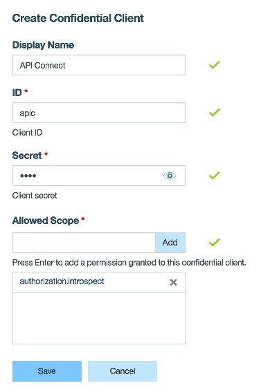
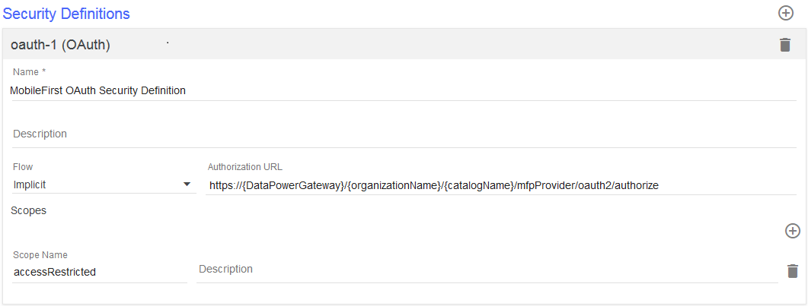
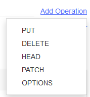
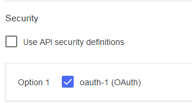

## Overview
IBM API Connect is a  cloud-based API Management solution that allows you to design, control, secure, publish, manage, analyze, and scale your API with its simple-to-use configuration and coding platform.
To learn more about IBM API Connect, visit the [IBM API Connect Developer Center](https://developer.ibm.com/apiconnect/).  

Add IBM MobileFirst Platform Foundation security capabilities to your API Connect API by using the MobileFirst OAuthProvider Swagger template, which adds 2 capabilities:  
 1. Protect API Connect endpoints with the MobileFirst server as the authorization server.  
 2. Proxy MobileFirst client management requests and responses through DataPower to the MobileFirst server that is located behind the DMZ.  

Currently the security integration of MobileFirst and API Connect is supported only when DataPower is used as the Gateway server ("Edge Gateway").  
Note that API Connect supports only HTTPS endpoints. Therefore you must add the relevant certificate to your client application.  

This documentation assumes that the user is familiar with the MobileFirst tutorial and sample that demonstrate basic Android credential validation using the PinCode challenge. Other advanced security checks (such as application authenticity, SMS, or others) can be used instead.  


### Jump to:
* [Prerequisites](#prerequisites)
* [Protect the API Connect endpoint with MobileFirst as an authorization server](#protect-the-api-connect-endpoint-with-mobilefirst-as-an-authorization-server)
  * Import MobileFirst OAuthProvider template
  * Configure MobileFirst OAuthProvider template
  * Get the full URL path of MobileFirst OAuthProvider for /oauth2/authorize
  * Create Simple REST API
  * Protect the API using the MobileFirst OAuth Security Definition
  * Add APIs to the product and publish it
* [Update the sample MobileFirst client application](#update-the-sample-pincodeandroid-mobilefirst-client-application)
  * Update `wlclient.properties`
  * Update the `WLResourceRequest` request
  * Add HTTPS Certificate for the API Connect endpoint
* [Support for multiple MobileFirst OAuthProviders](#support-for-multiple-mobilefirst-oauthproviders)


## Prerequisites
* API Connect DataPower (Edge) version 5040 or later
* A MobileFirst Server  and MobileFirst Operations Console V8 installed locally
* MobileFirst CLI and OpenSSL
* A MobileFirst Android client application   
    * Download the MobileFirst sample **PinCodeAndroid** app and set up the the sample according to the `readme` file:  [PinCodeAndroid sample](https://github.com/MobileFirst-Platform-Developer-Center/PinCodeAndroid/tree/release80).  
    * Follow the challenge handler tutorial to complete the application: 
     [Implementing the challenge handler in Android applications](https://mobilefirstplatform.ibmcloud.com/tutorials/en/foundation/8.0/authentication-and-security/credentials-validation/android/).  


## Protect the API Connect endpoint with MobileFirst as an authorization server

After completing this tutorial and the PinCode sample you will have:  
 1. An Android application with the `PinCodeChallengeHandler` for the  `PinCodeAttempts` security check adapter.  
 2. A `ResourceAdapter` that protects the  `/balance` endpoint with the `accessRestricted` scope.  
 3. A `PinCodeAttempts` security check adapter which is mapped to `Scope Element` of `accessRestricted` for the Android application.  


### Import the MobileFirst OAuthProvider template
From the API Designer, create an OAuthProvider REST API by importing the Swagger template (`mobilefirst-ouath-provider_1.0.0.yaml`). See
[Adding a REST API by using an OpenAPI (Swagger 2.0) file](http://www.ibm.com/support/knowledgecenter/SSMNED_5.0.0/com.ibm.apic.apionprem.doc/create_api_swagger.html).

[js where is the user to find the yaml file? can we put a link here?]

After importing, different configuration options are displayed and the **Design** tab is selected. Go to the **Assemble** tab.


You will see the following components in the assembly flow for the MobileFirst OAuth Provider API:

* MobileFirst Configuration
* gatewayscript
* proxy
* gatewayscript


#### Configure the MobileFirst OAuthProvider template
Using the API Designer, configure the imported API.  
1. From the **Assemble** tab choose the **MobileFirst Configuration** component.  
2. In the **MobileFirst Configuration** component, set the variable policy, and update the following variable values:  
   *  **mfp-oauth-type:** Leave the default value (`true`).  
   * **mfp-server-url:** PROTOCOL://SERVER_HOST:SERVER_PORT. The MobileFirst Server URL. For example `http://myMobileFirstServer:9080`.  Find this value in the `mfpclient.properties` file (`wlServerHost` and `wlServerPort`). The protocol is the `wlServerProtocol` value.  
   * **mfp-server-context:** MobileFirst server context as configured in its `server.xml`. Find this value in the `mfpclient.properties` file (`wlServerContext`).  
   * **mfp-client-id:** As configured in **Runtime Settings** of the MobileFirst Operations Console in **Runtime Settings ->  Confidential Clients** for the `authorization.introspect` scope.  
   * **mfp-client-secret:** As configured in the MobileFirst Operations Console  **Runtime Settings -> Confidential Clients** for the `authorization.introspect` scope.  

To set the **mfp-client-id** and **mfp-client-secret**, in the MobileFirst Operations Console:

1. In the **Runtime Settings** choose the  **Confidential Clients** tab.
2. Click the **New** button.
3. Provide the following values:
  * **Display Name** `API Connect`
  * **ID**: `apic`
  * **Secret**: 1234
  * **Allowed Scope**: `authorization.introspect`




If `mfp-server-url` uses the HTTPS protocol, a TLS profile must be configured in order to establish a secured connection between API Connect and MobileFirst. See [TLS profiles](http://www.ibm.com/support/knowledgecenter/SSMNED_5.0.0/com.ibm.apic.apionprem.doc/task_apionprem_ssl.html).

After adding the TLS Profile, go to the **proxy**  policy component in the **Assemble** tab. Choose the relevant value the **TLS Profile** property.


### Get the full URL path of MobileFirst OAuthProvider for `/oauth2/authorize`
Choose and configure a Catalog, and set the full path.

1. Open the **Dashboard**.
2. Choose a catalog (for example **Sandbox**) for your product.
3. Go to **Settings -> Endpoints** and copy the **Base URL** which has the following format:

  `https://{DataPowerGateway}/{organizationName}/{catalogName}`

1. To determine full URL path of MobileFirst OAuthProvider for /oauth2/authorize, concatenate the `Base URL`,  the **MobileFirst OAuthProvider** value (`/mfpProvider`), and the `/oauth2/authorize` endpoint.

[js what is the **MobileFirst OAuthProvider** mfpProvider value from? I see it is in the Swagger template, but we don't refer to this before]

 The full URL of the of MobileFirst OAuthProvider should look like this:

 `https://{DataPowerGateway}/{organizationName}/{catalogName}/mfpProvider/oauth2/authorize`

### Create a simple REST API to protect with MobileFirst
Create a REST API. See [Creating an invoke REST API definition](http://www.ibm.com/support/knowledgecenter/SSMNED_5.0.0/com.ibm.apic.toolkit.doc/tutorial_apionprem_apiproxy.html ).

### Protect the API using the MobileFirst OAuth Security Definition
Once you have the full URL path of MobileFirst OAuthProvider for `/oauth2/authorize`, go to the **Design** tab in the API Connect Designer.

#### Security Definitions
Create a  **Security Definition**.

1. Choose **Security Definition** from the design list and add click the **+** to add a defintion of type **OAuth**.
    

1. Set the values.

   * **Flow:** Choose **Implicit**.
   * **Authorization URL:** Use the full URL path of MobileFirst OAuthProvider for `/oauth2/authorize`.
   * **Scopes:** `accessRestricted`.

  

#### Add the Security Definition
Add a Security Definition to API path.
  1. Go to the **Paths** section and choose a path.
  [js "choose the path of the API you want to protect?"]
  1. Click **Add Operation** and choose a method and expand it.

  
  1. In the **Security** section uncheck **Use API security definitions**. A list of defined Security Definitions appears. Check the Security Definition you created for MobileFirst.

    

### Add APIs to the product and publish it
1. Create a new product or use existing product. See [Creating a Product in the API Designer](http://www.ibm.com/support/knowledgecenter/SSFS6T/com.ibm.apic.toolkit.doc/tapim_create_product.html).
2. Add  the two APIs to the product: the MobileFirst OAuthProvider API and the new/existing API you want to protect with the MobileFirst OAuth Security Definition.
3. Stage the Product. See [Staging a Product](http://www.ibm.com/support/knowledgecenter/en/SSMNED_5.0.0/com.ibm.apic.toolkit.doc/task_deploy_product_offline.html.).
4. Publish the Product: Go to the Catalog **Dashboard** and choose the product to publish.


## Update the sample PinCodeAndroid MobileFirst client application

### Update the `wlclient.properties` file

After setting up the **PinCodeAndroid** sample (including the setup described in the `readme` file), the `wclient.properties` is configured to send all MobileFirst internal requests directly to MobileFirst server.  

However, when working with APIC Connect, the client application requests are proxied by the API Connect endpoints exposed by the MobileFirst OAuthProvider.  

To enable the proxy, change the following property values:   
* **wlServerProtocol:** Change to `https`.    
* **wlServerHost:** Change to DataPower GW hostname/IP (as it appears in the base URL).  
* **wlServerPort:** Change to 443.
* **wlServerContext:** Change to the relative base path of the MobileFirst OAuthProvider. For example `/{organizationName}/{catalogName}/mfpProvider/`.  


### Update the WLResourceRequest request
In the MobileFirst tutorial sample code, change the following in the `PinCodeApplication.java` code.

Replace this:  
```java
    WLResourceRequest request = new WLResourceRequest(adapterPath, WLResourceRequest.GET);
```
with this:   

```java
    String apicPath = "YOUR_APIC_ENDPOINT_PATH_WHICH_IS_PROTECTED_BY_MOBILEFIRST";
    WLResourceRequest request = new WLResourceRequest(apicPath, WLResourceRequest.GET);
```
Note: For API Connect endpoint path (`apicPath`), you must supply the full URL.

### Add an HTTPS certificate for API Connect endpoint
To learn about HTTPS, SSL, and adding the necessary certificate for Android applications see [Security with HTTPS and SSL](https://developer.android.com/training/articles/security-ssl.html). The code found there is the basis for the new `trustUnknownCertificateAuthority` method `PinCodeApplication.java` in the following section.

For the MobileFirst Android sample you can use the following instructions:

1. Create an API Connect certificate:

   `openssl s_client -connect {DATAPOWER_GW_HOSTNAME}:443 | openssl x509 > apic-certificate.crt`  
2. Copy the `apic-certificate.crt` file to the  `/app/src/main/assets`  Android project folder.  
3. Create the new method `trustUnknownCertificateAuthority`.

### Create and call the new `trustUnknownCertificateAuthority` method

 In the existing `PinCodeApplication.java` file of the **PinCodeAndroid** sample create the new `trustUnknownCertificateAuthority` method.

```java
    public static void trustUnknownCertificateAuthority(Context ctx, String certFileName, String hostname) throws java.security.cert.CertificateException, IOException, KeyStoreException, NoSuchAlgorithmException, KeyManagementException {
        CertificateFactory cf = CertificateFactory.getInstance("X.509");
        InputStream caInput = ctx.getAssets().open(certFileName);
        java.security.cert.Certificate ca;
        try {
            ca = cf.generateCertificate(caInput);
            System.out.println(ca.toString());
        } finally {
            caInput.close();
        }

        // Create a KeyStore containing our trusted CAs
        String keyStoreType = KeyStore.getDefaultType();
        KeyStore keyStore = KeyStore.getInstance(keyStoreType);
        keyStore.load(null, null);
        keyStore.setCertificateEntry("ca", ca);

        // Create a TrustManager that trusts the CAs in our KeyStore
        String tmfAlgorithm = TrustManagerFactory.getDefaultAlgorithm();
        TrustManagerFactory tmf = TrustManagerFactory.getInstance(tmfAlgorithm);
        tmf.init(keyStore);

        // Create an SSLContext that uses our TrustManager
        SSLContext context = SSLContext.getInstance("TLS");
        context.init(null, tmf.getTrustManagers(), null);

		// Note you should import com.worklight.wlclient.HttpClientManager;
        HttpClientManager hcm = HttpClientManager.getInstance();
        OkHttpClient ohc = hcm.getOkHttpClient();
        ohc.setSslSocketFactory(context.getSocketFactory());

        HostnameVerifier hostnameVerifier = new HostnameVerifier() {
            @Override
            public boolean verify(String hostname, SSLSession session) {
                if (hostname.contentEquals(hostname)) {
                    return true;
                }
                return false;
            }
        };
        ohc.setHostnameVerifier(hostnameVerifier);
    }
4. Add the `trustUnknownCertificateAuthority` method.

```

In the same `PinCodeApplication.java` file, after this line:

```java
    WLClient client = WLClient.createInstance(this);
```

call the  `trustUnknownCertificateAuthority` method:

```java
    String DATAPOWER_GW_HOSTNAME = "YOUR DATAPOWER GW HOSTNAME";
    try {
        trustUnknownCertificateAuthority(getApplicationContext(), "apic-certificate.crt", DATAPOWER_GW_HOSTNAME);
        } catch (Exception name) {
            // handle the exception
        }
```

## Support for multiple MobileFirst OAuthProviders

To add additional OAuthProviders, alter the Swagger template each time before re-importing:

1. **x-ibm-name:** Change "mobilefirst-ouath-provider" to another unique name (only lower case is allowed).  
1. **basePath:** Change "/mfpProvider" to another unique path.  
1. **title:** Change "MobileFirstOAuthProvider" to a unique title.
1. **description:** Change "MobileFirst OAuthProvider Template" to a unique description.  

For each additonal OAuthProvider, use the new base path value to replace the `/mfpProvider` value.
