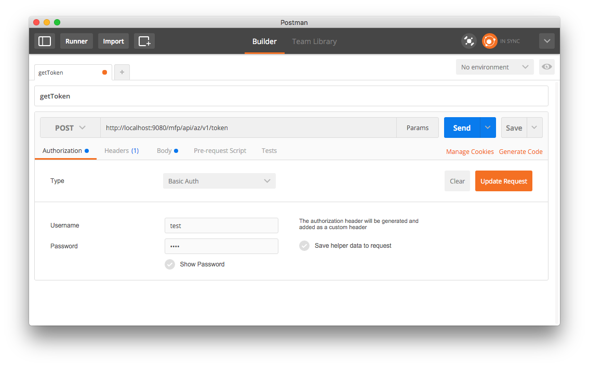
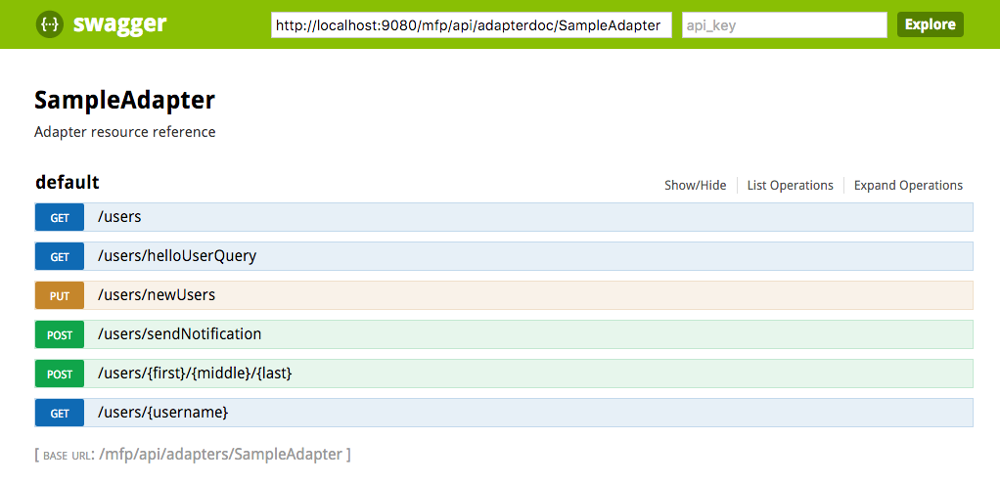
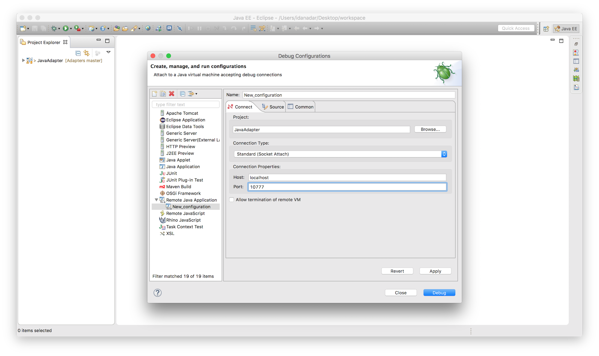

<!-- NLS_CHARSET=UTF-8 -->
## Visión general 
{: #overview }

Utilice entornos de desarrollo integrado (IDE) como, por ejemplo, Eclipse, IntelliJ o similares, para probar adaptadores Java y JavaScript, y para depurar código Java implementado para utilizar en adaptadores Java o JavaScript.   

Esta guía de aprendizaje muestra cómo probar adaptadores mediante {{ site.data.keys.mf_cli }} y Postman. También muestra cómo depurar un adaptador Java mediante el IDE de Eclipse. 

#### Ir a
{: #jump-to }

* [Prueba de adaptadores](#testing-adapters)
 * [Utilización de Postman](#using-postman)
 * [Utilización de Swagger](#using-swagger)
* [Depuración de adaptadores](#debugging-adapters)
 * [Adaptadores de JavaScript](#debugging-javascript-adapters)
 * [Adaptadores Java](#debugging-java-adapters)

## Prueba de adaptadores
{: #testing-adapters }

Los adaptadores están disponibles a través de una interfaz REST. Esto significa que si conoce el URL de un recurso, puede utilizar herramientas HTTP como, por ejemplo, Postman para probar solicitudes y pasar parámetros de `URL`, parámetros de `vía de acceso`, parámetros de `cuerpo` o parámetros de `cabeceras` según sea necesario. 

La estructura del URL utilizada para acceder al recurso de adaptador es: 

* En adaptadores JavaScript - `http://hostname-or-ip-address:port-number/mfp/api/adapters/{adapter-name}/{procedure-name}`
* En adaptadores Java - `http://hostname-or-ip-address:port-number/mfp/api/adapters/{adapter-name}/{path}`

### Cómo pasar parámetros
{: #passing-parameters }

* Cuando se utilizan adaptadores Java, se pueden pasar parámetros en el URL, el cuerpo, el formulario, etc, dependiendo de cómo se haya configurado el adaptador. 
* Cuando se utilizan adaptadores JavaScript, los parámetros se pasan como `params=["param1", "param2"]`. En otras palabras, un procedimiento JavaScript recibe un solo parámetro denominado `params` que debe ser **una matriz ordenada de valores sin nombre**. Este parámetro puede estar en el URL (`GET`) o en el cuerpo (`POST`) utilizando `Content-Type: application/x-www-form-urlencoded`. 

### Manejo de la seguridad
{: #handling-security }

La infraestructura de seguridad de {{ site.data.keys.product }} precisa de una señal de acceso para todos los recursos de adaptadores, incluso cuando a estos no se les haya sido asignado de forma explícita un ámbito.  Por ello, a no ser que de forma específica haya inhabilitado la seguridad, el punto final siempre estará protegido.  

Para inhabilitar la seguridad en adaptadores Java, adjunte la anotación `OAuthSecurity` al método/clase: 

```java
@OAuthSecurity(enabled=false)
```

Para inhabilitar la seguridad en adaptadores JavaScript, añada el atributo `secured` al procedimiento: 

```js
<procedure name="adapter-procedure-name" secured="false"/>
```

De forma alternativa, la versión de desarrollo de {{ site.data.keys.mf_server }} incluye un punto final de señal de prueba para omitir los desafíos de seguridad. 

### Utilización de Postman
{: #using-postman }

#### Señal de prueba
{: #test-token }

Para recibir una señal de prueba, pulse el botón "Ejecutar en Postman" abajo para importar una recopilación para su aplicación Postman que contenga una solicitud lista, o siga los siguientes pasos para crear usted mismo la solicitud. 

<a href="https://app.getpostman.com/run-collection/d614827491450d43c10e"></a>


1. En el separador {{ site.data.keys.mf_console }} → **Valores** → **Clientes confidenciales**, cree un cliente confidencial o utilice el predeterminado:   
A efectos de realización de pruebas, establezca **Ámbitos permitidos** en `**`. 

  


1.  Utilice su cliente HTTP (Postman) para realizar una solicitud `POST` HTTP a `http://<IP>:<PORT>/mfp/api/az/v1/token` con los siguientes parámetros utilizando `Content-Type: application/x-www-form-urlencoded`:  

    - `grant_type` - Establezca el valor en `client_credentials`.
    - `scope` - Establezca el valor en el ámbito de protección de su recurso. Si su recurso no está asignado a un ámbito de protección, omita este parámetro para aplicar el ámbito predeterminado (`RegisteredClient`). Para obtener más información, consulte [Ámbitos](../../authentication-and-security/#scopes).

    

2.  Añada una `cabecera de autorización` mediante `Autenticación básica` con ID de cliente confidencial ("test") y secreto ("test").
    > Para obtener más información sobre los clientes confidenciales, consulte [Clientes confidenciales](../../authentication-and-security/confidential-clients).

    


El resultado es un objeto JSON con una señal de acceso válido temporal:

```json
{
  "access_token": "eyJhbGciOiJSUzI1NiIsImp3ayI6eyJlIjoiQVFBQiIsIm4iOiJBTTBEZDd4QWR2NkgteWdMN3I4cUNMZEUtM0kya2s0NXpnWnREZF9xczhmdm5ZZmRpcVRTVjRfMnQ2T0dHOENWNUNlNDFQTXBJd21MNDEwWDlJWm52aHhvWWlGY01TYU9lSXFvZS1ySkEwdVp1dzJySGhYWjNXVkNlS2V6UlZjQ09Zc1FOLW1RSzBtZno1XzNvLWV2MFVZd1hrU093QkJsMUVocUl3VkR3T2llZzJKTUdsMEVYc1BaZmtOWkktSFU0b01paS1Uck5MelJXa01tTHZtMDloTDV6b3NVTkExNXZlQ0twaDJXcG1TbTJTNjFuRGhIN2dMRW95bURuVEVqUFk1QW9oMmluSS0zNlJHWVZNVVViTzQ2Q3JOVVl1SW9iT2lYbEx6QklodUlDcGZWZHhUX3g3c3RLWDVDOUJmTVRCNEdrT0hQNWNVdjdOejFkRGhJUHU4Iiwia3R5IjoiUlNBIiwia2lkIjoidGVzdCJ9fQ.eyJpc3MiOiJjb20uaWJtLm1mcCIsInN1YiI6InRlc3QiLCJhdWQiOiJjb20uaWJtLm1mcCIsImV4cCI6MTQ1MjUxNjczODAwNSwic2NvcGUiOiJ4eCJ9.vhjSkv5GShCpcDSu1XCp1FlgSpMHZa-fcJd3iB4JR-xr_3HOK54c36ed_U5s3rvXViao5E4HQUZ7PlEOl23bR0RGT2bMGJHiU7c0lyrMV5YE9FdMxqZ5MKHvRnSOeWlt2Vc2izh0pMMTZd-oL-0w1T8e-F968vycyXeMs4UAbp5Dr2C3DcXCzG_h9jujsNNxgXL5mKJem8EpZPolQ9Rgy2bqt45D06QTW7J9Q9GXKt1XrkZ9bGpL-HgE2ihYeHBygFll80M8O56By5KHwfSvGDJ8BMdasHFfGDRZUtC_yz64mH1lVxz5o0vWqPwEuyfslTNCN-M8c3W9-6fQRjO4bw",
  "token_type": "Bearer",
  "expires_in": 3599,
  "scope": "**"
}
```
<br/><br/>
#### Envío de solicitudes
{: #sending-request }

Ahora con cualquier solicitud futura a puntos finales de adaptador, añada una cabecera HTTP con el nombre de `Authorization` y el valor recibido con anterioridad (empezando con Bearer).  La infraestructura de seguridad omitirá los desafíos de seguridad que protegen a sus recursos. 

  

### Utilización de Swagger
{: #using-swagger }

La interfaz de usuarios de documentos de Swagger es una representación visual de los puntos finales REST de un adaptador.   
Con la ayuda de Swagger, un desarrollador puede probar los puntos finales de un adaptador antes de que los consuma una aplicación de cliente. 

Para acceder a Swagger:

1. Abra {{ site.data.keys.mf_console }} y seleccione un adaptador de la lista de adaptadores. 
2. Pulse en el separador **Recursos**. 
3. Pulse en el botón **Ver documentos de Swagger**.   
4. Pulse el botón **Mostrar/Ocultar**. 

  


#### Adición de una señal de prueba
{: #adding-a-test-token }

Para añadir una señal de prueba a la solicitud, de forma que la infraestructura de seguridad omita los desafíos de seguridad que protegen a su recurso, pulse el botón **conmutador de activar/desactivar** en la esquina superior derecha de una operación de punto final. 

Se le solicitará seleccionar los ámbitos en los que desea otorgar a la interfaz de usuario de Swagger (a efectos de realización de las pruebas, puede seleccionarlos todos). Si está utilizando la interfaz de usuario de Swagger por primera vez, se le podría solicitar iniciar una sesión con un ID de cliente confidencial y un secreto. Para esto, necesitará crear un nuevo cliente confidencial con `*` como su **Ámbito permitido**.

> Obtenga más información obre el cliente confidencial en la guía de aprendizaje [Cliente confidencial](../../authentication-and-security/confidential-clients). 

<br/><br/>

#### Envío de solicitudes
{: #sending-request-swagger }

Expanda la operación del punto final, especifique los parámetros necesarios (si es necesario) y pulse en el botón de **Probarlo**.  

  

#### Anotaciones de Swagger
{: #swagger-annotations }
Únicamente disponible en adaptadores Java.

Para generar la documentación Swagger para los adaptadores Java, utilice las anotaciones proporcionadas con Swagger en su implementación de Java.   
> Para obtener más información sobre las anotaciones de Swagger, consulte la [Documentación de Swagger](https://github.com/swagger-api/swagger-core/wiki/Annotations-1.5.X).


```java
@ApiOperation(value = "Multiple Parameter Types Example", notes = "Example of passing parameters by using 3 different methods: path parameters, headers, and form parameters. A JSON object containing all the received parameters is returned.")
@ApiResponses(value = { @ApiResponse(code = 200, message = "A JSON object containing all the received parameters returned.") })
@POST
@Produces(MediaType.APPLICATION_JSON)
@Path("/{path}")
public Map<String, String> enterInfo(
    @ApiParam(value = "The value to be passed as a path parameter", required = true) @PathParam("path") String path,
    @ApiParam(value = "The value to be passed as a header", required = true) @HeaderParam("Header") String header,
    @ApiParam(value = "The value to be passed as a form parameter", required = true) @FormParam("form") String form) {
  Map<String, String> result = new HashMap<String, String>();

  result.put("path", path);
  result.put("header", header);
  result.put("form", form);

  return result;
}
```



### Utilización de {{ site.data.keys.mf_cli }}
{: #using-mobilefirst-cli }

Con el propósito de probar la funcionalidad del adaptador, utilice el mandato `mfpdev adapter call` para llamar a adaptadores Java o JavaScript desde la línea de mandatos. Puede ejecutar el mandato de forma interactiva o de forma directa.
A continuación se muestra un ejemplo de utilización de la modalidad directa: 

#### Adaptadores Java
{: #java-adapters-adapters-cli }

Abra una ventana de **línea de mandatos** y ejecute:


```bash
mfpdev adapter call adapterName/path
```
Por ejemplo:

```bash
mfpdev adapter call SampleAdapter/users/World

Calling GET '/mfp/api/adapters/SampleAdapter/users/World'
Response:
Hello World
```

#### Adaptadores de JavaScript
{: #javascript-adapters-cli }

Abra una ventana de **línea de mandatos** y ejecute:


```bash
mfpdev adapter call adapterName/procedureName
```
Por ejemplo:

```bash
mfpdev adapter call SampleAdapter/getFeed

Calling GET '/mfp/api/adapters/SampleAdapter/users/World'
Response:
Hello World
```



## Depuración de adaptadores
{: #debugging-adapters }

### Adaptadores de JavaScript
{: #debugging-javascript-adapters }
Depure código JavaScript en adaptadores JavaScript mediante la API `MFP.Logger`.   
Los niveles de creación de registro disponibles, de menos detallado o más detallado son: `MFP.Logger.error`, `MFP.Logger.warn`, `MFP.Logger.info` y `MFP.Logger.debug`.

Los registros se imprimen entonces en el archivo de registro del servidor de aplicaciones.   
Asegúrese de establecer consecuentemente el nivel de detalle del servidor, de lo contrario los registros no se anotarán en el archivo de registro. 

### Adaptadores Java
{: #debugging-java-adapters }

Antes de poder depurar el código Java de un adaptador, es necesario configurar Eclipse de la siguiente manera: 

1. **Integración Maven** - A partir de Eclipse Kepler (v4.3), el soporte a Maven está incorporado en Eclipse.   
Si su instancia de Eclipse no da soporte a Maven, [siga las instrucciones de m2e](http://www.eclipse.org/m2e/) para añadir el soporte a Maven.


2. Una vez Maven esté disponible en Eclipse, importe el proyecto Maven del adaptador: 

    

3. Proporcione los parámetros de depuración: 
    - Pulse **Ejecutar** → **Configuraciones de depuración**.
    - Efectúe una doble pulsación en **Aplicación Java remota**.
    - Proporcione un **Nombre** para esta configuración. 
    - Establezca el valor de **Host**: utilice "localhost" si está ejecutando un servidor local, o proporcione el nombre del host de servidor remoto. 
    - Establezca el valor de **Puerto** en "10777".
    - Pulse **Examinar** y seleccione el proyecto Maven. 
    - Pulse **Depurar**.

    

4. Pulse en **Ventana → Mostrar vista → Depuración** para entrar en la *modalidad de depuración*. 
Puede ahora depurar el código Java normalmente como lo haría en una aplicación Java estándar. Necesitará emitir una solicitud al adaptador para poder ejecutar el código y alcanzar los puntos de interrupción que haya establecido.  Esto se puede lograr siguiendo las instrucciones sobre cómo llamar a un recurso de adaptador en la sección de [Prueba de adaptadores](#testing-adapters). 

    

> Para obtener instrucciones de como utilizar IntelliJ para depurar adaptadores Java, consulte el artículo del blog [Utilización de IntelliJ para desarrollar adaptadores Java de MobileFirst]({{site.baseurl}}/blog/2016/03/31/using-intellij-to-develop-adapters).

