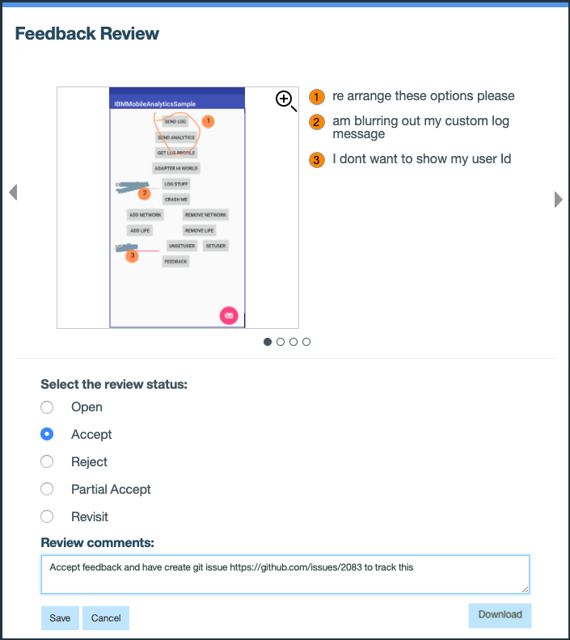

<!-- NLS_CHARSET=UTF-8 -->
## Visión general
{: #overview }

Utilizando la característica Comentarios de usuarios de la aplicación interna, los usuarios de sus aplicaciones puede realizar capturas de pantalla de la aplicación, anotarlas con marcadores y comentarios que describen sus comentarios y opiniones acerca de la aplicación.   

En primer lugar y principalmente debe asegurarse de que su aplicación esté habilitada para capturar y enviar comentarios de usuario de aplicación interna. Consulte [Capturar & enviar comentarios de usuario de aplicación interna](../../analytics-api#sending-userfeedback-data)

Los comentarios de los usuarios capturados y enviados desde los dispositivos móviles se agregan a Mobile Foundation Analytics Service y se presentan en Analytics Console para que los propietarios y desarrolladores de aplicaciones los revisen, recopilen conocimientos y realicen acciones, si es necesario.  

## Visualización de la lista de comentarios de usuarios de la aplicación interna 

En Mobile Foundation Analytics Console, seleccione la opción **Panel de control** en el panel de navegación de la izquierda. A continuación, en el panel de la derecha, pase el ratón por las opciones de menú y seleccione **Comentarios de usuario**    

Una vez seleccionado, verá que el panel derecho de Analytics Console muestra una tabla que lista los comentarios de usuarios que se han recibido de los usuarios de aplicación.  Puede filtrar el contenido de la tabla por periodo de tiempo, aplicación, sistema operativo y versión del dispositivo.  Es posible que también tenga que filtrar los comentarios por la acción de resolución llevada a cabo.

## Visualización de detalles de comentarios de usuarios de aplicación interna 

Para ver los comentarios detallados pulse el comentario que se ha de consultar detalladamente. Se abrirá en una vista modal que contendrá lo siguiente: 

* Un carrusel de capturas de pantalla de la aplicación móvil con anotaciones del usuario.    
* Para cada captura de pantalla existe una lista de comentarios de texto anotados por el usuario.
* En el caso de los comentarios completos (que incluyen las capturas de pantalla), el propietario de la aplicación o el revisor puede marcar una acción realizada, por ejemplo, si el comentario se ha aceptado total o parcialmente, si se ha rechazado el comentario, etc. También existe un área de texto donde se puede incluir cualquier comentario de revisión realizado por el propietario de la aplicación o por el revisor de los comentarios.   

También está disponible la opción de descargar el comentario y todos sus detalles; pantallas con anotaciones.   Por ejemplo, el propietario de la aplicación puede descargar los detalles de los comentarios y cargarlos o adjuntarlos a un problema de GiT o JIRA.  

> **Nota**: Actualmente, la configuración de la acción para un comentario es solo un marcador que ayuda a marcar el estado de revisión del comentario.  No existen acciones en cascada incluidas, tales como la creación de un problema JIRA o GiT con toda la información del comentario copiada en el mismo.    

