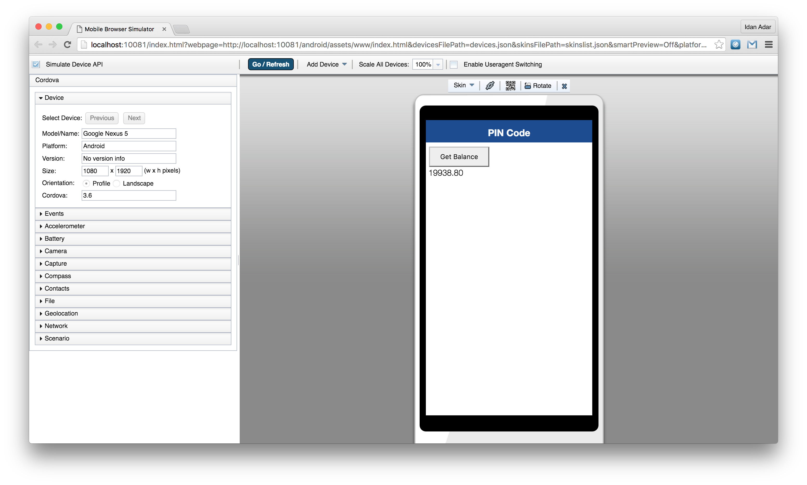

<!-- NLS_CHARSET=UTF-8 -->
## Visión general
{: #overview }
La depuración es un proceso cuyo propósito es encontrar la causa de los defectos en el código y en la interfaz de usuario de la aplicación.


* Las aplicaciones JavaScript (Cordova, Web) están formadas por recursos web como, por ejemplo, HTML, JavaScript y CSS.
Las aplicaciones Cordova también pueden contener código nativo opcional (escrito en Java, Objective-C, Swift, C#, ...).
* El código nativo se puede depurar utilizando herramientas estándar que proporciona el SDK de la plataforma como, por ejemplo, XCode, Android o Microsoft Visual Studio.


En esta guía de aprendizaje se exploran varios enfoques para la depuración de aplicaciones basadas en JavaScript que se ejecuten lógicamente a través de un emulador, un simulador, un dispositivo físico o en un navegador web.


> Aprenda más sobre la depuración y realización de pruebas de Cordova en el sitio web de Cordova:
[Depuración de aplicaciones](https://cordova.apache.org/docs/en/latest/guide/next/index.html#link-testing-on-a-simulator-vs-on-a-real-device).


#### Ir a:
{: #jump-to }

* [Depuración con {{ site.data.keys.mf_mbs }}](#debugging-with-the-mobile-browser-simulator)
* [Depuración con Ripple](#debugging-with-ripple)
* [Depuración con iOS Remote Web Inspector](#debugging-with-ios-remote-web-inspector)
* [Depuración con Chrome Remote Web Inspector](#debugging-with-chrome-remote-web-inspector)
* [Depuración con {{ site.data.keys.product_adj }} Logger](#debugging-with-mobilefirst-logger)
* [Depuración con WireShark](#debugging-with-wireshark)

## Depuración con {{ site.data.keys.mf_mbs }}
{: #debugging-with-the-mobile-browser-simulator }
Utilice {{ site.data.keys.product_full }} {{ site.data.keys.mf_mbs }} (MBS) para obtener una vista previa y depurar aplicaciones {{ site.data.keys.product_adj }}.
  
Para utilizar MBS, abra una ventana de **línea de mandatos** y ejecute el mandato:


```bash
mfpdev app preview
```

Si su aplicación está formada por más de una plataforma, especifique la plataforma para la vista previa:


```bash
mfpdev app preview -p <platform>
```

> <span class="glyphicon glyphicon-exclamation-sign" aria-hidden="true"></span> **Importante:** La característica de vista previa tiene varias limitaciones conocidas.
Su aplicación podría no comportarse de la forma esperada durante la vista previa.
Por ejemplo, omite las características de seguridad utilizando un cliente confidencial, de forma que no se desencadenan los manejadores de retos de seguridad.

 

### {{ site.data.keys.mf_mbs }}
{: #mobile-browser-simulator}



### Vista previa simple
{: #simple-preview }


> Aprenda más sobre {{ site.data.keys.mf_cli }} en la guía de aprendizaje de [Utilización de {{ site.data.keys.mf_cli }} para gestionar artefactos de {{ site.data.keys.product_adj }}](../using-mobilefirst-cli-to-manage-mobilefirst-artifacts).


## Depuración con Ripple
{: #debugging-with-ripple }
Apache Ripple es un simulador de entornos móviles basado en la web para depurar aplicaciones web móviles.
  
Permite ejecutar una aplicación Cordova en su navegador y simular varias características de Cordova.
Por ejemplo puede simular la API de cámara permitiendo seleccionar una imagen local de su sistema.
  

### Instalación de Ripple
{: #installing-ripple }

1. Descargue e instale la última versión de [Node.js](https://nodejs.org/en/).
Verifique la instalación de Node.js escribiendo `npm -v` en el terminal.

2. Abra el terminal y escriba: 

   ```bash
   npm install -g ripple-emulator
   ```

### Ejecución de una aplicación utilizando Ripple
{: #running-application-using-ripple }
Después de que Ripple esté instalado abra el terminal de su ubicación de proyecto de Cordova y escriba:


```bash
ripple emulate
```


> Encontrará más información sobre Apache Ripple en la [página de Apache Ripple](http://ripple.incubator.apache.org/) o en la [página de npm ripple-emulator](https://www.npmjs.com/package/ripple-emulator).


## Depuración con iOS Remote Web Inspector
{: #debugging-with-ios-remote-web-inspector }
A partir de iOS 6, Apple introdujo [Remote Web Inspector](https://developer.apple.com/safari/tools/) para depurar aplicaciones web en dispositivos iOS.
Para poder depurar, asegúrese de que el dispositivo (o simulador iOS) tiene desactivada la opción de **Navegación privada**.
  

1. Para habilitar Web Inspector en el dispositivo, pulse **Valores > Safari > Avanzado > Web Inspector**.
2. Para iniciar la depuración, conecte el dispositivo iOS a un Mac o inicie el simulador.

3. En Safari, vaya a **Preferencias > Avanzado** y seleccione el recuadro de selección **Mostrar menú de desarrollo en la barra de menús**.

4. En Safari, seleccione **Desarrollo > [su ID de dispositivo] > [su archivo HTML de aplicación]**.


## Depuración con Chrome Remote Web Inspector
{: #debugging-with-chrome-remote-web-inspector }
Mediante Google Chrome es posible inspeccionar de forma remota aplicaciones web en dispositivos Android o en el emulador de Android.
  
Esta acción precisa de Android 4.4 o posterior, Chrome 32 o posterior.
Además, en el archivo `AndroidManifest.xml`, se necesita `targetSdkVersion = 19` o superior.
En el archivo `project.properties`, se necesita `target = 19` o posterior.


1. Inicie la aplicación en el emulador de Android o en un dispositivo conectado.

2. En Chrome, especifique el siguiente URL en la barra de direcciones:
`chrome://inspect`.
3. Pulse **Inspeccionar** para la aplicación relevante. 


### Depuración con {{ site.data.keys.product_adj }} Logger
{: #debugging-with-mobilefirst-logger }
{{ site.data.keys.product }} proporciona el objeto `WL.Logger` que se puede utilizar para imprimir mensajes de registro.
  
`WL.Logger` contiene varios niveles de creación de registro: `WL.Logger.info`, `WL.Logger.debug` `WL.Logger.error`.


> Para obtener más información, consulte la documentación de `WL.Logger` en la parte de la consulta de la API de la documentación del usuario.


**Inspección del registro:
**

* **Consola del desarrollador** al obtener una vista previa de una plataforma utilizando un simulador o emulador.

* **LogCat** cuando se ejecuta en un dispositivo Android.

* **Consola XCode** cuando se ejecuta en un dispositivo iOS.

* **Salida de Visual Studio** cuando se ejecuta en dispositivos Windows.


### Depuración con WireShark
{: #debugging-with-wireshark }
**Wireshark es un analizador de protocolo de red** que se puede utilizar para ver lo que ocurre en la red.
  
Utilice los filtros para seguir aquello que únicamente necesita.
  

> Para obtener más información, consulte el sitio web de [WireShark](http://www.wireshark.org).


