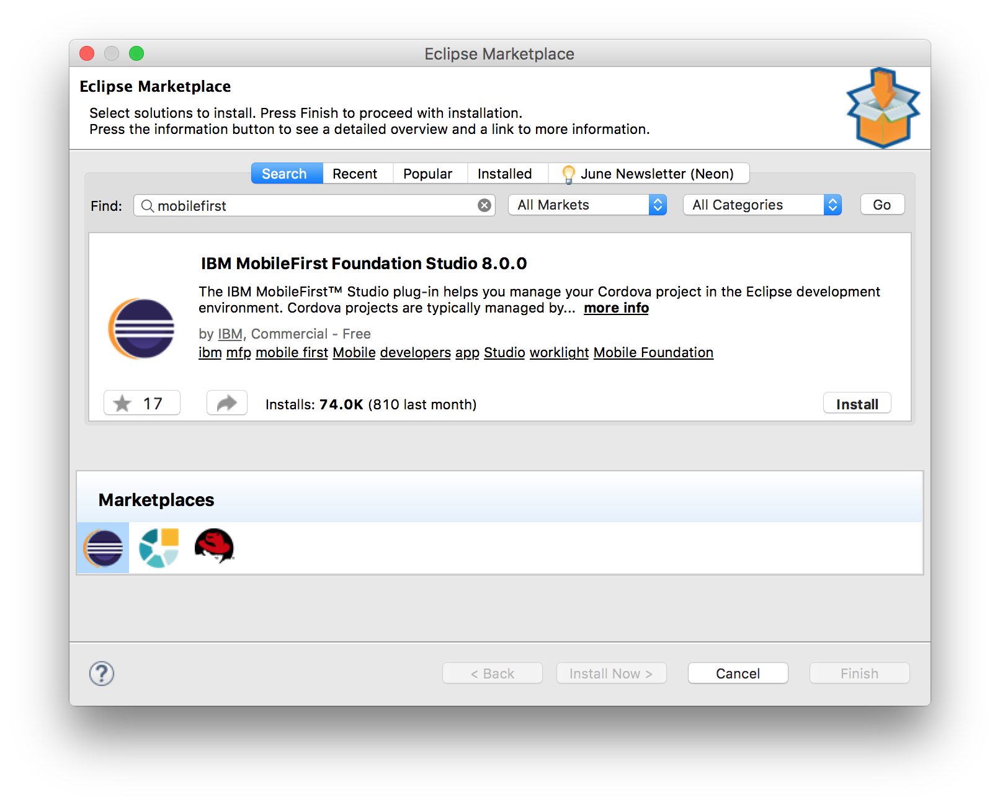
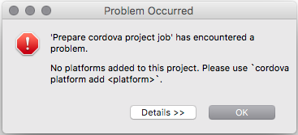

<!-- NLS_CHARSET=UTF-8 -->
## Visión general
{: #overview }
Mediante la interfaz de línea de mandatos (CLI) de Cordova puede crear y gestionar aplicaciones de Cordova. También puede lograr lo mismo en el entorno de desarrollo integrado (IDE) Eclipse mediante el plugin [THyM](https://www.eclipse.org/thym/).

THyM proporciona soporte para la importación y gestión de proyectos Cordova en Eclipse. Puede crear nuevos proyectos de Cordova, así como importar proyectos Cordova existentes. También es posible instalar plugins de Cordova en su proyecto a través de este plugin.

Obtenga más información acerca de THyM en su [sitio web oficial](https://www.eclipse.org/thym/).

El plugin de {{ site.data.keys.mf_studio }} para Eclipse expone varios mandatos de {{ site.data.keys.product_adj }} en el IDE de Eclipse.
En concreto, proporciona los siguientes mandatos:
Abrir consola de servidor, Vista previa de aplicación, Registrar aplicación, Cifrar aplicación, Hacer pull a aplicación, Hacer push a aplicación, Actualizar aplicación.

Esta guía de aprendizaje recorre el proceso de instalación de los plugins de Eclipse de THyM y MobileFirst.

**Requisitos previos:**

* {{ site.data.keys.mf_server }} para ejecutar localemente o {{ site.data.keys.mf_server }} ejecutándose de forma remota.
* {{ site.data.keys.mf_cli }} instalado en la estación de trabajo del desarrollador

#### Ir a:
{: #jump-to }
* [Instalación del plugin {{ site.data.keys.mf_studio }}](#installing-the-mobilefirst-studio-plug-in)
* [Instalación del plugin THyM](#installing-the-thym-plug-in)
* [Creación de un proyecto de Cordova](#creating-a-cordova-project)
* [Importación de un proyecto Cordova existente](#importing-an-existing-cordova-project)
* [Adición de {{ site.data.keys.product_adj }} SDK a proyectos Cordova](#adding-the-mobilefirst-sdk-to-cordova-project)
* [Mandatos de {{ site.data.keys.product_adj }}](#mobilefirst-commands)
* [Sugerencias y consejos](#tips-and-tricks)

## Instalación del plugin {{ site.data.keys.mf_studio }}
{: #installing-the-mobilefirst-studio-plug-in}
1. Dentro de Eclipse, pulse **Ayuda → Eclipse Marketplace...**
2. En el campo de búsqueda busque "{{ site.data.keys.product_adj }}" y, a continuación, pulse "Ir"
3. Pulse "Instalar"

	

4. Complete el proceso de instalación
5. Reinicie Eclipse para que la instalación se haga efectiva.

## Instalación del plugin THyM
{: #installing-the-thym-plug-in }
**Nota:** Para ejecutar THyM debe ejecutar Eclipse Mars o posterior

1. Dentro de Eclipse, pulse **Ayuda → Eclipse Marketplace...**
2. En el campo de búsqueda busque "thym" y, a continuación, pulse "Ir"
3. Pulse "Instalar" para ThyM.

	

4. Complete el proceso de instalación
5. Reinicie Eclipse para que la instalación se haga efectiva.

## Creación de un proyecto de Cordova
{: #creating-a-cordova-project }
En esta sección crearemos un nuevo proyecto de Cordova utilizando THyM.

1. Dentro de Eclipse, pulse **Archivo → Nuevo → Otro...**
2. Reduzca las opciones buscando "Cordova" y seleccione **Proyecto de aplicación móvil híbrida (Cordova)** en el directorio **Móvil** y pulse **Siguiente**

	

3. Dé un nombre al proyecto y pulse **Siguiente**

	

4. Añada la plataforma deseada para su proyecto y pulse **Finalizar**

**Nota**: Si necesita más plataformas después de crear esta, consulte [Adición de plataformas](#adding-platforms)

## Importación de un proyecto Cordova existente
{: #importing-an-existing-cordova-project }
En esta sección trataremos de cómo importar un proyecto de Cordova existente que ya se creó mediante la interfaz de línea de mandatos (CLI) de Cordova.

1. Dentro de Eclipse, pulse **Archivo → Importar...**
2. Seleccione **Importar proyecto de Cordova** en el directorio **Móvil** y pulse **Siguiente>**
3. Pulse **Examinar...** y seleccione el directorio raíz de un proyecto Cordova existente.
4. Asegúrese de que el proyecto está seleccionado en las secciones "Proyectos:" y pulse **Finalizar**
	

Si importa un proyecto sin ninguna plataforma verá el siguiente error, consulte la sección de [adición de plataformas](#adding-platforms) para resolver este error.

**Nota**: Si necesita plataformas adicionales después de realizar una importación consulte [adición de plataformas](#adding-platforms)

## Adición de {{ site.data.keys.product_adj }} SDK a un proyecto Cordova
{: #adding-the-mobilefirst-sdk-to-cordova-project }
Una vez haya [instalado THyM](#installing-the-thym-plug-in) y el plugin [{{ site.data.keys.mf_cli }} ](#installing-the-mobilefirst-studio-plug-in) en Eclipse y haya [creado un proyecto de Cordova](#creating-a-cordova-project) o [importado un proyecto de Cordova](#importing-an-existing-cordova-project) podrá seguir los pasos que hay a continuación para instalar {{ site.data.keys.product_adj }} SDK a través del plugin de Cordova.

1. En el Explorador de proyectos pulse con el botón derecho del ratón sobre el directorio **plugins** y seleccione **Instalar plugin de Cordova**
2. En el separador Registro del recuadro de diálogo que se presenta, busque **mfp**, seleccione **cordova-plugin-mfp** y pulse **Finalizar**

	

## Mandatos de {{ site.data.keys.product_adj }}
{: #mobilefirst-commands }
Para acceder a los atajos de {{ site.data.keys.product }}, pulse con el botón derecho del ratón sobre el directorio del proyecto raíz y vaya a **IBM MobileFirst Foundation**.

Aquí podrá seleccionar alguno de los siguientes mandatos:

| Opción de menú         | Acción                                                                                                                                       | Interfaz de línea de mandatos de MobileFirst equivalente |
|---------------------|----------------------------------------------------------------------------------------------------------------------------------------------|-----------------------------------------------|
| Abrir consola del servidor | Cuando existe la definición de servidor, abre la consola de forma que se pueden ver las distintas acciones en el servidor especificado.                                    | mfpdev server console                         |
| Vista previa de aplicación         | Abre la aplicación en la modalidad de vista previa del navegador.                                                                                                   | Abre la aplicación en la modalidad de vista previa del navegador.    |
| Registrar aplicación        | Registra la aplicación con el servidor especificado en sus definiciones de servidor.                                                              | mfpdev app register                           |
| Cifrar aplicación         | Ejecuta la herramienta de cifrado de recursos web en su aplicación.                                                                                           | mfpdev app webencrypt                         |
| Hacer pull a aplicación            | Recupera la configuración de la aplicación existente desde el servidor especificado en la definición de servidor.                                         | mfpdev app pull                               |
| Hacer push a aplicación            | Envía la configuración de su aplicación actual al servidor que se especifica en la definición de compilación de forma que pueda reutilizarla en otra aplicación. | mfpdev app push                               |
| Actualizar aplicación         | Empaqueta el contenido de la carpeta www en un archivo .zip y sustituye la versión en el servidor con la del paquete.                             | mfpdev app webupdate                          |

## Sugerencias y consejos
{: #tips-and-tricks }

### Entornos de desarrollo integrado (IDE) externos
{: #external-ides }
Si desea probar o desplegar en un dispositivo a través de un IDE externo (Android Studio o Xcode) puede hacerlo a través del menú contextual.

**Nota**:  Asegúrese de importar de forma manual su proyecto en Android Studio para configurar gradle antes del lanzamiento desde Eclipse.  De lo contrario podrían darse errores o pasos no necesarios.  Desde Android Studio seleccione **Importar proyecto (Eclipse ADT Gradle, etc.)** y vaya a su proyecto y seleccione el directorio **android** dentro del directorio **platforms**.

En el explorador de proyectos de Eclipse pulse con el botón derecho del ratón sobre la plataforma que desee (por ejemplo, **android** o **ios** en el directorio **platforms**) → pase el ratón sobre **Ejecutar como** en el menú contextual → seleccione el IDE externo apropiado.

### Adición de plataformas
{: #adding-platforms }

La adición de plataformas adicionales es un proceso simple que el plugin THyM no hace más intuitivo. Tiene dos opciones para realizar la misma tarea, que son las siguientes.

1. A través de las propiedades
	1. Pulse con el botón derecho del ratón y seleccione **properties** desde el menú contextual.
	1. En el diálogo que aparece, seleccione **Motor móvil híbrido** en el menú del lado izquierdo.
	1. En este panel podrá seleccionar o descargar las plataformas deseadas.

1. A través del terminal
	1. Pulse con el botón derecho del ratón sobre su proyecto y pase el ratón sobre **Mostrar en** y seleccione **Terminal** en el menú contextual.
	1. Esto debería añadir un separador junto a la consola en Eclipse
	1. Aquí podrá añadir manualmente plataformas mediante los mandatos de la interfaz de línea de mandatos (CLI) de Cordova
		*  `cordova platform ls` listará las plataformas disponibles e instaladas
		*  `cordova platform add <platform>`, donde *<platform>* es la plataforma deseada, añadirá la plataforma especificada al proyecto. 
		*  Para obtener más información sobre mandatos específicos de la plataforma Cordova, consulte <a href="https://cordova.apache.org/docs/en/latest/reference/cordova-cli/#cordova-platform-command" target="blank">Documentación de mandatos de la plataforma Cordova</a>.

### Modalidad de depuración
{: #debug-mode }
La habilitación de la modalidad de depuración mostrará registros de nivel de depuración en la consola de Eclipse, a la vez que permitirá una visualización previa de la aplicación en un navegador.  Para habilitar la modalidad de depuración, hago lo siguiente:

1. Abra las preferencias de Eclipse.
2. Seleccione los **Plugins de MobileFirst Studio** para mostrar la página de preferencias de plugins.
3. Asegúrese de que el recuadro de selección **Habilitar modalidad de depuración** está seleccionado y, a continuación, pulse **Aplicar → Aceptar**

### Live Update
{: #live-update }
Mientra realiza una vista de una aplicación Live Update está disponible. Puede realizar actualizaciones, guardar sus cambios y verlos renovados de forma automática en la vista previa.

### Integración de {{ site.data.keys.mf_server }} en Eclipse
{: #integrating-mobilefirst-server-into-eclipse }
{{ site.data.keys.mf_dev_kit }}, permite acoplar lo anterior [ejecutando {{ site.data.keys.mf_server }} en Eclipse](../../installation-configuration/development/mobilefirst/using-mobilefirst-server-in-eclipse) para crear un entorno de desarrollo más integrado.

### Vídeo de demostración
{: #demo-video }

	

   		<iframe src="https://www.youtube.com/embed/yRe2AprnUeg"></iframe>
	

