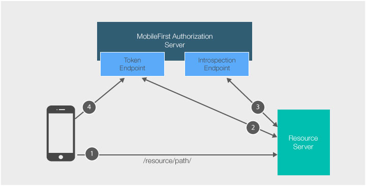

<!-- NLS_CHARSET=UTF-8 -->
## Visión general
{: #overview }
Los recursos protegidos pueden ejecutarse en {{ site.data.keys.mf_server }} (por ejemplo **Adaptadores**), o en **servidores externos**. Puede proteger recursos en servidores externos utilizando los módulos de validación proporcionados con {{ site.data.keys.product }}.

En este tutorial, aprenderá a proteger un **servidor de recursos** externo implementando un **filtro** que valida una {{ site.data.keys.product_adj }} **señal de acceso**.  
Puede implementar la protección con un código personalizado, o utilizando una de las bibliotecas de ayuda de {{ site.data.keys.product }} que encapsula parte del flujo.

**Requisito previos:**  

* Comprensión de la infraestructura de seguridad de [{{ site.data.keys.product_adj }}](../).

## Flujo
{: #flow }

{{ site.data.keys.mf_server }} tiene un componente denominado **punto final de introspección ** que tiene la capacidad de validar y extraer datos de la señal de acceso de {{ site.data.keys.product_adj }} ****. Este punto final de introspección está disponible mediante una API REST.

1. Una aplicación con el SDK de cliente de {{ site.data.keys.product }} realiza una llamada de solicitud de recurso (o cualquier solicitud HTTP) a un recurso protegido con o sin cabecera de `Autorización` (**señal de acceso de cliente**).
2. Para comunicarse con el punto final de introspección, el **filtro** del servidor de recurso debe obtener una señal separada (consulte la sección **cliente confidencial**).
3. El **filtro** del servidor de recurso extrae la **señal de acceso de cliente** del paso 1 y la envía al punto final de introspección para validarla.
4. Si el servidor de autorización de {{ site.data.keys.product_adj }} determina que la señal es inválida (o no existe), el servidor de recurso redirige el cliente para obtener una señal nueva para los ámbitos necesarios. Esta parte ocurre de manera interna cuando se utiliza el SDK de cliente de {{ site.data.keys.product_adj }}.

## Cliente confidencial
{: #confidential-client }
Como el punto final de introspección es un recurso interno protegido por el ámbito `authorization.introspect`, el recurso necesita obtener una señal separada para poder enviarle datos. Si intenta realizar una solicitud al punto final de introspección sin una cabecera de autorización, se devuelve una respuesta 401.

Para que el servidor de recurso externo pueda solicitar una señal para el ámbito `authorization.introspect`, el servidor necesita registrarse como **cliente confidencial** mediante {{ site.data.keys.mf_console }}.  

> Obtenga más información en la guía de aprendizaje [Clientes confidenciales](../confidential-clients/).

En {{ site.data.keys.mf_console }}, en **Configuración → Clientes confidenciales**, añada una entrada nueva. Seleccione un **secreto de cliente ** y el valor **secreto de API**. Asegúrese de establecer `authorization.introspect` como el **ámbito permitido**.

## Implementaciones
{: #implementations }
Este flujo puede implementarse de forma manual realizando solicitudes HTTP directamente a las diferentes API REST (consulte la documentación).  
{{ site.data.keys.product }} también proporciona bibliotecas para ayudar a lograrlo en los servidores **WebSphere** utilizando el **interceptor de asociación de confianza** proporcionado, o cualquier filtro basado en Java mediante el **validador de señal Java** proporcionado:
