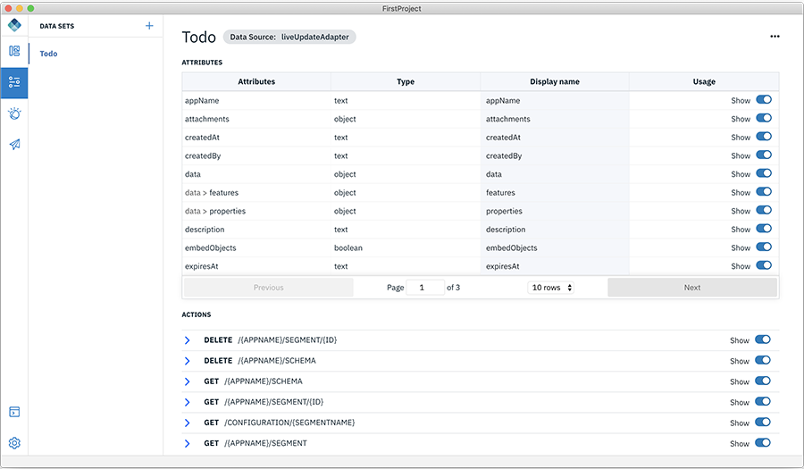

<!-- NLS_CHARSET=UTF-8 -->
## Añadir un conjunto de datos 
{: #dab-login-form }

### Creación de un nuevo conjunto de datos en modalidad de diseño 
{: #data-set-design-mode }

1. En la página de destino de Digital App Builder, abra cualquier aplicación existente o cree una en modalidad de diseño.
2. Pulse **Datos** en el panel de la izquierda.

    

3. Pulse **Añadir nuevo conjunto de datos**. Esta acción visualiza la ventana Añadir un conjunto de datos. 

    

4. Cree un conjunto de datos. Puede crearlo a partir de un origen existente (predeterminado) o crear un origen de datos para un microservicio utilizando un documento OpenAPI. 
    * **Crear a partir de un origen de datos existente** (predeterminado) - Esto cumplimentará el desplegable con todos los orígenes de datos (adaptadores) de la instancia configurada del servidor de Mobile Foundation.  
    * **Crear un origen de datos para un microservicio utilizando un documento de OpenAPI** - Esta opción permite crear un origen de datos a partir de un archivo de documento de especificación de Open API (Swagger json/yml) y un conjunto de datos a partir de la misma. 

#### Creación de un conjunto de datos a partir de un origen de datos existente

1. Seleccione el origen de datos para el que desea crear el conjunto de datos.
2. Esto cumplimentará las entidades disponibles en el origen de datos. Seleccione la entidad que se va a crear.
3. Asigne un nombre al conjunto de datos y pulse el botón **Añadir**. Esta acción añadirá el conjunto de datos para que pueda ver los atributos y las acciones asociadas con dicho conjunto de datos. 

    

4. Puede ocultar algunos de los atributos y acciones en función de lo que desea hacer con el conjunto de datos.
5. También puede editar las **Etiquetas de visualización** para los atributos
6. También puede probar cualquiera de las acciones GET proporcionando los atributos necesarios y pulsando en **Ejecutar esta acción**, que forma parte de la acción. Recuerde que para esto funcione debe haber especificado el nombre de cliente confidencial y la contraseña en el separador **Valores**. 

#### Creación de un origen de datos para un microservicio utilizando un archivo swagger

1. Seleccione el archivo **json/yml** para el que desea crear un origen de datos y pulse **Generar**. 
2. Esto generará un adaptador, que es un artefacto de configuración en el servidor MF que puede volver a utilizar y desplegarlo en la instancia de servidor de Mobile Foundation.
3. Seleccione la entidad para la que desea definir el origen de datos. 
4. Asigne un nombre al conjunto de datos y pulse el botón **Añadir**. 
5. Esta acción añadirá el conjunto de datos para que pueda ver los atributos y las acciones asociadas con el conjunto de datos. 

Ahora puede enlazar este conjunto de datos con cualquiera de los controles de enlace de datos.

#### Enlazar el conjunto de datos en su aplicación 

1. En la aplicación en modalidad de diseño, vaya a la página que desea añadir a la lista. 
2. Pulse **Mostrar controles** para ver **DATABOUND**.
3. Pulse para expandir **DATABOUND** y arrastre y suelte **Lista** al lienzo. 
4. Actualice los **Valores**, según sea necesario.  
5. Añada el **Título de lista**. 
6. Seleccione el **Tipo de lista** en el que trabajar. 
7. Añada contenido al elemento de lista. 
8. Conéctese a un conjunto de datos para utilizarlo.  

### Creación de un nuevo conjunto de datos en modalidad de código 
{: #data-set-code-mode }

1. En la página de destino de Digital App Builder, abra cualquier aplicación existente o cree una en modalidad de código. 
2. Pulse **</>** (**Mostrar fragmentos de código**).
3. Vaya a **IONIC** y añada el fragmento de código necesario (Lista simple, Lista de tarjetas, Botón de cabecera) y modifique el código, según sea necesario.

