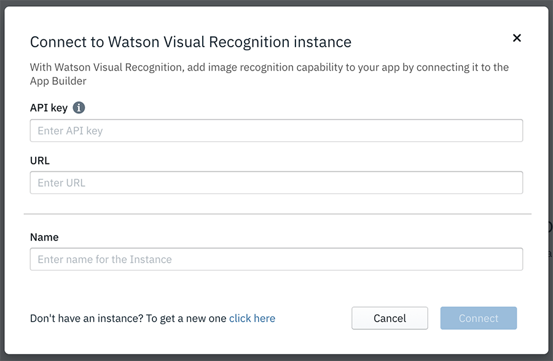
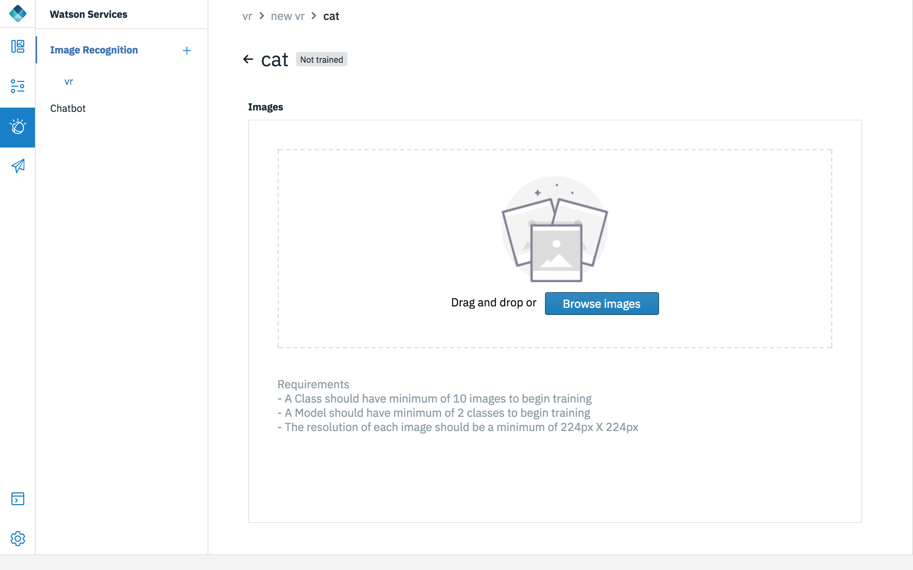

<!-- NLS_CHARSET=UTF-8 -->
## Watson Visual Recognition
{: #dab-watson-vr }

La funcionalidad de reconocimiento de imágenes viene respaldada por el servicio de reconocimiento Watson Visual en IBM Cloud. 
Cree una instancia de Watson Visual Recognition en IBM Cloud. Para obtener más información, consulte [aquí](https://cloud.ibm.com/catalog/services/visual-recognition).

Una vez configurado, podrá crear un nuevo modelo y añadirle clases. Puede arrastrar y soltar imágenes en el constructor y, a continuación, entrenar el modelo con dichas imágenes. Una vez que se haya completado el entrenamiento, puede descargar el modelo CoreML o utilizar el modelo en un control de IA en su aplicación.

Para habilitar reconocimiento visual en la aplicación, realice los pasos siguientes:

1. Pulse **Watson** y, a continuación, pulse **Reconocimiento de imagen**. Se visualizará la pantalla **Trabajar con Watson Visual Recognition**. 

    

2. Pulse **Conectar** a su instancia de Watson Visual Recognition. 

    

3. Especifique los detalles de la **clave de API** y especifique el **URL** de su instancia de Watson Visual Recognition.  
4. Proporcione un **Nombre** a su instancia de reconocimiento de imagen y pulse **Conectar**. Visualizará el panel de control para su modelo. 

    

5. Pulse **Añadir nuevo modelo** para crear un nuevo modelo. Esto mostrará la ventana emergente **Crear un nuevo modelo**. 

    

6. Especifique el **Nombre de modelo** y pulse **Crear**. Esta acción mostrará las clases para dicho modelo y una clase **Negativa**. 

    

7. Pulse **Añadir nueva clase**. Esta acción mostrará una ventana emergente para especificar un nombre para la nueva clase. 

    

8. Especifique el **Nombre de clase** para la nueva clase y pulse **Crear**. Esto mostrará el espacio de trabajo para añadir las imágenes para entrenar el modelo. 

    

9. Añada las imágenes al modelo arrastrándolas y soltándolas en el espacio de trabajo o bien utilice Examinar para acceder a las imágenes. 

10. Puede volver a su espacio de trabajo después de añadir las imágenes y probarlas pulsando **Probar modelo**.

    

11. En la sección **Pruebe el modelo**, añada una imagen y, a continuación, se mostrará el resultado. 

