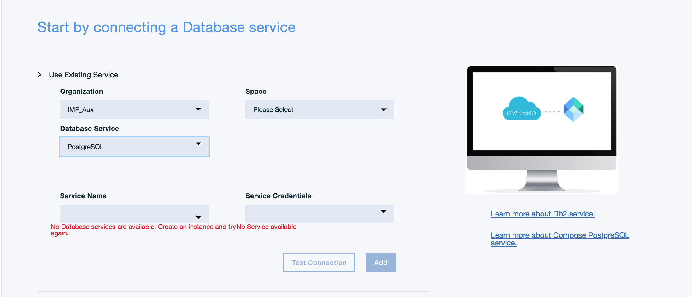
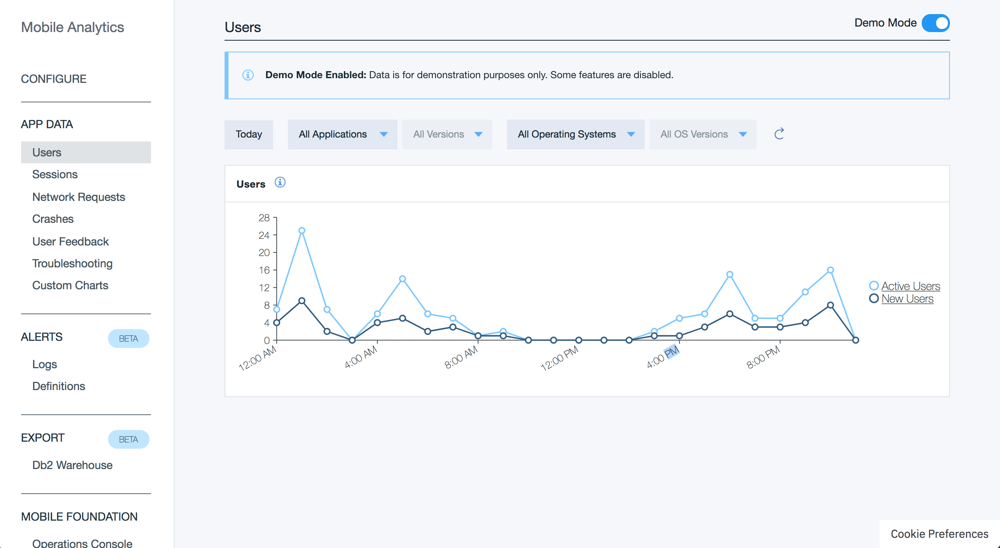
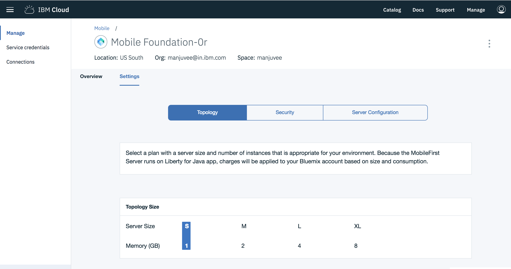

<!-- NLS_CHARSET=UTF-8 -->
## Overview
{: #overview }
This tutorial provides step-by-step instructions to set up a {{ site.data.keys.mfound_server }} instance on IBM Cloud by using the {{ site.data.keys.mf_bm_full }} (**{{ site.data.keys.mf_bm_short }}**) service.  
{{ site.data.keys.mf_bm_short }} is a IBM Cloud service that enables quick and easy stand-up of scalable Developer or Production environments of Mobile Foundation v8.0 on **Liberty for Java runtime**.

The {{ site.data.keys.mf_bm_short }} service offers the following plan options:

1. **Developer**: This plan provisions a {{ site.data.keys.mfound_server }} as a Cloud Foundry application on a Liberty for Java runtime. Liberty for Java charges are billed separately and are not included in this plan. The plan does not support the use of external databases and is restricted to development and testing. Mobile Analytics is offered at no additional charge with events retained for 6 months. The {{ site.data.keys.mf_bm_short }} server *Developer plan* instance allows you to register any number of Mobile applications for development and testing, but it restricts the number of connected devices to 10 per day.  <!--This plan also includes {{ site.data.keys.mf_analytics_service }} service instance. If your usage exceeds the Mobile Analytics free tier entitlements, then charges apply as per Mobile Analytics basic plan.-->

    > **Note:** the Developer plan does not offer a persistent database, as such be sure to backup your configuration as explained [in the Troubleshooting section](#troubleshooting).

2. **Professional Per Device**: This plan allows users to build, test and run up to 5 mobile applications on Mobile Foundation mobile applications in production. Mobile Analytics is offered at no additional charge with events retained for 6 months. This plan supports large deployments and high availability. This plan requires you to have an instance of IBM Db2 (any plan other than the **Lite** plan) or Compose for PostgreSQL service, which is created and billed separately. This plan provisions a Mobile Foundation server on *Liberty for Java*, starting with a minimum of 2 nodes of 1 GB. *Liberty for Java* charges are billed separately and are not included as part of this plan. <!--Optionally, you can add  Mobile Analytics service instance. The Mobile Analytics service is billed separately.-->

3. **Professional 1 Application**: This plan allows users to build, test and run mobile applications on Mobile Foundation in production. Mobile Analytics is offered at no additional charge with events retained for 6 months. You’re billed based on the number of client devices connected per day. This plan supports large deployments and high availability. This plan requires you to have an instance of IBM Db2 (any plan other than the **Lite** plan) or Compose for PostgreSQL service, which is created and billed separately. This plan creates a Mobile Foundation server on *Liberty for Java*, starting with a minimum of 2 nodes of 1 GB. *Liberty for Java* charges are billed separately and isn't included as part of this plan. <!--Optionally, you can add {{ site.data.keys.mf_analytics_service }} service instance by clicking the **Add Analytics** button. The Mobile Analytics service is billed separately.-->

4. **Developer Pro**: This plan provisions a {{ site.data.keys.mfound_server }} as a Cloud Foundry app on a Liberty for Java runtime, and allows users to develop and test any number of mobile applications. This plan requires you to have a **Db2** (any plan other than the **Lite** plan) service instance. The Db2 service instance is created and billed separately. This plan is limited in size and is intended to be used for team-based development and testing activities, not production. Charges depend on the total size of your environment. <!--Optionally, you can add a {{ site.data.keys.mf_analytics_service }} service by clicking the **Add Analytics** button.-->
>_The **Developer Pro** plan is now deprecated._

5. **Professional Per Capacity:** This plan allows users to build, test and run any number of mobile applications in production, regardless of the number of mobile users or devices. It supports large deployments and High Availability. The plan requires you to have a **Db2** (any plan other than the **Lite** plan) service instance. The Db2 service instance is created and billed separately. Charges depend on the total size of your environment. <!--Optionally, you can add a {{ site.data.keys.mf_analytics_service }} service by clicking the **Add Analytics** button.-->
>_The **Professional Per Capacity** plan is now deprecated._

> [See the service details](https://console.bluemix.net/catalog/services/mobile-foundation/) for more information about the available plans and their billing.

#### Jump to:
{: #jump-to}
- [Setting up the Mobile Foundation service](#setting-up-the-mobile-foundation-service)
  - [Setting up the *developer* plan](#setting-up-the-developer-plan)
  - [Setting up the *Professional 1 Application* and *Professional Per Device* plan](#setting-up-the-professional-1-application-and-professional-per-device-plan)
- [Using the Mobile Foundation service](#using-the-mobile-foundation-service)
  - [Server configuration](#server-configuration)
  - [Advanced server configuration](#advanced-server-configuration)
- [Migrating the Mobile Foundation service plan](#migrating-mobile-foundation-service-plan)  
- [Applying Mobile Foundation server fixes](#applying-mobile-foundation-server-fixes)
- [Accessing server logs](#accessing-server-logs)
    - [Tracing](#tracing)
- [Troubleshooting](#troubleshooting)
- [Further reading](#further-reading)

## Setting up the {{ site.data.keys.mf_bm_short }} service
{: #setting-up-the-mobile-foundation-service }
To set up the available plans, first follow these steps:

1. Go to [bluemix.net](http://bluemix.net), login, and click on **Catalog**.
2. Search for **Mobile Foundation** and click on the resulting tile option.
3. *Optional*. Enter a custom name for the service instance, or use the default provided name.
4. Select the desired pricing plan, then click **Create**.

    

### Setting up the *developer* plan
{: #setting-up-the-developer-plan }

Creating the {{ site.data.keys.mf_bm_short }} service creates the {{ site.data.keys.mfound_server }}.
  * You can instantly access and work with the {{ site.data.keys.mfound_server }}.
  * To access the {{ site.data.keys.mfound_server }} using CLI you will need the credentials, which are available when you click **Service credentials** available in the left navigation panel of the IBM Cloud console.

  

### Setting up the *Professional 1 Application* and *Professional Per Device* plan
{: #setting-up-the-professional-1-application-n-professional-per-device-plan }
1. These plans require an external [Db2 (any plan other than the **Lite** plan) database instance](https://console.bluemix.net/catalog/services/db2/).

    * If you have an existing Db2 service instance, select the **Use Existing Service** option, and provide your credentials:

        

    * If you have an existing Compose for PostgreSQL service instance, select the **Use Existing Service** option, and provide your credentials:

        


    * If you do not currently have a Db2 or Compose for PostgreSQL service instance, select the **Create New Service** option and follow the on-screen instructions:

       

2. Start the {{ site.data.keys.mfound_server }}.
    - You can either keep the server configuration at its basic level and click on **Start Basic Server**, or
    - Update the server configuration in the [Settings tab](#advanced-server-configuration), and click on **Start advanced server**.

    During this step a Cloud Foundry app is generated for the {{ site.data.keys.mf_bm_short }} service, and the Mobile Foundation environment is being initialized. This step can take between 5 to 10 minutes.

3. With the instance ready, you can now [use the service](#using-the-mobile-foundation-service).

    

## Using the Mobile Foundation service
{: #using-the-mobile-foundation-service }

With the {{ site.data.keys.mfound_server }} now running, you are presented with the following dashboard:


<!--Click on **Add Analytics** to add {{ site.data.keys.mf_analytics_service }} support to your server instance.
Learn more in the [Adding Analytics support](#adding-analytics-support) section.-->

* Click on **Launch Console** to open the {{ site.data.keys.mf_console }}. The default user name is *admin* and the password can be revealed by clicking on the eye icon in the password field.

  

* Click on **Analytics Console** from the {{ site.data.keys.mf_console }} to open the Mobile Analytics console and view the analytics data, as shown below.

  


### Server configuration
{: #server-configuration }
The basic server instance consists of:

* A single node (server size: "small")
* 1GB memory
* 2GB storage capacity

### Advanced server configuration
{: #advanced-server-configuration }
Through the **Settings** tab, you can further customize the server instance with

* Varying node, memory, and storage combinations
* {{ site.data.keys.mf_console }} admin password
* LTPA keys
* JNDI configuration
* User registry
* TrustStore

  *Creating the TrustStore Certificate for Mobile Foundation Service:*

  * Take *cacerts* from the latest fix pack Java 8 JDK of IBM Java or Oracle Java.

  * Import the additional certificate into the TrustStore using the following command:
    ```
    keytool -import -file firstCA.cert -alias firstCA -keystore truststore.jks
    ```

  >**Note** : You can choose to create your own TrustStore, but the default certificate needs to made available for Mobile Foundation Service to function properly

<!--* {{ site.data.keys.mf_analytics_service }} configuration-->
* VPN



<!--
## Adding {{ site.data.keys.mf_analytics_service }} support
{: #adding-analytics-support }
You can add {{ site.data.keys.mf_analytics_service }} support to your {{ site.data.keys.mf_bm_short }} service instance by clicking on **Add Analytics** from the service's Dashboard page. This action provisions a {{ site.data.keys.mf_analytics_service }} service instance.

>When you create or recreate the **Developer** plan instance of {{ site.data.keys.mf_bm_short }} service, the {{ site.data.keys.mf_analytics_service }} service instance is added by default.
-->
<!--* When using the **Developer** plan this action will also automatically hook the {{ site.data.keys.mf_analytics_service }} service instance to your {{ site.data.keys.mf_server }} instance.  
* When using the **Developer Pro**, **Professional Per Capacity** or **Professional 1 Application** plans, this action will require additional input from you to select: amount of available Nodes, available Memory and a storage volume. -->
<!--
Once the operation finishes, reload the {{ site.data.keys.mf_console }} page in your browser to access the {{ site.data.keys.mf_analytics_service_console }}.  

> Learn more about {{ site.data.keys.mf_analytics_service }} in the [{{ site.data.keys.mf_analytics_service }} category](../../analytics).

##  Removing {{ site.data.keys.mf_analytics_service }} support
{: #removing-analytics-support}

You can remove the {{ site.data.keys.mf_analytics_service }} support for your {{ site.data.keys.mf_bm_short }} service instance by clicking on **Delete Analytics**  from the service’s Dashboard page. This action deletes the {{ site.data.keys.mf_analytics_service }} service instance.

Once the operation finishes, reload the {{ site.data.keys.mf_console }} page in your browser.
-->
<!--
##  Switching from Analytics deployed with IBM Containers to Analytics service
{: #switching-from-analytics-container-to-analytics-service}

>**Note**: Deleting {{ site.data.keys.mf_analytics_service }} will remove all available analytics data. This data will not be available in the new {{ site.data.keys.mf_analytics_service }} instance.

User can delete current container by clicking on **Delete Analytics** button from service dashboard. This will remove the analytics instance and enable the **Add Analytics** button, which the user can click to add a new {{ site.data.keys.mf_analytics_service }} service instance.
-->

## Migrating the Mobile Foundation service plan
{: #migrating-mobile-foundation-service-plan }

Mobile Foundation instances created using the deprecated plans need to be updated to the new plans. Plan update may also be needed based on the instance usage.

### Sample scenario: Migrate from the Professional Per Device plan to the Professional 1 Application plan

1. From the IBM Cloud dashboard, select the IBM Mobile Foundation instance you want to migrate.
2. Select **Plan** from the left navigation.
   
3. From the listed pricing plans, select Professional 1 Application.
   
4. Click the **Save** button and confirm the plan migration.
     Migration to Professional 1 Application is now completed and all the existing data is retained. The billing is changed and there’s no downtime.
5. After the plan migration, the Mobile Foundation instance needs to be re-created from the service dashboard for the right configuration to take effect. This update requires a short downtime. You'll need to plan for the downtime. Select **Manage** from the left navigation and click **Recreate**.

>**Note:** If you’re on one of the deprecated plans, you must migrate to a new plan.

### Supported plan migrations

* *Developer* (deprecated) plan can be updated only to the new *Developer* plan.
* *Developer Pro* (deprecated) plan can be updated only to *Professional Per Device* or *Professional 1 Application* plan.
* *Professional Per Capacity* (deprecated) plan can be updated only to *Professional Per Device* or *Professional 1 Application* plan.
* *Professional Per Device* plan can be updated only to *Professional 1 Application* plan.
* *Professional 1 Application* plan can be updated only to *Professional Per Device* plan.
* Plan update isn’t supported for the new *Developer* plan.

## Applying Mobile Foundation server fixes
{: #applying-mobile-foundation-server-fixes }
Updates to the {{ site.data.keys.mf_bm }} services are applied automatically without a need for human intervention, other than agreeing to perform the update. When an update is available, a banner is displayed in the service's Dashboard page with instructions and action buttons.

## Accessing server logs
{: #accessing-server-logs }
To access server logs, follow the steps described below.

**Scenario 1:**

1. Set up your host machine.<br/>
   To manage the IBM Cloud Cloud Foundry app, you need to install the Cloud Foundry CLI.<br/>
   Install the [Cloud Foundry CLI](https://github.com/cloudfoundry/cli/releases).
2. Open the terminal and log in to your *Organization* and *Space* using `cf login`.
3. Execute the following command in the CLI:
```bash
  cf ssh <mfp_Appname> -c "/bin/cat logs/messages.log" > messages.log
```
4. Only if trace is enabled, execute the following command:
```bash
cf ssh <mfp_Appname> -c "/bin/cat logs/trace.log" > trace.log
 ```

**Scenario 2:**      

* To access server logs, open the sidebar navigation and click on **Apps → Dashboard → Cloud Foundry Apps**.
* Select your App and click on **Logs → View in Kibana**.
* Select and copy the logs messages.


#### Tracing
{: #tracing }
To enable tracing, in order to view DEBUG-level messages in the **trace.log** file:

1. In **Runtime → SSH**, select your service instance from the combobox (instance IDs start with **0**).
2. Go to each instance in the console and open the file `/home/vcap/app/wlp/usr/servers/mfp/configDropins/overrides/tracespec.xml` using the vi editor.
3. Update the following trace statement: `traceSpecification="=info:com.ibm.mfp.*=all"` and save the file.

The **trace.log** file is now available in the above specified location.


## Troubleshooting
{: #troubleshooting }
The Developer plan does not offer a persistent database, which could cause at times loss of data. To quickly onboard in such cases, be sure to follow these best practices:

* Every time you make any of the following server-side actions:
    * Deploy an adapter or update any adapter configuration or property value
    * Perform any security configuration such scope-mapping and alike

    Run the following from the command-line to download your configuration to a .zip file:

  ```bash
  $curl -X GET -u admin:admin -o export.zip http://<App Name>.mybluemix.net/mfpadmin/management-apis/2.0/runtimes/mfp/export/all
  ```

* In case you recreate your server or lose your configuration, run the following from the command-line to import the configuration to the server:

  ```bash
  $curl -X POST -u admin:admin -F file=@./export.zip http://<App Name>.mybluemix.net/mfpadmin/management-apis/2.0/runtimes/mfp/deploy/multi
  ```

## Further reading
{: #further-reading }
Now that the {{ site.data.keys.mfound_server }} instance is up and running,

* Familiarize yourself with the [{{ site.data.keys.mf_console }}](../../product-overview/components/console).
* Experience Mobile Foundation with these [Quick Start tutorials](../../quick-start).
* Read through all [available tutorials](../../all-tutorials/).
